[](https://mybinder.org/v2/gh/quarcs-lab/tutorial-distribution-dynamics--Master-s-Thesis-Cani-Chapter-2/HEAD?urlpath=rstudio)
Regional Poverty Convergence across Districts in Indonesia:A
Distribution Dynamics Approach
================
Ragdad Cani Miranti

<style>
h1.title {font-size: 18pt; color: DarkBlue;} 
body, h1, h2, h3, h4 {font-family: "Palatino", serif;}
body {font-size: 12pt;}
/* Headers */
h1,h2,h3,h4,h5,h6{font-size: 14pt; color: #00008B;}
body {color: #333333;}
a, a:hover {color: #8B3A62;}
pre {font-size: 12px;}
</style>

Suggested citation: Miranti, Ragdad Cani.(2020). Regional Poverty
Convergence across Districts in Indonesia: A Distribution Dynamics
Approach
<https://rpubs.com/canimiranti/distribution_dynamics_poverty514districts>

This work is licensed under the Creative Commons Attribution-Non
Commercial-Share Alike 4.0 International License 

# Original data source

Data of Headcount Index (Poverty Rate) are derived from the Indonesia
Central Bureau of Statistics (Badan Pusat Statistik Republik of
Indonesia). <https://www.bps.go.id/>

Acknowledgment:

Material adapted from multiple sources, in particular from [Magrini
(2007).](https://pdfs.semanticscholar.org/eab1/cb89dde0c909898b0a43273377c5dfa73ebc.pdf)

# Libraries

``` r
knitr::opts_chunk$set(echo = TRUE)

library(tidyverse)
library(skimr)
library(kableExtra)    # html tables 
library(pdfCluster)    # density based clusters
library(hdrcde)        # conditional density estimation 
library(plotly)

library(intoo)
library(barsurf)
library(bivariate)

library(np)
library(quantreg)

library(basetheme)
basetheme("minimal")

library(viridis)
library(ggpointdensity)
library(isoband)

#library(MASS)
library(KernSmooth)


# Change the presentation of decimal numbers to 4 and avoid scientific notation
options(prompt="R> ", digits=4, scipen=7)
```

# Tutorial objectives

  - Study the dynamics of univariate densities

  - Compute the bandwidth of a density

  - Study mobility plots

  - Study bi-variate densities

  - Study density-based clustering methods

  - Study conditional bi-variate densities

# Import data

``` r
dat <- read_csv("data/poverty.csv")
dat <- as.data.frame(dat)
```

# Transform data

Since the data is in relative terms, let us rename the variables and add
new variables.

``` r
dat <- dat %>% 
  mutate(
    rel_pov2010 = pov2010/mean(pov2010),
    rel_pov2018 = pov2010/mean(pov2018)
  )
dat
```

    ##                       District Code pov2010 pov2011 pov2012 pov2013 pov2014
    ## 1                     Simeulue 1101   23.61   22.96   21.88   20.57   19.92
    ## 2                 Aceh Singkil 1102   19.38   18.93   17.92   18.73   17.77
    ## 3                 Aceh Selatan 1103   15.93   15.52   14.81   13.44   12.79
    ## 4                Aceh Tenggara 1104   16.78   16.39   15.64   14.39   13.75
    ## 5                   Aceh Timur 1105   18.42   18.01   17.19   16.59   15.88
    ## 6                  Aceh Tengah 1106   20.09   19.58   18.78   17.76   16.99
    ## 7                   Aceh Barat 1107   24.42   23.81   22.76   23.70   22.97
    ## 8                   Aceh Besar 1108   18.80   18.36   17.50   16.88   16.13
    ## 9                        Pidie 1109   23.80   23.19   22.12   21.12   20.29
    ## 10                     Bireuen 1110   19.50   19.06   18.21   17.65   16.94
    ## 11                  Aceh Utara 1111   23.43   22.89   21.89   20.34   19.58
    ## 12             Aceh Barat Daya 1112   19.93   19.49   18.51   18.92   17.99
    ## 13                   Gayo Lues 1113   23.90   23.38   22.31   22.33   21.43
    ## 14                Aceh Tamiang 1114   17.98   17.49   16.70   15.13   14.58
    ## 15                  Nagan Raya 1115   24.06   23.38   22.27   21.75   20.85
    ## 16                   Aceh Jaya 1116   20.17   19.80   18.30   17.53   16.52
    ## 17                Bener Meriah 1117   26.22   25.50   24.50   23.47   22.45
    ## 18                  Pidie Jaya 1118   26.07   25.43   24.35   22.70   21.78
    ## 19             Kota Banda Aceh 1171    9.19    9.08    8.65    8.03    7.78
    ## 20                 Kota Sabang 1172   21.68   21.31   20.51   18.31   17.02
    ## 21                 Kota Langsa 1173   15.01   14.66   13.93   12.62   12.08
    ## 22            Kota Lhokseumawe 1174   14.07   13.73   13.06   12.47   11.93
    ## 23           Kota Subulussalam 1175   24.33   23.85   22.64   20.69   19.72
    ## 24                        Nias 1201   19.97   19.11   18.67   17.28   16.39
    ## 25            Mandailing Natal 1202   12.60   11.98   11.57    9.62    9.28
    ## 26            Tapanuli Selatan 1203   11.96   11.40   11.10   11.33   10.74
    ## 27             Tapanuli Tengah 1204   16.73   15.96   15.03   15.41   14.47
    ## 28              Tapanuli Utara 1205   12.49   11.89   11.55   11.68   11.06
    ## 29                Toba Samosir 1206   10.15    9.67    9.43    9.54    9.23
    ## 30                Labuhan Batu 1207   10.67   10.15    9.61    8.53    8.20
    ## 31                      Asahan 1208   11.42   10.85   10.52   11.60   10.98
    ## 32                  Simalungun 1209   10.73   10.21    9.96   10.45   10.20
    ## 33                       Dairi 1210    9.97    9.48    9.28    8.68    8.40
    ## 34                        Karo 1211   11.02   10.49    9.93    9.79    9.20
    ## 35                Deli Serdang 1212    5.34    5.10    4.78    4.71    4.56
    ## 36                     Langkat 1213   10.84   10.31   10.02   10.44    9.99
    ## 37                Nias Selatan 1214   20.72   19.71   19.04   18.83   17.81
    ## 38          Humbang Hasundutan 1215   10.60   10.09    9.72   10.00    9.44
    ## 39               Pakpak Bharat 1216   13.78   13.16   12.40   11.28   10.55
    ## 40                     Samosir 1217   16.50   15.67   15.16   14.01   13.20
    ## 41             Serdang Bedagai 1218   10.59   10.07    9.89    9.35    8.98
    ## 42                   Batu Bara 1219   12.28   11.67   11.24   11.92   11.25
    ## 43          Padang Lawas Utara 1220   11.19   10.64    9.98   10.28    9.60
    ## 44                Padang Lawas 1221   11.13   10.56    9.80    8.59    8.03
    ## 45        Labuhan Batu Selatan 1222   15.58   14.86   13.95   12.36   11.54
    ## 46          Labuhan Batu Utara 1223   12.32   11.77   11.34   11.34   10.71
    ## 47                  Nias Utara 1224   31.90   30.44   29.49   30.94   29.28
    ## 48                  Nias Barat 1225   30.89   29.32   28.56   29.65   28.10
    ## 49                Kota Sibolga 1271   13.90   13.18   13.00   12.90   12.26
    ## 50          Kota Tanjung Balai 1272   16.31   15.52   14.85   14.85   14.02
    ## 51       Kota Pematang Siantar 1273   11.72   11.15   10.79   10.93   10.35
    ## 52          Kota Tebing Tinggi 1274   13.04   12.44   11.93   11.74   11.08
    ## 53                  Kota Medan 1275   10.05    9.63    9.33    9.64    9.12
    ## 54                 Kota Binjai 1276    7.33    7.00    6.72    6.75    6.38
    ## 55        Kota Padangsidimpuan 1277   10.53   10.08    9.60    9.04    8.52
    ## 56           Kota Gunungsitoli 1278   33.86   32.12   30.84   30.94   27.63
    ## 57          Kepulauan Mentawai 1301   19.74   18.85   16.71   16.12   14.96
    ## 58             Pesisir Selatan 1302   10.22    9.75    8.69    8.64    7.82
    ## 59                       Solok 1303   11.74   11.19   10.04   10.26    9.53
    ## 60                   Sijunjung 1304   10.45    9.94    8.80    8.53    7.74
    ## 61                 Tanah Datar 1305    6.90    6.57    5.96    5.77    5.29
    ## 62             Padang Pariaman 1306   11.86   11.26   10.13    9.17    8.39
    ## 63                        Agam 1307    9.84    9.39    8.44    7.68    7.02
    ## 64             Lima Puluh Kota 1308   10.47    9.96    8.90    8.26    7.48
    ## 65                     Pasaman 1309   10.96   10.42    9.31    8.37    7.60
    ## 66               Solok Selatan 1310   11.11   10.61    9.38    8.12    7.33
    ## 67                 Dharmasraya 1311   10.56   10.09    8.83    7.74    6.97
    ## 68               Pasaman Barat 1312    9.59    9.14    8.05    7.86    7.08
    ## 69                 Kota Padang 1371    6.31    6.02    5.30    5.02    4.56
    ## 70                  Kota Solok 1372    6.99    6.72    5.88    4.60    4.16
    ## 71            Kota Sawah Lunto 1373    2.47    2.34    2.17    2.28    2.25
    ## 72         Kota Padang Panjang 1374    7.60    7.25    6.50    6.66    6.40
    ## 73            Kota Bukittinggi 1375    6.82    6.49    5.74    5.36    4.96
    ## 74             Kota Payakumbuh 1376   10.58   10.09    9.00    7.81    7.01
    ## 75               Kota Pariaman 1377    5.90    5.66    5.02    5.35    5.12
    ## 76            Kuantan Singingi 1401   12.57   10.19   10.29   11.28   10.75
    ## 77              Indragiri Hulu 1402    8.90    7.25    7.17    7.50    7.28
    ## 78             Indragiri Hilir 1403    9.41    7.65    7.81    7.88    7.51
    ## 79                   Pelalawan 1404   14.51   11.93   11.11   12.00   11.15
    ## 80                        Siak 1405    6.49    5.29    5.17    5.54    5.22
    ## 81                      Kampar 1406   10.47    8.52    8.36    9.04    8.68
    ## 82                  Rokan Hulu 1407   13.03   10.66   10.13   10.86   10.13
    ## 83                   Bengkalis 1408    8.25    6.72    6.76    7.57    7.20
    ## 84                 Rokan Hilir 1409    9.30    7.58    7.37    7.73    7.28
    ## 85           Kepulauan Meranti 1410   42.56   34.53   35.88   35.74   33.85
    ## 86              Kota Pekanbaru 1471    4.20    3.45    3.38    3.27    3.17
    ## 87                  Kota Dumai 1473    6.45    5.27    5.23    4.98    4.83
    ## 88                     Kerinci 1501    7.83    7.36    7.71    7.35    7.43
    ## 89                    Merangin 1502    8.07    7.68    8.09    9.31    9.37
    ## 90                  Sarolangun 1503    9.66    9.10    9.46   10.51   10.17
    ## 91                 Batang Hari 1504   10.19    9.56   10.13   10.42   10.50
    ## 92                 Muaro Jambi 1505    5.29    4.98    5.08    4.58    4.45
    ## 93        Tanjung Jabung Timur 1506   12.40   11.60   12.50   13.42   13.55
    ## 94        Tanjung Jabung Barat 1507   11.08   10.43   10.92   11.61   11.64
    ## 95                        Tebo 1508    6.42    6.05    6.35    6.86    6.89
    ## 96                       Bungo 1509    5.70    5.35    5.55    5.25    5.12
    ## 97                  Kota Jambi 1571    9.90    9.27    9.80    8.91    8.94
    ## 98           Kota Sungai Penuh 1572    3.64    3.42    3.66    3.30    3.33
    ## 99           Ogan Komering Ulu 1601   12.28   11.58   11.19   12.31   11.96
    ## 100         Ogan Komering Ilir 1602   15.98   15.06   14.53   15.82   15.30
    ## 101                 Muara Enim 1603   14.51   13.71   13.21   14.26   13.76
    ## 102                      Lahat 1604   19.02   17.92   17.45   18.61   18.02
    ## 103                 Musi Rawas 1605   19.38   18.25   17.67   17.85   17.28
    ## 104             Musi Banyuasin 1606   20.06   18.99   18.29   18.02   17.38
    ## 105                 Banyu Asin 1607   12.39   11.66   11.27   12.28   11.88
    ## 106  Ogan Komering Ulu Selatan 1608   11.53   10.84   10.49   11.57   11.21
    ## 107    Ogan Komering Ulu Timur 1609    9.81    9.23    8.98   10.28   10.13
    ## 108                  Ogan Ilir 1610   13.97   13.18   12.79   13.86   13.38
    ## 109               Empat Lawang 1611   14.73   13.82   13.36   13.10   12.89
    ## 110 Penukal Abab Lematang Ilir 1612   14.67   13.42   13.43   12.86   12.80
    ## 111           Musi Rawas Utara 1613   23.83   21.67   22.01   22.91   20.32
    ## 112             Kota Palembang 1671   15.00   14.13   13.59   13.36   12.93
    ## 113            Kota Prabumulih 1672   12.93   12.19   11.71   11.23   10.86
    ## 114            Kota Pagar Alam 1673    9.81    9.24    9.00    9.00    8.90
    ## 115          Kota Lubuklinggau 1674   15.30   14.43   13.88   14.37   13.90
    ## 116           Bengkulu Selatan 1701   22.62   22.55   22.98   22.59   21.91
    ## 117              Rejang Lebong 1702   15.11   16.79   17.31   18.48   17.99
    ## 118             Bengkulu Utara 1703   14.75   14.40   14.41   14.50   13.95
    ## 119                       Kaur 1704   21.22   22.26   22.66   23.25   21.96
    ## 120                     Seluma 1705   20.81   20.90   21.21   21.84   21.17
    ## 121                   Mukomuko 1706   14.06   13.28   13.21   12.98   12.48
    ## 122                     Lebong 1707   13.01   12.43   12.48   12.89   12.44
    ## 123                  Kepahiang 1708   14.78   15.02   15.35   16.13   15.65
    ## 124            Bengkulu Tengah 1709    6.42    6.49    6.52    7.24    8.22
    ## 125              Kota Bengkulu 1771   17.69   22.23   22.11   21.51   20.16
    ## 126              Lampung Barat 1801   17.12   15.99   15.13   13.96   13.70
    ## 127                  Tanggamus 1802   18.30   17.06   16.10   15.24   14.95
    ## 128            Lampung Selatan 1803   20.61   19.23   18.19   17.09   16.77
    ## 129              Lampung Timur 1804   21.06   19.66   18.59   17.38   17.05
    ## 130             Lampung Tengah 1805   16.88   15.76   14.96   13.37   13.13
    ## 131              Lampung Utara 1806   28.19   26.33   25.17   23.67   23.32
    ## 132                  Way Kanan 1807   18.81   17.63   16.54   15.36   15.03
    ## 133               Tulangbawang 1808   10.80   10.11    9.43    8.04    8.66
    ## 134                  Pesawaran 1809   20.48   19.06   18.01   17.86   17.51
    ## 135                  Pringsewu 1810   12.45   11.62   11.01    9.81    9.83
    ## 136                     Mesuji 1811    8.65    8.07    7.69    5.81    6.57
    ## 137        Tulang Bawang Barat 1812    7.63    7.11    6.73    6.31    7.12
    ## 138              Pesisir Barat 1813   15.36   13.61   14.10   14.75   13.80
    ## 139        Kota Bandar Lampung 1871   14.58   12.90   12.65   10.85   10.60
    ## 140                 Kota Metro 1872   13.77   12.60   12.09   11.08   10.82
    ## 141                     Bangka 1901    7.81    5.36    5.57    5.40    5.20
    ## 142                   Belitung 1902   10.13    6.97    7.26    8.48    7.36
    ## 143               Bangka Barat 1903    5.25    3.59    3.72    3.26    3.15
    ## 144              Bangka Tengah 1904    8.07    5.56    5.77    5.46    5.27
    ## 145             Bangka Selatan 1905    6.18    4.23    4.40    4.01    3.87
    ## 146             Belitung Timur 1906   10.36    7.13    7.43    6.90    6.68
    ## 147        Kota Pangkal Pinang 1971    6.02    4.15    4.29    4.15    4.04
    ## 148                    Karimun 2101    7.21    5.93    6.37    6.69    6.85
    ## 149                     Bintan 2102    7.33    6.04    6.30    6.23    6.09
    ## 150                     Natuna 2103    4.83    4.06    4.26    3.78    4.11
    ## 151                     Lingga 2104   15.81   12.98   14.17   14.03   14.75
    ## 152          Kepulauan Anambas 2105    4.80    3.95    4.17    4.47    4.91
    ## 153                 Kota Batam 2171    7.26    6.11    5.90    5.20    5.30
    ## 154        Kota Tanjung Pinang 2172   12.60   10.52   11.04   10.40    9.94
    ## 155           Kepulauan Seribu 3101   13.01   11.53   11.62   11.01   11.56
    ## 156       Kota Jakarta Selatan 3171    3.81    3.43    3.49    3.47    3.72
    ## 157         Kota Jakarta Timur 3172    3.41    3.06    3.12    3.10    3.43
    ## 158         Kota Jakarta Pusat 3173    3.97    3.56    3.72    3.70    4.12
    ## 159         Kota Jakarta Barat 3174    3.81    3.44    3.47    3.46    3.72
    ## 160         Kota Jakarta Utara 3175    5.62    5.07    5.14    5.30    6.00
    ## 161                      Bogor 3201    9.97    9.65    8.82    9.54    8.91
    ## 162                   Sukabumi 3202   10.65   10.28    9.78    9.24    8.81
    ## 163                    Cianjur 3203   14.32   13.82   13.17   12.02   11.47
    ## 164                    Bandung 3204    9.29    8.99    8.32    7.94    7.65
    ## 165                      Garut 3205   13.94   13.47   12.70   12.79   12.47
    ## 166                Tasikmalaya 3206   12.78   12.36   11.75   11.57   11.26
    ## 167                     Ciamis 3207   10.34    9.98    9.61    8.62    8.38
    ## 168                   Kuningan 3208   14.68   14.20   13.69   13.34   12.72
    ## 169                    Cirebon 3209   16.12   15.56   14.94   14.65   14.22
    ## 170                 Majalengka 3210   15.51   14.98   14.44   14.07   13.42
    ## 171                   Sumedang 3211   12.94   12.48   11.85   11.31   10.78
    ## 172                  Indramayu 3212   16.58   16.01   15.42   14.99   14.29
    ## 173                     Subang 3213   13.54   13.06   12.47   12.35   11.73
    ## 174                 Purwakarta 3214   10.57   10.22    9.56    9.28    8.80
    ## 175                   Karawang 3215   12.21   11.80   11.10   10.69   10.15
    ## 176                     Bekasi 3216    6.11    5.93    5.25    5.20    4.97
    ## 177              Bandung Barat 3217   14.68   14.22   13.33   12.92   12.26
    ## 178                Pangandaran 3218   12.85   11.57   10.66   11.40   10.61
    ## 179                 Kota Bogor 3271    9.47    9.16    8.47    8.19    7.74
    ## 180              Kota Sukabumi 3272    9.24    8.95    8.41    8.05    7.65
    ## 181               Kota Bandung 3273    4.95    4.78    4.55    4.78    4.65
    ## 182               Kota Cirebon 3274   12.00   11.56   11.08   10.54   10.03
    ## 183                Kota Bekasi 3275    6.30    6.12    5.55    5.33    5.25
    ## 184                 Kota Depok 3276    2.84    2.75    2.46    2.32    2.32
    ## 185                Kota Cimahi 3277    7.40    7.15    6.67    5.63    5.47
    ## 186           Kota Tasikmalaya 3278   20.71   19.98   18.92   17.19   15.95
    ## 187                Kota Banjar 3279    8.47    8.21    7.78    7.11    6.95
    ## 188                    Cilacap 3301   18.11   17.15   15.92   15.24   14.21
    ## 189                   Banyumas 3302   20.20   21.11   19.44   18.44   17.45
    ## 190                Purbalingga 3303   24.58   23.06   21.19   20.53   19.75
    ## 191               Banjarnegara 3304   19.17   20.38   18.87   18.71   17.77
    ## 192                    Kebumen 3305   22.70   24.06   22.40   21.32   20.50
    ## 193                  Purworejo 3306   16.61   17.51   16.32   15.44   14.41
    ## 194                   Wonosobo 3307   23.15   24.21   22.50   22.08   21.42
    ## 195                   Magelang 3308   14.14   15.18   13.97   13.96   12.98
    ## 196                   Boyolali 3309   13.72   14.97   13.88   13.27   12.36
    ## 197                     Klaten 3310   17.47   17.95   16.71   15.60   14.56
    ## 198                  Sukoharjo 3311   10.94   11.13   10.16    9.87    9.18
    ## 199                   Wonogiri 3312   15.67   15.74   14.67   14.02   13.09
    ## 200                Karanganyar 3313   13.98   15.29   14.07   13.58   12.62
    ## 201                     Sragen 3314   17.49   17.95   16.72   15.93   14.87
    ## 202                   Grobogan 3315   17.86   17.38   16.14   14.87   13.86
    ## 203                      Blora 3316   16.27   16.24   15.11   14.64   13.66
    ## 204                    Rembang 3317   23.40   23.71   21.88   20.97   19.50
    ## 205                       Pati 3318   14.48   14.69   13.61   12.94   12.06
    ## 206                      Kudus 3319    9.01    9.45    8.63    8.62    7.99
    ## 207                     Jepara 3320   10.18   10.32    9.38    9.23    8.55
    ## 208                      Demak 3321   18.76   18.21   16.73   15.72   14.60
    ## 209                   Semarang 3322   10.50   10.30    9.40    8.51    8.05
    ## 210                 Temanggung 3323   13.46   13.38   12.32   12.42   11.55
    ## 211                     Kendal 3324   14.47   14.26   13.17   12.68   11.80
    ## 212                     Batang 3325   14.67   13.47   12.40   11.96   11.13
    ## 213                 Pekalongan 3326   16.29   15.00   13.86   13.51   12.57
    ## 214                   Pemalang 3327   19.96   20.68   19.28   19.27   18.44
    ## 215                      Tegal 3328   13.11   11.54   10.75   10.58    9.87
    ## 216                     Brebes 3329   23.01   22.72   21.12   20.82   20.00
    ## 217              Kota Magelang 3371   10.51   11.06   10.31    9.80    9.14
    ## 218             Kota Surakarta 3372   13.96   12.90   12.01   11.74   10.95
    ## 219              Kota Salatiga 3373    8.28    7.80    7.11    6.40    5.93
    ## 220              Kota Semarang 3374    5.12    5.68    5.13    5.25    5.04
    ## 221            Kota Pekalongan 3375    9.36   10.04    9.47    8.26    8.02
    ## 222                 Kota Tegal 3376   10.62   10.81   10.04    8.84    8.54
    ## 223                Kulon Progo 3401   23.15   23.62   23.32   21.39   20.64
    ## 224                     Bantul 3402   16.09   17.28   16.97   16.48   15.89
    ## 225               Gunung Kidul 3403   22.05   23.03   22.72   21.70   20.83
    ## 226                     Sleman 3404   10.70   10.61   10.44    9.68    9.50
    ## 227            Kota Yogyakarta 3471    9.75    9.62    9.38    8.82    8.67
    ## 228                    Pacitan 3501   19.50   18.13   17.22   16.73   16.18
    ## 229                   Ponorogo 3502   13.22   12.29   11.72   11.92   11.53
    ## 230                 Trenggalek 3503   16.00   14.90   14.15   13.56   13.10
    ## 231                Tulungagung 3504   10.64    9.90    9.37    9.07    8.75
    ## 232                     Blitar 3505   12.13   11.29   10.70   10.57   10.22
    ## 233                     Kediri 3506   15.52   14.44   13.66   13.23   12.77
    ## 234                     Malang 3507   12.54   11.67   11.00   11.48   11.07
    ## 235                   Lumajang 3508   13.98   13.01   12.36   12.14   11.75
    ## 236                     Jember 3509   13.27   12.44   11.76   11.68   11.28
    ## 237                 Banyuwangi 3510   11.25   10.47    9.93    9.61    9.29
    ## 238                  Bondowoso 3511   17.89   16.66   15.75   15.29   14.76
    ## 239                  Situbondo 3512   16.23   15.11   14.29   13.65   13.15
    ## 240                Probolinggo 3513   25.22   23.48   22.14   21.21   20.44
    ## 241                   Pasuruan 3514   13.18   12.26   11.53   11.26   10.86
    ## 242                   Sidoarjo 3515    7.45    6.97    6.42    6.72    6.40
    ## 243                  Mojokerto 3516   12.23   11.38   10.67   10.99   10.56
    ## 244                    Jombang 3517   13.84   12.88   12.18   11.17   10.80
    ## 245                    Nganjuk 3518   14.91   13.88   13.17   13.60   13.14
    ## 246                     Madiun 3519   15.45   14.37   13.65   12.45   12.04
    ## 247                    Magetan 3520   12.94   12.01   11.45   12.19   11.80
    ## 248                      Ngawi 3521   18.26   16.74   15.94   15.45   14.88
    ## 249                 Bojonegoro 3522   18.78   17.47   16.60   16.02   15.48
    ## 250                      Tuban 3523   20.19   18.78   17.77   17.23   16.64
    ## 251                   Lamongan 3524   18.70   17.41   16.64   16.18   15.68
    ## 252                     Gresik 3525   16.42   15.33   14.29   13.94   13.41
    ## 253                  Bangkalan 3526   28.12   26.22   24.61   23.23   22.38
    ## 254                    Sampang 3527   32.47   30.21   27.87   27.08   25.80
    ## 255                  Pamekasan 3528   22.47   20.94   19.53   18.53   17.74
    ## 256                    Sumenep 3529   24.61   23.10   21.87   21.22   20.49
    ## 257                Kota Kediri 3571    9.31    8.63    8.11    8.23    7.95
    ## 258                Kota Blitar 3572    7.63    7.12    6.72    7.42    7.15
    ## 259                Kota Malang 3573    5.90    5.50    5.19    4.87    4.80
    ## 260           Kota Probolinggo 3574   19.03   17.74   18.33    8.55    8.37
    ## 261              Kota Pasuruan 3575    9.00    8.39    7.87    7.60    7.34
    ## 262             Kota Mojokerto 3576    7.41    6.89    6.46    6.65    6.42
    ## 263                Kota Madiun 3577    6.11    5.66    5.35    5.02    4.86
    ## 264              Kota Surabaya 3578    7.07    6.58    6.23    6.00    5.79
    ## 265                  Kota Batu 3579    5.08    4.74    4.45    4.77    4.59
    ## 266                 Pandeglang 3601   11.14    9.80    9.27   10.25    9.50
    ## 267                      Lebak 3602   10.38    9.20    8.62    9.50    9.17
    ## 268                  Tangerang 3603    7.18    6.42    5.71    5.78    5.26
    ## 269                     Serang 3604    6.34    5.63    5.28    5.02    4.87
    ## 270             Kota Tangerang 3671    6.88    6.14    5.55    5.26    4.91
    ## 271               Kota Cilegon 3672    4.46    3.98    3.81    3.99    3.81
    ## 272                Kota Serang 3673    7.02    6.25    5.69    5.92    5.70
    ## 273     Kota Tangerang Selatan 3674    1.67    1.50    1.33    1.75    1.68
    ## 274                   Jembrana 5101    8.11    6.56    5.74    5.56    5.83
    ## 275                    Tabanan 5102    6.96    5.62    4.90    5.21    5.61
    ## 276                     Badung 5103    3.23    2.62    2.16    2.46    2.54
    ## 277                    Gianyar 5104    6.68    5.40    4.69    4.27    4.57
    ## 278                  Klungkung 5105    7.58    6.10    5.37    7.01    7.01
    ## 279                     Bangli 5106    6.41    5.16    4.52    5.45    5.86
    ## 280                Karang Asem 5107    7.95    6.43    5.63    6.88    7.30
    ## 281                   Buleleng 5108    7.35    5.93    5.19    6.31    6.79
    ## 282              Kota Denpasar 5171    2.21    1.79    1.52    2.07    2.21
    ## 283               Lombok Barat 5201   21.59   19.70   17.91   17.43   17.11
    ## 284              Lombok Tengah 5202   19.92   18.14   16.71   16.20   16.03
    ## 285               Lombok Timur 5203   23.82   21.71   20.07   19.16   19.00
    ## 286                    Sumbawa 5204   21.74   19.82   18.25   17.04   16.87
    ## 287                      Dompu 5205   19.89   18.17   16.57   14.24   15.46
    ## 288                       Bima 5206   19.41   17.66   16.22   16.24   16.04
    ## 289              Sumbawa Barat 5207   21.81   19.88   17.60   17.10   16.87
    ## 290               Lombok Utara 5208   43.12   39.27   35.97   35.88   34.27
    ## 291               Kota Mataram 5271   14.44   13.18   11.87   10.75   10.53
    ## 292                  Kota Bima 5272   12.81   11.69   10.54    9.91    9.74
    ## 293                Sumba Barat 5301   31.71   29.84   29.56   28.92   27.79
    ## 294                Sumba Timur 5302   32.41   30.63   30.30   28.58   27.63
    ## 295                     Kupang 5303   20.78   19.54   20.10   20.06   19.05
    ## 296       Timor Tengah Selatan 5304   28.70   26.96   27.49   27.81   26.79
    ## 297         Timor Tengah Utara 5305   22.72   21.33   21.53   21.59   20.89
    ## 298                       Belu 5306   15.48   14.61   14.52   14.58   14.24
    ## 299                       Alor 5307   21.16   19.97   20.03   20.11   19.48
    ## 300                    Lembata 5308   26.74   25.17   24.74   23.25   22.32
    ## 301               Flores Timur 5309    9.61    9.06    9.12    8.10    7.83
    ## 302                      Sikka 5310   13.38   12.63   12.81   12.66   12.27
    ## 303                       Ende 5311   21.64   20.37   20.68   21.03   20.37
    ## 304                      Ngada 5312   12.05   11.36   11.33   11.19   10.76
    ## 305                  Manggarai 5313   22.90   21.39   21.49   20.96   20.22
    ## 306                  Rote Ndao 5314   32.79   30.99   29.07   28.25   26.85
    ## 307            Manggarai Barat 5315   20.39   19.27   18.87   18.21   17.20
    ## 308               Sumba Tengah 5316   34.02   32.10   32.05   31.93   31.40
    ## 309           Sumba Barat Daya 5317   29.87   27.93   27.67   26.87   25.78
    ## 310                    Nagekeo 5318   12.70   12.01   12.16   12.08   12.02
    ## 311            Manggarai Timur 5319   25.93   24.52   24.56   24.85   24.01
    ## 312                Sabu Raijua 5320   41.13   39.49   32.61   31.02   29.48
    ## 313                     Malaka 5321   21.51   19.11   18.96   19.11   17.36
    ## 314                Kota Kupang 5371   10.56    9.88    9.39    9.12    8.70
    ## 315                     Sambas 6101   10.08    9.38    8.88    9.90    9.46
    ## 316                 Bengkayang 6102    7.81    7.25    6.74    8.01    7.20
    ## 317                     Landak 6103   14.05   13.13   12.41   14.18   13.71
    ## 318                  Pontianak 6104    6.41    5.97    5.64    6.30    6.00
    ## 319                    Sanggau 6105    5.02    4.67    4.40    4.71    4.47
    ## 320                   Ketapang 6106   13.67   12.75   11.91   12.85   11.60
    ## 321                    Sintang 6107    9.76    9.07    8.55   10.09    9.11
    ## 322                Kapuas Hulu 6108   11.39   10.61    9.95   11.11   10.03
    ## 323                    Sekadau 6109    6.77    6.30    5.93    6.93    6.31
    ## 324                     Melawi 6110   13.76   12.93   12.10   13.70   12.40
    ## 325               Kayong Utara 6111   11.68   10.91   10.16   10.87    9.55
    ## 326                  Kubu Raya 6112    7.14    6.67    6.27    6.04    5.45
    ## 327             Kota Pontianak 6171    6.62    6.15    5.77    5.56    5.15
    ## 328            Kota Singkawang 6172    6.12    5.69    5.32    6.50    5.88
    ## 329         Kotawaringin Barat 6201    6.97    6.19    5.64    5.44    5.27
    ## 330         Kotawaringin Timur 6202    8.36    7.43    6.91    6.85    6.67
    ## 331                     Kapuas 6203    7.11    6.28    6.11    6.19    6.12
    ## 332             Barito Selatan 6204    8.56    7.56    7.26    6.26    6.13
    ## 333               Barito Utara 6205    7.18    6.33    6.11    5.98    5.88
    ## 334                   Sukamara 6206    6.63    5.90    5.37    4.56    4.29
    ## 335                   Lamandau 6207    5.81    5.18    4.66    4.87    4.66
    ## 336                    Seruyan 6208    9.98    8.82    7.92    8.77    8.39
    ## 337                   Katingan 6209    7.56    6.47    6.10    6.55    6.42
    ## 338               Pulang Pisau 6210    6.18    5.45    5.25    5.45    5.35
    ## 339                 Gunung Mas 6211    8.06    7.12    6.56    6.90    6.70
    ## 340               Barito Timur 6212   10.50    9.27    8.53    8.83    8.55
    ## 341                Murung Raya 6213    7.05    6.30    5.78    6.44    6.24
    ## 342         Kota Palangka Raya 6271    5.31    4.69    4.24    3.94    3.81
    ## 343                 Tanah Laut 6301    5.12    4.85    4.56    4.33    4.38
    ## 344                  Kota Baru 6302    5.45    5.18    4.86    4.73    4.76
    ## 345                     Banjar 6303    3.34    3.17    2.97    2.84    2.87
    ## 346               Barito Kuala 6304    5.72    5.41    5.12    5.12    5.19
    ## 347                      Tapin 6305    5.57    5.29    5.00    3.41    3.63
    ## 348        Hulu Sungai Selatan 6306    7.66    7.25    6.90    6.67    6.77
    ## 349         Hulu Sungai Tengah 6307    6.31    5.98    5.68    5.57    5.65
    ## 350          Hulu Sungai Utara 6308    7.76    7.31    6.94    6.92    7.00
    ## 351                   Tabalong 6309    6.53    6.22    5.84    6.15    6.21
    ## 352                Tanah Bumbu 6310    6.48    6.17    5.48    5.20    5.21
    ## 353                   Balangan 6311    7.74    7.31    6.86    6.17    6.29
    ## 354           Kota Banjarmasin 6371    5.04    4.77    4.51    4.21    4.27
    ## 355           Kota Banjar Baru 6372    5.98    5.68    5.16    4.50    4.35
    ## 356                      Paser 6401    9.48    7.91    7.64    7.94    7.87
    ## 357                Kutai Barat 6402    9.90    8.25    8.28    7.70    7.53
    ## 358          Kutai Kartanegara 6403    8.68    7.21    6.94    7.52    7.43
    ## 359                Kutai Timur 6404   11.38    9.43    8.77    9.06    9.10
    ## 360                      Berau 6405    6.60    5.46    5.24    4.83    4.76
    ## 361        Penajam Paser Utara 6409   10.46    8.67    8.57    7.70    7.56
    ## 362               Mahakam Hulu 6411    8.71    8.90   10.14    9.43    9.66
    ## 363            Kota Balikpapan 6471    4.07    3.39    3.30    2.48    2.46
    ## 364             Kota Samarinda 6472    5.21    4.31    4.18    4.63    4.56
    ## 365               Kota Bontang 6474    6.67    5.40    5.20    5.16    5.10
    ## 366                    Malinau 6501   15.29   12.67   11.68   10.48   10.12
    ## 367                   Bulungan 6502   14.57   12.14   11.73   12.04   11.87
    ## 368                Tana Tidung 6503   13.89   11.41    9.81   10.21    9.50
    ## 369                    Nunukan 6504   12.45   10.38    9.60    9.51    8.69
    ## 370               Kota Tarakan 6571   10.23    8.41    7.95    7.90    7.68
    ## 371          Bolaang Mongondow 7101    9.70    8.60    7.67    8.91    8.59
    ## 372                   Minahasa 7102    8.99    7.93    7.15    8.81    8.53
    ## 373          Kepulauan Sangihe 7103   13.21   11.69   10.65   12.19   11.84
    ## 374           Kepulauan Talaud 7104   11.37   10.05    9.06   10.27    9.92
    ## 375           Minahasa Selatan 7105   10.74    9.48    8.61   10.08    9.85
    ## 376             Minahasa Utara 7106    8.38    7.38    6.68    8.02    7.75
    ## 377    Bolaang Mongondow Utara 7107   10.23    8.98    8.01    9.61    9.27
    ## 378     Siau Tagulandang Biaro 7108   11.79   10.38    9.47   11.36   11.03
    ## 379          Minahasa Tenggara 7109   17.64   15.35   14.24   16.10   15.76
    ## 380  Bolaang Mongondow Selatan 7110   18.81   16.57   15.07   15.28   15.00
    ## 381    Bolaang Mongondow Timur 7111    7.81    6.93    6.20    6.92    6.61
    ## 382                Kota Manado 7171    6.15    5.40    4.91    4.88    4.81
    ## 383                Kota Bitung 7172    9.52    8.46    7.45    6.45    6.34
    ## 384               Kota Tomohon 7173    7.39    6.56    5.82    6.57    6.32
    ## 385            Kota Kotamobagu 7174    7.57    6.64    5.85    5.98    5.75
    ## 386          Banggai Kepulauan 7201   19.47   18.08   17.03   16.30   15.45
    ## 387                    Banggai 7202   12.06   11.25   10.48    9.81    9.27
    ## 388                   Morowali 7203   20.27   18.85   17.25   15.92   14.97
    ## 389                       Poso 7204   21.42   20.10   18.46   18.22   17.09
    ## 390                   Donggala 7205   19.42   18.03   17.02   17.18   16.30
    ## 391                   ToliToli 7206   16.16   15.03   14.12   13.86   13.14
    ## 392                       Buol 7207   18.67   17.40   15.99   15.06   14.18
    ## 393             Parigi Moutong 7208   20.11   18.70   17.36   17.03   16.60
    ## 394                Tojo UnaUna 7209   24.06   22.37   20.97   20.61   18.95
    ## 395                       Sigi 7210   15.09   14.03   13.20   12.27   11.63
    ## 396               Banggai Laut 7211   20.58   19.20   17.78   17.58   16.74
    ## 397             Morowali Utara 7212   17.85   15.72   14.91   14.79   15.29
    ## 398                  Kota Palu 7271    9.98    9.24    8.58    7.24    7.05
    ## 399          Kepulauan Selayar 7301   14.98   13.49   12.87   14.23   13.13
    ## 400                  Bulukumba 7302    9.02    8.12    7.82    9.04    8.37
    ## 401                   Bantaeng 7303   10.24    9.21    8.89   10.45    9.68
    ## 402                  Jeneponto 7304   19.09   17.16   16.58   16.52   15.31
    ## 403                    Takalar 7305   11.16   10.04    9.59   10.42    9.62
    ## 404                       Gowa 7306    9.49    8.55    8.05    8.73    8.00
    ## 405                     Sinjai 7307   10.68    9.63    9.28   10.32    9.56
    ## 406                      Maros 7308   14.62   13.14   12.55   12.94   11.93
    ## 407   Pangkajene Dan Kepulauan 7309   19.26   17.36   16.62   17.75   16.38
    ## 408                      Barru 7310   10.68    9.59    9.28   10.32    9.74
    ## 409                       Bone 7311   14.08   12.67   12.25   11.92   10.88
    ## 410                    Soppeng 7312   10.41    9.36    9.12    9.43    8.76
    ## 411                       Wajo 7313    8.96    8.06    7.83    8.17    7.74
    ## 412          Sidenreng Rappang 7314    6.99    6.29    6.00    6.30    5.82
    ## 413                    Pinrang 7315    9.01    8.12    7.82    8.86    8.20
    ## 414                   Enrekang 7316   16.84   15.18   14.44   15.11   13.90
    ## 415                       Luwu 7317   15.43   13.93   13.33   15.10   13.95
    ## 416                Tana Toraja 7318   14.61   13.22   12.72   13.81   12.77
    ## 417                 Luwu Utara 7322   16.24   14.64   14.02   15.52   14.31
    ## 418                 Luwu Timur 7325    9.18    8.29    7.71    8.38    7.67
    ## 419               Toraja Utara 7326   19.08   17.06   16.27   16.53   15.10
    ## 420              Kota Makassar 7371    5.86    5.29    5.02    4.70    4.48
    ## 421              Kota Parepare 7372    6.53    5.91    5.58    6.38    5.88
    ## 422                Kota Palopo 7373   11.28   10.22    9.46    9.57    8.80
    ## 423                      Buton 7401   17.95   16.64   15.47   15.25   14.31
    ## 424                       Muna 7402   17.35   16.14   14.65   15.32   14.46
    ## 425                     Konawe 7403   17.45   15.83   14.63   16.58   15.47
    ## 426                     Kolaka 7404   18.90   17.62   15.57   16.20   14.99
    ## 427             Konawe Selatan 7405   14.13   12.57   11.23   12.45   11.60
    ## 428                    Bombana 7406   15.70   14.68   12.82   14.28   13.20
    ## 429                   Wakatobi 7407   18.49   17.10   16.00   17.40   16.27
    ## 430               Kolaka Utara 7408   20.04   18.76   16.41   17.41   16.10
    ## 431                Buton Utara 7409   18.78   17.34   15.76   17.53   16.35
    ## 432               Konawe Utara 7410   13.69   12.80   11.79   10.62   10.15
    ## 433               Kolaka Timur 7411   19.06   16.94   15.85   17.34   15.58
    ## 434           Konawe Kepulauan 7412   20.74   19.54   18.32   18.18   16.85
    ## 435                 Muna Barat 7413   15.65   15.69   15.62   15.65   15.80
    ## 436               Buton Tengah 7414   23.14   22.41   21.86   23.34   21.05
    ## 437              Buton Selatan 7415   20.36   20.04   20.76   20.24   18.71
    ## 438               Kota Kendari 7471    8.02    5.89    6.40    6.07    5.56
    ## 439                Kota Baubau 7472   12.06   11.32   10.03   10.11    9.25
    ## 440                    Boalemo 7501   19.82   21.90   20.41   21.79   20.79
    ## 441                  Gorontalo 7502   18.87   21.31   20.78   21.57   21.05
    ## 442                   Pohuwato 7503   18.73   21.58   20.17   21.47   20.69
    ## 443               Bone Bolango 7504   17.64   17.39   16.66   17.19   16.68
    ## 444            Gorontalo Utara 7505   19.58   19.22   18.53   19.16   18.34
    ## 445             Kota Gorontalo 7571    5.49    5.97    5.61    5.99    5.85
    ## 446                     Majene 7601   18.41   17.06   16.52   15.26   15.05
    ## 447            Polewali Mandar 7602   21.24   19.66   19.10   18.02   17.79
    ## 448                     Mamasa 7603   16.24   15.04   14.38   13.92   13.82
    ## 449                     Mamuju 7604    8.16    7.59    7.12    6.81    6.72
    ## 450               Mamuju Utara 7605    6.20    5.77    5.30    4.71    4.65
    ## 451              Mamuju Tengah 7606    8.42    8.30    7.97    7.45    6.02
    ## 452      Maluku Tenggara Barat 8101   33.93   30.13   28.43   29.75   28.56
    ## 453            Maluku Tenggara 8102   30.70   27.16   26.01   25.06   24.21
    ## 454              Maluku Tengah 8103   28.41   25.15   24.04   22.15   21.41
    ## 455                       Buru 8104   24.82   22.00   19.77   18.51   17.55
    ## 456              Kepulauan Aru 8105   34.96   30.96   28.55   27.34   26.33
    ## 457         Seram Bagian Barat 8106   30.08   26.70   25.34   24.63   23.79
    ## 458         Seram Bagian Timur 8107   31.44   27.94   25.90   24.49   23.40
    ## 459          Maluku Barat Daya 8108   39.22   34.49   32.53   29.25   28.33
    ## 460               Buru Selatan 8109   21.82   19.33   18.28   17.05   16.59
    ## 461                 Kota Ambon 8171    7.67    6.83    5.98    4.42    4.23
    ## 462                  Kota Tual 8172   32.01   28.17   25.64   23.28   22.31
    ## 463            Halmahera Barat 8201   13.30   12.93   10.65    9.78    9.56
    ## 464           Halmahera Tengah 8202   24.56   22.68   18.47   17.44   16.88
    ## 465             Kepulauan Sula 8203    8.98   10.42    8.54    9.16    8.76
    ## 466          Halmahera Selatan 8204    9.51    8.11    6.58    6.04    5.87
    ## 467            Halmahera Utara 8205    7.82    8.46    6.75    5.90    5.74
    ## 468            Halmahera Timur 8206   19.30   20.72   16.41   16.43   15.94
    ## 469              Pulau Morotai 8207   10.59   11.61    9.49    9.18    8.74
    ## 470              Pulau Taliabu 8208    9.16    8.78    8.08    8.65    7.87
    ## 471               Kota Ternate 8271    4.53    5.16    4.02    3.24    3.16
    ## 472      Kota Tidore Kepulauan 8272    7.08    7.34    6.02    5.77    5.71
    ## 473                     Fakfak 9101   33.25   33.18   29.28   29.84   29.18
    ## 474                    Kaimana 9102   20.89   20.84   18.01   18.60   17.65
    ## 475              Teluk Wondama 9103   44.25   43.86   38.43   39.43   38.81
    ## 476              Teluk Bintuni 9104   47.53   47.44   40.62   40.33   38.92
    ## 477                  Manokwari 9105   34.00   33.95   29.43   28.45   27.63
    ## 478             Sorong Selatan 9106   23.02   22.93   20.01   20.50   19.73
    ## 479                     Sorong 9107   33.43   33.38   33.70   35.48   34.30
    ## 480                 Raja Ampat 9108   23.58   23.50   21.05   21.16   20.73
    ## 481                   Tambrauw 9109   44.71   43.77   38.77   38.68   38.35
    ## 482                    Maybrat 9110   40.13   40.16   34.99   35.64   35.20
    ## 483          Manokwari Selatan  911   34.53   32.85   32.76   33.07   31.31
    ## 484           Pegunungan Arfak 9112   42.16   41.19   39.03   37.97   36.19
    ## 485                Kota Sorong 9171   14.04   14.04   19.36   19.27   18.37
    ## 486                    Merauke 9401   14.54   13.22   12.94   12.33   10.20
    ## 487                 Jayawijaya 9402   41.84   39.03   39.04   41.81   39.60
    ## 488                   Jayapura 9403   18.64   17.30   17.08   17.58   14.18
    ## 489                     Nabire 9404   33.68   30.86   30.64   27.69   23.92
    ## 490            Kepulauan Yapen 9408   33.54   30.76   30.34   29.32   26.39
    ## 491                Biak Numfor 9409   33.61   30.31   29.83   30.28   27.44
    ## 492                     Paniai 9410   43.47   37.18   38.68   40.15   36.07
    ## 493                Puncak Jaya 9411   43.80   40.25   38.20   39.92   36.15
    ## 494                     Mimika 9412   22.57   20.78   20.08   20.37   16.11
    ## 495               Boven Digoel 9413   25.79   23.52   22.78   23.70   18.87
    ## 496                      Mappi 9414   33.11   30.14   29.29   30.35   25.95
    ## 497                      Asmat 9415   35.40   32.38   30.56   33.84   29.10
    ## 498                   Yahukimo 9416   46.21   42.49   41.97   43.27   39.02
    ## 499         Pegunungan Bintang 9417   40.08   36.23   35.62   37.23   32.78
    ## 500                   Tolikara 9418   41.17   37.81   36.29   38.00   33.27
    ## 501                      Sarmi 9419   21.09   19.42   18.82   17.72   13.32
    ## 502                     Keerom 9420   24.12   21.98   21.65   23.23   19.12
    ## 503                    Waropen 9426   39.88   36.23   36.62   37.27   32.63
    ## 504                    Supiori 9427   45.75   42.73   41.56   41.50   36.65
    ## 505             Mamberamo Raya 9428   39.98   36.38   35.20   34.25   29.86
    ## 506                    Nduga * 9429   42.53   39.49   38.13   39.69   35.89
    ## 507                 Lanny Jaya 9430   46.55   43.68   42.31   43.79   39.26
    ## 508           Mamberamo Tengah 9431   43.15   43.69   42.83   39.59   35.47
    ## 509                     Yalimo 9432   44.13   40.65   39.48   40.33   35.65
    ## 510                     Puncak 9433   44.65   40.77   39.37   41.96   37.85
    ## 511                    Dogiyai 9434   33.96   30.40   30.07   32.25   29.10
    ## 512                 Intan Jaya 9435   47.82   41.53   40.64   42.03   38.16
    ## 513                     Deiyai 9436   49.58   46.76   45.92   47.52   44.49
    ## 514              Kota Jayapura 9471   17.31   16.03   15.76   16.19   12.21
    ##     pov2015 pov2016 pov2017 pov2018 rel_pov2010 rel_pov2018
    ## 1     20.43   19.93   20.20   19.78      1.5120      1.9133
    ## 2     21.72   21.60   22.11   21.25      1.2411      1.5705
    ## 3     13.24   13.48   14.07   14.01      1.0202      1.2909
    ## 4     14.91   14.46   14.86   14.29      1.0746      1.3598
    ## 5     15.85   15.06   15.25   14.49      1.1796      1.4927
    ## 6     17.51   16.64   16.84   15.58      1.2866      1.6281
    ## 7     21.46   20.38   20.28   19.31      1.5639      1.9790
    ## 8     15.93   15.55   15.41   14.47      1.2039      1.5235
    ## 9     21.18   21.25   21.43   20.47      1.5241      1.9287
    ## 10    16.94   15.95   15.87   14.31      1.2488      1.5802
    ## 11    19.20   19.46   19.78   18.27      1.5005      1.8987
    ## 12    18.25   18.03   18.31   17.10      1.2763      1.6151
    ## 13    21.95   21.86   21.97   20.70      1.5306      1.9368
    ## 14    14.57   14.51   14.69   14.21      1.1514      1.4571
    ## 15    20.13   19.25   19.34   18.97      1.5408      1.9498
    ## 16    15.93   15.01   14.85   14.16      1.2917      1.6345
    ## 17    21.55   21.43   21.14   20.13      1.6791      2.1248
    ## 18    21.40   21.18   21.82   20.17      1.6695      2.1127
    ## 19     7.72    7.41    7.44    7.25      0.5885      0.7447
    ## 20    17.69   17.33   17.66   16.31      1.3884      1.7569
    ## 21    11.62   11.09   11.24   10.79      0.9612      1.2164
    ## 22    12.16   11.98   12.32   11.81      0.9010      1.1402
    ## 23    20.39   19.57   19.71   18.51      1.5581      1.9717
    ## 24    18.05   17.64   18.11   16.37      1.2789      1.6183
    ## 25    11.13   10.98   11.02    9.58      0.8069      1.0211
    ## 26    11.37   11.15   10.60    9.16      0.7659      0.9692
    ## 27    15.00   14.58   14.66   13.17      1.0714      1.3558
    ## 28    11.41   11.25   11.35    9.75      0.7999      1.0122
    ## 29    10.21   10.08   10.19    8.67      0.6500      0.8225
    ## 30     8.99    8.95    8.89    8.61      0.6833      0.8647
    ## 31    12.09   11.86   11.67   10.25      0.7313      0.9255
    ## 32    10.96   10.81   10.65    9.31      0.6871      0.8695
    ## 33     9.09    8.90    8.87    8.20      0.6385      0.8080
    ## 34     9.68    9.81    9.97    8.67      0.7057      0.8930
    ## 35     4.74    4.86    4.62    4.13      0.3420      0.4327
    ## 36    11.30   11.36   11.15   10.20      0.6942      0.8785
    ## 37    19.05   18.60   18.48   16.65      1.3269      1.6791
    ## 38     9.85    9.78    9.85    9.00      0.6788      0.8590
    ## 39    11.26   10.72   10.53    9.74      0.8825      1.1167
    ## 40    14.11   14.40   14.72   13.38      1.0567      1.3371
    ## 41     9.59    9.53    9.30    8.22      0.6782      0.8582
    ## 42    12.61   12.24   12.48   12.57      0.7864      0.9952
    ## 43    10.97   10.87   10.70   10.06      0.7166      0.9068
    ## 44     8.73    8.69    9.10    8.41      0.7128      0.9020
    ## 45    11.65   11.49   11.63   10.00      0.9977      1.2626
    ## 46    11.31   10.97   11.28   10.12      0.7890      0.9984
    ## 47    32.62   30.92   29.06   26.56      2.0429      2.5851
    ## 48    29.96   28.36   27.23   26.72      1.9782      2.5033
    ## 49    13.48   13.30   13.69   12.38      0.8902      1.1264
    ## 50    15.08   14.49   14.46   14.64      1.0445      1.3217
    ## 51    10.47    9.99   10.10    8.70      0.7505      0.9498
    ## 52    12.03   11.70   11.90   10.27      0.8351      1.0567
    ## 53     9.41    9.30    9.11    8.25      0.6436      0.8144
    ## 54     7.03    6.67    6.75    5.88      0.4694      0.5940
    ## 55     8.77    8.32    8.25    7.69      0.6743      0.8533
    ## 56    25.42   23.43   21.66   18.44      2.1684      2.7440
    ## 57    15.52   15.12   14.67   14.44      1.2641      1.5997
    ## 58     8.46    7.92    7.79    7.59      0.6545      0.8282
    ## 59    10.00    9.32    9.06    8.88      0.7518      0.9514
    ## 60     7.87    7.60    7.35    7.11      0.6692      0.8469
    ## 61     5.82    5.68    5.56    5.32      0.4419      0.5592
    ## 62     8.86    8.91    8.46    8.04      0.7595      0.9611
    ## 63     7.58    7.83    7.59    6.76      0.6302      0.7974
    ## 64     7.65    7.59    7.15    6.99      0.6705      0.8485
    ## 65     8.14    7.65    7.41    7.31      0.7019      0.8882
    ## 66     7.52    7.35    7.21    7.07      0.7115      0.9003
    ## 67     7.17    7.16    6.68    6.42      0.6763      0.8558
    ## 68     7.93    7.40    7.26    7.34      0.6141      0.7772
    ## 69     4.93    4.68    4.74    4.70      0.4041      0.5114
    ## 70     4.12    3.86    3.66    3.30      0.4476      0.5665
    ## 71     2.22    2.21    2.01    2.39      0.1582      0.2002
    ## 72     6.74    6.75    6.17    5.88      0.4867      0.6159
    ## 73     5.36    5.48    5.35    4.92      0.4368      0.5527
    ## 74     6.67    6.46    5.88    5.77      0.6775      0.8574
    ## 75     5.42    5.23    5.20    5.03      0.3778      0.4781
    ## 76    10.80    9.85    9.97    9.92      0.8050      1.0187
    ## 77     7.76    7.15    6.94    6.30      0.5700      0.7212
    ## 78     8.11    7.99    7.70    7.05      0.6026      0.7626
    ## 79    12.09   11.00   10.25    9.73      0.9292      1.1759
    ## 80     5.67    5.52    5.80    5.44      0.4156      0.5259
    ## 81     9.17    8.38    8.02    8.18      0.6705      0.8485
    ## 82    11.05   11.05   10.91   10.95      0.8344      1.0559
    ## 83     7.38    6.82    6.85    6.22      0.5283      0.6686
    ## 84     7.67    7.97    7.88    7.06      0.5956      0.7537
    ## 85    34.08   30.89   28.99   27.79      2.7255      3.4490
    ## 86     3.27    3.07    3.05    2.85      0.2690      0.3404
    ## 87     5.26    4.74    4.57    3.71      0.4131      0.5227
    ## 88     8.16    7.48    7.45    7.07      0.5014      0.6345
    ## 89     9.80    9.95    9.43    8.88      0.5168      0.6540
    ## 90    10.29    9.33    8.87    8.73      0.6186      0.7828
    ## 91    10.69   10.79   10.33   10.23      0.6526      0.8258
    ## 92     4.63    4.30    4.37    4.05      0.3388      0.4287
    ## 93    14.17   12.76   12.58   12.38      0.7941      1.0049
    ## 94    12.63   11.81   11.32   11.10      0.7096      0.8979
    ## 95     7.12    6.87    6.79    6.58      0.4111      0.5203
    ## 96     5.70    5.99    5.82    5.78      0.3650      0.4619
    ## 97     9.67    8.87    8.84    8.49      0.6340      0.8023
    ## 98     3.43    3.13    2.78    2.76      0.2331      0.2950
    ## 99    13.22   13.29   12.95   12.61      0.7864      0.9952
    ## 100   17.08   16.03   15.75   15.28      1.0234      1.2950
    ## 101   14.54   13.56   13.19   12.56      0.9292      1.1759
    ## 102   18.02   17.11   16.81   16.15      1.2180      1.5413
    ## 103   15.13   14.30   14.24   13.76      1.2411      1.5705
    ## 104   18.35   17.27   16.75   16.52      1.2846      1.6256
    ## 105   12.45   11.72   11.47   11.32      0.7935      1.0041
    ## 106   11.58   10.95   10.98   10.64      0.7384      0.9344
    ## 107   11.24   11.29   11.00   10.57      0.6282      0.7950
    ## 108   14.43   13.80   13.58   13.19      0.8946      1.1321
    ## 109   13.33   12.54   12.44   12.25      0.9433      1.1937
    ## 110   14.88   14.26   14.53   13.81      0.9395      1.1888
    ## 111   19.73   20.00   19.49   19.12      1.5261      1.9311
    ## 112   12.85   12.04   11.40   10.95      0.9606      1.2156
    ## 113   12.12   11.44   11.42   11.39      0.8280      1.0478
    ## 114    9.64    9.19    8.89    8.77      0.6282      0.7950
    ## 115   15.16   13.99   13.12   13.02      0.9798      1.2399
    ## 116   22.76   22.10   21.06   18.65      1.4486      1.8331
    ## 117   18.03   17.81   16.97   16.23      0.9676      1.2245
    ## 118   14.78   13.67   13.11   11.81      0.9446      1.1953
    ## 119   22.87   22.36   21.54   19.40      1.3589      1.7196
    ## 120   22.98   21.68   20.73   19.60      1.3327      1.6864
    ## 121   13.45   13.01   12.20   11.40      0.9004      1.1394
    ## 122   12.32   12.26   11.83   11.59      0.8332      1.0543
    ## 123   16.83   16.31   15.95   14.42      0.9465      1.1977
    ## 124    8.33    8.71    8.41    8.20      0.4111      0.5203
    ## 125   21.14   20.72   19.18   18.82      1.1329      1.4336
    ## 126   14.18   15.06   14.32   13.54      1.0964      1.3874
    ## 127   14.26   14.05   13.25   12.48      1.1719      1.4830
    ## 128   16.27   16.16   15.16   14.86      1.3199      1.6702
    ## 129   16.91   16.98   16.35   15.76      1.3487      1.7067
    ## 130   13.30   13.28   12.90   12.62      1.0810      1.3679
    ## 131   23.20   22.92   21.55   20.85      1.8053      2.2845
    ## 132   14.61   14.58   14.06   13.52      1.2046      1.5243
    ## 133   10.25   10.20   10.09    9.70      0.6916      0.8752
    ## 134   17.61   17.31   16.48   15.97      1.3115      1.6597
    ## 135   11.80   11.73   11.30   10.50      0.7973      1.0089
    ## 136    8.20    8.00    7.66    7.55      0.5539      0.7010
    ## 137    8.23    8.40    8.11    8.10      0.4886      0.6183
    ## 138   15.81   15.91   15.61   14.98      0.9837      1.2447
    ## 139   10.33   10.15    9.94    9.04      0.9337      1.1815
    ## 140   10.29   10.15    9.89    9.14      0.8818      1.1159
    ## 141    5.63    5.52    5.10    5.47      0.5002      0.6329
    ## 142    8.38    7.85    7.77    7.56      0.6487      0.8209
    ## 143    3.08    2.74    2.98    3.05      0.3362      0.4255
    ## 144    5.67    5.64    6.07    5.81      0.5168      0.6540
    ## 145    3.74    3.62    3.92    3.70      0.3958      0.5008
    ## 146    7.33    6.99    6.81    7.06      0.6635      0.8396
    ## 147    4.97    5.02    4.80    4.95      0.3855      0.4879
    ## 148    6.60    6.77    7.41    6.90      0.4617      0.5843
    ## 149    6.07    6.43    6.01    6.61      0.4694      0.5940
    ## 150    4.34    4.33    4.64    4.68      0.3093      0.3914
    ## 151   14.95   14.36   13.84   13.55      1.0125      1.2812
    ## 152    6.58    6.73    6.87    6.93      0.3074      0.3890
    ## 153    5.08    4.68    4.81    5.11      0.4649      0.5883
    ## 154    9.56    9.34    9.29    9.24      0.8069      1.0211
    ## 155   11.40   12.58   12.98   11.98      0.8332      1.0543
    ## 156    3.41    3.27    3.14    2.83      0.2440      0.3088
    ## 157    3.24    3.19    3.31    3.14      0.2184      0.2763
    ## 158    4.16    3.91    3.78    3.59      0.2542      0.3217
    ## 159    3.64    3.38    3.45    3.39      0.2440      0.3088
    ## 160    5.91    5.57    5.59    5.35      0.3599      0.4554
    ## 161    8.96    8.83    8.57    7.14      0.6385      0.8080
    ## 162    8.96    8.13    8.04    6.76      0.6820      0.8631
    ## 163   12.21   11.62   11.41    9.81      0.9170      1.1605
    ## 164    8.00    7.61    7.36    6.65      0.5949      0.7528
    ## 165   12.81   11.64   11.27    9.27      0.8927      1.1297
    ## 166   11.99   11.24   10.84    9.85      0.8184      1.0357
    ## 167    8.98    8.42    8.20    7.22      0.6622      0.8379
    ## 168   13.97   13.59   13.27   12.22      0.9401      1.1896
    ## 169   14.77   13.49   12.97   10.70      1.0323      1.3063
    ## 170   14.19   12.85   12.60   10.79      0.9933      1.2569
    ## 171   11.36   10.57   10.53    9.76      0.8287      1.0486
    ## 172   14.98   13.95   13.67   11.89      1.0618      1.3436
    ## 173   12.27   11.05   10.77    8.67      0.8671      1.0973
    ## 174    9.14    8.98    9.06    7.99      0.6769      0.8566
    ## 175   10.37   10.07   10.25    8.06      0.7819      0.9895
    ## 176    5.27    4.92    4.73    4.37      0.3913      0.4951
    ## 177   12.67   11.71   11.49   10.06      0.9401      1.1896
    ## 178   10.76   10.23   10.00    8.12      0.8229      1.0413
    ## 179    7.60    7.29    7.11    5.93      0.6065      0.7674
    ## 180    8.79    8.59    8.48    7.12      0.5917      0.7488
    ## 181    4.61    4.32    4.17    3.57      0.3170      0.4011
    ## 182   10.36    9.73    9.66    8.88      0.7685      0.9725
    ## 183    5.46    5.06    4.79    4.11      0.4035      0.5105
    ## 184    2.40    2.34    2.34    2.14      0.1819      0.2301
    ## 185    5.84    5.92    5.76    4.94      0.4739      0.5997
    ## 186   16.28   15.60   14.80   12.71      1.3263      1.6783
    ## 187    7.41    7.01    7.06    5.70      0.5424      0.6864
    ## 188   14.39   14.12   13.94   11.25      1.1598      1.4676
    ## 189   17.52   17.23   17.05   13.50      1.2936      1.6370
    ## 190   19.70   18.98   18.80   15.62      1.5741      1.9919
    ## 191   18.37   17.46   17.21   15.46      1.2276      1.5535
    ## 192   20.44   19.86   19.60   17.47      1.4537      1.8396
    ## 193   14.27   13.91   13.81   11.67      1.0637      1.3460
    ## 194   21.45   20.53   20.32   17.58      1.4825      1.8760
    ## 195   13.07   12.67   12.42   11.23      0.9055      1.1459
    ## 196   12.45   12.09   11.96   10.04      0.8786      1.1118
    ## 197   14.89   14.46   14.15   12.96      1.1188      1.4157
    ## 198    9.26    9.07    8.75    7.41      0.7006      0.8866
    ## 199   12.98   13.12   12.90   10.75      1.0035      1.2699
    ## 200   12.46   12.49   12.28   10.01      0.8953      1.1329
    ## 201   14.86   14.38   14.02   13.12      1.1201      1.4174
    ## 202   13.68   13.57   13.27   12.31      1.1438      1.4473
    ## 203   13.52   13.33   13.04   11.90      1.0419      1.3185
    ## 204   19.28   18.54   18.35   15.41      1.4985      1.8963
    ## 205   11.95   11.65   11.38    9.90      0.9273      1.1734
    ## 206    7.73    7.65    7.59    6.98      0.5770      0.7302
    ## 207    8.50    8.35    8.12    7.00      0.6519      0.8250
    ## 208   14.44   14.10   13.41   12.54      1.2014      1.5203
    ## 209    8.15    7.99    7.78    7.29      0.6724      0.8509
    ## 210   11.76   11.60   11.46    9.87      0.8620      1.0908
    ## 211   11.62   11.37   11.10    9.84      0.9267      1.1726
    ## 212   11.27   11.04   10.80    8.69      0.9395      1.1888
    ## 213   12.84   12.90   12.61   10.06      1.0432      1.3201
    ## 214   18.30   17.58   17.37   16.04      1.2782      1.6175
    ## 215   10.09   10.10    9.90    7.94      0.8396      1.0624
    ## 216   19.79   19.47   19.14   17.17      1.4736      1.8647
    ## 217    9.05    8.79    8.75    7.87      0.6731      0.8517
    ## 218   10.89   10.88   10.65    9.08      0.8940      1.1313
    ## 219    5.80    5.24    5.07    4.84      0.5302      0.6710
    ## 220    4.97    4.85    4.62    4.14      0.3279      0.4149
    ## 221    8.09    7.92    7.47    6.75      0.5994      0.7585
    ## 222    8.26    8.20    8.11    7.81      0.6801      0.8606
    ## 223   21.40   20.30   20.03   18.30      1.4825      1.8760
    ## 224   16.33   14.55   14.07   13.43      1.0304      1.3039
    ## 225   21.73   19.34   18.65   17.12      1.4121      1.7869
    ## 226    9.46    8.21    8.13    7.65      0.6852      0.8671
    ## 227    8.75    7.70    7.64    6.98      0.6244      0.7901
    ## 228   16.68   15.49   15.42   14.19      1.2488      1.5802
    ## 229   11.91   11.75   11.39   10.36      0.8466      1.0713
    ## 230   13.39   13.24   12.96   12.02      1.0246      1.2966
    ## 231    8.57    8.23    8.04    7.27      0.6814      0.8622
    ## 232    9.97    9.88    9.80    9.72      0.7768      0.9830
    ## 233   12.91   12.72   12.25   11.31      0.9939      1.2577
    ## 234   11.53   11.49   11.04   10.37      0.8031      1.0162
    ## 235   11.52   11.22   10.87    9.98      0.8953      1.1329
    ## 236   11.22   10.97   11.00    9.98      0.8498      1.0754
    ## 237    9.17    8.79    8.64    7.80      0.7204      0.9117
    ## 238   14.96   15.00   14.54   14.39      1.1457      1.4498
    ## 239   13.63   13.34   13.05   11.82      1.0394      1.3153
    ## 240   20.82   20.98   20.52   18.71      1.6151      2.0438
    ## 241   10.72   10.57   10.34    9.45      0.8440      1.0681
    ## 242    6.44    6.39    6.23    5.69      0.4771      0.6037
    ## 243   10.57   10.61   10.19   10.08      0.7832      0.9911
    ## 244   10.79   10.70   10.48    9.56      0.8863      1.1216
    ## 245   12.69   12.25   11.98   12.11      0.9548      1.2083
    ## 246   12.54   12.69   12.28   11.42      0.9894      1.2520
    ## 247   11.35   11.03   10.48   10.31      0.8287      1.0486
    ## 248   15.61   15.27   14.91   14.83      1.1694      1.4798
    ## 249   15.71   14.60   14.34   13.16      1.2027      1.5219
    ## 250   17.08   17.14   16.87   15.31      1.2930      1.6362
    ## 251   15.38   14.89   14.42   13.80      1.1975      1.5154
    ## 252   13.63   13.19   12.80   11.89      1.0515      1.3306
    ## 253   22.57   21.41   21.32   19.59      1.8008      2.2788
    ## 254   25.69   24.11   23.56   21.21      2.0794      2.6313
    ## 255   17.41   16.70   16.00   14.47      1.4390      1.8209
    ## 256   20.20   20.09   19.62   20.16      1.5760      1.9944
    ## 257    8.51    8.40    8.49    7.68      0.5962      0.7545
    ## 258    7.29    7.18    8.03    7.44      0.4886      0.6183
    ## 259    4.60    4.33    4.17    4.10      0.3778      0.4781
    ## 260    8.17    7.97    7.84    7.20      1.2187      1.5422
    ## 261    7.47    7.62    7.53    6.77      0.5764      0.7293
    ## 262    6.16    5.73    5.73    5.50      0.4745      0.6005
    ## 263    4.89    5.16    4.94    4.49      0.3913      0.4951
    ## 264    5.82    5.63    5.39    4.88      0.4528      0.5729
    ## 265    4.71    4.48    4.31    3.89      0.3253      0.4117
    ## 266   10.43    9.67    9.74    9.61      0.7134      0.9028
    ## 267    9.97    8.71    8.64    8.41      0.6647      0.8412
    ## 268    5.71    5.29    5.39    5.18      0.4598      0.5819
    ## 269    5.09    4.58    4.63    4.30      0.4060      0.5138
    ## 270    5.04    4.94    4.95    4.76      0.4406      0.5575
    ## 271    4.10    3.57    3.52    3.25      0.2856      0.3614
    ## 272    6.28    5.58    5.57    5.36      0.4496      0.5689
    ## 273    1.69    1.67    1.76    1.68      0.1069      0.1353
    ## 274    5.84    5.33    5.38    5.20      0.5194      0.6572
    ## 275    5.52    5.00    4.92    4.46      0.4457      0.5640
    ## 276    2.33    2.06    2.06    1.98      0.2068      0.2618
    ## 277    4.61    4.44    4.46    4.19      0.4278      0.5413
    ## 278    6.91    6.35    6.29    5.86      0.4854      0.6143
    ## 279    5.73    5.22    5.23    4.89      0.4105      0.5195
    ## 280    7.44    6.61    6.55    6.28      0.5091      0.6443
    ## 281    6.74    5.79    5.74    5.36      0.4707      0.5956
    ## 282    2.39    2.15    2.27    2.24      0.1415      0.1791
    ## 283   17.38   16.73   16.46   15.20      1.3826      1.7496
    ## 284   16.26   15.80   15.31   13.87      1.2757      1.6143
    ## 285   19.14   18.46   18.28   16.55      1.5254      1.9303
    ## 286   16.73   16.12   15.31   14.08      1.3922      1.7618
    ## 287   15.11   14.23   13.43   12.40      1.2738      1.6119
    ## 288   15.78   15.31   15.10   14.84      1.2430      1.5730
    ## 289   16.97   16.50   15.96   14.17      1.3967      1.7674
    ## 290   34.13   33.21   32.06   28.83      2.7614      3.4944
    ## 291   10.45    9.80    9.55    8.96      0.9247      1.1702
    ## 292    9.85    9.51    9.27    8.79      0.8203      1.0381
    ## 293   30.56   29.34   29.28   28.51      2.0307      2.5697
    ## 294   31.74   31.43   31.03   30.13      2.0755      2.6265
    ## 295   23.37   23.43   22.91   23.10      1.3307      1.6840
    ## 296   31.12   29.89   29.44   28.06      1.8379      2.3258
    ## 297   25.20   24.07   23.52   22.31      1.4550      1.8412
    ## 298   16.81   15.82   15.95   15.70      0.9913      1.2545
    ## 299   22.92   22.35   21.67   21.63      1.3551      1.7148
    ## 300   27.13   26.26   26.48   26.45      1.7124      2.1670
    ## 301    9.66   10.31   10.75   11.05      0.6154      0.7788
    ## 302   14.28   14.33   14.20   13.82      0.8569      1.0843
    ## 303   23.49   23.89   23.95   24.20      1.3858      1.7537
    ## 304   12.81   12.69   12.77   12.94      0.7717      0.9765
    ## 305   23.18   22.50   21.91   20.83      1.4665      1.8558
    ## 306   30.49   29.60   28.81   28.08      2.0999      2.6572
    ## 307   20.12   19.35   18.86   18.14      1.3058      1.6524
    ## 308   36.22   36.55   36.01   34.85      2.1786      2.7569
    ## 309   30.01   30.63   30.13   28.88      1.9129      2.4206
    ## 310   14.38   13.61   13.48   12.98      0.8133      1.0292
    ## 311   28.64   27.71   26.80   26.50      1.6606      2.1013
    ## 312   33.17   32.44   31.07   30.83      2.6340      3.3331
    ## 313   17.28   16.66   16.52   16.34      1.3775      1.7431
    ## 314   10.21    9.97    9.81    9.61      0.6763      0.8558
    ## 315    9.42    8.54    8.59    8.55      0.6455      0.8169
    ## 316    6.94    7.46    7.51    7.17      0.5002      0.6329
    ## 317   13.51   12.32   12.23   11.77      0.8998      1.1386
    ## 318    5.52    5.75    5.94    5.61      0.4105      0.5195
    ## 319    4.57    4.51    4.52    4.67      0.3215      0.4068
    ## 320   11.72   10.99   11.02   10.93      0.8754      1.1078
    ## 321    9.33   10.07   10.20   10.35      0.6250      0.7909
    ## 322    9.66    9.82    9.45    9.60      0.7294      0.9230
    ## 323    6.50    6.14    6.46    6.17      0.4335      0.5486
    ## 324   12.57   12.63   12.54   12.83      0.8812      1.1151
    ## 325    9.84   10.19    9.89   10.08      0.7480      0.9465
    ## 326    5.22    5.04    5.26    5.07      0.4572      0.5786
    ## 327    5.22    5.55    5.31    5.00      0.4239      0.5365
    ## 328    5.76    5.33    5.42    5.12      0.3919      0.4960
    ## 329    5.07    4.96    4.52    4.27      0.4464      0.5648
    ## 330    6.42    6.32    6.24    6.21      0.5354      0.6775
    ## 331    6.03    5.70    5.32    5.20      0.4553      0.5762
    ## 332    5.07    4.58    4.44    4.55      0.5482      0.6937
    ## 333    5.93    5.38    5.21    5.00      0.4598      0.5819
    ## 334    4.32    3.73    3.36    3.19      0.4246      0.5373
    ## 335    3.95    3.80    3.52    3.15      0.3721      0.4708
    ## 336    8.50    8.08    7.46    7.43      0.6391      0.8088
    ## 337    6.53    6.23    5.78    5.22      0.4841      0.6126
    ## 338    5.65    5.49    5.19    4.51      0.3958      0.5008
    ## 339    6.17    5.85    5.83    5.10      0.5162      0.6532
    ## 340    8.41    7.64    7.17    6.56      0.6724      0.8509
    ## 341    6.57    6.32    5.88    6.28      0.4515      0.5713
    ## 342    3.91    3.75    3.62    3.47      0.3401      0.4303
    ## 343    4.58    4.65    4.60    4.40      0.3279      0.4149
    ## 344    4.62    4.56    4.38    4.52      0.3490      0.4417
    ## 345    3.26    3.10    2.96    2.70      0.2139      0.2707
    ## 346    5.37    5.22    5.13    4.56      0.3663      0.4635
    ## 347    3.88    3.70    3.77    3.70      0.3567      0.4514
    ## 348    6.45    6.29    5.80    5.21      0.4905      0.6208
    ## 349    5.81    6.18    6.09    6.01      0.4041      0.5114
    ## 350    7.07    6.76    6.65    6.38      0.4969      0.6289
    ## 351    6.59    6.35    6.09    5.95      0.4182      0.5292
    ## 352    5.55    5.27    4.99    4.88      0.4150      0.5251
    ## 353    5.87    5.67    5.68    5.59      0.4957      0.6272
    ## 354    4.44    4.22    4.19    4.18      0.3228      0.4084
    ## 355    4.90    4.62    4.68    4.19      0.3830      0.4846
    ## 356    8.76    8.68    9.28    9.03      0.6071      0.7682
    ## 357    8.33    8.65    8.72    9.15      0.6340      0.8023
    ## 358    7.99    7.63    7.57    7.41      0.5559      0.7034
    ## 359    9.31    9.16    9.29    9.22      0.7288      0.9222
    ## 360    5.33    5.37    5.41    5.04      0.4227      0.5349
    ## 361    7.92    7.49    7.63    7.40      0.6699      0.8477
    ## 362   10.50   10.65   11.29   11.62      0.5578      0.7058
    ## 363    2.91    2.81    2.82    2.64      0.2606      0.3298
    ## 364    4.82    4.72    4.77    4.59      0.3336      0.4222
    ## 365    5.06    5.18    5.16    4.67      0.4271      0.5405
    ## 366    7.26    7.15    8.06    7.68      0.9792      1.2391
    ## 367    8.50    8.99    9.93    9.44      0.9331      1.1807
    ## 368    6.35    6.11    6.63    5.08      0.8895      1.1256
    ## 369    5.61    5.25    6.22    6.71      0.7973      1.0089
    ## 370    5.11    5.17    6.32    6.15      0.6551      0.8290
    ## 371    8.63    8.34    8.02    7.67      0.6212      0.7861
    ## 372    8.80    8.36    7.90    7.30      0.5757      0.7285
    ## 373   12.27   12.28   11.80   11.82      0.8460      1.0705
    ## 374   10.09   10.29    9.77    9.50      0.7281      0.9214
    ## 375   10.22    9.92    9.78    9.34      0.6878      0.8704
    ## 376    8.12    7.90    7.46    6.99      0.5367      0.6791
    ## 377    9.72    9.38    8.89    8.64      0.6551      0.8290
    ## 378   10.93   10.58   10.33    9.87      0.7550      0.9554
    ## 379   15.88   14.71   14.08   13.29      1.1297      1.4295
    ## 380   15.17   14.85   14.16   13.60      1.2046      1.5243
    ## 381    6.90    6.77    6.20    6.03      0.5002      0.6329
    ## 382    5.63    5.24    5.46    5.38      0.3938      0.4984
    ## 383    6.87    6.57    6.62    6.67      0.6097      0.7715
    ## 384    6.78    6.56    6.47    5.95      0.4733      0.5989
    ## 385    5.85    6.01    5.90    5.96      0.4848      0.6135
    ## 386   16.08   16.18   15.92   15.65      1.2469      1.5778
    ## 387    9.84    9.47    9.20    9.12      0.7723      0.9773
    ## 388   15.80   15.13   14.55   14.34      1.2981      1.6426
    ## 389   18.16   17.71   17.16   16.71      1.3717      1.7358
    ## 390   18.11   18.59   18.17   18.03      1.2437      1.5738
    ## 391   13.64   13.47   13.30   13.66      1.0349      1.3096
    ## 392   16.36   16.68   16.65   16.08      1.1956      1.5130
    ## 393   18.05   17.80   17.55   17.41      1.2878      1.6297
    ## 394   18.79   18.56   18.15   18.27      1.5408      1.9498
    ## 395   12.75   12.76   12.66   12.60      0.9664      1.2229
    ## 396   17.68   16.60   16.17   16.32      1.3179      1.6678
    ## 397   16.91   16.07   15.73   15.53      1.1431      1.4465
    ## 398    7.42    7.06    6.74    6.58      0.6391      0.8088
    ## 399   12.94   13.11   13.28   13.13      0.9593      1.2140
    ## 400    8.15    8.06    7.97    7.48      0.5776      0.7310
    ## 401    9.53    9.51    9.66    9.23      0.6558      0.8298
    ## 402   15.18   15.49   15.40   15.48      1.2225      1.5470
    ## 403    9.48    9.35    9.24    9.00      0.7147      0.9044
    ## 404    8.27    8.40    8.42    7.83      0.6077      0.7691
    ## 405    9.26    9.41    9.24    9.28      0.6839      0.8655
    ## 406   11.85   11.41   11.14   10.31      0.9363      1.1848
    ## 407   16.70   16.22   16.22   15.10      1.2334      1.5608
    ## 408    9.42    9.45    9.71    9.04      0.6839      0.8655
    ## 409   10.12   10.07   10.28   10.55      0.9017      1.1410
    ## 410    8.36    8.45    8.29    7.50      0.6667      0.8436
    ## 411    7.66    7.47    7.38    7.50      0.5738      0.7261
    ## 412    5.55    5.45    5.32    5.16      0.4476      0.5665
    ## 413    8.34    8.48    8.46    8.81      0.5770      0.7302
    ## 414   13.82   13.41   13.16   12.49      1.0784      1.3647
    ## 415   13.89   14.35   14.01   13.36      0.9881      1.2504
    ## 416   12.46   12.36   12.62   12.75      0.9356      1.1840
    ## 417   13.87   14.36   14.33   13.69      1.0400      1.3161
    ## 418    7.18    7.52    7.66    7.23      0.5879      0.7439
    ## 419   15.19   14.57   14.41   13.37      1.2219      1.5462
    ## 420    4.38    4.56    4.59    4.41      0.3753      0.4749
    ## 421    6.08    5.73    5.70    5.59      0.4182      0.5292
    ## 422    8.58    8.74    8.78    7.94      0.7224      0.9141
    ## 423   13.75   13.22   13.46   13.67      1.1495      1.4546
    ## 424   15.45   15.22   14.85   13.19      1.1111      1.4060
    ## 425   16.09   16.09   15.65   13.48      1.1175      1.4141
    ## 426   14.68   15.05   13.78   12.51      1.2104      1.5316
    ## 427   11.58   11.36   11.14   10.95      0.9049      1.1451
    ## 428   12.55   13.06   12.36   11.05      1.0054      1.2723
    ## 429   16.88   16.46   16.19   14.85      1.1841      1.4984
    ## 430   16.53   17.11   16.24   14.30      1.2834      1.6240
    ## 431   15.86   15.78   15.58   14.93      1.2027      1.5219
    ## 432    9.97    9.75   13.93   14.22      0.8767      1.1094
    ## 433   15.57   15.71   15.64   13.82      1.2206      1.5446
    ## 434   16.73   17.72   18.10   17.48      1.3282      1.6807
    ## 435   15.39   15.77   16.24   14.17      1.0022      1.2682
    ## 436   20.69   13.69   18.35   14.88      1.4819      1.8752
    ## 437   18.56   13.74   15.99   14.82      1.3039      1.6499
    ## 438    5.59    5.51    5.01    4.69      0.5136      0.6499
    ## 439    9.24    8.81    8.39    7.57      0.7723      0.9773
    ## 440   21.67   21.11   21.85   20.33      1.2693      1.6062
    ## 441   21.80   21.03   20.55   19.84      1.2084      1.5292
    ## 442   22.43   21.17   21.27   19.40      1.1995      1.5178
    ## 443   18.49   17.97   17.81   17.40      1.1297      1.4295
    ## 444   18.93   18.51   19.23   18.54      1.2539      1.5867
    ## 445    6.05    6.05    5.70    5.57      0.3516      0.4449
    ## 446   15.57   14.89   13.94   13.79      1.1790      1.4919
    ## 447   18.22   17.06   16.05   15.97      1.3602      1.7213
    ## 448   14.71   13.90   13.51   13.38      1.0400      1.3161
    ## 449    6.70    6.48    6.88    7.18      0.5226      0.6613
    ## 450    4.99    4.82    4.84    4.53      0.3970      0.5024
    ## 451    6.86    6.83    6.95    7.14      0.5392      0.6823
    ## 452   29.17   28.31   27.47   28.08      2.1729      2.7496
    ## 453   25.23   24.81   23.87   23.27      1.9660      2.4879
    ## 454   22.10   21.68   21.20   20.11      1.8194      2.3023
    ## 455   18.47   18.02   17.40   17.03      1.5895      2.0114
    ## 456   28.64   28.71   27.13   27.12      2.2388      2.8331
    ## 457   26.35   26.50   25.49   25.62      1.9263      2.4376
    ## 458   25.37   24.53   23.59   23.62      2.0134      2.5478
    ## 459   31.58   31.01   30.18   30.20      2.5116      3.1783
    ## 460   17.58   16.86   16.83   16.31      1.3973      1.7683
    ## 461    4.38    4.64    4.46    4.72      0.4912      0.6216
    ## 462   24.90   24.74   24.00   23.42      2.0499      2.5940
    ## 463    9.69    8.77    8.74    8.74      0.8517      1.0778
    ## 464   15.23   14.03   14.15   13.94      1.5728      1.9903
    ## 465    8.85    8.63    8.59    8.89      0.5751      0.7277
    ## 466    4.61    4.11    4.10    4.80      0.6090      0.7707
    ## 467    4.99    4.19    4.22    4.51      0.5008      0.6337
    ## 468   15.33   15.48   15.25   15.02      1.2360      1.5640
    ## 469    8.39    7.08    7.07    7.16      0.6782      0.8582
    ## 470    7.04    7.29    7.17    7.35      0.5866      0.7423
    ## 471    2.99    2.67    2.73    3.00      0.2901      0.3671
    ## 472    5.38    5.07    5.45    5.95      0.4534      0.5738
    ## 473   27.51   26.66   25.96   24.31      2.1293      2.6945
    ## 474   17.79   17.44   17.22   16.65      1.3378      1.6929
    ## 475   37.44   36.37   36.37   33.32      2.8338      3.5859
    ## 476   36.66   34.72   34.32   31.30      3.0438      3.8518
    ## 477   25.28   24.93   24.32   22.21      2.1774      2.7553
    ## 478   20.38   19.92   19.66   19.14      1.4742      1.8655
    ## 479   33.35   33.25   32.86   30.19      2.1409      2.7091
    ## 480   20.94   20.50   20.00   17.80      1.5101      1.9109
    ## 481   38.11   36.67   35.99   34.59      2.8632      3.6232
    ## 482   35.31   34.65   34.87   32.89      2.5699      3.2521
    ## 483   34.33   34.15   34.02   30.87      2.2113      2.7983
    ## 484   38.53   39.46   39.23   35.72      2.6999      3.4166
    ## 485   17.56   17.85   17.78   15.85      0.8991      1.1378
    ## 486   11.10   11.08   10.81   10.54      0.9311      1.1783
    ## 487   39.48   39.66   38.62   38.66      2.6794      3.3906
    ## 488   14.69   13.49   13.01   13.44      1.1937      1.5106
    ## 489   24.37   26.03   25.38   25.17      2.1569      2.7294
    ## 490   27.70   27.54   26.82   27.17      2.1479      2.7180
    ## 491   27.23   26.99   25.44   25.72      2.1524      2.7237
    ## 492   37.43   39.13   37.40   37.35      2.7838      3.5227
    ## 493   37.45   37.31   36.01   36.27      2.8049      3.5495
    ## 494   16.20   14.72   14.89   14.55      1.4454      1.8290
    ## 495   19.50   20.82   19.90   20.35      1.6516      2.0900
    ## 496   26.96   26.64   25.75   25.64      2.1204      2.6832
    ## 497   28.48   27.79   27.16   27.41      2.2670      2.8688
    ## 498   41.26   40.62   39.33   39.25      2.9593      3.7448
    ## 499   31.55   31.52   30.60   30.75      2.5667      3.2480
    ## 500   34.00   33.63   32.73   33.14      2.6365      3.3363
    ## 501   13.85   13.74   13.75   14.51      1.3506      1.7091
    ## 502   15.83   17.15   16.69   16.90      1.5446      1.9546
    ## 503   31.41   31.25   30.82   30.53      2.5539      3.2318
    ## 504   39.25   37.99   37.40   39.22      2.9298      3.7075
    ## 505   29.71   29.52   29.88   30.10      2.5603      3.2399
    ## 506   35.89   38.47   37.29   38.13      2.7236      3.4466
    ## 507   41.97   41.68   39.60   40.06      2.9811      3.7723
    ## 508   35.54   38.36   36.38   37.02      2.7633      3.4968
    ## 509   35.88   35.80   34.97   35.45      2.8261      3.5762
    ## 510   38.74   38.58   37.46   38.15      2.8594      3.6184
    ## 511   29.10   31.21   30.36   30.48      2.1748      2.7521
    ## 512   41.34   43.73   42.23   42.71      3.0624      3.8753
    ## 513   45.74   45.11   43.63   43.49      3.1751      4.0179
    ## 514   12.22   12.06   11.46   11.37      1.1085      1.4028

# Descriptive statistics

``` r
skim(dat)
```

<table style='width: auto;'
        class='table table-condensed'>

<caption>

Data summary

</caption>

<thead>

<tr>

<th style="text-align:left;">

</th>

<th style="text-align:left;">

</th>

</tr>

</thead>

<tbody>

<tr>

<td style="text-align:left;">

Name

</td>

<td style="text-align:left;">

dat

</td>

</tr>

<tr>

<td style="text-align:left;">

Number of rows

</td>

<td style="text-align:left;">

514

</td>

</tr>

<tr>

<td style="text-align:left;">

Number of columns

</td>

<td style="text-align:left;">

13

</td>

</tr>

<tr>

<td style="text-align:left;">

\_\_\_\_\_\_\_\_\_\_\_\_\_\_\_\_\_\_\_\_\_\_\_

</td>

<td style="text-align:left;">

</td>

</tr>

<tr>

<td style="text-align:left;">

Column type frequency:

</td>

<td style="text-align:left;">

</td>

</tr>

<tr>

<td style="text-align:left;">

character

</td>

<td style="text-align:left;">

1

</td>

</tr>

<tr>

<td style="text-align:left;">

numeric

</td>

<td style="text-align:left;">

12

</td>

</tr>

<tr>

<td style="text-align:left;">

\_\_\_\_\_\_\_\_\_\_\_\_\_\_\_\_\_\_\_\_\_\_\_\_

</td>

<td style="text-align:left;">

</td>

</tr>

<tr>

<td style="text-align:left;">

Group variables

</td>

<td style="text-align:left;">

None

</td>

</tr>

</tbody>

</table>

**Variable type: character**

<table>

<thead>

<tr>

<th style="text-align:left;">

skim\_variable

</th>

<th style="text-align:right;">

n\_missing

</th>

<th style="text-align:right;">

complete\_rate

</th>

<th style="text-align:right;">

min

</th>

<th style="text-align:right;">

max

</th>

<th style="text-align:right;">

empty

</th>

<th style="text-align:right;">

n\_unique

</th>

<th style="text-align:right;">

whitespace

</th>

</tr>

</thead>

<tbody>

<tr>

<td style="text-align:left;">

District

</td>

<td style="text-align:right;">

0

</td>

<td style="text-align:right;">

1

</td>

<td style="text-align:right;">

4

</td>

<td style="text-align:right;">

26

</td>

<td style="text-align:right;">

0

</td>

<td style="text-align:right;">

514

</td>

<td style="text-align:right;">

0

</td>

</tr>

</tbody>

</table>

**Variable type: numeric**

<table>

<thead>

<tr>

<th style="text-align:left;">

skim\_variable

</th>

<th style="text-align:right;">

n\_missing

</th>

<th style="text-align:right;">

complete\_rate

</th>

<th style="text-align:right;">

mean

</th>

<th style="text-align:right;">

sd

</th>

<th style="text-align:right;">

p0

</th>

<th style="text-align:right;">

p25

</th>

<th style="text-align:right;">

p50

</th>

<th style="text-align:right;">

p75

</th>

<th style="text-align:right;">

p100

</th>

<th style="text-align:left;">

hist

</th>

</tr>

</thead>

<tbody>

<tr>

<td style="text-align:left;">

Code

</td>

<td style="text-align:right;">

0

</td>

<td style="text-align:right;">

1

</td>

<td style="text-align:right;">

4558.30

</td>

<td style="text-align:right;">

2678.26

</td>

<td style="text-align:right;">

911.00

</td>

<td style="text-align:right;">

1803.25

</td>

<td style="text-align:right;">

3550.00

</td>

<td style="text-align:right;">

7173.75

</td>

<td style="text-align:right;">

9471.00

</td>

<td style="text-align:left;">

▇▆▂▇▃

</td>

</tr>

<tr>

<td style="text-align:left;">

pov2010

</td>

<td style="text-align:right;">

0

</td>

<td style="text-align:right;">

1

</td>

<td style="text-align:right;">

15.62

</td>

<td style="text-align:right;">

9.42

</td>

<td style="text-align:right;">

1.67

</td>

<td style="text-align:right;">

9.01

</td>

<td style="text-align:right;">

13.34

</td>

<td style="text-align:right;">

19.56

</td>

<td style="text-align:right;">

49.58

</td>

<td style="text-align:left;">

▇▇▂▁▁

</td>

</tr>

<tr>

<td style="text-align:left;">

pov2011

</td>

<td style="text-align:right;">

0

</td>

<td style="text-align:right;">

1

</td>

<td style="text-align:right;">

14.64

</td>

<td style="text-align:right;">

8.92

</td>

<td style="text-align:right;">

1.50

</td>

<td style="text-align:right;">

8.14

</td>

<td style="text-align:right;">

12.44

</td>

<td style="text-align:right;">

18.91

</td>

<td style="text-align:right;">

47.44

</td>

<td style="text-align:left;">

▇▇▂▁▁

</td>

</tr>

<tr>

<td style="text-align:left;">

pov2012

</td>

<td style="text-align:right;">

0

</td>

<td style="text-align:right;">

1

</td>

<td style="text-align:right;">

13.92

</td>

<td style="text-align:right;">

8.55

</td>

<td style="text-align:right;">

1.33

</td>

<td style="text-align:right;">

7.79

</td>

<td style="text-align:right;">

11.77

</td>

<td style="text-align:right;">

17.78

</td>

<td style="text-align:right;">

45.92

</td>

<td style="text-align:left;">

▇▇▂▁▁

</td>

</tr>

<tr>

<td style="text-align:left;">

pov2013

</td>

<td style="text-align:right;">

0

</td>

<td style="text-align:right;">

1

</td>

<td style="text-align:right;">

13.83

</td>

<td style="text-align:right;">

8.59

</td>

<td style="text-align:right;">

1.75

</td>

<td style="text-align:right;">

7.76

</td>

<td style="text-align:right;">

11.74

</td>

<td style="text-align:right;">

17.41

</td>

<td style="text-align:right;">

47.52

</td>

<td style="text-align:left;">

▇▆▂▁▁

</td>

</tr>

<tr>

<td style="text-align:left;">

pov2014

</td>

<td style="text-align:right;">

0

</td>

<td style="text-align:right;">

1

</td>

<td style="text-align:right;">

13.12

</td>

<td style="text-align:right;">

7.93

</td>

<td style="text-align:right;">

1.68

</td>

<td style="text-align:right;">

7.38

</td>

<td style="text-align:right;">

11.18

</td>

<td style="text-align:right;">

16.60

</td>

<td style="text-align:right;">

44.49

</td>

<td style="text-align:left;">

▇▆▂▁▁

</td>

</tr>

<tr>

<td style="text-align:left;">

pov2015

</td>

<td style="text-align:right;">

0

</td>

<td style="text-align:right;">

1

</td>

<td style="text-align:right;">

13.51

</td>

<td style="text-align:right;">

8.25

</td>

<td style="text-align:right;">

1.69

</td>

<td style="text-align:right;">

7.59

</td>

<td style="text-align:right;">

11.58

</td>

<td style="text-align:right;">

16.87

</td>

<td style="text-align:right;">

45.74

</td>

<td style="text-align:left;">

▇▇▂▁▁

</td>

</tr>

<tr>

<td style="text-align:left;">

pov2016

</td>

<td style="text-align:right;">

0

</td>

<td style="text-align:right;">

1

</td>

<td style="text-align:right;">

13.18

</td>

<td style="text-align:right;">

8.20

</td>

<td style="text-align:right;">

1.67

</td>

<td style="text-align:right;">

7.40

</td>

<td style="text-align:right;">

11.25

</td>

<td style="text-align:right;">

16.29

</td>

<td style="text-align:right;">

45.11

</td>

<td style="text-align:left;">

▇▇▂▁▁

</td>

</tr>

<tr>

<td style="text-align:left;">

pov2017

</td>

<td style="text-align:right;">

0

</td>

<td style="text-align:right;">

1

</td>

<td style="text-align:right;">

12.97

</td>

<td style="text-align:right;">

7.98

</td>

<td style="text-align:right;">

1.76

</td>

<td style="text-align:right;">

7.35

</td>

<td style="text-align:right;">

11.14

</td>

<td style="text-align:right;">

16.04

</td>

<td style="text-align:right;">

43.63

</td>

<td style="text-align:left;">

▇▇▂▁▁

</td>

</tr>

<tr>

<td style="text-align:left;">

pov2018

</td>

<td style="text-align:right;">

0

</td>

<td style="text-align:right;">

1

</td>

<td style="text-align:right;">

12.34

</td>

<td style="text-align:right;">

7.84

</td>

<td style="text-align:right;">

1.68

</td>

<td style="text-align:right;">

6.99

</td>

<td style="text-align:right;">

10.21

</td>

<td style="text-align:right;">

15.08

</td>

<td style="text-align:right;">

43.49

</td>

<td style="text-align:left;">

▇▆▂▁▁

</td>

</tr>

<tr>

<td style="text-align:left;">

rel\_pov2010

</td>

<td style="text-align:right;">

0

</td>

<td style="text-align:right;">

1

</td>

<td style="text-align:right;">

1.00

</td>

<td style="text-align:right;">

0.60

</td>

<td style="text-align:right;">

0.11

</td>

<td style="text-align:right;">

0.58

</td>

<td style="text-align:right;">

0.85

</td>

<td style="text-align:right;">

1.25

</td>

<td style="text-align:right;">

3.18

</td>

<td style="text-align:left;">

▇▇▂▁▁

</td>

</tr>

<tr>

<td style="text-align:left;">

rel\_pov2018

</td>

<td style="text-align:right;">

0

</td>

<td style="text-align:right;">

1

</td>

<td style="text-align:right;">

1.27

</td>

<td style="text-align:right;">

0.76

</td>

<td style="text-align:right;">

0.14

</td>

<td style="text-align:right;">

0.73

</td>

<td style="text-align:right;">

1.08

</td>

<td style="text-align:right;">

1.59

</td>

<td style="text-align:right;">

4.02

</td>

<td style="text-align:left;">

▇▇▂▁▁

</td>

</tr>

</tbody>

</table>

``` r
xy <- dat %>% 
select(
pov2010,
pov2018,
  ) %>% 
  mutate(
    x = pov2010,
    y = pov2018
  ) %>% 
  select(
    x,
    y
  )
```

# Univariate dynamics

## Select bandwiths

Select bandwidth based on function `dpik` from the package `KernSmooth`

``` r
h_rel_pov2010<- dpik(dat$rel_pov2010)
h_rel_pov2010
```

    ## [1] 0.1026

``` r
h_rel_pov2018 <- dpik(dat$rel_pov2018)
h_rel_pov2018
```

    ## [1] 0.1299

## Plot each density

``` r
dis_rel_pov2010 <- bkde(dat$rel_pov2010, bandwidth = h_rel_pov2010)
dis_rel_pov2010 <- as.data.frame(dis_rel_pov2010)
ggplot(dis_rel_pov2010, aes(x, y)) + geom_line() + 
  theme_minimal() 
```

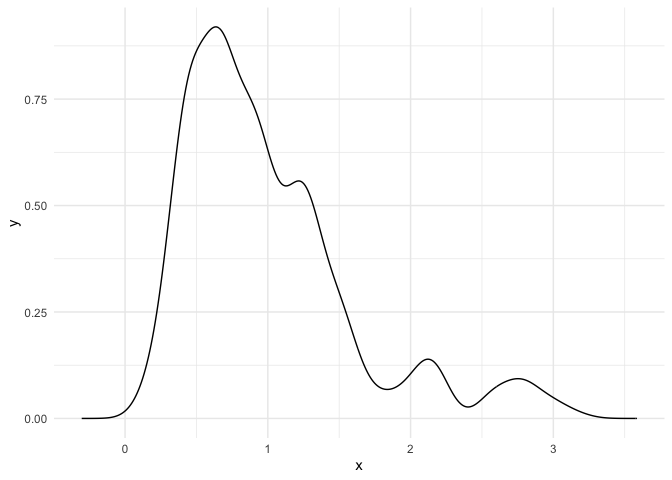<!-- -->

``` r
dis_rel_pov2018 <- bkde(dat$rel_pov2018, bandwidth = h_rel_pov2018)
dis_rel_pov2018 <- as.data.frame(dis_rel_pov2018)
ggplot(dis_rel_pov2018, aes(x, y)) + geom_line() + 
  theme_minimal() 
```

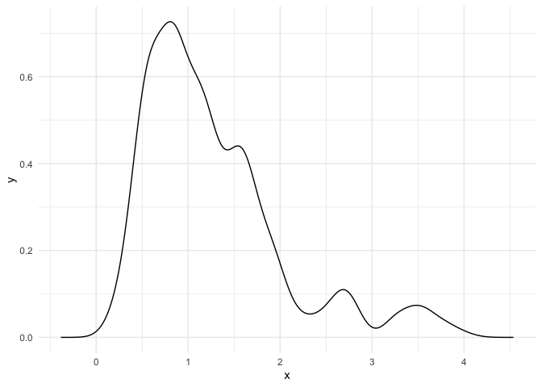<!-- -->

## Plot both densities

There are two methods for plot both densities,i.e. Kernsmooth and
bandwith default of ggplot. I prefer using the gglot ( Method 2).

# Method 2 (ggplot)

Using the bandwidth default of ggplot Manual labels are not yet
implemented in the `ggplotly` function

``` r
rel_pov2010 <- dat %>% 
  select(rel_pov2010) %>% 
  rename(rel_var = rel_pov2010) %>% 
  mutate(year = 2010)
```

``` r
rel_pov2018 <- dat %>% 
  select(rel_pov2018) %>% 
  rename(rel_var = rel_pov2018) %>% 
  mutate(year = 2018)
```

``` r
rel_pov2010pov2018 <- bind_rows(rel_pov2010, rel_pov2018)
```

``` r
rel_pov2010pov2018 <- rel_pov2010pov2018 %>% 
  mutate(year = as.factor(year))
head(rel_pov2010pov2018)
```

    ##   rel_var year
    ## 1   1.512 2010
    ## 2   1.241 2010
    ## 3   1.020 2010
    ## 4   1.075 2010
    ## 5   1.180 2010
    ## 6   1.287 2010

``` r
dis_rel_pov2010pov2018 <- ggplot(rel_pov2010pov2018,aes(x=rel_var, color=year)) +
  geom_density() + 
  theme_minimal() 
dis_rel_pov2010pov2018
```

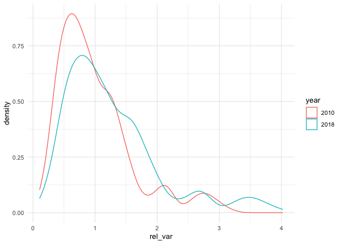<!-- -->

Using plotly

``` r
ggplotly(dis_rel_pov2010pov2018)
```

    ## PhantomJS not found. You can install it with webshot::install_phantomjs(). If it is installed, please make sure the phantomjs executable can be found via the PATH variable.

<!--html_preserve-->

<div id="htmlwidget-be367a6f3c826657eb7b" class="plotly html-widget" style="width:672px;height:480px;">

</div>

<script type="application/json" data-for="htmlwidget-be367a6f3c826657eb7b">{"x":{"data":[{"x":[0.106946448283509,0.114599936403695,0.122253424523881,0.129906912644066,0.137560400764252,0.145213888884438,0.152867377004623,0.160520865124809,0.168174353244995,0.17582784136518,0.183481329485366,0.191134817605552,0.198788305725737,0.206441793845923,0.214095281966109,0.221748770086294,0.22940225820648,0.237055746326666,0.244709234446851,0.252362722567037,0.260016210687223,0.267669698807408,0.275323186927594,0.28297667504778,0.290630163167965,0.298283651288151,0.305937139408337,0.313590627528522,0.321244115648708,0.328897603768894,0.336551091889079,0.344204580009265,0.351858068129451,0.359511556249636,0.367165044369822,0.374818532490008,0.382472020610193,0.390125508730379,0.397778996850565,0.40543248497075,0.413085973090936,0.420739461211122,0.428392949331307,0.436046437451493,0.443699925571679,0.451353413691864,0.45900690181205,0.466660389932236,0.474313878052421,0.481967366172607,0.489620854292793,0.497274342412978,0.504927830533164,0.51258131865335,0.520234806773535,0.527888294893721,0.535541783013907,0.543195271134092,0.550848759254278,0.558502247374464,0.566155735494649,0.573809223614835,0.581462711735021,0.589116199855206,0.596769687975392,0.604423176095578,0.612076664215763,0.619730152335949,0.627383640456135,0.63503712857632,0.642690616696506,0.650344104816692,0.657997592936878,0.665651081057063,0.673304569177249,0.680958057297435,0.68861154541762,0.696265033537806,0.703918521657992,0.711572009778177,0.719225497898363,0.726878986018549,0.734532474138734,0.74218596225892,0.749839450379105,0.757492938499291,0.765146426619477,0.772799914739662,0.780453402859848,0.788106890980034,0.795760379100219,0.803413867220405,0.811067355340591,0.818720843460777,0.826374331580962,0.834027819701148,0.841681307821334,0.849334795941519,0.856988284061705,0.864641772181891,0.872295260302076,0.879948748422262,0.887602236542448,0.895255724662633,0.902909212782819,0.910562700903005,0.91821618902319,0.925869677143376,0.933523165263561,0.941176653383747,0.948830141503933,0.956483629624118,0.964137117744304,0.97179060586449,0.979444093984676,0.987097582104861,0.994751070225047,1.00240455834523,1.01005804646542,1.0177115345856,1.02536502270579,1.03301851082598,1.04067199894616,1.04832548706635,1.05597897518653,1.06363246330672,1.0712859514269,1.07893943954709,1.08659292766727,1.09424641578746,1.10189990390765,1.10955339202783,1.11720688014802,1.1248603682682,1.13251385638839,1.14016734450857,1.14782083262876,1.15547432074895,1.16312780886913,1.17078129698932,1.1784347851095,1.18608827322969,1.19374176134987,1.20139524947006,1.20904873759025,1.21670222571043,1.22435571383062,1.2320092019508,1.23966269007099,1.24731617819117,1.25496966631136,1.26262315443155,1.27027664255173,1.27793013067192,1.2855836187921,1.29323710691229,1.30089059503247,1.30854408315266,1.31619757127284,1.32385105939303,1.33150454751322,1.3391580356334,1.34681152375359,1.35446501187377,1.36211849999396,1.36977198811414,1.37742547623433,1.38507896435452,1.3927324524747,1.40038594059489,1.40803942871507,1.41569291683526,1.42334640495544,1.43099989307563,1.43865338119582,1.446306869316,1.45396035743619,1.46161384555637,1.46926733367656,1.47692082179674,1.48457430991693,1.49222779803712,1.4998812861573,1.50753477427749,1.51518826239767,1.52284175051786,1.53049523863804,1.53814872675823,1.54580221487841,1.5534557029986,1.56110919111879,1.56876267923897,1.57641616735916,1.58406965547934,1.59172314359953,1.59937663171971,1.6070301198399,1.61468360796009,1.62233709608027,1.62999058420046,1.63764407232064,1.64529756044083,1.65295104856101,1.6606045366812,1.66825802480139,1.67591151292157,1.68356500104176,1.69121848916194,1.69887197728213,1.70652546540231,1.7141789535225,1.72183244164269,1.72948592976287,1.73713941788306,1.74479290600324,1.75244639412343,1.76009988224361,1.7677533703638,1.77540685848399,1.78306034660417,1.79071383472436,1.79836732284454,1.80602081096473,1.81367429908491,1.8213277872051,1.82898127532528,1.83663476344547,1.84428825156566,1.85194173968584,1.85959522780603,1.86724871592621,1.8749022040464,1.88255569216658,1.89020918028677,1.89786266840696,1.90551615652714,1.91316964464733,1.92082313276751,1.9284766208877,1.93613010900788,1.94378359712807,1.95143708524826,1.95909057336844,1.96674406148863,1.97439754960881,1.982051037729,1.98970452584918,1.99735801396937,2.00501150208955,2.01266499020974,2.02031847832993,2.02797196645011,2.0356254545703,2.04327894269048,2.05093243081067,2.05858591893085,2.06623940705104,2.07389289517123,2.08154638329141,2.0891998714116,2.09685335953178,2.10450684765197,2.11216033577215,2.11981382389234,2.12746731201253,2.13512080013271,2.1427742882529,2.15042777637308,2.15808126449327,2.16573475261345,2.17338824073364,2.18104172885383,2.18869521697401,2.1963487050942,2.20400219321438,2.21165568133457,2.21930916945475,2.22696265757494,2.23461614569512,2.24226963381531,2.2499231219355,2.25757661005568,2.26523009817587,2.27288358629605,2.28053707441624,2.28819056253642,2.29584405065661,2.3034975387768,2.31115102689698,2.31880451501717,2.32645800313735,2.33411149125754,2.34176497937772,2.34941846749791,2.3570719556181,2.36472544373828,2.37237893185847,2.38003241997865,2.38768590809884,2.39533939621902,2.40299288433921,2.4106463724594,2.41829986057958,2.42595334869977,2.43360683681995,2.44126032494014,2.44891381306032,2.45656730118051,2.46422078930069,2.47187427742088,2.47952776554107,2.48718125366125,2.49483474178144,2.50248822990162,2.51014171802181,2.51779520614199,2.52544869426218,2.53310218238237,2.54075567050255,2.54840915862274,2.55606264674292,2.56371613486311,2.57136962298329,2.57902311110348,2.58667659922367,2.59433008734385,2.60198357546404,2.60963706358422,2.61729055170441,2.62494403982459,2.63259752794478,2.64025101606497,2.64790450418515,2.65555799230534,2.66321148042552,2.67086496854571,2.67851845666589,2.68617194478608,2.69382543290626,2.70147892102645,2.70913240914664,2.71678589726682,2.72443938538701,2.73209287350719,2.73974636162738,2.74739984974756,2.75505333786775,2.76270682598794,2.77036031410812,2.77801380222831,2.78566729034849,2.79332077846868,2.80097426658886,2.80862775470905,2.81628124282924,2.82393473094942,2.83158821906961,2.83924170718979,2.84689519530998,2.85454868343016,2.86220217155035,2.86985565967054,2.87750914779072,2.88516263591091,2.89281612403109,2.90046961215128,2.90812310027146,2.91577658839165,2.92343007651183,2.93108356463202,2.93873705275221,2.94639054087239,2.95404402899258,2.96169751711276,2.96935100523295,2.97700449335313,2.98465798147332,2.99231146959351,2.99996495771369,3.00761844583388,3.01527193395406,3.02292542207425,3.03057891019443,3.03823239831462,3.04588588643481,3.05353937455499,3.06119286267518,3.06884635079536,3.07649983891555,3.08415332703573,3.09180681515592,3.09946030327611,3.10711379139629,3.11476727951648,3.12242076763666,3.13007425575685,3.13772774387703,3.14538123199722,3.15303472011741,3.16068820823759,3.16834169635778,3.17599518447796,3.18364867259815,3.19130216071833,3.19895564883852,3.2066091369587,3.21426262507889,3.22191611319908,3.22956960131926,3.23722308943945,3.24487657755963,3.25253006567982,3.2601835538,3.26783704192019,3.27549053004038,3.28314401816056,3.29079750628075,3.29845099440093,3.30610448252112,3.3137579706413,3.32141145876149,3.32906494688168,3.33671843500186,3.34437192312205,3.35202541124223,3.35967889936242,3.3673323874826,3.37498587560279,3.38263936372298,3.39029285184316,3.39794633996335,3.40559982808353,3.41325331620372,3.4209068043239,3.42856029244409,3.43621378056427,3.44386726868446,3.45152075680465,3.45917424492483,3.46682773304502,3.4744812211652,3.48213470928539,3.48978819740557,3.49744168552576,3.50509517364595,3.51274866176613,3.52040214988632,3.5280556380065,3.53570912612669,3.54336261424687,3.55101610236706,3.55866959048725,3.56632307860743,3.57397656672762,3.5816300548478,3.58928354296799,3.59693703108817,3.60459051920836,3.61224400732854,3.61989749544873,3.62755098356892,3.6352044716891,3.64285795980929,3.65051144792947,3.65816493604966,3.66581842416984,3.67347191229003,3.68112540041022,3.6887788885304,3.69643237665059,3.70408586477077,3.71173935289096,3.71939284101114,3.72704632913133,3.73469981725152,3.7423533053717,3.75000679349189,3.75766028161207,3.76531376973226,3.77296725785244,3.78062074597263,3.78827423409282,3.795927722213,3.80358121033319,3.81123469845337,3.81888818657356,3.82654167469374,3.83419516281393,3.84184865093412,3.8495021390543,3.85715562717449,3.86480911529467,3.87246260341486,3.88011609153504,3.88776957965523,3.89542306777541,3.9030765558956,3.91073004401579,3.91838353213597,3.92603702025616,3.93369050837634,3.94134399649653,3.94899748461671,3.9566509727369,3.96430446085709,3.97195794897727,3.97961143709746,3.98726492521764,3.99491841333783,4.00257190145801,4.0102253895782,4.01787887769839,4.01787887769839,4.0102253895782,4.00257190145801,3.99491841333783,3.98726492521764,3.97961143709746,3.97195794897727,3.96430446085709,3.9566509727369,3.94899748461671,3.94134399649653,3.93369050837634,3.92603702025616,3.91838353213597,3.91073004401579,3.9030765558956,3.89542306777541,3.88776957965523,3.88011609153504,3.87246260341486,3.86480911529467,3.85715562717449,3.8495021390543,3.84184865093412,3.83419516281393,3.82654167469374,3.81888818657356,3.81123469845337,3.80358121033319,3.795927722213,3.78827423409282,3.78062074597263,3.77296725785244,3.76531376973226,3.75766028161207,3.75000679349189,3.7423533053717,3.73469981725152,3.72704632913133,3.71939284101114,3.71173935289096,3.70408586477077,3.69643237665059,3.6887788885304,3.68112540041022,3.67347191229003,3.66581842416984,3.65816493604966,3.65051144792947,3.64285795980929,3.6352044716891,3.62755098356892,3.61989749544873,3.61224400732854,3.60459051920836,3.59693703108817,3.58928354296799,3.5816300548478,3.57397656672762,3.56632307860743,3.55866959048725,3.55101610236706,3.54336261424687,3.53570912612669,3.5280556380065,3.52040214988632,3.51274866176613,3.50509517364595,3.49744168552576,3.48978819740557,3.48213470928539,3.4744812211652,3.46682773304502,3.45917424492483,3.45152075680465,3.44386726868446,3.43621378056427,3.42856029244409,3.4209068043239,3.41325331620372,3.40559982808353,3.39794633996335,3.39029285184316,3.38263936372298,3.37498587560279,3.3673323874826,3.35967889936242,3.35202541124223,3.34437192312205,3.33671843500186,3.32906494688168,3.32141145876149,3.3137579706413,3.30610448252112,3.29845099440093,3.29079750628075,3.28314401816056,3.27549053004038,3.26783704192019,3.2601835538,3.25253006567982,3.24487657755963,3.23722308943945,3.22956960131926,3.22191611319908,3.21426262507889,3.2066091369587,3.19895564883852,3.19130216071833,3.18364867259815,3.17599518447796,3.16834169635778,3.16068820823759,3.15303472011741,3.14538123199722,3.13772774387703,3.13007425575685,3.12242076763666,3.11476727951648,3.10711379139629,3.09946030327611,3.09180681515592,3.08415332703573,3.07649983891555,3.06884635079536,3.06119286267518,3.05353937455499,3.04588588643481,3.03823239831462,3.03057891019443,3.02292542207425,3.01527193395406,3.00761844583388,2.99996495771369,2.99231146959351,2.98465798147332,2.97700449335313,2.96935100523295,2.96169751711276,2.95404402899258,2.94639054087239,2.93873705275221,2.93108356463202,2.92343007651183,2.91577658839165,2.90812310027146,2.90046961215128,2.89281612403109,2.88516263591091,2.87750914779072,2.86985565967054,2.86220217155035,2.85454868343016,2.84689519530998,2.83924170718979,2.83158821906961,2.82393473094942,2.81628124282924,2.80862775470905,2.80097426658886,2.79332077846868,2.78566729034849,2.77801380222831,2.77036031410812,2.76270682598794,2.75505333786775,2.74739984974756,2.73974636162738,2.73209287350719,2.72443938538701,2.71678589726682,2.70913240914664,2.70147892102645,2.69382543290626,2.68617194478608,2.67851845666589,2.67086496854571,2.66321148042552,2.65555799230534,2.64790450418515,2.64025101606497,2.63259752794478,2.62494403982459,2.61729055170441,2.60963706358422,2.60198357546404,2.59433008734385,2.58667659922367,2.57902311110348,2.57136962298329,2.56371613486311,2.55606264674292,2.54840915862274,2.54075567050255,2.53310218238237,2.52544869426218,2.51779520614199,2.51014171802181,2.50248822990162,2.49483474178144,2.48718125366125,2.47952776554107,2.47187427742088,2.46422078930069,2.45656730118051,2.44891381306032,2.44126032494014,2.43360683681995,2.42595334869977,2.41829986057958,2.4106463724594,2.40299288433921,2.39533939621902,2.38768590809884,2.38003241997865,2.37237893185847,2.36472544373828,2.3570719556181,2.34941846749791,2.34176497937772,2.33411149125754,2.32645800313735,2.31880451501717,2.31115102689698,2.3034975387768,2.29584405065661,2.28819056253642,2.28053707441624,2.27288358629605,2.26523009817587,2.25757661005568,2.2499231219355,2.24226963381531,2.23461614569512,2.22696265757494,2.21930916945475,2.21165568133457,2.20400219321438,2.1963487050942,2.18869521697401,2.18104172885383,2.17338824073364,2.16573475261345,2.15808126449327,2.15042777637308,2.1427742882529,2.13512080013271,2.12746731201253,2.11981382389234,2.11216033577215,2.10450684765197,2.09685335953178,2.0891998714116,2.08154638329141,2.07389289517123,2.06623940705104,2.05858591893085,2.05093243081067,2.04327894269048,2.0356254545703,2.02797196645011,2.02031847832993,2.01266499020974,2.00501150208955,1.99735801396937,1.98970452584918,1.982051037729,1.97439754960881,1.96674406148863,1.95909057336844,1.95143708524826,1.94378359712807,1.93613010900788,1.9284766208877,1.92082313276751,1.91316964464733,1.90551615652714,1.89786266840696,1.89020918028677,1.88255569216658,1.8749022040464,1.86724871592621,1.85959522780603,1.85194173968584,1.84428825156566,1.83663476344547,1.82898127532528,1.8213277872051,1.81367429908491,1.80602081096473,1.79836732284454,1.79071383472436,1.78306034660417,1.77540685848399,1.7677533703638,1.76009988224361,1.75244639412343,1.74479290600324,1.73713941788306,1.72948592976287,1.72183244164269,1.7141789535225,1.70652546540231,1.69887197728213,1.69121848916194,1.68356500104176,1.67591151292157,1.66825802480139,1.6606045366812,1.65295104856101,1.64529756044083,1.63764407232064,1.62999058420046,1.62233709608027,1.61468360796009,1.6070301198399,1.59937663171971,1.59172314359953,1.58406965547934,1.57641616735916,1.56876267923897,1.56110919111879,1.5534557029986,1.54580221487841,1.53814872675823,1.53049523863804,1.52284175051786,1.51518826239767,1.50753477427749,1.4998812861573,1.49222779803712,1.48457430991693,1.47692082179674,1.46926733367656,1.46161384555637,1.45396035743619,1.446306869316,1.43865338119582,1.43099989307563,1.42334640495544,1.41569291683526,1.40803942871507,1.40038594059489,1.3927324524747,1.38507896435452,1.37742547623433,1.36977198811414,1.36211849999396,1.35446501187377,1.34681152375359,1.3391580356334,1.33150454751322,1.32385105939303,1.31619757127284,1.30854408315266,1.30089059503247,1.29323710691229,1.2855836187921,1.27793013067192,1.27027664255173,1.26262315443155,1.25496966631136,1.24731617819117,1.23966269007099,1.2320092019508,1.22435571383062,1.21670222571043,1.20904873759025,1.20139524947006,1.19374176134987,1.18608827322969,1.1784347851095,1.17078129698932,1.16312780886913,1.15547432074895,1.14782083262876,1.14016734450857,1.13251385638839,1.1248603682682,1.11720688014802,1.10955339202783,1.10189990390765,1.09424641578746,1.08659292766727,1.07893943954709,1.0712859514269,1.06363246330672,1.05597897518653,1.04832548706635,1.04067199894616,1.03301851082598,1.02536502270579,1.0177115345856,1.01005804646542,1.00240455834523,0.994751070225047,0.987097582104861,0.979444093984676,0.97179060586449,0.964137117744304,0.956483629624118,0.948830141503933,0.941176653383747,0.933523165263561,0.925869677143376,0.91821618902319,0.910562700903005,0.902909212782819,0.895255724662633,0.887602236542448,0.879948748422262,0.872295260302076,0.864641772181891,0.856988284061705,0.849334795941519,0.841681307821334,0.834027819701148,0.826374331580962,0.818720843460777,0.811067355340591,0.803413867220405,0.795760379100219,0.788106890980034,0.780453402859848,0.772799914739662,0.765146426619477,0.757492938499291,0.749839450379105,0.74218596225892,0.734532474138734,0.726878986018549,0.719225497898363,0.711572009778177,0.703918521657992,0.696265033537806,0.68861154541762,0.680958057297435,0.673304569177249,0.665651081057063,0.657997592936878,0.650344104816692,0.642690616696506,0.63503712857632,0.627383640456135,0.619730152335949,0.612076664215763,0.604423176095578,0.596769687975392,0.589116199855206,0.581462711735021,0.573809223614835,0.566155735494649,0.558502247374464,0.550848759254278,0.543195271134092,0.535541783013907,0.527888294893721,0.520234806773535,0.51258131865335,0.504927830533164,0.497274342412978,0.489620854292793,0.481967366172607,0.474313878052421,0.466660389932236,0.45900690181205,0.451353413691864,0.443699925571679,0.436046437451493,0.428392949331307,0.420739461211122,0.413085973090936,0.40543248497075,0.397778996850565,0.390125508730379,0.382472020610193,0.374818532490008,0.367165044369822,0.359511556249636,0.351858068129451,0.344204580009265,0.336551091889079,0.328897603768894,0.321244115648708,0.313590627528522,0.305937139408337,0.298283651288151,0.290630163167965,0.28297667504778,0.275323186927594,0.267669698807408,0.260016210687223,0.252362722567037,0.244709234446851,0.237055746326666,0.22940225820648,0.221748770086294,0.214095281966109,0.206441793845923,0.198788305725737,0.191134817605552,0.183481329485366,0.17582784136518,0.168174353244995,0.160520865124809,0.152867377004623,0.145213888884438,0.137560400764252,0.129906912644066,0.122253424523881,0.114599936403695,0.106946448283509,0.106946448283509],"y":[0,0,0,0,0,0,0,0,0,0,0,0,0,0,0,0,0,0,0,0,0,0,0,0,0,0,0,0,0,0,0,0,0,0,0,0,0,0,0,0,0,0,0,0,0,0,0,0,0,0,0,0,0,0,0,0,0,0,0,0,0,0,0,0,0,0,0,0,0,0,0,0,0,0,0,0,0,0,0,0,0,0,0,0,0,0,0,0,0,0,0,0,0,0,0,0,0,0,0,0,0,0,0,0,0,0,0,0,0,0,0,0,0,0,0,0,0,0,0,0,0,0,0,0,0,0,0,0,0,0,0,0,0,0,0,0,0,0,0,0,0,0,0,0,0,0,0,0,0,0,0,0,0,0,0,0,0,0,0,0,0,0,0,0,0,0,0,0,0,0,0,0,0,0,0,0,0,0,0,0,0,0,0,0,0,0,0,0,0,0,0,0,0,0,0,0,0,0,0,0,0,0,0,0,0,0,0,0,0,0,0,0,0,0,0,0,0,0,0,0,0,0,0,0,0,0,0,0,0,0,0,0,0,0,0,0,0,0,0,0,0,0,0,0,0,0,0,0,0,0,0,0,0,0,0,0,0,0,0,0,0,0,0,0,0,0,0,0,0,0,0,0,0,0,0,0,0,0,0,0,0,0,0,0,0,0,0,0,0,0,0,0,0,0,0,0,0,0,0,0,0,0,0,0,0,0,0,0,0,0,0,0,0,0,0,0,0,0,0,0,0,0,0,0,0,0,0,0,0,0,0,0,0,0,0,0,0,0,0,0,0,0,0,0,0,0,0,0,0,0,0,0,0,0,0,0,0,0,0,0,0,0,0,0,0,0,0,0,0,0,0,0,0,0,0,0,0,0,0,0,0,0,0,0,0,0,0,0,0,0,0,0,0,0,0,0,0,0,0,0,0,0,0,0,0,0,0,0,0,0,0,0,0,0,0,0,0,0,0,0,0,0,0,0,0,0,0,0,0,0,0,0,0,0,0,0,0,0,0,0,0,0,0,0,0,0,0,0,0,0,0,0,0,0,0,0,0,0,0,0,0,0,0,0,0,0,0,0,0,0,0,0,0,0,0,0,0,0,0,0,0,0,0,0,0,0,0,0,0,0,0,0,0,0,0,0,0,0,0,0,0,0,0,0,0,0,0,0,0,0,0,0,5.16940147402815e-12,7.59279056204514e-12,1.10096015947656e-11,1.57377186573357e-11,2.26969034112609e-11,3.3056323488353e-11,4.75997114777721e-11,6.77010596552075e-11,9.49927535211587e-11,1.35778902178817e-10,1.93847519170572e-10,2.73747471695336e-10,3.82063153427362e-10,5.26851984357424e-10,7.44835247195319e-10,1.04271382632725e-09,1.44460693186542e-09,1.97925914848497e-09,2.7037008110678e-09,3.74765917090311e-09,5.14618444313285e-09,6.99718797499233e-09,9.41497986554445e-09,1.27260105481153e-08,1.73005358988735e-08,2.33106381368443e-08,3.11177401956223e-08,4.11358951010297e-08,5.49582317032885e-08,7.33008403272004e-08,9.69453670284167e-08,1.27104461466411e-07,1.65143876781731e-07,2.17847308854028e-07,2.85159425015124e-07,3.70329539597917e-07,4.77053878141368e-07,6.12557818525904e-07,7.92976243369846e-07,1.01909141667664e-06,1.300050460285e-06,1.64608081128524e-06,2.08699508004446e-06,2.65225132962758e-06,3.34774007761685e-06,4.19676482265495e-06,5.22498937820269e-06,6.53566130987722e-06,8.15711463375374e-06,1.01165953623881e-05,1.24677857265027e-05,1.52690053096477e-05,1.88295052565359e-05,2.30902276882441e-05,2.81498315461089e-05,3.41199357904373e-05,4.12236720652533e-05,4.99641797872192e-05,6.02278099008903e-05,7.22103037028811e-05,8.61206464356501e-05,0.000102628407007205,0.000122283548197414,0.000144972177577902,0.000171027660735073,0.000200801217950694,0.000235939273205967,0.000276534028208271,0.000322627094804294,0.000374725553118164,0.000433356908556423,0.000501985327022694,0.000579138462432925,0.000665367622615463,0.000761357796399321,0.000868671109033612,0.000991102817233633,0.0011263920496033,0.0012753437195274,0.00143877256266939,0.00162023301619485,0.00182191600607064,0.00204155317073905,0.00227998891907344,0.00253806430693255,0.00282215310077634,0.00313077897879825,0.00346238062343989,0.00381770849075135,0.00419749505284035,0.00461145416848358,0.00505252336339098,0.005520669679556,0.00601642371313658,0.0065421741951896,0.0071053019935021,0.00769773918788269,0.00831975519624858,0.00897158488050026,0.00965808864782249,0.010381088118607,0.011134314672548,0.011917734518221,0.0127312824141917,0.0135820729324815,0.0144660798094467,0.0153794548167637,0.0163219170500789,0.0172931631122113,0.0183020445314734,0.0193394337517971,0.0204040375644904,0.0214954288703388,0.0226146498158995,0.0237672748507398,0.0249448086314995,0.0261467843573547,0.0273727352943501,0.0286255194430252,0.029905885019056,0.0312083133356306,0.032532348135899,0.0338775331828878,0.0352480725070778,0.0366409215640203,0.0380529687257487,0.0394837005100332,0.0409325866822098,0.042404352133034,0.0438929932959322,0.0453970806697373,0.0469157986231114,0.04844888511088,0.0499978158593141,0.0515570202939731,0.0531251099841487,0.0547006026017771,0.056282270264032,0.0578669878233366,0.0594513318165062,0.0610329794139463,0.06260949627547,0.0641753173982487,0.0657261028519979,0.0672598615209257,0.0687733413072897,0.0702632040495149,0.0717150828958166,0.0731308149954693,0.0745080265658849,0.0758429972157042,0.0771297848457814,0.0783478558205625,0.0795084555246236,0.0806081050050821,0.081643408141032,0.0826014638415611,0.0834695742151534,0.0842609485666533,0.0849731271637875,0.0856037985246422,0.0861316910149099,0.0865603212001682,0.0869005374729657,0.0871513111337674,0.0873117763456098,0.0873530205470755,0.0872979588594507,0.0871517085712109,0.0869145878668173,0.0865839543929603,0.0861348413697645,0.0855980578044272,0.0849748397295123,0.0842665211208799,0.0834645706661659,0.082562622371491,0.0815826301856782,0.0805266976424802,0.0793970331751266,0.0781818648210244,0.0768903880711873,0.0755363020235828,0.0741228454379133,0.072653415405956,0.0711183623657129,0.069536765831321,0.0679164856673424,0.0662624924730765,0.0645794626532441,0.0628707596132471,0.061152518200248,0.059431620534568,0.0577151881698782,0.0560135764449712,0.054344160635514,0.0527122977192793,0.0511267733175712,0.0495965239423073,0.0481474549250748,0.0467934993699375,0.0455334650957539,0.0443767713454211,0.0433327958766807,0.0424519729454594,0.0417208711073706,0.0411389419221453,0.0407140844149752,0.0404572776051802,0.0404361226600594,0.0405990453300616,0.0409505312820114,0.041494492054554,0.0422557543954954,0.0432663187543604,0.0444756272372962,0.0458823512612496,0.0474844311969878,0.0493151084717696,0.0513591910957992,0.0535776806022523,0.0559625669249774,0.0585051129946718,0.0612314091482995,0.0640918642980714,0.0670621683871382,0.0701285469358181,0.0732773608178031,0.0765037652573246,0.0797625657970541,0.0830371112537168,0.0863106313981989,0.0895614638718554,0.0927527514607339,0.0958734256381935,0.0989073749610881,0.101838816634929,0.104624987120574,0.107241926031048,0.109698572098973,0.111983374269356,0.114085484331031,0.115936997963703,0.117563114993232,0.118975328747445,0.120169366312264,0.121140976897141,0.12180866227243,0.122253867138796,0.122479282206832,0.122488400598181,0.122266894645272,0.121789815490102,0.121122711269346,0.120274589619276,0.119254985620585,0.118048509690642,0.11667611842054,0.115178737104938,0.113568741692459,0.111858693004708,0.110044724257123,0.108163500367401,0.106235413381018,0.104273149740726,0.102289292712224,0.100302048125919,0.0983307994447697,0.0963867355607842,0.0944807725870716,0.0926291466995283,0.0908614482586191,0.0891727568404814,0.0875718070106329,0.0860670693816013,0.0846872814217044,0.0834480560211099,0.0823360798315145,0.081358000584214,0.0805202808953289,0.0798707059472441,0.0793951117313627,0.0790839987260092,0.0789427220632772,0.078976529037217,0.0792574755369326,0.0797310540137824,0.0803997339924769,0.0812679944825226,0.0823564994311959,0.0837160648718636,0.0852918554606862,0.0870872424308319,0.0891053994135603,0.0913874939134348,0.0939447814879218,0.0967341186699101,0.0997565838447878,0.103012924819103,0.106562870222527,0.110370665656433,0.114409120383317,0.11867591209372,0.123168304065869,0.127956223532254,0.132960927344399,0.138172629969619,0.143585435222185,0.149205808894765,0.155062889622116,0.161091846356188,0.167284680200886,0.173633266764347,0.1801502749831,0.18682662939901,0.193624389244901,0.200535552461568,0.207552279971315,0.214687768222308,0.221917558733144,0.229224683773485,0.236603573130002,0.244049014737252,0.251574429348729,0.259155649340324,0.26678838094645,0.274470242252138,0.28220192604163,0.289991665659845,0.297824382987411,0.305699070087899,0.313614684089445,0.321575773903734,0.329581828653736,0.337621987682708,0.345693280473038,0.353792277765161,0.361918116752963,0.370058059249831,0.378201773053726,0.386340873577916,0.394466265970489,0.402551971214939,0.410586810351115,0.41855798335763,0.42645112615934,0.434244849663872,0.441882328042161,0.44937584518126,0.45670869616896,0.463864270282261,0.47079427297818,0.477453638194314,0.483871999812191,0.490036542729356,0.495935348528313,0.501489936429928,0.506715469926109,0.511645145410369,0.51627704297332,0.520610745059671,0.524556631683862,0.528207464303044,0.531586471157086,0.534705982675865,0.537569849755194,0.540148346264412,0.542540908486274,0.544770539002434,0.54686116818849,0.548828759997563,0.550714786496169,0.552571754310088,0.554427302247623,0.556308975756342,0.558267480186955,0.560343744096109,0.562552660836507,0.56491666854201,0.56745711687665,0.570265696477229,0.573313973169164,0.576603087955767,0.58014275535623,0.583951305168202,0.58811085436982,0.592535625407553,0.597222282461203,0.602166013937163,0.607390194751825,0.612902339770152,0.618630406917387,0.62456022074866,0.630676850773377,0.636994504747048,0.643471064563729,0.650064871859754,0.656758717506361,0.663535527715445,0.670388916284016,0.677279030435164,0.684188882572069,0.691105679177101,0.698016738338211,0.704899586433008,0.711749245807288,0.718559743977741,0.725325927131031,0.732037182747215,0.738682925571201,0.745274634677864,0.751812148981606,0.758295634016248,0.764714788647007,0.771073856613924,0.777381435574529,0.783637501513977,0.789841685789135,0.795976000367977,0.802048336643701,0.808057660854543,0.813998620385196,0.819863055337516,0.82561037569798,0.831255139552509,0.836785848516107,0.842190364069968,0.847437502704964,0.852479737792315,0.857337215492628,0.861994550008396,0.86643627218864,0.87059459947409,0.874451125696309,0.878029906067023,0.881317296424925,0.88430014029234,0.886867717830098,0.889072046192053,0.890927966284766,0.892427409528528,0.893557169965682,0.894183994090755,0.894430390147006,0.894292712519188,0.893767621482454,0.892810916035918,0.891357234589413,0.889505020870254,0.887251373821821,0.884593155535534,0.881446568360662,0.877812866235871,0.873755619005669,0.869268402763052,0.864344301823523,0.858845519452166,0.852847123420414,0.846375698528653,0.839421421430281,0.831970297469534,0.823829991130096,0.815166429508868,0.80597126689067,0.796236858263029,0.785902627808744,0.774866898810185,0.763274688421609,0.751126953047557,0.738426134971842,0.725077354799538,0.711101482591178,0.696609643665076,0.681617766101473,0.666143550892637,0.65009337264957,0.633594052137626,0.616714881281612,0.599486404968142,0.58194050667182,0.564036196062307,0.54592662737882,0.527650130577726,0.509245421046423,0.49074977295746,0.472226663537595,0.453737872310094,0.435321603701088,0.417015465425206,0.398894011115875,0.381022445186678,0.363402934566454,0.346065357061167,0.329038326517459,0.312451293164545,0.296284171423961,0.280522277014869,0.265182933213533,0.250281999098825,0.236001766839526,0.222197665821771,0.208872429971033,0.196031021185459,0.183716849470119,0.172029119182314,0.16082778556022,0.150109372658983,0.139869582500104,0.130181546529509,0.121042665778069,0.112353153519563,0.104103793080394,0],"text":["density: 1.041e-01<br />rel_var: 0.1069<br />year: 2010","density: 1.124e-01<br />rel_var: 0.1146<br />year: 2010","density: 1.210e-01<br />rel_var: 0.1223<br />year: 2010","density: 1.302e-01<br />rel_var: 0.1299<br />year: 2010","density: 1.399e-01<br />rel_var: 0.1376<br />year: 2010","density: 1.501e-01<br />rel_var: 0.1452<br />year: 2010","density: 1.608e-01<br />rel_var: 0.1529<br />year: 2010","density: 1.720e-01<br />rel_var: 0.1605<br />year: 2010","density: 1.837e-01<br />rel_var: 0.1682<br />year: 2010","density: 1.960e-01<br />rel_var: 0.1758<br />year: 2010","density: 2.089e-01<br />rel_var: 0.1835<br />year: 2010","density: 2.222e-01<br />rel_var: 0.1911<br />year: 2010","density: 2.360e-01<br />rel_var: 0.1988<br />year: 2010","density: 2.503e-01<br />rel_var: 0.2064<br />year: 2010","density: 2.652e-01<br />rel_var: 0.2141<br />year: 2010","density: 2.805e-01<br />rel_var: 0.2217<br />year: 2010","density: 2.963e-01<br />rel_var: 0.2294<br />year: 2010","density: 3.125e-01<br />rel_var: 0.2371<br />year: 2010","density: 3.290e-01<br />rel_var: 0.2447<br />year: 2010","density: 3.461e-01<br />rel_var: 0.2524<br />year: 2010","density: 3.634e-01<br />rel_var: 0.2600<br />year: 2010","density: 3.810e-01<br />rel_var: 0.2677<br />year: 2010","density: 3.989e-01<br />rel_var: 0.2753<br />year: 2010","density: 4.170e-01<br />rel_var: 0.2830<br />year: 2010","density: 4.353e-01<br />rel_var: 0.2906<br />year: 2010","density: 4.537e-01<br />rel_var: 0.2983<br />year: 2010","density: 4.722e-01<br />rel_var: 0.3059<br />year: 2010","density: 4.907e-01<br />rel_var: 0.3136<br />year: 2010","density: 5.092e-01<br />rel_var: 0.3212<br />year: 2010","density: 5.277e-01<br />rel_var: 0.3289<br />year: 2010","density: 5.459e-01<br />rel_var: 0.3366<br />year: 2010","density: 5.640e-01<br />rel_var: 0.3442<br />year: 2010","density: 5.819e-01<br />rel_var: 0.3519<br />year: 2010","density: 5.995e-01<br />rel_var: 0.3595<br />year: 2010","density: 6.167e-01<br />rel_var: 0.3672<br />year: 2010","density: 6.336e-01<br />rel_var: 0.3748<br />year: 2010","density: 6.501e-01<br />rel_var: 0.3825<br />year: 2010","density: 6.661e-01<br />rel_var: 0.3901<br />year: 2010","density: 6.816e-01<br />rel_var: 0.3978<br />year: 2010","density: 6.966e-01<br />rel_var: 0.4054<br />year: 2010","density: 7.111e-01<br />rel_var: 0.4131<br />year: 2010","density: 7.251e-01<br />rel_var: 0.4207<br />year: 2010","density: 7.384e-01<br />rel_var: 0.4284<br />year: 2010","density: 7.511e-01<br />rel_var: 0.4360<br />year: 2010","density: 7.633e-01<br />rel_var: 0.4437<br />year: 2010","density: 7.749e-01<br />rel_var: 0.4514<br />year: 2010","density: 7.859e-01<br />rel_var: 0.4590<br />year: 2010","density: 7.962e-01<br />rel_var: 0.4667<br />year: 2010","density: 8.060e-01<br />rel_var: 0.4743<br />year: 2010","density: 8.152e-01<br />rel_var: 0.4820<br />year: 2010","density: 8.238e-01<br />rel_var: 0.4896<br />year: 2010","density: 8.320e-01<br />rel_var: 0.4973<br />year: 2010","density: 8.394e-01<br />rel_var: 0.5049<br />year: 2010","density: 8.464e-01<br />rel_var: 0.5126<br />year: 2010","density: 8.528e-01<br />rel_var: 0.5202<br />year: 2010","density: 8.588e-01<br />rel_var: 0.5279<br />year: 2010","density: 8.643e-01<br />rel_var: 0.5355<br />year: 2010","density: 8.693e-01<br />rel_var: 0.5432<br />year: 2010","density: 8.738e-01<br />rel_var: 0.5508<br />year: 2010","density: 8.778e-01<br />rel_var: 0.5585<br />year: 2010","density: 8.814e-01<br />rel_var: 0.5662<br />year: 2010","density: 8.846e-01<br />rel_var: 0.5738<br />year: 2010","density: 8.873e-01<br />rel_var: 0.5815<br />year: 2010","density: 8.895e-01<br />rel_var: 0.5891<br />year: 2010","density: 8.914e-01<br />rel_var: 0.5968<br />year: 2010","density: 8.928e-01<br />rel_var: 0.6044<br />year: 2010","density: 8.938e-01<br />rel_var: 0.6121<br />year: 2010","density: 8.943e-01<br />rel_var: 0.6197<br />year: 2010","density: 8.944e-01<br />rel_var: 0.6274<br />year: 2010","density: 8.942e-01<br />rel_var: 0.6350<br />year: 2010","density: 8.936e-01<br />rel_var: 0.6427<br />year: 2010","density: 8.924e-01<br />rel_var: 0.6503<br />year: 2010","density: 8.909e-01<br />rel_var: 0.6580<br />year: 2010","density: 8.891e-01<br />rel_var: 0.6657<br />year: 2010","density: 8.869e-01<br />rel_var: 0.6733<br />year: 2010","density: 8.843e-01<br />rel_var: 0.6810<br />year: 2010","density: 8.813e-01<br />rel_var: 0.6886<br />year: 2010","density: 8.780e-01<br />rel_var: 0.6963<br />year: 2010","density: 8.745e-01<br />rel_var: 0.7039<br />year: 2010","density: 8.706e-01<br />rel_var: 0.7116<br />year: 2010","density: 8.664e-01<br />rel_var: 0.7192<br />year: 2010","density: 8.620e-01<br />rel_var: 0.7269<br />year: 2010","density: 8.573e-01<br />rel_var: 0.7345<br />year: 2010","density: 8.525e-01<br />rel_var: 0.7422<br />year: 2010","density: 8.474e-01<br />rel_var: 0.7498<br />year: 2010","density: 8.422e-01<br />rel_var: 0.7575<br />year: 2010","density: 8.368e-01<br />rel_var: 0.7651<br />year: 2010","density: 8.313e-01<br />rel_var: 0.7728<br />year: 2010","density: 8.256e-01<br />rel_var: 0.7805<br />year: 2010","density: 8.199e-01<br />rel_var: 0.7881<br />year: 2010","density: 8.140e-01<br />rel_var: 0.7958<br />year: 2010","density: 8.081e-01<br />rel_var: 0.8034<br />year: 2010","density: 8.020e-01<br />rel_var: 0.8111<br />year: 2010","density: 7.960e-01<br />rel_var: 0.8187<br />year: 2010","density: 7.898e-01<br />rel_var: 0.8264<br />year: 2010","density: 7.836e-01<br />rel_var: 0.8340<br />year: 2010","density: 7.774e-01<br />rel_var: 0.8417<br />year: 2010","density: 7.711e-01<br />rel_var: 0.8493<br />year: 2010","density: 7.647e-01<br />rel_var: 0.8570<br />year: 2010","density: 7.583e-01<br />rel_var: 0.8646<br />year: 2010","density: 7.518e-01<br />rel_var: 0.8723<br />year: 2010","density: 7.453e-01<br />rel_var: 0.8799<br />year: 2010","density: 7.387e-01<br />rel_var: 0.8876<br />year: 2010","density: 7.320e-01<br />rel_var: 0.8953<br />year: 2010","density: 7.253e-01<br />rel_var: 0.9029<br />year: 2010","density: 7.186e-01<br />rel_var: 0.9106<br />year: 2010","density: 7.117e-01<br />rel_var: 0.9182<br />year: 2010","density: 7.049e-01<br />rel_var: 0.9259<br />year: 2010","density: 6.980e-01<br />rel_var: 0.9335<br />year: 2010","density: 6.911e-01<br />rel_var: 0.9412<br />year: 2010","density: 6.842e-01<br />rel_var: 0.9488<br />year: 2010","density: 6.773e-01<br />rel_var: 0.9565<br />year: 2010","density: 6.704e-01<br />rel_var: 0.9641<br />year: 2010","density: 6.635e-01<br />rel_var: 0.9718<br />year: 2010","density: 6.568e-01<br />rel_var: 0.9794<br />year: 2010","density: 6.501e-01<br />rel_var: 0.9871<br />year: 2010","density: 6.435e-01<br />rel_var: 0.9948<br />year: 2010","density: 6.370e-01<br />rel_var: 1.0024<br />year: 2010","density: 6.307e-01<br />rel_var: 1.0101<br />year: 2010","density: 6.246e-01<br />rel_var: 1.0177<br />year: 2010","density: 6.186e-01<br />rel_var: 1.0254<br />year: 2010","density: 6.129e-01<br />rel_var: 1.0330<br />year: 2010","density: 6.074e-01<br />rel_var: 1.0407<br />year: 2010","density: 6.022e-01<br />rel_var: 1.0483<br />year: 2010","density: 5.972e-01<br />rel_var: 1.0560<br />year: 2010","density: 5.925e-01<br />rel_var: 1.0636<br />year: 2010","density: 5.881e-01<br />rel_var: 1.0713<br />year: 2010","density: 5.840e-01<br />rel_var: 1.0789<br />year: 2010","density: 5.801e-01<br />rel_var: 1.0866<br />year: 2010","density: 5.766e-01<br />rel_var: 1.0942<br />year: 2010","density: 5.733e-01<br />rel_var: 1.1019<br />year: 2010","density: 5.703e-01<br />rel_var: 1.1096<br />year: 2010","density: 5.675e-01<br />rel_var: 1.1172<br />year: 2010","density: 5.649e-01<br />rel_var: 1.1249<br />year: 2010","density: 5.626e-01<br />rel_var: 1.1325<br />year: 2010","density: 5.603e-01<br />rel_var: 1.1402<br />year: 2010","density: 5.583e-01<br />rel_var: 1.1478<br />year: 2010","density: 5.563e-01<br />rel_var: 1.1555<br />year: 2010","density: 5.544e-01<br />rel_var: 1.1631<br />year: 2010","density: 5.526e-01<br />rel_var: 1.1708<br />year: 2010","density: 5.507e-01<br />rel_var: 1.1784<br />year: 2010","density: 5.488e-01<br />rel_var: 1.1861<br />year: 2010","density: 5.469e-01<br />rel_var: 1.1937<br />year: 2010","density: 5.448e-01<br />rel_var: 1.2014<br />year: 2010","density: 5.425e-01<br />rel_var: 1.2090<br />year: 2010","density: 5.401e-01<br />rel_var: 1.2167<br />year: 2010","density: 5.376e-01<br />rel_var: 1.2244<br />year: 2010","density: 5.347e-01<br />rel_var: 1.2320<br />year: 2010","density: 5.316e-01<br />rel_var: 1.2397<br />year: 2010","density: 5.282e-01<br />rel_var: 1.2473<br />year: 2010","density: 5.246e-01<br />rel_var: 1.2550<br />year: 2010","density: 5.206e-01<br />rel_var: 1.2626<br />year: 2010","density: 5.163e-01<br />rel_var: 1.2703<br />year: 2010","density: 5.116e-01<br />rel_var: 1.2779<br />year: 2010","density: 5.067e-01<br />rel_var: 1.2856<br />year: 2010","density: 5.015e-01<br />rel_var: 1.2932<br />year: 2010","density: 4.959e-01<br />rel_var: 1.3009<br />year: 2010","density: 4.900e-01<br />rel_var: 1.3085<br />year: 2010","density: 4.839e-01<br />rel_var: 1.3162<br />year: 2010","density: 4.775e-01<br />rel_var: 1.3239<br />year: 2010","density: 4.708e-01<br />rel_var: 1.3315<br />year: 2010","density: 4.639e-01<br />rel_var: 1.3392<br />year: 2010","density: 4.567e-01<br />rel_var: 1.3468<br />year: 2010","density: 4.494e-01<br />rel_var: 1.3545<br />year: 2010","density: 4.419e-01<br />rel_var: 1.3621<br />year: 2010","density: 4.342e-01<br />rel_var: 1.3698<br />year: 2010","density: 4.265e-01<br />rel_var: 1.3774<br />year: 2010","density: 4.186e-01<br />rel_var: 1.3851<br />year: 2010","density: 4.106e-01<br />rel_var: 1.3927<br />year: 2010","density: 4.026e-01<br />rel_var: 1.4004<br />year: 2010","density: 3.945e-01<br />rel_var: 1.4080<br />year: 2010","density: 3.863e-01<br />rel_var: 1.4157<br />year: 2010","density: 3.782e-01<br />rel_var: 1.4233<br />year: 2010","density: 3.701e-01<br />rel_var: 1.4310<br />year: 2010","density: 3.619e-01<br />rel_var: 1.4387<br />year: 2010","density: 3.538e-01<br />rel_var: 1.4463<br />year: 2010","density: 3.457e-01<br />rel_var: 1.4540<br />year: 2010","density: 3.376e-01<br />rel_var: 1.4616<br />year: 2010","density: 3.296e-01<br />rel_var: 1.4693<br />year: 2010","density: 3.216e-01<br />rel_var: 1.4769<br />year: 2010","density: 3.136e-01<br />rel_var: 1.4846<br />year: 2010","density: 3.057e-01<br />rel_var: 1.4922<br />year: 2010","density: 2.978e-01<br />rel_var: 1.4999<br />year: 2010","density: 2.900e-01<br />rel_var: 1.5075<br />year: 2010","density: 2.822e-01<br />rel_var: 1.5152<br />year: 2010","density: 2.745e-01<br />rel_var: 1.5228<br />year: 2010","density: 2.668e-01<br />rel_var: 1.5305<br />year: 2010","density: 2.592e-01<br />rel_var: 1.5381<br />year: 2010","density: 2.516e-01<br />rel_var: 1.5458<br />year: 2010","density: 2.440e-01<br />rel_var: 1.5535<br />year: 2010","density: 2.366e-01<br />rel_var: 1.5611<br />year: 2010","density: 2.292e-01<br />rel_var: 1.5688<br />year: 2010","density: 2.219e-01<br />rel_var: 1.5764<br />year: 2010","density: 2.147e-01<br />rel_var: 1.5841<br />year: 2010","density: 2.076e-01<br />rel_var: 1.5917<br />year: 2010","density: 2.005e-01<br />rel_var: 1.5994<br />year: 2010","density: 1.936e-01<br />rel_var: 1.6070<br />year: 2010","density: 1.868e-01<br />rel_var: 1.6147<br />year: 2010","density: 1.802e-01<br />rel_var: 1.6223<br />year: 2010","density: 1.736e-01<br />rel_var: 1.6300<br />year: 2010","density: 1.673e-01<br />rel_var: 1.6376<br />year: 2010","density: 1.611e-01<br />rel_var: 1.6453<br />year: 2010","density: 1.551e-01<br />rel_var: 1.6530<br />year: 2010","density: 1.492e-01<br />rel_var: 1.6606<br />year: 2010","density: 1.436e-01<br />rel_var: 1.6683<br />year: 2010","density: 1.382e-01<br />rel_var: 1.6759<br />year: 2010","density: 1.330e-01<br />rel_var: 1.6836<br />year: 2010","density: 1.280e-01<br />rel_var: 1.6912<br />year: 2010","density: 1.232e-01<br />rel_var: 1.6989<br />year: 2010","density: 1.187e-01<br />rel_var: 1.7065<br />year: 2010","density: 1.144e-01<br />rel_var: 1.7142<br />year: 2010","density: 1.104e-01<br />rel_var: 1.7218<br />year: 2010","density: 1.066e-01<br />rel_var: 1.7295<br />year: 2010","density: 1.030e-01<br />rel_var: 1.7371<br />year: 2010","density: 9.976e-02<br />rel_var: 1.7448<br />year: 2010","density: 9.673e-02<br />rel_var: 1.7524<br />year: 2010","density: 9.394e-02<br />rel_var: 1.7601<br />year: 2010","density: 9.139e-02<br />rel_var: 1.7678<br />year: 2010","density: 8.911e-02<br />rel_var: 1.7754<br />year: 2010","density: 8.709e-02<br />rel_var: 1.7831<br />year: 2010","density: 8.529e-02<br />rel_var: 1.7907<br />year: 2010","density: 8.372e-02<br />rel_var: 1.7984<br />year: 2010","density: 8.236e-02<br />rel_var: 1.8060<br />year: 2010","density: 8.127e-02<br />rel_var: 1.8137<br />year: 2010","density: 8.040e-02<br />rel_var: 1.8213<br />year: 2010","density: 7.973e-02<br />rel_var: 1.8290<br />year: 2010","density: 7.926e-02<br />rel_var: 1.8366<br />year: 2010","density: 7.898e-02<br />rel_var: 1.8443<br />year: 2010","density: 7.894e-02<br />rel_var: 1.8519<br />year: 2010","density: 7.908e-02<br />rel_var: 1.8596<br />year: 2010","density: 7.940e-02<br />rel_var: 1.8672<br />year: 2010","density: 7.987e-02<br />rel_var: 1.8749<br />year: 2010","density: 8.052e-02<br />rel_var: 1.8826<br />year: 2010","density: 8.136e-02<br />rel_var: 1.8902<br />year: 2010","density: 8.234e-02<br />rel_var: 1.8979<br />year: 2010","density: 8.345e-02<br />rel_var: 1.9055<br />year: 2010","density: 8.469e-02<br />rel_var: 1.9132<br />year: 2010","density: 8.607e-02<br />rel_var: 1.9208<br />year: 2010","density: 8.757e-02<br />rel_var: 1.9285<br />year: 2010","density: 8.917e-02<br />rel_var: 1.9361<br />year: 2010","density: 9.086e-02<br />rel_var: 1.9438<br />year: 2010","density: 9.263e-02<br />rel_var: 1.9514<br />year: 2010","density: 9.448e-02<br />rel_var: 1.9591<br />year: 2010","density: 9.639e-02<br />rel_var: 1.9667<br />year: 2010","density: 9.833e-02<br />rel_var: 1.9744<br />year: 2010","density: 1.003e-01<br />rel_var: 1.9821<br />year: 2010","density: 1.023e-01<br />rel_var: 1.9897<br />year: 2010","density: 1.043e-01<br />rel_var: 1.9974<br />year: 2010","density: 1.062e-01<br />rel_var: 2.0050<br />year: 2010","density: 1.082e-01<br />rel_var: 2.0127<br />year: 2010","density: 1.100e-01<br />rel_var: 2.0203<br />year: 2010","density: 1.119e-01<br />rel_var: 2.0280<br />year: 2010","density: 1.136e-01<br />rel_var: 2.0356<br />year: 2010","density: 1.152e-01<br />rel_var: 2.0433<br />year: 2010","density: 1.167e-01<br />rel_var: 2.0509<br />year: 2010","density: 1.180e-01<br />rel_var: 2.0586<br />year: 2010","density: 1.193e-01<br />rel_var: 2.0662<br />year: 2010","density: 1.203e-01<br />rel_var: 2.0739<br />year: 2010","density: 1.211e-01<br />rel_var: 2.0815<br />year: 2010","density: 1.218e-01<br />rel_var: 2.0892<br />year: 2010","density: 1.223e-01<br />rel_var: 2.0969<br />year: 2010","density: 1.225e-01<br />rel_var: 2.1045<br />year: 2010","density: 1.225e-01<br />rel_var: 2.1122<br />year: 2010","density: 1.223e-01<br />rel_var: 2.1198<br />year: 2010","density: 1.218e-01<br />rel_var: 2.1275<br />year: 2010","density: 1.211e-01<br />rel_var: 2.1351<br />year: 2010","density: 1.202e-01<br />rel_var: 2.1428<br />year: 2010","density: 1.190e-01<br />rel_var: 2.1504<br />year: 2010","density: 1.176e-01<br />rel_var: 2.1581<br />year: 2010","density: 1.159e-01<br />rel_var: 2.1657<br />year: 2010","density: 1.141e-01<br />rel_var: 2.1734<br />year: 2010","density: 1.120e-01<br />rel_var: 2.1810<br />year: 2010","density: 1.097e-01<br />rel_var: 2.1887<br />year: 2010","density: 1.072e-01<br />rel_var: 2.1963<br />year: 2010","density: 1.046e-01<br />rel_var: 2.2040<br />year: 2010","density: 1.018e-01<br />rel_var: 2.2117<br />year: 2010","density: 9.891e-02<br />rel_var: 2.2193<br />year: 2010","density: 9.587e-02<br />rel_var: 2.2270<br />year: 2010","density: 9.275e-02<br />rel_var: 2.2346<br />year: 2010","density: 8.956e-02<br />rel_var: 2.2423<br />year: 2010","density: 8.631e-02<br />rel_var: 2.2499<br />year: 2010","density: 8.304e-02<br />rel_var: 2.2576<br />year: 2010","density: 7.976e-02<br />rel_var: 2.2652<br />year: 2010","density: 7.650e-02<br />rel_var: 2.2729<br />year: 2010","density: 7.328e-02<br />rel_var: 2.2805<br />year: 2010","density: 7.013e-02<br />rel_var: 2.2882<br />year: 2010","density: 6.706e-02<br />rel_var: 2.2958<br />year: 2010","density: 6.409e-02<br />rel_var: 2.3035<br />year: 2010","density: 6.123e-02<br />rel_var: 2.3112<br />year: 2010","density: 5.851e-02<br />rel_var: 2.3188<br />year: 2010","density: 5.596e-02<br />rel_var: 2.3265<br />year: 2010","density: 5.358e-02<br />rel_var: 2.3341<br />year: 2010","density: 5.136e-02<br />rel_var: 2.3418<br />year: 2010","density: 4.932e-02<br />rel_var: 2.3494<br />year: 2010","density: 4.748e-02<br />rel_var: 2.3571<br />year: 2010","density: 4.588e-02<br />rel_var: 2.3647<br />year: 2010","density: 4.448e-02<br />rel_var: 2.3724<br />year: 2010","density: 4.327e-02<br />rel_var: 2.3800<br />year: 2010","density: 4.226e-02<br />rel_var: 2.3877<br />year: 2010","density: 4.149e-02<br />rel_var: 2.3953<br />year: 2010","density: 4.095e-02<br />rel_var: 2.4030<br />year: 2010","density: 4.060e-02<br />rel_var: 2.4106<br />year: 2010","density: 4.044e-02<br />rel_var: 2.4183<br />year: 2010","density: 4.046e-02<br />rel_var: 2.4260<br />year: 2010","density: 4.071e-02<br />rel_var: 2.4336<br />year: 2010","density: 4.114e-02<br />rel_var: 2.4413<br />year: 2010","density: 4.172e-02<br />rel_var: 2.4489<br />year: 2010","density: 4.245e-02<br />rel_var: 2.4566<br />year: 2010","density: 4.333e-02<br />rel_var: 2.4642<br />year: 2010","density: 4.438e-02<br />rel_var: 2.4719<br />year: 2010","density: 4.553e-02<br />rel_var: 2.4795<br />year: 2010","density: 4.679e-02<br />rel_var: 2.4872<br />year: 2010","density: 4.815e-02<br />rel_var: 2.4948<br />year: 2010","density: 4.960e-02<br />rel_var: 2.5025<br />year: 2010","density: 5.113e-02<br />rel_var: 2.5101<br />year: 2010","density: 5.271e-02<br />rel_var: 2.5178<br />year: 2010","density: 5.434e-02<br />rel_var: 2.5254<br />year: 2010","density: 5.601e-02<br />rel_var: 2.5331<br />year: 2010","density: 5.772e-02<br />rel_var: 2.5408<br />year: 2010","density: 5.943e-02<br />rel_var: 2.5484<br />year: 2010","density: 6.115e-02<br />rel_var: 2.5561<br />year: 2010","density: 6.287e-02<br />rel_var: 2.5637<br />year: 2010","density: 6.458e-02<br />rel_var: 2.5714<br />year: 2010","density: 6.626e-02<br />rel_var: 2.5790<br />year: 2010","density: 6.792e-02<br />rel_var: 2.5867<br />year: 2010","density: 6.954e-02<br />rel_var: 2.5943<br />year: 2010","density: 7.112e-02<br />rel_var: 2.6020<br />year: 2010","density: 7.265e-02<br />rel_var: 2.6096<br />year: 2010","density: 7.412e-02<br />rel_var: 2.6173<br />year: 2010","density: 7.554e-02<br />rel_var: 2.6249<br />year: 2010","density: 7.689e-02<br />rel_var: 2.6326<br />year: 2010","density: 7.818e-02<br />rel_var: 2.6403<br />year: 2010","density: 7.940e-02<br />rel_var: 2.6479<br />year: 2010","density: 8.053e-02<br />rel_var: 2.6556<br />year: 2010","density: 8.158e-02<br />rel_var: 2.6632<br />year: 2010","density: 8.256e-02<br />rel_var: 2.6709<br />year: 2010","density: 8.346e-02<br />rel_var: 2.6785<br />year: 2010","density: 8.427e-02<br />rel_var: 2.6862<br />year: 2010","density: 8.497e-02<br />rel_var: 2.6938<br />year: 2010","density: 8.560e-02<br />rel_var: 2.7015<br />year: 2010","density: 8.613e-02<br />rel_var: 2.7091<br />year: 2010","density: 8.658e-02<br />rel_var: 2.7168<br />year: 2010","density: 8.691e-02<br />rel_var: 2.7244<br />year: 2010","density: 8.715e-02<br />rel_var: 2.7321<br />year: 2010","density: 8.730e-02<br />rel_var: 2.7397<br />year: 2010","density: 8.735e-02<br />rel_var: 2.7474<br />year: 2010","density: 8.731e-02<br />rel_var: 2.7551<br />year: 2010","density: 8.715e-02<br />rel_var: 2.7627<br />year: 2010","density: 8.690e-02<br />rel_var: 2.7704<br />year: 2010","density: 8.656e-02<br />rel_var: 2.7780<br />year: 2010","density: 8.613e-02<br />rel_var: 2.7857<br />year: 2010","density: 8.560e-02<br />rel_var: 2.7933<br />year: 2010","density: 8.497e-02<br />rel_var: 2.8010<br />year: 2010","density: 8.426e-02<br />rel_var: 2.8086<br />year: 2010","density: 8.347e-02<br />rel_var: 2.8163<br />year: 2010","density: 8.260e-02<br />rel_var: 2.8239<br />year: 2010","density: 8.164e-02<br />rel_var: 2.8316<br />year: 2010","density: 8.061e-02<br />rel_var: 2.8392<br />year: 2010","density: 7.951e-02<br />rel_var: 2.8469<br />year: 2010","density: 7.835e-02<br />rel_var: 2.8545<br />year: 2010","density: 7.713e-02<br />rel_var: 2.8622<br />year: 2010","density: 7.584e-02<br />rel_var: 2.8699<br />year: 2010","density: 7.451e-02<br />rel_var: 2.8775<br />year: 2010","density: 7.313e-02<br />rel_var: 2.8852<br />year: 2010","density: 7.172e-02<br />rel_var: 2.8928<br />year: 2010","density: 7.026e-02<br />rel_var: 2.9005<br />year: 2010","density: 6.877e-02<br />rel_var: 2.9081<br />year: 2010","density: 6.726e-02<br />rel_var: 2.9158<br />year: 2010","density: 6.573e-02<br />rel_var: 2.9234<br />year: 2010","density: 6.418e-02<br />rel_var: 2.9311<br />year: 2010","density: 6.261e-02<br />rel_var: 2.9387<br />year: 2010","density: 6.103e-02<br />rel_var: 2.9464<br />year: 2010","density: 5.945e-02<br />rel_var: 2.9540<br />year: 2010","density: 5.787e-02<br />rel_var: 2.9617<br />year: 2010","density: 5.628e-02<br />rel_var: 2.9694<br />year: 2010","density: 5.470e-02<br />rel_var: 2.9770<br />year: 2010","density: 5.313e-02<br />rel_var: 2.9847<br />year: 2010","density: 5.156e-02<br />rel_var: 2.9923<br />year: 2010","density: 5.000e-02<br />rel_var: 3.0000<br />year: 2010","density: 4.845e-02<br />rel_var: 3.0076<br />year: 2010","density: 4.692e-02<br />rel_var: 3.0153<br />year: 2010","density: 4.540e-02<br />rel_var: 3.0229<br />year: 2010","density: 4.389e-02<br />rel_var: 3.0306<br />year: 2010","density: 4.240e-02<br />rel_var: 3.0382<br />year: 2010","density: 4.093e-02<br />rel_var: 3.0459<br />year: 2010","density: 3.948e-02<br />rel_var: 3.0535<br />year: 2010","density: 3.805e-02<br />rel_var: 3.0612<br />year: 2010","density: 3.664e-02<br />rel_var: 3.0688<br />year: 2010","density: 3.525e-02<br />rel_var: 3.0765<br />year: 2010","density: 3.388e-02<br />rel_var: 3.0842<br />year: 2010","density: 3.253e-02<br />rel_var: 3.0918<br />year: 2010","density: 3.121e-02<br />rel_var: 3.0995<br />year: 2010","density: 2.991e-02<br />rel_var: 3.1071<br />year: 2010","density: 2.863e-02<br />rel_var: 3.1148<br />year: 2010","density: 2.737e-02<br />rel_var: 3.1224<br />year: 2010","density: 2.615e-02<br />rel_var: 3.1301<br />year: 2010","density: 2.494e-02<br />rel_var: 3.1377<br />year: 2010","density: 2.377e-02<br />rel_var: 3.1454<br />year: 2010","density: 2.261e-02<br />rel_var: 3.1530<br />year: 2010","density: 2.150e-02<br />rel_var: 3.1607<br />year: 2010","density: 2.040e-02<br />rel_var: 3.1683<br />year: 2010","density: 1.934e-02<br />rel_var: 3.1760<br />year: 2010","density: 1.830e-02<br />rel_var: 3.1836<br />year: 2010","density: 1.729e-02<br />rel_var: 3.1913<br />year: 2010","density: 1.632e-02<br />rel_var: 3.1990<br />year: 2010","density: 1.538e-02<br />rel_var: 3.2066<br />year: 2010","density: 1.447e-02<br />rel_var: 3.2143<br />year: 2010","density: 1.358e-02<br />rel_var: 3.2219<br />year: 2010","density: 1.273e-02<br />rel_var: 3.2296<br />year: 2010","density: 1.192e-02<br />rel_var: 3.2372<br />year: 2010","density: 1.113e-02<br />rel_var: 3.2449<br />year: 2010","density: 1.038e-02<br />rel_var: 3.2525<br />year: 2010","density: 9.658e-03<br />rel_var: 3.2602<br />year: 2010","density: 8.972e-03<br />rel_var: 3.2678<br />year: 2010","density: 8.320e-03<br />rel_var: 3.2755<br />year: 2010","density: 7.698e-03<br />rel_var: 3.2831<br />year: 2010","density: 7.105e-03<br />rel_var: 3.2908<br />year: 2010","density: 6.542e-03<br />rel_var: 3.2985<br />year: 2010","density: 6.016e-03<br />rel_var: 3.3061<br />year: 2010","density: 5.521e-03<br />rel_var: 3.3138<br />year: 2010","density: 5.053e-03<br />rel_var: 3.3214<br />year: 2010","density: 4.611e-03<br />rel_var: 3.3291<br />year: 2010","density: 4.197e-03<br />rel_var: 3.3367<br />year: 2010","density: 3.818e-03<br />rel_var: 3.3444<br />year: 2010","density: 3.462e-03<br />rel_var: 3.3520<br />year: 2010","density: 3.131e-03<br />rel_var: 3.3597<br />year: 2010","density: 2.822e-03<br />rel_var: 3.3673<br />year: 2010","density: 2.538e-03<br />rel_var: 3.3750<br />year: 2010","density: 2.280e-03<br />rel_var: 3.3826<br />year: 2010","density: 2.042e-03<br />rel_var: 3.3903<br />year: 2010","density: 1.822e-03<br />rel_var: 3.3979<br />year: 2010","density: 1.620e-03<br />rel_var: 3.4056<br />year: 2010","density: 1.439e-03<br />rel_var: 3.4133<br />year: 2010","density: 1.275e-03<br />rel_var: 3.4209<br />year: 2010","density: 1.126e-03<br />rel_var: 3.4286<br />year: 2010","density: 9.911e-04<br />rel_var: 3.4362<br />year: 2010","density: 8.687e-04<br />rel_var: 3.4439<br />year: 2010","density: 7.614e-04<br />rel_var: 3.4515<br />year: 2010","density: 6.654e-04<br />rel_var: 3.4592<br />year: 2010","density: 5.791e-04<br />rel_var: 3.4668<br />year: 2010","density: 5.020e-04<br />rel_var: 3.4745<br />year: 2010","density: 4.334e-04<br />rel_var: 3.4821<br />year: 2010","density: 3.747e-04<br />rel_var: 3.4898<br />year: 2010","density: 3.226e-04<br />rel_var: 3.4974<br />year: 2010","density: 2.765e-04<br />rel_var: 3.5051<br />year: 2010","density: 2.359e-04<br />rel_var: 3.5127<br />year: 2010","density: 2.008e-04<br />rel_var: 3.5204<br />year: 2010","density: 1.710e-04<br />rel_var: 3.5281<br />year: 2010","density: 1.450e-04<br />rel_var: 3.5357<br />year: 2010","density: 1.223e-04<br />rel_var: 3.5434<br />year: 2010","density: 1.026e-04<br />rel_var: 3.5510<br />year: 2010","density: 8.612e-05<br />rel_var: 3.5587<br />year: 2010","density: 7.221e-05<br />rel_var: 3.5663<br />year: 2010","density: 6.023e-05<br />rel_var: 3.5740<br />year: 2010","density: 4.996e-05<br />rel_var: 3.5816<br />year: 2010","density: 4.122e-05<br />rel_var: 3.5893<br />year: 2010","density: 3.412e-05<br />rel_var: 3.5969<br />year: 2010","density: 2.815e-05<br />rel_var: 3.6046<br />year: 2010","density: 2.309e-05<br />rel_var: 3.6122<br />year: 2010","density: 1.883e-05<br />rel_var: 3.6199<br />year: 2010","density: 1.527e-05<br />rel_var: 3.6276<br />year: 2010","density: 1.247e-05<br />rel_var: 3.6352<br />year: 2010","density: 1.012e-05<br />rel_var: 3.6429<br />year: 2010","density: 8.157e-06<br />rel_var: 3.6505<br />year: 2010","density: 6.536e-06<br />rel_var: 3.6582<br />year: 2010","density: 5.225e-06<br />rel_var: 3.6658<br />year: 2010","density: 4.197e-06<br />rel_var: 3.6735<br />year: 2010","density: 3.348e-06<br />rel_var: 3.6811<br />year: 2010","density: 2.652e-06<br />rel_var: 3.6888<br />year: 2010","density: 2.087e-06<br />rel_var: 3.6964<br />year: 2010","density: 1.646e-06<br />rel_var: 3.7041<br />year: 2010","density: 1.300e-06<br />rel_var: 3.7117<br />year: 2010","density: 1.019e-06<br />rel_var: 3.7194<br />year: 2010","density: 7.930e-07<br />rel_var: 3.7270<br />year: 2010","density: 6.126e-07<br />rel_var: 3.7347<br />year: 2010","density: 4.771e-07<br />rel_var: 3.7424<br />year: 2010","density: 3.703e-07<br />rel_var: 3.7500<br />year: 2010","density: 2.852e-07<br />rel_var: 3.7577<br />year: 2010","density: 2.178e-07<br />rel_var: 3.7653<br />year: 2010","density: 1.651e-07<br />rel_var: 3.7730<br />year: 2010","density: 1.271e-07<br />rel_var: 3.7806<br />year: 2010","density: 9.695e-08<br />rel_var: 3.7883<br />year: 2010","density: 7.330e-08<br />rel_var: 3.7959<br />year: 2010","density: 5.496e-08<br />rel_var: 3.8036<br />year: 2010","density: 4.114e-08<br />rel_var: 3.8112<br />year: 2010","density: 3.112e-08<br />rel_var: 3.8189<br />year: 2010","density: 2.331e-08<br />rel_var: 3.8265<br />year: 2010","density: 1.730e-08<br />rel_var: 3.8342<br />year: 2010","density: 1.273e-08<br />rel_var: 3.8418<br />year: 2010","density: 9.415e-09<br />rel_var: 3.8495<br />year: 2010","density: 6.997e-09<br />rel_var: 3.8572<br />year: 2010","density: 5.146e-09<br />rel_var: 3.8648<br />year: 2010","density: 3.748e-09<br />rel_var: 3.8725<br />year: 2010","density: 2.704e-09<br />rel_var: 3.8801<br />year: 2010","density: 1.979e-09<br />rel_var: 3.8878<br />year: 2010","density: 1.445e-09<br />rel_var: 3.8954<br />year: 2010","density: 1.043e-09<br />rel_var: 3.9031<br />year: 2010","density: 7.448e-10<br />rel_var: 3.9107<br />year: 2010","density: 5.269e-10<br />rel_var: 3.9184<br />year: 2010","density: 3.821e-10<br />rel_var: 3.9260<br />year: 2010","density: 2.737e-10<br />rel_var: 3.9337<br />year: 2010","density: 1.938e-10<br />rel_var: 3.9413<br />year: 2010","density: 1.358e-10<br />rel_var: 3.9490<br />year: 2010","density: 9.499e-11<br />rel_var: 3.9567<br />year: 2010","density: 6.770e-11<br />rel_var: 3.9643<br />year: 2010","density: 4.760e-11<br />rel_var: 3.9720<br />year: 2010","density: 3.306e-11<br />rel_var: 3.9796<br />year: 2010","density: 2.270e-11<br />rel_var: 3.9873<br />year: 2010","density: 1.574e-11<br />rel_var: 3.9949<br />year: 2010","density: 1.101e-11<br />rel_var: 4.0026<br />year: 2010","density: 7.593e-12<br />rel_var: 4.0102<br />year: 2010","density: 5.169e-12<br />rel_var: 4.0179<br />year: 2010","density: 5.169e-12<br />rel_var: 4.0179<br />year: 2010","density: 7.593e-12<br />rel_var: 4.0102<br />year: 2010","density: 1.101e-11<br />rel_var: 4.0026<br />year: 2010","density: 1.574e-11<br />rel_var: 3.9949<br />year: 2010","density: 2.270e-11<br />rel_var: 3.9873<br />year: 2010","density: 3.306e-11<br />rel_var: 3.9796<br />year: 2010","density: 4.760e-11<br />rel_var: 3.9720<br />year: 2010","density: 6.770e-11<br />rel_var: 3.9643<br />year: 2010","density: 9.499e-11<br />rel_var: 3.9567<br />year: 2010","density: 1.358e-10<br />rel_var: 3.9490<br />year: 2010","density: 1.938e-10<br />rel_var: 3.9413<br />year: 2010","density: 2.737e-10<br />rel_var: 3.9337<br />year: 2010","density: 3.821e-10<br />rel_var: 3.9260<br />year: 2010","density: 5.269e-10<br />rel_var: 3.9184<br />year: 2010","density: 7.448e-10<br />rel_var: 3.9107<br />year: 2010","density: 1.043e-09<br />rel_var: 3.9031<br />year: 2010","density: 1.445e-09<br />rel_var: 3.8954<br />year: 2010","density: 1.979e-09<br />rel_var: 3.8878<br />year: 2010","density: 2.704e-09<br />rel_var: 3.8801<br />year: 2010","density: 3.748e-09<br />rel_var: 3.8725<br />year: 2010","density: 5.146e-09<br />rel_var: 3.8648<br />year: 2010","density: 6.997e-09<br />rel_var: 3.8572<br />year: 2010","density: 9.415e-09<br />rel_var: 3.8495<br />year: 2010","density: 1.273e-08<br />rel_var: 3.8418<br />year: 2010","density: 1.730e-08<br />rel_var: 3.8342<br />year: 2010","density: 2.331e-08<br />rel_var: 3.8265<br />year: 2010","density: 3.112e-08<br />rel_var: 3.8189<br />year: 2010","density: 4.114e-08<br />rel_var: 3.8112<br />year: 2010","density: 5.496e-08<br />rel_var: 3.8036<br />year: 2010","density: 7.330e-08<br />rel_var: 3.7959<br />year: 2010","density: 9.695e-08<br />rel_var: 3.7883<br />year: 2010","density: 1.271e-07<br />rel_var: 3.7806<br />year: 2010","density: 1.651e-07<br />rel_var: 3.7730<br />year: 2010","density: 2.178e-07<br />rel_var: 3.7653<br />year: 2010","density: 2.852e-07<br />rel_var: 3.7577<br />year: 2010","density: 3.703e-07<br />rel_var: 3.7500<br />year: 2010","density: 4.771e-07<br />rel_var: 3.7424<br />year: 2010","density: 6.126e-07<br />rel_var: 3.7347<br />year: 2010","density: 7.930e-07<br />rel_var: 3.7270<br />year: 2010","density: 1.019e-06<br />rel_var: 3.7194<br />year: 2010","density: 1.300e-06<br />rel_var: 3.7117<br />year: 2010","density: 1.646e-06<br />rel_var: 3.7041<br />year: 2010","density: 2.087e-06<br />rel_var: 3.6964<br />year: 2010","density: 2.652e-06<br />rel_var: 3.6888<br />year: 2010","density: 3.348e-06<br />rel_var: 3.6811<br />year: 2010","density: 4.197e-06<br />rel_var: 3.6735<br />year: 2010","density: 5.225e-06<br />rel_var: 3.6658<br />year: 2010","density: 6.536e-06<br />rel_var: 3.6582<br />year: 2010","density: 8.157e-06<br />rel_var: 3.6505<br />year: 2010","density: 1.012e-05<br />rel_var: 3.6429<br />year: 2010","density: 1.247e-05<br />rel_var: 3.6352<br />year: 2010","density: 1.527e-05<br />rel_var: 3.6276<br />year: 2010","density: 1.883e-05<br />rel_var: 3.6199<br />year: 2010","density: 2.309e-05<br />rel_var: 3.6122<br />year: 2010","density: 2.815e-05<br />rel_var: 3.6046<br />year: 2010","density: 3.412e-05<br />rel_var: 3.5969<br />year: 2010","density: 4.122e-05<br />rel_var: 3.5893<br />year: 2010","density: 4.996e-05<br />rel_var: 3.5816<br />year: 2010","density: 6.023e-05<br />rel_var: 3.5740<br />year: 2010","density: 7.221e-05<br />rel_var: 3.5663<br />year: 2010","density: 8.612e-05<br />rel_var: 3.5587<br />year: 2010","density: 1.026e-04<br />rel_var: 3.5510<br />year: 2010","density: 1.223e-04<br />rel_var: 3.5434<br />year: 2010","density: 1.450e-04<br />rel_var: 3.5357<br />year: 2010","density: 1.710e-04<br />rel_var: 3.5281<br />year: 2010","density: 2.008e-04<br />rel_var: 3.5204<br />year: 2010","density: 2.359e-04<br />rel_var: 3.5127<br />year: 2010","density: 2.765e-04<br />rel_var: 3.5051<br />year: 2010","density: 3.226e-04<br />rel_var: 3.4974<br />year: 2010","density: 3.747e-04<br />rel_var: 3.4898<br />year: 2010","density: 4.334e-04<br />rel_var: 3.4821<br />year: 2010","density: 5.020e-04<br />rel_var: 3.4745<br />year: 2010","density: 5.791e-04<br />rel_var: 3.4668<br />year: 2010","density: 6.654e-04<br />rel_var: 3.4592<br />year: 2010","density: 7.614e-04<br />rel_var: 3.4515<br />year: 2010","density: 8.687e-04<br />rel_var: 3.4439<br />year: 2010","density: 9.911e-04<br />rel_var: 3.4362<br />year: 2010","density: 1.126e-03<br />rel_var: 3.4286<br />year: 2010","density: 1.275e-03<br />rel_var: 3.4209<br />year: 2010","density: 1.439e-03<br />rel_var: 3.4133<br />year: 2010","density: 1.620e-03<br />rel_var: 3.4056<br />year: 2010","density: 1.822e-03<br />rel_var: 3.3979<br />year: 2010","density: 2.042e-03<br />rel_var: 3.3903<br />year: 2010","density: 2.280e-03<br />rel_var: 3.3826<br />year: 2010","density: 2.538e-03<br />rel_var: 3.3750<br />year: 2010","density: 2.822e-03<br />rel_var: 3.3673<br />year: 2010","density: 3.131e-03<br />rel_var: 3.3597<br />year: 2010","density: 3.462e-03<br />rel_var: 3.3520<br />year: 2010","density: 3.818e-03<br />rel_var: 3.3444<br />year: 2010","density: 4.197e-03<br />rel_var: 3.3367<br />year: 2010","density: 4.611e-03<br />rel_var: 3.3291<br />year: 2010","density: 5.053e-03<br />rel_var: 3.3214<br />year: 2010","density: 5.521e-03<br />rel_var: 3.3138<br />year: 2010","density: 6.016e-03<br />rel_var: 3.3061<br />year: 2010","density: 6.542e-03<br />rel_var: 3.2985<br />year: 2010","density: 7.105e-03<br />rel_var: 3.2908<br />year: 2010","density: 7.698e-03<br />rel_var: 3.2831<br />year: 2010","density: 8.320e-03<br />rel_var: 3.2755<br />year: 2010","density: 8.972e-03<br />rel_var: 3.2678<br />year: 2010","density: 9.658e-03<br />rel_var: 3.2602<br />year: 2010","density: 1.038e-02<br />rel_var: 3.2525<br />year: 2010","density: 1.113e-02<br />rel_var: 3.2449<br />year: 2010","density: 1.192e-02<br />rel_var: 3.2372<br />year: 2010","density: 1.273e-02<br />rel_var: 3.2296<br />year: 2010","density: 1.358e-02<br />rel_var: 3.2219<br />year: 2010","density: 1.447e-02<br />rel_var: 3.2143<br />year: 2010","density: 1.538e-02<br />rel_var: 3.2066<br />year: 2010","density: 1.632e-02<br />rel_var: 3.1990<br />year: 2010","density: 1.729e-02<br />rel_var: 3.1913<br />year: 2010","density: 1.830e-02<br />rel_var: 3.1836<br />year: 2010","density: 1.934e-02<br />rel_var: 3.1760<br />year: 2010","density: 2.040e-02<br />rel_var: 3.1683<br />year: 2010","density: 2.150e-02<br />rel_var: 3.1607<br />year: 2010","density: 2.261e-02<br />rel_var: 3.1530<br />year: 2010","density: 2.377e-02<br />rel_var: 3.1454<br />year: 2010","density: 2.494e-02<br />rel_var: 3.1377<br />year: 2010","density: 2.615e-02<br />rel_var: 3.1301<br />year: 2010","density: 2.737e-02<br />rel_var: 3.1224<br />year: 2010","density: 2.863e-02<br />rel_var: 3.1148<br />year: 2010","density: 2.991e-02<br />rel_var: 3.1071<br />year: 2010","density: 3.121e-02<br />rel_var: 3.0995<br />year: 2010","density: 3.253e-02<br />rel_var: 3.0918<br />year: 2010","density: 3.388e-02<br />rel_var: 3.0842<br />year: 2010","density: 3.525e-02<br />rel_var: 3.0765<br />year: 2010","density: 3.664e-02<br />rel_var: 3.0688<br />year: 2010","density: 3.805e-02<br />rel_var: 3.0612<br />year: 2010","density: 3.948e-02<br />rel_var: 3.0535<br />year: 2010","density: 4.093e-02<br />rel_var: 3.0459<br />year: 2010","density: 4.240e-02<br />rel_var: 3.0382<br />year: 2010","density: 4.389e-02<br />rel_var: 3.0306<br />year: 2010","density: 4.540e-02<br />rel_var: 3.0229<br />year: 2010","density: 4.692e-02<br />rel_var: 3.0153<br />year: 2010","density: 4.845e-02<br />rel_var: 3.0076<br />year: 2010","density: 5.000e-02<br />rel_var: 3.0000<br />year: 2010","density: 5.156e-02<br />rel_var: 2.9923<br />year: 2010","density: 5.313e-02<br />rel_var: 2.9847<br />year: 2010","density: 5.470e-02<br />rel_var: 2.9770<br />year: 2010","density: 5.628e-02<br />rel_var: 2.9694<br />year: 2010","density: 5.787e-02<br />rel_var: 2.9617<br />year: 2010","density: 5.945e-02<br />rel_var: 2.9540<br />year: 2010","density: 6.103e-02<br />rel_var: 2.9464<br />year: 2010","density: 6.261e-02<br />rel_var: 2.9387<br />year: 2010","density: 6.418e-02<br />rel_var: 2.9311<br />year: 2010","density: 6.573e-02<br />rel_var: 2.9234<br />year: 2010","density: 6.726e-02<br />rel_var: 2.9158<br />year: 2010","density: 6.877e-02<br />rel_var: 2.9081<br />year: 2010","density: 7.026e-02<br />rel_var: 2.9005<br />year: 2010","density: 7.172e-02<br />rel_var: 2.8928<br />year: 2010","density: 7.313e-02<br />rel_var: 2.8852<br />year: 2010","density: 7.451e-02<br />rel_var: 2.8775<br />year: 2010","density: 7.584e-02<br />rel_var: 2.8699<br />year: 2010","density: 7.713e-02<br />rel_var: 2.8622<br />year: 2010","density: 7.835e-02<br />rel_var: 2.8545<br />year: 2010","density: 7.951e-02<br />rel_var: 2.8469<br />year: 2010","density: 8.061e-02<br />rel_var: 2.8392<br />year: 2010","density: 8.164e-02<br />rel_var: 2.8316<br />year: 2010","density: 8.260e-02<br />rel_var: 2.8239<br />year: 2010","density: 8.347e-02<br />rel_var: 2.8163<br />year: 2010","density: 8.426e-02<br />rel_var: 2.8086<br />year: 2010","density: 8.497e-02<br />rel_var: 2.8010<br />year: 2010","density: 8.560e-02<br />rel_var: 2.7933<br />year: 2010","density: 8.613e-02<br />rel_var: 2.7857<br />year: 2010","density: 8.656e-02<br />rel_var: 2.7780<br />year: 2010","density: 8.690e-02<br />rel_var: 2.7704<br />year: 2010","density: 8.715e-02<br />rel_var: 2.7627<br />year: 2010","density: 8.731e-02<br />rel_var: 2.7551<br />year: 2010","density: 8.735e-02<br />rel_var: 2.7474<br />year: 2010","density: 8.730e-02<br />rel_var: 2.7397<br />year: 2010","density: 8.715e-02<br />rel_var: 2.7321<br />year: 2010","density: 8.691e-02<br />rel_var: 2.7244<br />year: 2010","density: 8.658e-02<br />rel_var: 2.7168<br />year: 2010","density: 8.613e-02<br />rel_var: 2.7091<br />year: 2010","density: 8.560e-02<br />rel_var: 2.7015<br />year: 2010","density: 8.497e-02<br />rel_var: 2.6938<br />year: 2010","density: 8.427e-02<br />rel_var: 2.6862<br />year: 2010","density: 8.346e-02<br />rel_var: 2.6785<br />year: 2010","density: 8.256e-02<br />rel_var: 2.6709<br />year: 2010","density: 8.158e-02<br />rel_var: 2.6632<br />year: 2010","density: 8.053e-02<br />rel_var: 2.6556<br />year: 2010","density: 7.940e-02<br />rel_var: 2.6479<br />year: 2010","density: 7.818e-02<br />rel_var: 2.6403<br />year: 2010","density: 7.689e-02<br />rel_var: 2.6326<br />year: 2010","density: 7.554e-02<br />rel_var: 2.6249<br />year: 2010","density: 7.412e-02<br />rel_var: 2.6173<br />year: 2010","density: 7.265e-02<br />rel_var: 2.6096<br />year: 2010","density: 7.112e-02<br />rel_var: 2.6020<br />year: 2010","density: 6.954e-02<br />rel_var: 2.5943<br />year: 2010","density: 6.792e-02<br />rel_var: 2.5867<br />year: 2010","density: 6.626e-02<br />rel_var: 2.5790<br />year: 2010","density: 6.458e-02<br />rel_var: 2.5714<br />year: 2010","density: 6.287e-02<br />rel_var: 2.5637<br />year: 2010","density: 6.115e-02<br />rel_var: 2.5561<br />year: 2010","density: 5.943e-02<br />rel_var: 2.5484<br />year: 2010","density: 5.772e-02<br />rel_var: 2.5408<br />year: 2010","density: 5.601e-02<br />rel_var: 2.5331<br />year: 2010","density: 5.434e-02<br />rel_var: 2.5254<br />year: 2010","density: 5.271e-02<br />rel_var: 2.5178<br />year: 2010","density: 5.113e-02<br />rel_var: 2.5101<br />year: 2010","density: 4.960e-02<br />rel_var: 2.5025<br />year: 2010","density: 4.815e-02<br />rel_var: 2.4948<br />year: 2010","density: 4.679e-02<br />rel_var: 2.4872<br />year: 2010","density: 4.553e-02<br />rel_var: 2.4795<br />year: 2010","density: 4.438e-02<br />rel_var: 2.4719<br />year: 2010","density: 4.333e-02<br />rel_var: 2.4642<br />year: 2010","density: 4.245e-02<br />rel_var: 2.4566<br />year: 2010","density: 4.172e-02<br />rel_var: 2.4489<br />year: 2010","density: 4.114e-02<br />rel_var: 2.4413<br />year: 2010","density: 4.071e-02<br />rel_var: 2.4336<br />year: 2010","density: 4.046e-02<br />rel_var: 2.4260<br />year: 2010","density: 4.044e-02<br />rel_var: 2.4183<br />year: 2010","density: 4.060e-02<br />rel_var: 2.4106<br />year: 2010","density: 4.095e-02<br />rel_var: 2.4030<br />year: 2010","density: 4.149e-02<br />rel_var: 2.3953<br />year: 2010","density: 4.226e-02<br />rel_var: 2.3877<br />year: 2010","density: 4.327e-02<br />rel_var: 2.3800<br />year: 2010","density: 4.448e-02<br />rel_var: 2.3724<br />year: 2010","density: 4.588e-02<br />rel_var: 2.3647<br />year: 2010","density: 4.748e-02<br />rel_var: 2.3571<br />year: 2010","density: 4.932e-02<br />rel_var: 2.3494<br />year: 2010","density: 5.136e-02<br />rel_var: 2.3418<br />year: 2010","density: 5.358e-02<br />rel_var: 2.3341<br />year: 2010","density: 5.596e-02<br />rel_var: 2.3265<br />year: 2010","density: 5.851e-02<br />rel_var: 2.3188<br />year: 2010","density: 6.123e-02<br />rel_var: 2.3112<br />year: 2010","density: 6.409e-02<br />rel_var: 2.3035<br />year: 2010","density: 6.706e-02<br />rel_var: 2.2958<br />year: 2010","density: 7.013e-02<br />rel_var: 2.2882<br />year: 2010","density: 7.328e-02<br />rel_var: 2.2805<br />year: 2010","density: 7.650e-02<br />rel_var: 2.2729<br />year: 2010","density: 7.976e-02<br />rel_var: 2.2652<br />year: 2010","density: 8.304e-02<br />rel_var: 2.2576<br />year: 2010","density: 8.631e-02<br />rel_var: 2.2499<br />year: 2010","density: 8.956e-02<br />rel_var: 2.2423<br />year: 2010","density: 9.275e-02<br />rel_var: 2.2346<br />year: 2010","density: 9.587e-02<br />rel_var: 2.2270<br />year: 2010","density: 9.891e-02<br />rel_var: 2.2193<br />year: 2010","density: 1.018e-01<br />rel_var: 2.2117<br />year: 2010","density: 1.046e-01<br />rel_var: 2.2040<br />year: 2010","density: 1.072e-01<br />rel_var: 2.1963<br />year: 2010","density: 1.097e-01<br />rel_var: 2.1887<br />year: 2010","density: 1.120e-01<br />rel_var: 2.1810<br />year: 2010","density: 1.141e-01<br />rel_var: 2.1734<br />year: 2010","density: 1.159e-01<br />rel_var: 2.1657<br />year: 2010","density: 1.176e-01<br />rel_var: 2.1581<br />year: 2010","density: 1.190e-01<br />rel_var: 2.1504<br />year: 2010","density: 1.202e-01<br />rel_var: 2.1428<br />year: 2010","density: 1.211e-01<br />rel_var: 2.1351<br />year: 2010","density: 1.218e-01<br />rel_var: 2.1275<br />year: 2010","density: 1.223e-01<br />rel_var: 2.1198<br />year: 2010","density: 1.225e-01<br />rel_var: 2.1122<br />year: 2010","density: 1.225e-01<br />rel_var: 2.1045<br />year: 2010","density: 1.223e-01<br />rel_var: 2.0969<br />year: 2010","density: 1.218e-01<br />rel_var: 2.0892<br />year: 2010","density: 1.211e-01<br />rel_var: 2.0815<br />year: 2010","density: 1.203e-01<br />rel_var: 2.0739<br />year: 2010","density: 1.193e-01<br />rel_var: 2.0662<br />year: 2010","density: 1.180e-01<br />rel_var: 2.0586<br />year: 2010","density: 1.167e-01<br />rel_var: 2.0509<br />year: 2010","density: 1.152e-01<br />rel_var: 2.0433<br />year: 2010","density: 1.136e-01<br />rel_var: 2.0356<br />year: 2010","density: 1.119e-01<br />rel_var: 2.0280<br />year: 2010","density: 1.100e-01<br />rel_var: 2.0203<br />year: 2010","density: 1.082e-01<br />rel_var: 2.0127<br />year: 2010","density: 1.062e-01<br />rel_var: 2.0050<br />year: 2010","density: 1.043e-01<br />rel_var: 1.9974<br />year: 2010","density: 1.023e-01<br />rel_var: 1.9897<br />year: 2010","density: 1.003e-01<br />rel_var: 1.9821<br />year: 2010","density: 9.833e-02<br />rel_var: 1.9744<br />year: 2010","density: 9.639e-02<br />rel_var: 1.9667<br />year: 2010","density: 9.448e-02<br />rel_var: 1.9591<br />year: 2010","density: 9.263e-02<br />rel_var: 1.9514<br />year: 2010","density: 9.086e-02<br />rel_var: 1.9438<br />year: 2010","density: 8.917e-02<br />rel_var: 1.9361<br />year: 2010","density: 8.757e-02<br />rel_var: 1.9285<br />year: 2010","density: 8.607e-02<br />rel_var: 1.9208<br />year: 2010","density: 8.469e-02<br />rel_var: 1.9132<br />year: 2010","density: 8.345e-02<br />rel_var: 1.9055<br />year: 2010","density: 8.234e-02<br />rel_var: 1.8979<br />year: 2010","density: 8.136e-02<br />rel_var: 1.8902<br />year: 2010","density: 8.052e-02<br />rel_var: 1.8826<br />year: 2010","density: 7.987e-02<br />rel_var: 1.8749<br />year: 2010","density: 7.940e-02<br />rel_var: 1.8672<br />year: 2010","density: 7.908e-02<br />rel_var: 1.8596<br />year: 2010","density: 7.894e-02<br />rel_var: 1.8519<br />year: 2010","density: 7.898e-02<br />rel_var: 1.8443<br />year: 2010","density: 7.926e-02<br />rel_var: 1.8366<br />year: 2010","density: 7.973e-02<br />rel_var: 1.8290<br />year: 2010","density: 8.040e-02<br />rel_var: 1.8213<br />year: 2010","density: 8.127e-02<br />rel_var: 1.8137<br />year: 2010","density: 8.236e-02<br />rel_var: 1.8060<br />year: 2010","density: 8.372e-02<br />rel_var: 1.7984<br />year: 2010","density: 8.529e-02<br />rel_var: 1.7907<br />year: 2010","density: 8.709e-02<br />rel_var: 1.7831<br />year: 2010","density: 8.911e-02<br />rel_var: 1.7754<br />year: 2010","density: 9.139e-02<br />rel_var: 1.7678<br />year: 2010","density: 9.394e-02<br />rel_var: 1.7601<br />year: 2010","density: 9.673e-02<br />rel_var: 1.7524<br />year: 2010","density: 9.976e-02<br />rel_var: 1.7448<br />year: 2010","density: 1.030e-01<br />rel_var: 1.7371<br />year: 2010","density: 1.066e-01<br />rel_var: 1.7295<br />year: 2010","density: 1.104e-01<br />rel_var: 1.7218<br />year: 2010","density: 1.144e-01<br />rel_var: 1.7142<br />year: 2010","density: 1.187e-01<br />rel_var: 1.7065<br />year: 2010","density: 1.232e-01<br />rel_var: 1.6989<br />year: 2010","density: 1.280e-01<br />rel_var: 1.6912<br />year: 2010","density: 1.330e-01<br />rel_var: 1.6836<br />year: 2010","density: 1.382e-01<br />rel_var: 1.6759<br />year: 2010","density: 1.436e-01<br />rel_var: 1.6683<br />year: 2010","density: 1.492e-01<br />rel_var: 1.6606<br />year: 2010","density: 1.551e-01<br />rel_var: 1.6530<br />year: 2010","density: 1.611e-01<br />rel_var: 1.6453<br />year: 2010","density: 1.673e-01<br />rel_var: 1.6376<br />year: 2010","density: 1.736e-01<br />rel_var: 1.6300<br />year: 2010","density: 1.802e-01<br />rel_var: 1.6223<br />year: 2010","density: 1.868e-01<br />rel_var: 1.6147<br />year: 2010","density: 1.936e-01<br />rel_var: 1.6070<br />year: 2010","density: 2.005e-01<br />rel_var: 1.5994<br />year: 2010","density: 2.076e-01<br />rel_var: 1.5917<br />year: 2010","density: 2.147e-01<br />rel_var: 1.5841<br />year: 2010","density: 2.219e-01<br />rel_var: 1.5764<br />year: 2010","density: 2.292e-01<br />rel_var: 1.5688<br />year: 2010","density: 2.366e-01<br />rel_var: 1.5611<br />year: 2010","density: 2.440e-01<br />rel_var: 1.5535<br />year: 2010","density: 2.516e-01<br />rel_var: 1.5458<br />year: 2010","density: 2.592e-01<br />rel_var: 1.5381<br />year: 2010","density: 2.668e-01<br />rel_var: 1.5305<br />year: 2010","density: 2.745e-01<br />rel_var: 1.5228<br />year: 2010","density: 2.822e-01<br />rel_var: 1.5152<br />year: 2010","density: 2.900e-01<br />rel_var: 1.5075<br />year: 2010","density: 2.978e-01<br />rel_var: 1.4999<br />year: 2010","density: 3.057e-01<br />rel_var: 1.4922<br />year: 2010","density: 3.136e-01<br />rel_var: 1.4846<br />year: 2010","density: 3.216e-01<br />rel_var: 1.4769<br />year: 2010","density: 3.296e-01<br />rel_var: 1.4693<br />year: 2010","density: 3.376e-01<br />rel_var: 1.4616<br />year: 2010","density: 3.457e-01<br />rel_var: 1.4540<br />year: 2010","density: 3.538e-01<br />rel_var: 1.4463<br />year: 2010","density: 3.619e-01<br />rel_var: 1.4387<br />year: 2010","density: 3.701e-01<br />rel_var: 1.4310<br />year: 2010","density: 3.782e-01<br />rel_var: 1.4233<br />year: 2010","density: 3.863e-01<br />rel_var: 1.4157<br />year: 2010","density: 3.945e-01<br />rel_var: 1.4080<br />year: 2010","density: 4.026e-01<br />rel_var: 1.4004<br />year: 2010","density: 4.106e-01<br />rel_var: 1.3927<br />year: 2010","density: 4.186e-01<br />rel_var: 1.3851<br />year: 2010","density: 4.265e-01<br />rel_var: 1.3774<br />year: 2010","density: 4.342e-01<br />rel_var: 1.3698<br />year: 2010","density: 4.419e-01<br />rel_var: 1.3621<br />year: 2010","density: 4.494e-01<br />rel_var: 1.3545<br />year: 2010","density: 4.567e-01<br />rel_var: 1.3468<br />year: 2010","density: 4.639e-01<br />rel_var: 1.3392<br />year: 2010","density: 4.708e-01<br />rel_var: 1.3315<br />year: 2010","density: 4.775e-01<br />rel_var: 1.3239<br />year: 2010","density: 4.839e-01<br />rel_var: 1.3162<br />year: 2010","density: 4.900e-01<br />rel_var: 1.3085<br />year: 2010","density: 4.959e-01<br />rel_var: 1.3009<br />year: 2010","density: 5.015e-01<br />rel_var: 1.2932<br />year: 2010","density: 5.067e-01<br />rel_var: 1.2856<br />year: 2010","density: 5.116e-01<br />rel_var: 1.2779<br />year: 2010","density: 5.163e-01<br />rel_var: 1.2703<br />year: 2010","density: 5.206e-01<br />rel_var: 1.2626<br />year: 2010","density: 5.246e-01<br />rel_var: 1.2550<br />year: 2010","density: 5.282e-01<br />rel_var: 1.2473<br />year: 2010","density: 5.316e-01<br />rel_var: 1.2397<br />year: 2010","density: 5.347e-01<br />rel_var: 1.2320<br />year: 2010","density: 5.376e-01<br />rel_var: 1.2244<br />year: 2010","density: 5.401e-01<br />rel_var: 1.2167<br />year: 2010","density: 5.425e-01<br />rel_var: 1.2090<br />year: 2010","density: 5.448e-01<br />rel_var: 1.2014<br />year: 2010","density: 5.469e-01<br />rel_var: 1.1937<br />year: 2010","density: 5.488e-01<br />rel_var: 1.1861<br />year: 2010","density: 5.507e-01<br />rel_var: 1.1784<br />year: 2010","density: 5.526e-01<br />rel_var: 1.1708<br />year: 2010","density: 5.544e-01<br />rel_var: 1.1631<br />year: 2010","density: 5.563e-01<br />rel_var: 1.1555<br />year: 2010","density: 5.583e-01<br />rel_var: 1.1478<br />year: 2010","density: 5.603e-01<br />rel_var: 1.1402<br />year: 2010","density: 5.626e-01<br />rel_var: 1.1325<br />year: 2010","density: 5.649e-01<br />rel_var: 1.1249<br />year: 2010","density: 5.675e-01<br />rel_var: 1.1172<br />year: 2010","density: 5.703e-01<br />rel_var: 1.1096<br />year: 2010","density: 5.733e-01<br />rel_var: 1.1019<br />year: 2010","density: 5.766e-01<br />rel_var: 1.0942<br />year: 2010","density: 5.801e-01<br />rel_var: 1.0866<br />year: 2010","density: 5.840e-01<br />rel_var: 1.0789<br />year: 2010","density: 5.881e-01<br />rel_var: 1.0713<br />year: 2010","density: 5.925e-01<br />rel_var: 1.0636<br />year: 2010","density: 5.972e-01<br />rel_var: 1.0560<br />year: 2010","density: 6.022e-01<br />rel_var: 1.0483<br />year: 2010","density: 6.074e-01<br />rel_var: 1.0407<br />year: 2010","density: 6.129e-01<br />rel_var: 1.0330<br />year: 2010","density: 6.186e-01<br />rel_var: 1.0254<br />year: 2010","density: 6.246e-01<br />rel_var: 1.0177<br />year: 2010","density: 6.307e-01<br />rel_var: 1.0101<br />year: 2010","density: 6.370e-01<br />rel_var: 1.0024<br />year: 2010","density: 6.435e-01<br />rel_var: 0.9948<br />year: 2010","density: 6.501e-01<br />rel_var: 0.9871<br />year: 2010","density: 6.568e-01<br />rel_var: 0.9794<br />year: 2010","density: 6.635e-01<br />rel_var: 0.9718<br />year: 2010","density: 6.704e-01<br />rel_var: 0.9641<br />year: 2010","density: 6.773e-01<br />rel_var: 0.9565<br />year: 2010","density: 6.842e-01<br />rel_var: 0.9488<br />year: 2010","density: 6.911e-01<br />rel_var: 0.9412<br />year: 2010","density: 6.980e-01<br />rel_var: 0.9335<br />year: 2010","density: 7.049e-01<br />rel_var: 0.9259<br />year: 2010","density: 7.117e-01<br />rel_var: 0.9182<br />year: 2010","density: 7.186e-01<br />rel_var: 0.9106<br />year: 2010","density: 7.253e-01<br />rel_var: 0.9029<br />year: 2010","density: 7.320e-01<br />rel_var: 0.8953<br />year: 2010","density: 7.387e-01<br />rel_var: 0.8876<br />year: 2010","density: 7.453e-01<br />rel_var: 0.8799<br />year: 2010","density: 7.518e-01<br />rel_var: 0.8723<br />year: 2010","density: 7.583e-01<br />rel_var: 0.8646<br />year: 2010","density: 7.647e-01<br />rel_var: 0.8570<br />year: 2010","density: 7.711e-01<br />rel_var: 0.8493<br />year: 2010","density: 7.774e-01<br />rel_var: 0.8417<br />year: 2010","density: 7.836e-01<br />rel_var: 0.8340<br />year: 2010","density: 7.898e-01<br />rel_var: 0.8264<br />year: 2010","density: 7.960e-01<br />rel_var: 0.8187<br />year: 2010","density: 8.020e-01<br />rel_var: 0.8111<br />year: 2010","density: 8.081e-01<br />rel_var: 0.8034<br />year: 2010","density: 8.140e-01<br />rel_var: 0.7958<br />year: 2010","density: 8.199e-01<br />rel_var: 0.7881<br />year: 2010","density: 8.256e-01<br />rel_var: 0.7805<br />year: 2010","density: 8.313e-01<br />rel_var: 0.7728<br />year: 2010","density: 8.368e-01<br />rel_var: 0.7651<br />year: 2010","density: 8.422e-01<br />rel_var: 0.7575<br />year: 2010","density: 8.474e-01<br />rel_var: 0.7498<br />year: 2010","density: 8.525e-01<br />rel_var: 0.7422<br />year: 2010","density: 8.573e-01<br />rel_var: 0.7345<br />year: 2010","density: 8.620e-01<br />rel_var: 0.7269<br />year: 2010","density: 8.664e-01<br />rel_var: 0.7192<br />year: 2010","density: 8.706e-01<br />rel_var: 0.7116<br />year: 2010","density: 8.745e-01<br />rel_var: 0.7039<br />year: 2010","density: 8.780e-01<br />rel_var: 0.6963<br />year: 2010","density: 8.813e-01<br />rel_var: 0.6886<br />year: 2010","density: 8.843e-01<br />rel_var: 0.6810<br />year: 2010","density: 8.869e-01<br />rel_var: 0.6733<br />year: 2010","density: 8.891e-01<br />rel_var: 0.6657<br />year: 2010","density: 8.909e-01<br />rel_var: 0.6580<br />year: 2010","density: 8.924e-01<br />rel_var: 0.6503<br />year: 2010","density: 8.936e-01<br />rel_var: 0.6427<br />year: 2010","density: 8.942e-01<br />rel_var: 0.6350<br />year: 2010","density: 8.944e-01<br />rel_var: 0.6274<br />year: 2010","density: 8.943e-01<br />rel_var: 0.6197<br />year: 2010","density: 8.938e-01<br />rel_var: 0.6121<br />year: 2010","density: 8.928e-01<br />rel_var: 0.6044<br />year: 2010","density: 8.914e-01<br />rel_var: 0.5968<br />year: 2010","density: 8.895e-01<br />rel_var: 0.5891<br />year: 2010","density: 8.873e-01<br />rel_var: 0.5815<br />year: 2010","density: 8.846e-01<br />rel_var: 0.5738<br />year: 2010","density: 8.814e-01<br />rel_var: 0.5662<br />year: 2010","density: 8.778e-01<br />rel_var: 0.5585<br />year: 2010","density: 8.738e-01<br />rel_var: 0.5508<br />year: 2010","density: 8.693e-01<br />rel_var: 0.5432<br />year: 2010","density: 8.643e-01<br />rel_var: 0.5355<br />year: 2010","density: 8.588e-01<br />rel_var: 0.5279<br />year: 2010","density: 8.528e-01<br />rel_var: 0.5202<br />year: 2010","density: 8.464e-01<br />rel_var: 0.5126<br />year: 2010","density: 8.394e-01<br />rel_var: 0.5049<br />year: 2010","density: 8.320e-01<br />rel_var: 0.4973<br />year: 2010","density: 8.238e-01<br />rel_var: 0.4896<br />year: 2010","density: 8.152e-01<br />rel_var: 0.4820<br />year: 2010","density: 8.060e-01<br />rel_var: 0.4743<br />year: 2010","density: 7.962e-01<br />rel_var: 0.4667<br />year: 2010","density: 7.859e-01<br />rel_var: 0.4590<br />year: 2010","density: 7.749e-01<br />rel_var: 0.4514<br />year: 2010","density: 7.633e-01<br />rel_var: 0.4437<br />year: 2010","density: 7.511e-01<br />rel_var: 0.4360<br />year: 2010","density: 7.384e-01<br />rel_var: 0.4284<br />year: 2010","density: 7.251e-01<br />rel_var: 0.4207<br />year: 2010","density: 7.111e-01<br />rel_var: 0.4131<br />year: 2010","density: 6.966e-01<br />rel_var: 0.4054<br />year: 2010","density: 6.816e-01<br />rel_var: 0.3978<br />year: 2010","density: 6.661e-01<br />rel_var: 0.3901<br />year: 2010","density: 6.501e-01<br />rel_var: 0.3825<br />year: 2010","density: 6.336e-01<br />rel_var: 0.3748<br />year: 2010","density: 6.167e-01<br />rel_var: 0.3672<br />year: 2010","density: 5.995e-01<br />rel_var: 0.3595<br />year: 2010","density: 5.819e-01<br />rel_var: 0.3519<br />year: 2010","density: 5.640e-01<br />rel_var: 0.3442<br />year: 2010","density: 5.459e-01<br />rel_var: 0.3366<br />year: 2010","density: 5.277e-01<br />rel_var: 0.3289<br />year: 2010","density: 5.092e-01<br />rel_var: 0.3212<br />year: 2010","density: 4.907e-01<br />rel_var: 0.3136<br />year: 2010","density: 4.722e-01<br />rel_var: 0.3059<br />year: 2010","density: 4.537e-01<br />rel_var: 0.2983<br />year: 2010","density: 4.353e-01<br />rel_var: 0.2906<br />year: 2010","density: 4.170e-01<br />rel_var: 0.2830<br />year: 2010","density: 3.989e-01<br />rel_var: 0.2753<br />year: 2010","density: 3.810e-01<br />rel_var: 0.2677<br />year: 2010","density: 3.634e-01<br />rel_var: 0.2600<br />year: 2010","density: 3.461e-01<br />rel_var: 0.2524<br />year: 2010","density: 3.290e-01<br />rel_var: 0.2447<br />year: 2010","density: 3.125e-01<br />rel_var: 0.2371<br />year: 2010","density: 2.963e-01<br />rel_var: 0.2294<br />year: 2010","density: 2.805e-01<br />rel_var: 0.2217<br />year: 2010","density: 2.652e-01<br />rel_var: 0.2141<br />year: 2010","density: 2.503e-01<br />rel_var: 0.2064<br />year: 2010","density: 2.360e-01<br />rel_var: 0.1988<br />year: 2010","density: 2.222e-01<br />rel_var: 0.1911<br />year: 2010","density: 2.089e-01<br />rel_var: 0.1835<br />year: 2010","density: 1.960e-01<br />rel_var: 0.1758<br />year: 2010","density: 1.837e-01<br />rel_var: 0.1682<br />year: 2010","density: 1.720e-01<br />rel_var: 0.1605<br />year: 2010","density: 1.608e-01<br />rel_var: 0.1529<br />year: 2010","density: 1.501e-01<br />rel_var: 0.1452<br />year: 2010","density: 1.399e-01<br />rel_var: 0.1376<br />year: 2010","density: 1.302e-01<br />rel_var: 0.1299<br />year: 2010","density: 1.210e-01<br />rel_var: 0.1223<br />year: 2010","density: 1.124e-01<br />rel_var: 0.1146<br />year: 2010","density: 1.041e-01<br />rel_var: 0.1069<br />year: 2010","density: 1.041e-01<br />rel_var: 0.1069<br />year: 2010"],"type":"scatter","mode":"lines","line":{"width":1.88976377952756,"color":"rgba(248,118,109,1)","dash":"solid"},"fill":"toself","fillcolor":"transparent","hoveron":"points","name":"2010","legendgroup":"2010","showlegend":true,"xaxis":"x","yaxis":"y","hoverinfo":"text","frame":null},{"x":[0.106946448283509,0.114599936403695,0.122253424523881,0.129906912644066,0.137560400764252,0.145213888884438,0.152867377004623,0.160520865124809,0.168174353244995,0.17582784136518,0.183481329485366,0.191134817605552,0.198788305725737,0.206441793845923,0.214095281966109,0.221748770086294,0.22940225820648,0.237055746326666,0.244709234446851,0.252362722567037,0.260016210687223,0.267669698807408,0.275323186927594,0.28297667504778,0.290630163167965,0.298283651288151,0.305937139408337,0.313590627528522,0.321244115648708,0.328897603768894,0.336551091889079,0.344204580009265,0.351858068129451,0.359511556249636,0.367165044369822,0.374818532490008,0.382472020610193,0.390125508730379,0.397778996850565,0.40543248497075,0.413085973090936,0.420739461211122,0.428392949331307,0.436046437451493,0.443699925571679,0.451353413691864,0.45900690181205,0.466660389932236,0.474313878052421,0.481967366172607,0.489620854292793,0.497274342412978,0.504927830533164,0.51258131865335,0.520234806773535,0.527888294893721,0.535541783013907,0.543195271134092,0.550848759254278,0.558502247374464,0.566155735494649,0.573809223614835,0.581462711735021,0.589116199855206,0.596769687975392,0.604423176095578,0.612076664215763,0.619730152335949,0.627383640456135,0.63503712857632,0.642690616696506,0.650344104816692,0.657997592936878,0.665651081057063,0.673304569177249,0.680958057297435,0.68861154541762,0.696265033537806,0.703918521657992,0.711572009778177,0.719225497898363,0.726878986018549,0.734532474138734,0.74218596225892,0.749839450379105,0.757492938499291,0.765146426619477,0.772799914739662,0.780453402859848,0.788106890980034,0.795760379100219,0.803413867220405,0.811067355340591,0.818720843460777,0.826374331580962,0.834027819701148,0.841681307821334,0.849334795941519,0.856988284061705,0.864641772181891,0.872295260302076,0.879948748422262,0.887602236542448,0.895255724662633,0.902909212782819,0.910562700903005,0.91821618902319,0.925869677143376,0.933523165263561,0.941176653383747,0.948830141503933,0.956483629624118,0.964137117744304,0.97179060586449,0.979444093984676,0.987097582104861,0.994751070225047,1.00240455834523,1.01005804646542,1.0177115345856,1.02536502270579,1.03301851082598,1.04067199894616,1.04832548706635,1.05597897518653,1.06363246330672,1.0712859514269,1.07893943954709,1.08659292766727,1.09424641578746,1.10189990390765,1.10955339202783,1.11720688014802,1.1248603682682,1.13251385638839,1.14016734450857,1.14782083262876,1.15547432074895,1.16312780886913,1.17078129698932,1.1784347851095,1.18608827322969,1.19374176134987,1.20139524947006,1.20904873759025,1.21670222571043,1.22435571383062,1.2320092019508,1.23966269007099,1.24731617819117,1.25496966631136,1.26262315443155,1.27027664255173,1.27793013067192,1.2855836187921,1.29323710691229,1.30089059503247,1.30854408315266,1.31619757127284,1.32385105939303,1.33150454751322,1.3391580356334,1.34681152375359,1.35446501187377,1.36211849999396,1.36977198811414,1.37742547623433,1.38507896435452,1.3927324524747,1.40038594059489,1.40803942871507,1.41569291683526,1.42334640495544,1.43099989307563,1.43865338119582,1.446306869316,1.45396035743619,1.46161384555637,1.46926733367656,1.47692082179674,1.48457430991693,1.49222779803712,1.4998812861573,1.50753477427749,1.51518826239767,1.52284175051786,1.53049523863804,1.53814872675823,1.54580221487841,1.5534557029986,1.56110919111879,1.56876267923897,1.57641616735916,1.58406965547934,1.59172314359953,1.59937663171971,1.6070301198399,1.61468360796009,1.62233709608027,1.62999058420046,1.63764407232064,1.64529756044083,1.65295104856101,1.6606045366812,1.66825802480139,1.67591151292157,1.68356500104176,1.69121848916194,1.69887197728213,1.70652546540231,1.7141789535225,1.72183244164269,1.72948592976287,1.73713941788306,1.74479290600324,1.75244639412343,1.76009988224361,1.7677533703638,1.77540685848399,1.78306034660417,1.79071383472436,1.79836732284454,1.80602081096473,1.81367429908491,1.8213277872051,1.82898127532528,1.83663476344547,1.84428825156566,1.85194173968584,1.85959522780603,1.86724871592621,1.8749022040464,1.88255569216658,1.89020918028677,1.89786266840696,1.90551615652714,1.91316964464733,1.92082313276751,1.9284766208877,1.93613010900788,1.94378359712807,1.95143708524826,1.95909057336844,1.96674406148863,1.97439754960881,1.982051037729,1.98970452584918,1.99735801396937,2.00501150208955,2.01266499020974,2.02031847832993,2.02797196645011,2.0356254545703,2.04327894269048,2.05093243081067,2.05858591893085,2.06623940705104,2.07389289517123,2.08154638329141,2.0891998714116,2.09685335953178,2.10450684765197,2.11216033577215,2.11981382389234,2.12746731201253,2.13512080013271,2.1427742882529,2.15042777637308,2.15808126449327,2.16573475261345,2.17338824073364,2.18104172885383,2.18869521697401,2.1963487050942,2.20400219321438,2.21165568133457,2.21930916945475,2.22696265757494,2.23461614569512,2.24226963381531,2.2499231219355,2.25757661005568,2.26523009817587,2.27288358629605,2.28053707441624,2.28819056253642,2.29584405065661,2.3034975387768,2.31115102689698,2.31880451501717,2.32645800313735,2.33411149125754,2.34176497937772,2.34941846749791,2.3570719556181,2.36472544373828,2.37237893185847,2.38003241997865,2.38768590809884,2.39533939621902,2.40299288433921,2.4106463724594,2.41829986057958,2.42595334869977,2.43360683681995,2.44126032494014,2.44891381306032,2.45656730118051,2.46422078930069,2.47187427742088,2.47952776554107,2.48718125366125,2.49483474178144,2.50248822990162,2.51014171802181,2.51779520614199,2.52544869426218,2.53310218238237,2.54075567050255,2.54840915862274,2.55606264674292,2.56371613486311,2.57136962298329,2.57902311110348,2.58667659922367,2.59433008734385,2.60198357546404,2.60963706358422,2.61729055170441,2.62494403982459,2.63259752794478,2.64025101606497,2.64790450418515,2.65555799230534,2.66321148042552,2.67086496854571,2.67851845666589,2.68617194478608,2.69382543290626,2.70147892102645,2.70913240914664,2.71678589726682,2.72443938538701,2.73209287350719,2.73974636162738,2.74739984974756,2.75505333786775,2.76270682598794,2.77036031410812,2.77801380222831,2.78566729034849,2.79332077846868,2.80097426658886,2.80862775470905,2.81628124282924,2.82393473094942,2.83158821906961,2.83924170718979,2.84689519530998,2.85454868343016,2.86220217155035,2.86985565967054,2.87750914779072,2.88516263591091,2.89281612403109,2.90046961215128,2.90812310027146,2.91577658839165,2.92343007651183,2.93108356463202,2.93873705275221,2.94639054087239,2.95404402899258,2.96169751711276,2.96935100523295,2.97700449335313,2.98465798147332,2.99231146959351,2.99996495771369,3.00761844583388,3.01527193395406,3.02292542207425,3.03057891019443,3.03823239831462,3.04588588643481,3.05353937455499,3.06119286267518,3.06884635079536,3.07649983891555,3.08415332703573,3.09180681515592,3.09946030327611,3.10711379139629,3.11476727951648,3.12242076763666,3.13007425575685,3.13772774387703,3.14538123199722,3.15303472011741,3.16068820823759,3.16834169635778,3.17599518447796,3.18364867259815,3.19130216071833,3.19895564883852,3.2066091369587,3.21426262507889,3.22191611319908,3.22956960131926,3.23722308943945,3.24487657755963,3.25253006567982,3.2601835538,3.26783704192019,3.27549053004038,3.28314401816056,3.29079750628075,3.29845099440093,3.30610448252112,3.3137579706413,3.32141145876149,3.32906494688168,3.33671843500186,3.34437192312205,3.35202541124223,3.35967889936242,3.3673323874826,3.37498587560279,3.38263936372298,3.39029285184316,3.39794633996335,3.40559982808353,3.41325331620372,3.4209068043239,3.42856029244409,3.43621378056427,3.44386726868446,3.45152075680465,3.45917424492483,3.46682773304502,3.4744812211652,3.48213470928539,3.48978819740557,3.49744168552576,3.50509517364595,3.51274866176613,3.52040214988632,3.5280556380065,3.53570912612669,3.54336261424687,3.55101610236706,3.55866959048725,3.56632307860743,3.57397656672762,3.5816300548478,3.58928354296799,3.59693703108817,3.60459051920836,3.61224400732854,3.61989749544873,3.62755098356892,3.6352044716891,3.64285795980929,3.65051144792947,3.65816493604966,3.66581842416984,3.67347191229003,3.68112540041022,3.6887788885304,3.69643237665059,3.70408586477077,3.71173935289096,3.71939284101114,3.72704632913133,3.73469981725152,3.7423533053717,3.75000679349189,3.75766028161207,3.76531376973226,3.77296725785244,3.78062074597263,3.78827423409282,3.795927722213,3.80358121033319,3.81123469845337,3.81888818657356,3.82654167469374,3.83419516281393,3.84184865093412,3.8495021390543,3.85715562717449,3.86480911529467,3.87246260341486,3.88011609153504,3.88776957965523,3.89542306777541,3.9030765558956,3.91073004401579,3.91838353213597,3.92603702025616,3.93369050837634,3.94134399649653,3.94899748461671,3.9566509727369,3.96430446085709,3.97195794897727,3.97961143709746,3.98726492521764,3.99491841333783,4.00257190145801,4.0102253895782,4.01787887769839,4.01787887769839,4.01787887769839,4.0102253895782,4.00257190145801,3.99491841333783,3.98726492521764,3.97961143709746,3.97195794897727,3.96430446085709,3.9566509727369,3.94899748461671,3.94134399649653,3.93369050837634,3.92603702025616,3.91838353213597,3.91073004401579,3.9030765558956,3.89542306777541,3.88776957965523,3.88011609153504,3.87246260341486,3.86480911529467,3.85715562717449,3.8495021390543,3.84184865093412,3.83419516281393,3.82654167469374,3.81888818657356,3.81123469845337,3.80358121033319,3.795927722213,3.78827423409282,3.78062074597263,3.77296725785244,3.76531376973226,3.75766028161207,3.75000679349189,3.7423533053717,3.73469981725152,3.72704632913133,3.71939284101114,3.71173935289096,3.70408586477077,3.69643237665059,3.6887788885304,3.68112540041022,3.67347191229003,3.66581842416984,3.65816493604966,3.65051144792947,3.64285795980929,3.6352044716891,3.62755098356892,3.61989749544873,3.61224400732854,3.60459051920836,3.59693703108817,3.58928354296799,3.5816300548478,3.57397656672762,3.56632307860743,3.55866959048725,3.55101610236706,3.54336261424687,3.53570912612669,3.5280556380065,3.52040214988632,3.51274866176613,3.50509517364595,3.49744168552576,3.48978819740557,3.48213470928539,3.4744812211652,3.46682773304502,3.45917424492483,3.45152075680465,3.44386726868446,3.43621378056427,3.42856029244409,3.4209068043239,3.41325331620372,3.40559982808353,3.39794633996335,3.39029285184316,3.38263936372298,3.37498587560279,3.3673323874826,3.35967889936242,3.35202541124223,3.34437192312205,3.33671843500186,3.32906494688168,3.32141145876149,3.3137579706413,3.30610448252112,3.29845099440093,3.29079750628075,3.28314401816056,3.27549053004038,3.26783704192019,3.2601835538,3.25253006567982,3.24487657755963,3.23722308943945,3.22956960131926,3.22191611319908,3.21426262507889,3.2066091369587,3.19895564883852,3.19130216071833,3.18364867259815,3.17599518447796,3.16834169635778,3.16068820823759,3.15303472011741,3.14538123199722,3.13772774387703,3.13007425575685,3.12242076763666,3.11476727951648,3.10711379139629,3.09946030327611,3.09180681515592,3.08415332703573,3.07649983891555,3.06884635079536,3.06119286267518,3.05353937455499,3.04588588643481,3.03823239831462,3.03057891019443,3.02292542207425,3.01527193395406,3.00761844583388,2.99996495771369,2.99231146959351,2.98465798147332,2.97700449335313,2.96935100523295,2.96169751711276,2.95404402899258,2.94639054087239,2.93873705275221,2.93108356463202,2.92343007651183,2.91577658839165,2.90812310027146,2.90046961215128,2.89281612403109,2.88516263591091,2.87750914779072,2.86985565967054,2.86220217155035,2.85454868343016,2.84689519530998,2.83924170718979,2.83158821906961,2.82393473094942,2.81628124282924,2.80862775470905,2.80097426658886,2.79332077846868,2.78566729034849,2.77801380222831,2.77036031410812,2.76270682598794,2.75505333786775,2.74739984974756,2.73974636162738,2.73209287350719,2.72443938538701,2.71678589726682,2.70913240914664,2.70147892102645,2.69382543290626,2.68617194478608,2.67851845666589,2.67086496854571,2.66321148042552,2.65555799230534,2.64790450418515,2.64025101606497,2.63259752794478,2.62494403982459,2.61729055170441,2.60963706358422,2.60198357546404,2.59433008734385,2.58667659922367,2.57902311110348,2.57136962298329,2.56371613486311,2.55606264674292,2.54840915862274,2.54075567050255,2.53310218238237,2.52544869426218,2.51779520614199,2.51014171802181,2.50248822990162,2.49483474178144,2.48718125366125,2.47952776554107,2.47187427742088,2.46422078930069,2.45656730118051,2.44891381306032,2.44126032494014,2.43360683681995,2.42595334869977,2.41829986057958,2.4106463724594,2.40299288433921,2.39533939621902,2.38768590809884,2.38003241997865,2.37237893185847,2.36472544373828,2.3570719556181,2.34941846749791,2.34176497937772,2.33411149125754,2.32645800313735,2.31880451501717,2.31115102689698,2.3034975387768,2.29584405065661,2.28819056253642,2.28053707441624,2.27288358629605,2.26523009817587,2.25757661005568,2.2499231219355,2.24226963381531,2.23461614569512,2.22696265757494,2.21930916945475,2.21165568133457,2.20400219321438,2.1963487050942,2.18869521697401,2.18104172885383,2.17338824073364,2.16573475261345,2.15808126449327,2.15042777637308,2.1427742882529,2.13512080013271,2.12746731201253,2.11981382389234,2.11216033577215,2.10450684765197,2.09685335953178,2.0891998714116,2.08154638329141,2.07389289517123,2.06623940705104,2.05858591893085,2.05093243081067,2.04327894269048,2.0356254545703,2.02797196645011,2.02031847832993,2.01266499020974,2.00501150208955,1.99735801396937,1.98970452584918,1.982051037729,1.97439754960881,1.96674406148863,1.95909057336844,1.95143708524826,1.94378359712807,1.93613010900788,1.9284766208877,1.92082313276751,1.91316964464733,1.90551615652714,1.89786266840696,1.89020918028677,1.88255569216658,1.8749022040464,1.86724871592621,1.85959522780603,1.85194173968584,1.84428825156566,1.83663476344547,1.82898127532528,1.8213277872051,1.81367429908491,1.80602081096473,1.79836732284454,1.79071383472436,1.78306034660417,1.77540685848399,1.7677533703638,1.76009988224361,1.75244639412343,1.74479290600324,1.73713941788306,1.72948592976287,1.72183244164269,1.7141789535225,1.70652546540231,1.69887197728213,1.69121848916194,1.68356500104176,1.67591151292157,1.66825802480139,1.6606045366812,1.65295104856101,1.64529756044083,1.63764407232064,1.62999058420046,1.62233709608027,1.61468360796009,1.6070301198399,1.59937663171971,1.59172314359953,1.58406965547934,1.57641616735916,1.56876267923897,1.56110919111879,1.5534557029986,1.54580221487841,1.53814872675823,1.53049523863804,1.52284175051786,1.51518826239767,1.50753477427749,1.4998812861573,1.49222779803712,1.48457430991693,1.47692082179674,1.46926733367656,1.46161384555637,1.45396035743619,1.446306869316,1.43865338119582,1.43099989307563,1.42334640495544,1.41569291683526,1.40803942871507,1.40038594059489,1.3927324524747,1.38507896435452,1.37742547623433,1.36977198811414,1.36211849999396,1.35446501187377,1.34681152375359,1.3391580356334,1.33150454751322,1.32385105939303,1.31619757127284,1.30854408315266,1.30089059503247,1.29323710691229,1.2855836187921,1.27793013067192,1.27027664255173,1.26262315443155,1.25496966631136,1.24731617819117,1.23966269007099,1.2320092019508,1.22435571383062,1.21670222571043,1.20904873759025,1.20139524947006,1.19374176134987,1.18608827322969,1.1784347851095,1.17078129698932,1.16312780886913,1.15547432074895,1.14782083262876,1.14016734450857,1.13251385638839,1.1248603682682,1.11720688014802,1.10955339202783,1.10189990390765,1.09424641578746,1.08659292766727,1.07893943954709,1.0712859514269,1.06363246330672,1.05597897518653,1.04832548706635,1.04067199894616,1.03301851082598,1.02536502270579,1.0177115345856,1.01005804646542,1.00240455834523,0.994751070225047,0.987097582104861,0.979444093984676,0.97179060586449,0.964137117744304,0.956483629624118,0.948830141503933,0.941176653383747,0.933523165263561,0.925869677143376,0.91821618902319,0.910562700903005,0.902909212782819,0.895255724662633,0.887602236542448,0.879948748422262,0.872295260302076,0.864641772181891,0.856988284061705,0.849334795941519,0.841681307821334,0.834027819701148,0.826374331580962,0.818720843460777,0.811067355340591,0.803413867220405,0.795760379100219,0.788106890980034,0.780453402859848,0.772799914739662,0.765146426619477,0.757492938499291,0.749839450379105,0.74218596225892,0.734532474138734,0.726878986018549,0.719225497898363,0.711572009778177,0.703918521657992,0.696265033537806,0.68861154541762,0.680958057297435,0.673304569177249,0.665651081057063,0.657997592936878,0.650344104816692,0.642690616696506,0.63503712857632,0.627383640456135,0.619730152335949,0.612076664215763,0.604423176095578,0.596769687975392,0.589116199855206,0.581462711735021,0.573809223614835,0.566155735494649,0.558502247374464,0.550848759254278,0.543195271134092,0.535541783013907,0.527888294893721,0.520234806773535,0.51258131865335,0.504927830533164,0.497274342412978,0.489620854292793,0.481967366172607,0.474313878052421,0.466660389932236,0.45900690181205,0.451353413691864,0.443699925571679,0.436046437451493,0.428392949331307,0.420739461211122,0.413085973090936,0.40543248497075,0.397778996850565,0.390125508730379,0.382472020610193,0.374818532490008,0.367165044369822,0.359511556249636,0.351858068129451,0.344204580009265,0.336551091889079,0.328897603768894,0.321244115648708,0.313590627528522,0.305937139408337,0.298283651288151,0.290630163167965,0.28297667504778,0.275323186927594,0.267669698807408,0.260016210687223,0.252362722567037,0.244709234446851,0.237055746326666,0.22940225820648,0.221748770086294,0.214095281966109,0.206441793845923,0.198788305725737,0.191134817605552,0.183481329485366,0.17582784136518,0.168174353244995,0.160520865124809,0.152867377004623,0.145213888884438,0.137560400764252,0.129906912644066,0.122253424523881,0.114599936403695,0.106946448283509,0.106946448283509],"y":[0,0,0,0,0,0,0,0,0,0,0,0,0,0,0,0,0,0,0,0,0,0,0,0,0,0,0,0,0,0,0,0,0,0,0,0,0,0,0,0,0,0,0,0,0,0,0,0,0,0,0,0,0,0,0,0,0,0,0,0,0,0,0,0,0,0,0,0,0,0,0,0,0,0,0,0,0,0,0,0,0,0,0,0,0,0,0,0,0,0,0,0,0,0,0,0,0,0,0,0,0,0,0,0,0,0,0,0,0,0,0,0,0,0,0,0,0,0,0,0,0,0,0,0,0,0,0,0,0,0,0,0,0,0,0,0,0,0,0,0,0,0,0,0,0,0,0,0,0,0,0,0,0,0,0,0,0,0,0,0,0,0,0,0,0,0,0,0,0,0,0,0,0,0,0,0,0,0,0,0,0,0,0,0,0,0,0,0,0,0,0,0,0,0,0,0,0,0,0,0,0,0,0,0,0,0,0,0,0,0,0,0,0,0,0,0,0,0,0,0,0,0,0,0,0,0,0,0,0,0,0,0,0,0,0,0,0,0,0,0,0,0,0,0,0,0,0,0,0,0,0,0,0,0,0,0,0,0,0,0,0,0,0,0,0,0,0,0,0,0,0,0,0,0,0,0,0,0,0,0,0,0,0,0,0,0,0,0,0,0,0,0,0,0,0,0,0,0,0,0,0,0,0,0,0,0,0,0,0,0,0,0,0,0,0,0,0,0,0,0,0,0,0,0,0,0,0,0,0,0,0,0,0,0,0,0,0,0,0,0,0,0,0,0,0,0,0,0,0,0,0,0,0,0,0,0,0,0,0,0,0,0,0,0,0,0,0,0,0,0,0,0,0,0,0,0,0,0,0,0,0,0,0,0,0,0,0,0,0,0,0,0,0,0,0,0,0,0,0,0,0,0,0,0,0,0,0,0,0,0,0,0,0,0,0,0,0,0,0,0,0,0,0,0,0,0,0,0,0,0,0,0,0,0,0,0,0,0,0,0,0,0,0,0,0,0,0,0,0,0,0,0,0,0,0,0,0,0,0,0,0,0,0,0,0,0,0,0,0,0,0,0,0,0,0,0,0,0,0,0,0,0,0,0,0,0,0,0,0,0,0,0,0,0,0,0,0,0,0,0,0,0,0,0,0,0,0,0,0,0,0,0,0,0.0153804471597165,0.0160441741796056,0.0167232865727222,0.0174183773250053,0.0181256196117399,0.0188448737777825,0.0195786849207101,0.0203271792299456,0.0210869677313766,0.0218579086772167,0.0226425197863761,0.0234405396331935,0.0242490009736618,0.0250677650419111,0.0258993035834496,0.0267430248150194,0.0275963452527792,0.0284591233926615,0.0293337422455136,0.0302193037835541,0.0311135619249427,0.032016352491237,0.0329298685474912,0.0338529036400444,0.0347835103582362,0.0357214671236888,0.0366685788061234,0.0376233343348169,0.0385840688284855,0.0395504578630673,0.0405235923558189,0.0415017236977479,0.0424834848553903,0.043468401765743,0.0444563913965133,0.0454456677031412,0.0464352064054505,0.0474243490567126,0.0484112747929837,0.0493945513116276,0.0503735570622909,0.051347440585805,0.0523120473515481,0.0532668983511114,0.0542118252282412,0.0551458111159404,0.0560618442799026,0.0569611612369713,0.0578440601315142,0.058709424381102,0.0595470470340809,0.0603606928854365,0.0611510813176796,0.0619170912049739,0.062645258279172,0.0633425819549123,0.0640100919352654,0.0646467693171833,0.0652361441561402,0.0657888918912034,0.0663061867761011,0.0667872080079843,0.0672130148933219,0.0675980258929469,0.0679433653683125,0.0682484754312687,0.0684926709532873,0.068693783812028,0.0688526993915083,0.0689691454325262,0.0690214869634079,0.0690303162342244,0.0689961285489773,0.0689187109248184,0.0687768601775495,0.0685924637749426,0.0683657473211391,0.0680960484800265,0.0677646600806502,0.0673924877016824,0.0669799416570947,0.066525956583274,0.0660146620534769,0.0654654193096322,0.0648788051250802,0.064253471146734,0.0635766307781401,0.0628657162449912,0.062121490682191,0.0613425412495865,0.0605194469065972,0.0596673974957481,0.0587874002424157,0.0578783238300512,0.0569344810111968,0.0559684590438886,0.0549815882273235,0.0539735130057502,0.0529426780387893,0.0518985807794492,0.0508429460319243,0.0497768328618817,0.0487030920568849,0.0476275102724667,0.0465522375736878,0.045480489468695,0.0444194725148599,0.0433705841317804,0.0423363614626028,0.0413229353564506,0.0403413160405073,0.0393879171155523,0.0384655398672304,0.0375838807834459,0.0367566126556325,0.0359748225592733,0.0352413689162014,0.0345699049842979,0.0339750806769902,0.0334427153104417,0.0329754505894904,0.0325908758729483,0.0323025729004039,0.032091646032546,0.0319602102738703,0.0319292310606543,0.032009116300669,0.0321773146919265,0.0324351080213431,0.0328056640014431,0.0332944163503734,0.0338766513516629,0.0345525580592544,0.0353457233861875,0.0362554810041265,0.0372567353641947,0.0383484128640229,0.0395522304331891,0.0408612750650949,0.0422519385306899,0.0437218406846869,0.0452882433236617,0.0469389933368021,0.0486537052483972,0.0504287988728755,0.052274507229657,0.0541755845965191,0.0561162563189726,0.0580920049718114,0.0601038444985086,0.0621364947408895,0.0641796605157798,0.0662282884961272,0.0682727460635921,0.070301246779665,0.0723092234771532,0.0742915836293345,0.0762276974764039,0.0781126768901607,0.0799473026202973,0.0817269702874288,0.083420954615883,0.0850339065525727,0.0865710350506831,0.0880287057084861,0.0893682347517247,0.0906051375971628,0.0917477645419128,0.09279381458985,0.0936997941136567,0.094491760690262,0.0951797750062057,0.0957630605427582,0.0961970759548865,0.0965164245473928,0.096731531294365,0.0968431399224709,0.0968095395052126,0.0966705019085118,0.0964357448411529,0.0961073456154121,0.0956499203374188,0.0951041984424904,0.0944785102652679,0.0937759424546826,0.0929701537154917,0.092098458125825,0.091167540554702,0.0901811007284144,0.0891235450991748,0.0880248804404713,0.0868902627614435,0.0857236077694825,0.0845207353629617,0.0833014111316903,0.0820696538257505,0.0808292514712943,0.0795872421185556,0.0783513771923155,0.0771250935123697,0.0759123014561878,0.0747289907662462,0.0735717395550771,0.0724435154524114,0.0713488100009347,0.0703097677039105,0.0693137816879448,0.0683633447271958,0.0674639525903286,0.0666415894923054,0.0658765049963162,0.0651707879239248,0.0645313274500383,0.0639862226128002,0.0635103726775382,0.0631055669248882,0.0627804474444021,0.0625640061846563,0.0624271860511807,0.0623715692919135,0.0624078685753894,0.0625650393141016,0.0628110606005912,0.0631473503518005,0.0635869268013459,0.0641578316742634,0.0648257870443112,0.0655920175678787,0.0664719298110686,0.0674916496443768,0.0686152438244548,0.0698436432207782,0.0711944900506643,0.0726908213631064,0.0742957286860672,0.0760097003769083,0.0778521576564079,0.0798418166401909,0.081941679908734,0.0841516392675769,0.0864921154126602,0.0889764543242922,0.0915686924915516,0.0942680187343112,0.0970948114709849,0.100056475853802,0.103119360040977,0.10628194016925,0.109563400248255,0.112965353672078,0.116457716626211,0.120038369519534,0.12372426453124,0.127512172511198,0.131376588361646,0.13531503811533,0.139341566239572,0.143449703333255,0.147619080614243,0.151847195043349,0.156145059986488,0.160504852732508,0.164911319950452,0.169362264603516,0.173866149448295,0.17841547213661,0.182999497748905,0.187616588128287,0.192273591065948,0.196964318730581,0.201681521202779,0.206424205051185,0.211198637428371,0.216000008192538,0.220823327795878,0.225668116342912,0.230540693369526,0.235436860363058,0.240352755889462,0.245288072208422,0.250248902992201,0.255230551013015,0.260229483380906,0.265245084768486,0.270281687765177,0.275333396992289,0.280396668564505,0.285470087596254,0.290553416673131,0.295640057530345,0.300726556756774,0.305810347206176,0.310882948260161,0.315939257036999,0.320976303161917,0.325990290062211,0.330960775082004,0.335888019388664,0.340769998119604,0.345601963494112,0.350348826150223,0.355021053000699,0.359617887471647,0.36413425808786,0.368519862670419,0.372799911322044,0.376974976888936,0.381040540801403,0.384933424638514,0.38869625444176,0.39233073917213,0.395833861610976,0.399135020066745,0.402293661307321,0.405312310467467,0.408190256884127,0.410857535378735,0.413385764812805,0.415778032573501,0.418035201424611,0.420100979748606,0.422047045749211,0.423878229969998,0.425596800146408,0.427169730628844,0.428657127280257,0.430066018410852,0.431401078260648,0.432654936167009,0.433868985923026,0.435051478029896,0.436210364973798,0.437361705722827,0.438523896239966,0.439705183585364,0.440917204023902,0.442193277997229,0.443528128616689,0.444928763842862,0.446410179974418,0.448014399813946,0.449715408182594,0.451517972960882,0.45343930664243,0.455521194875929,0.457722697952868,0.460045771746289,0.462508017843195,0.46514361132084,0.467904118471106,0.470788641209303,0.473813013858295,0.476999395612482,0.480299419406184,0.483709807097003,0.487242631258819,0.490907142259218,0.494661357253933,0.498500482920031,0.502431493118058,0.506452963670536,0.510533397048578,0.514667533826794,0.518856919074101,0.523093679096086,0.527358285251731,0.531646003624261,0.535953705026473,0.540271765375074,0.544591690746726,0.548909985580308,0.553220433655652,0.55751539589919,0.561794750771953,0.566056525979966,0.570293293917878,0.57450123187801,0.578685165079996,0.582844460905273,0.586971943757143,0.591067350452858,0.595137243603419,0.599181757731557,0.603194370088288,0.607176622973236,0.611134576438109,0.615068351782305,0.618971038277918,0.622843864986088,0.626691483148956,0.630513248382838,0.634299433033946,0.638049723533336,0.641767719402307,0.645451511066187,0.649085257949085,0.652667667947158,0.656202481617083,0.659686425504131,0.663094245765934,0.66642622809429,0.66968766924304,0.672874257482106,0.675948958732579,0.678917580177746,0.681788022724887,0.684555574665038,0.68717067183732,0.689648781448769,0.692000702344369,0.694222060103248,0.696251783000397,0.69811801831958,0.699833911083858,0.701396013714505,0.70273406305601,0.703889898506131,0.704877801473399,0.705695497405617,0.706266156791167,0.706644248501321,0.706843679859344,0.706863177495478,0.706621130192394,0.706182326427021,0.705558864937905,0.704749960015561,0.703669294780576,0.702389827261739,0.700920755769734,0.69926113176476,0.697318101027803,0.695172190576655,0.692829046144883,0.690287032990792,0.68744366429855,0.684388710289866,0.681124003097549,0.677647057437031,0.673842757679492,0.669813699494963,0.665557921321306,0.661069666129861,0.656228175383115,0.651144684642388,0.645816397284963,0.640233412290639,0.634276215996458,0.628062112642355,0.621589539691457,0.614845245982857,0.607717564116781,0.600327717833945,0.592676358855359,0.584748408147393,0.576448044998731,0.567895408702906,0.559094045845609,0.550029274642676,0.540628454635827,0.531003585668336,0.521161297100656,0.511090016097339,0.500745009389306,0.490222451320339,0.479531687916043,0.468667073749927,0.45761268045227,0.446442136813866,0.435166663890849,0.423789012632545,0.412318929407644,0.4008030707505,0.389253401055082,0.377682770904408,0.366120227436683,0.354584062417851,0.343085795531061,0.331649043648727,0.320313978138319,0.309072209543666,0.297933786621879,0.286932657021218,0.276111773276301,0.265440257204048,0.254925975246712,0.24461180719079,0.234536373910595,0.224652063271001,0.214964226514872,0.20552260272296,0.196356473364356,0.187407760506369,0.178679323367289,0.170225366788092,0.162063201058946,0.154130153038484,0.146426884515145,0.139009683771444,0.13188339509106,0.124985599214263,0.118315213250439,0.111928485588085,0.105818885528898,0.0999277818853526,0.0942528480856899,0.0888485654214001,0.083699059036493,0.0787516990808579,0.0740033803951609,0.0695055207663406,0.0652353008323746,0],"text":["density: 6.524e-02<br />rel_var: 0.1069<br />year: 2018","density: 6.951e-02<br />rel_var: 0.1146<br />year: 2018","density: 7.400e-02<br />rel_var: 0.1223<br />year: 2018","density: 7.875e-02<br />rel_var: 0.1299<br />year: 2018","density: 8.370e-02<br />rel_var: 0.1376<br />year: 2018","density: 8.885e-02<br />rel_var: 0.1452<br />year: 2018","density: 9.425e-02<br />rel_var: 0.1529<br />year: 2018","density: 9.993e-02<br />rel_var: 0.1605<br />year: 2018","density: 1.058e-01<br />rel_var: 0.1682<br />year: 2018","density: 1.119e-01<br />rel_var: 0.1758<br />year: 2018","density: 1.183e-01<br />rel_var: 0.1835<br />year: 2018","density: 1.250e-01<br />rel_var: 0.1911<br />year: 2018","density: 1.319e-01<br />rel_var: 0.1988<br />year: 2018","density: 1.390e-01<br />rel_var: 0.2064<br />year: 2018","density: 1.464e-01<br />rel_var: 0.2141<br />year: 2018","density: 1.541e-01<br />rel_var: 0.2217<br />year: 2018","density: 1.621e-01<br />rel_var: 0.2294<br />year: 2018","density: 1.702e-01<br />rel_var: 0.2371<br />year: 2018","density: 1.787e-01<br />rel_var: 0.2447<br />year: 2018","density: 1.874e-01<br />rel_var: 0.2524<br />year: 2018","density: 1.964e-01<br />rel_var: 0.2600<br />year: 2018","density: 2.055e-01<br />rel_var: 0.2677<br />year: 2018","density: 2.150e-01<br />rel_var: 0.2753<br />year: 2018","density: 2.247e-01<br />rel_var: 0.2830<br />year: 2018","density: 2.345e-01<br />rel_var: 0.2906<br />year: 2018","density: 2.446e-01<br />rel_var: 0.2983<br />year: 2018","density: 2.549e-01<br />rel_var: 0.3059<br />year: 2018","density: 2.654e-01<br />rel_var: 0.3136<br />year: 2018","density: 2.761e-01<br />rel_var: 0.3212<br />year: 2018","density: 2.869e-01<br />rel_var: 0.3289<br />year: 2018","density: 2.979e-01<br />rel_var: 0.3366<br />year: 2018","density: 3.091e-01<br />rel_var: 0.3442<br />year: 2018","density: 3.203e-01<br />rel_var: 0.3519<br />year: 2018","density: 3.316e-01<br />rel_var: 0.3595<br />year: 2018","density: 3.431e-01<br />rel_var: 0.3672<br />year: 2018","density: 3.546e-01<br />rel_var: 0.3748<br />year: 2018","density: 3.661e-01<br />rel_var: 0.3825<br />year: 2018","density: 3.777e-01<br />rel_var: 0.3901<br />year: 2018","density: 3.893e-01<br />rel_var: 0.3978<br />year: 2018","density: 4.008e-01<br />rel_var: 0.4054<br />year: 2018","density: 4.123e-01<br />rel_var: 0.4131<br />year: 2018","density: 4.238e-01<br />rel_var: 0.4207<br />year: 2018","density: 4.352e-01<br />rel_var: 0.4284<br />year: 2018","density: 4.464e-01<br />rel_var: 0.4360<br />year: 2018","density: 4.576e-01<br />rel_var: 0.4437<br />year: 2018","density: 4.687e-01<br />rel_var: 0.4514<br />year: 2018","density: 4.795e-01<br />rel_var: 0.4590<br />year: 2018","density: 4.902e-01<br />rel_var: 0.4667<br />year: 2018","density: 5.007e-01<br />rel_var: 0.4743<br />year: 2018","density: 5.111e-01<br />rel_var: 0.4820<br />year: 2018","density: 5.212e-01<br />rel_var: 0.4896<br />year: 2018","density: 5.310e-01<br />rel_var: 0.4973<br />year: 2018","density: 5.406e-01<br />rel_var: 0.5049<br />year: 2018","density: 5.500e-01<br />rel_var: 0.5126<br />year: 2018","density: 5.591e-01<br />rel_var: 0.5202<br />year: 2018","density: 5.679e-01<br />rel_var: 0.5279<br />year: 2018","density: 5.764e-01<br />rel_var: 0.5355<br />year: 2018","density: 5.847e-01<br />rel_var: 0.5432<br />year: 2018","density: 5.927e-01<br />rel_var: 0.5508<br />year: 2018","density: 6.003e-01<br />rel_var: 0.5585<br />year: 2018","density: 6.077e-01<br />rel_var: 0.5662<br />year: 2018","density: 6.148e-01<br />rel_var: 0.5738<br />year: 2018","density: 6.216e-01<br />rel_var: 0.5815<br />year: 2018","density: 6.281e-01<br />rel_var: 0.5891<br />year: 2018","density: 6.343e-01<br />rel_var: 0.5968<br />year: 2018","density: 6.402e-01<br />rel_var: 0.6044<br />year: 2018","density: 6.458e-01<br />rel_var: 0.6121<br />year: 2018","density: 6.511e-01<br />rel_var: 0.6197<br />year: 2018","density: 6.562e-01<br />rel_var: 0.6274<br />year: 2018","density: 6.611e-01<br />rel_var: 0.6350<br />year: 2018","density: 6.656e-01<br />rel_var: 0.6427<br />year: 2018","density: 6.698e-01<br />rel_var: 0.6503<br />year: 2018","density: 6.738e-01<br />rel_var: 0.6580<br />year: 2018","density: 6.776e-01<br />rel_var: 0.6657<br />year: 2018","density: 6.811e-01<br />rel_var: 0.6733<br />year: 2018","density: 6.844e-01<br />rel_var: 0.6810<br />year: 2018","density: 6.874e-01<br />rel_var: 0.6886<br />year: 2018","density: 6.903e-01<br />rel_var: 0.6963<br />year: 2018","density: 6.928e-01<br />rel_var: 0.7039<br />year: 2018","density: 6.952e-01<br />rel_var: 0.7116<br />year: 2018","density: 6.973e-01<br />rel_var: 0.7192<br />year: 2018","density: 6.993e-01<br />rel_var: 0.7269<br />year: 2018","density: 7.009e-01<br />rel_var: 0.7345<br />year: 2018","density: 7.024e-01<br />rel_var: 0.7422<br />year: 2018","density: 7.037e-01<br />rel_var: 0.7498<br />year: 2018","density: 7.047e-01<br />rel_var: 0.7575<br />year: 2018","density: 7.056e-01<br />rel_var: 0.7651<br />year: 2018","density: 7.062e-01<br />rel_var: 0.7728<br />year: 2018","density: 7.066e-01<br />rel_var: 0.7805<br />year: 2018","density: 7.069e-01<br />rel_var: 0.7881<br />year: 2018","density: 7.068e-01<br />rel_var: 0.7958<br />year: 2018","density: 7.066e-01<br />rel_var: 0.8034<br />year: 2018","density: 7.063e-01<br />rel_var: 0.8111<br />year: 2018","density: 7.057e-01<br />rel_var: 0.8187<br />year: 2018","density: 7.049e-01<br />rel_var: 0.8264<br />year: 2018","density: 7.039e-01<br />rel_var: 0.8340<br />year: 2018","density: 7.027e-01<br />rel_var: 0.8417<br />year: 2018","density: 7.014e-01<br />rel_var: 0.8493<br />year: 2018","density: 6.998e-01<br />rel_var: 0.8570<br />year: 2018","density: 6.981e-01<br />rel_var: 0.8646<br />year: 2018","density: 6.963e-01<br />rel_var: 0.8723<br />year: 2018","density: 6.942e-01<br />rel_var: 0.8799<br />year: 2018","density: 6.920e-01<br />rel_var: 0.8876<br />year: 2018","density: 6.896e-01<br />rel_var: 0.8953<br />year: 2018","density: 6.872e-01<br />rel_var: 0.9029<br />year: 2018","density: 6.846e-01<br />rel_var: 0.9106<br />year: 2018","density: 6.818e-01<br />rel_var: 0.9182<br />year: 2018","density: 6.789e-01<br />rel_var: 0.9259<br />year: 2018","density: 6.759e-01<br />rel_var: 0.9335<br />year: 2018","density: 6.729e-01<br />rel_var: 0.9412<br />year: 2018","density: 6.697e-01<br />rel_var: 0.9488<br />year: 2018","density: 6.664e-01<br />rel_var: 0.9565<br />year: 2018","density: 6.631e-01<br />rel_var: 0.9641<br />year: 2018","density: 6.597e-01<br />rel_var: 0.9718<br />year: 2018","density: 6.562e-01<br />rel_var: 0.9794<br />year: 2018","density: 6.527e-01<br />rel_var: 0.9871<br />year: 2018","density: 6.491e-01<br />rel_var: 0.9948<br />year: 2018","density: 6.455e-01<br />rel_var: 1.0024<br />year: 2018","density: 6.418e-01<br />rel_var: 1.0101<br />year: 2018","density: 6.380e-01<br />rel_var: 1.0177<br />year: 2018","density: 6.343e-01<br />rel_var: 1.0254<br />year: 2018","density: 6.305e-01<br />rel_var: 1.0330<br />year: 2018","density: 6.267e-01<br />rel_var: 1.0407<br />year: 2018","density: 6.228e-01<br />rel_var: 1.0483<br />year: 2018","density: 6.190e-01<br />rel_var: 1.0560<br />year: 2018","density: 6.151e-01<br />rel_var: 1.0636<br />year: 2018","density: 6.111e-01<br />rel_var: 1.0713<br />year: 2018","density: 6.072e-01<br />rel_var: 1.0789<br />year: 2018","density: 6.032e-01<br />rel_var: 1.0866<br />year: 2018","density: 5.992e-01<br />rel_var: 1.0942<br />year: 2018","density: 5.951e-01<br />rel_var: 1.1019<br />year: 2018","density: 5.911e-01<br />rel_var: 1.1096<br />year: 2018","density: 5.870e-01<br />rel_var: 1.1172<br />year: 2018","density: 5.828e-01<br />rel_var: 1.1249<br />year: 2018","density: 5.787e-01<br />rel_var: 1.1325<br />year: 2018","density: 5.745e-01<br />rel_var: 1.1402<br />year: 2018","density: 5.703e-01<br />rel_var: 1.1478<br />year: 2018","density: 5.661e-01<br />rel_var: 1.1555<br />year: 2018","density: 5.618e-01<br />rel_var: 1.1631<br />year: 2018","density: 5.575e-01<br />rel_var: 1.1708<br />year: 2018","density: 5.532e-01<br />rel_var: 1.1784<br />year: 2018","density: 5.489e-01<br />rel_var: 1.1861<br />year: 2018","density: 5.446e-01<br />rel_var: 1.1937<br />year: 2018","density: 5.403e-01<br />rel_var: 1.2014<br />year: 2018","density: 5.360e-01<br />rel_var: 1.2090<br />year: 2018","density: 5.316e-01<br />rel_var: 1.2167<br />year: 2018","density: 5.274e-01<br />rel_var: 1.2244<br />year: 2018","density: 5.231e-01<br />rel_var: 1.2320<br />year: 2018","density: 5.189e-01<br />rel_var: 1.2397<br />year: 2018","density: 5.147e-01<br />rel_var: 1.2473<br />year: 2018","density: 5.105e-01<br />rel_var: 1.2550<br />year: 2018","density: 5.065e-01<br />rel_var: 1.2626<br />year: 2018","density: 5.024e-01<br />rel_var: 1.2703<br />year: 2018","density: 4.985e-01<br />rel_var: 1.2779<br />year: 2018","density: 4.947e-01<br />rel_var: 1.2856<br />year: 2018","density: 4.909e-01<br />rel_var: 1.2932<br />year: 2018","density: 4.872e-01<br />rel_var: 1.3009<br />year: 2018","density: 4.837e-01<br />rel_var: 1.3085<br />year: 2018","density: 4.803e-01<br />rel_var: 1.3162<br />year: 2018","density: 4.770e-01<br />rel_var: 1.3239<br />year: 2018","density: 4.738e-01<br />rel_var: 1.3315<br />year: 2018","density: 4.708e-01<br />rel_var: 1.3392<br />year: 2018","density: 4.679e-01<br />rel_var: 1.3468<br />year: 2018","density: 4.651e-01<br />rel_var: 1.3545<br />year: 2018","density: 4.625e-01<br />rel_var: 1.3621<br />year: 2018","density: 4.600e-01<br />rel_var: 1.3698<br />year: 2018","density: 4.577e-01<br />rel_var: 1.3774<br />year: 2018","density: 4.555e-01<br />rel_var: 1.3851<br />year: 2018","density: 4.534e-01<br />rel_var: 1.3927<br />year: 2018","density: 4.515e-01<br />rel_var: 1.4004<br />year: 2018","density: 4.497e-01<br />rel_var: 1.4080<br />year: 2018","density: 4.480e-01<br />rel_var: 1.4157<br />year: 2018","density: 4.464e-01<br />rel_var: 1.4233<br />year: 2018","density: 4.449e-01<br />rel_var: 1.4310<br />year: 2018","density: 4.435e-01<br />rel_var: 1.4387<br />year: 2018","density: 4.422e-01<br />rel_var: 1.4463<br />year: 2018","density: 4.409e-01<br />rel_var: 1.4540<br />year: 2018","density: 4.397e-01<br />rel_var: 1.4616<br />year: 2018","density: 4.385e-01<br />rel_var: 1.4693<br />year: 2018","density: 4.374e-01<br />rel_var: 1.4769<br />year: 2018","density: 4.362e-01<br />rel_var: 1.4846<br />year: 2018","density: 4.351e-01<br />rel_var: 1.4922<br />year: 2018","density: 4.339e-01<br />rel_var: 1.4999<br />year: 2018","density: 4.327e-01<br />rel_var: 1.5075<br />year: 2018","density: 4.314e-01<br />rel_var: 1.5152<br />year: 2018","density: 4.301e-01<br />rel_var: 1.5228<br />year: 2018","density: 4.287e-01<br />rel_var: 1.5305<br />year: 2018","density: 4.272e-01<br />rel_var: 1.5381<br />year: 2018","density: 4.256e-01<br />rel_var: 1.5458<br />year: 2018","density: 4.239e-01<br />rel_var: 1.5535<br />year: 2018","density: 4.220e-01<br />rel_var: 1.5611<br />year: 2018","density: 4.201e-01<br />rel_var: 1.5688<br />year: 2018","density: 4.180e-01<br />rel_var: 1.5764<br />year: 2018","density: 4.158e-01<br />rel_var: 1.5841<br />year: 2018","density: 4.134e-01<br />rel_var: 1.5917<br />year: 2018","density: 4.109e-01<br />rel_var: 1.5994<br />year: 2018","density: 4.082e-01<br />rel_var: 1.6070<br />year: 2018","density: 4.053e-01<br />rel_var: 1.6147<br />year: 2018","density: 4.023e-01<br />rel_var: 1.6223<br />year: 2018","density: 3.991e-01<br />rel_var: 1.6300<br />year: 2018","density: 3.958e-01<br />rel_var: 1.6376<br />year: 2018","density: 3.923e-01<br />rel_var: 1.6453<br />year: 2018","density: 3.887e-01<br />rel_var: 1.6530<br />year: 2018","density: 3.849e-01<br />rel_var: 1.6606<br />year: 2018","density: 3.810e-01<br />rel_var: 1.6683<br />year: 2018","density: 3.770e-01<br />rel_var: 1.6759<br />year: 2018","density: 3.728e-01<br />rel_var: 1.6836<br />year: 2018","density: 3.685e-01<br />rel_var: 1.6912<br />year: 2018","density: 3.641e-01<br />rel_var: 1.6989<br />year: 2018","density: 3.596e-01<br />rel_var: 1.7065<br />year: 2018","density: 3.550e-01<br />rel_var: 1.7142<br />year: 2018","density: 3.503e-01<br />rel_var: 1.7218<br />year: 2018","density: 3.456e-01<br />rel_var: 1.7295<br />year: 2018","density: 3.408e-01<br />rel_var: 1.7371<br />year: 2018","density: 3.359e-01<br />rel_var: 1.7448<br />year: 2018","density: 3.310e-01<br />rel_var: 1.7524<br />year: 2018","density: 3.260e-01<br />rel_var: 1.7601<br />year: 2018","density: 3.210e-01<br />rel_var: 1.7678<br />year: 2018","density: 3.159e-01<br />rel_var: 1.7754<br />year: 2018","density: 3.109e-01<br />rel_var: 1.7831<br />year: 2018","density: 3.058e-01<br />rel_var: 1.7907<br />year: 2018","density: 3.007e-01<br />rel_var: 1.7984<br />year: 2018","density: 2.956e-01<br />rel_var: 1.8060<br />year: 2018","density: 2.906e-01<br />rel_var: 1.8137<br />year: 2018","density: 2.855e-01<br />rel_var: 1.8213<br />year: 2018","density: 2.804e-01<br />rel_var: 1.8290<br />year: 2018","density: 2.753e-01<br />rel_var: 1.8366<br />year: 2018","density: 2.703e-01<br />rel_var: 1.8443<br />year: 2018","density: 2.652e-01<br />rel_var: 1.8519<br />year: 2018","density: 2.602e-01<br />rel_var: 1.8596<br />year: 2018","density: 2.552e-01<br />rel_var: 1.8672<br />year: 2018","density: 2.502e-01<br />rel_var: 1.8749<br />year: 2018","density: 2.453e-01<br />rel_var: 1.8826<br />year: 2018","density: 2.404e-01<br />rel_var: 1.8902<br />year: 2018","density: 2.354e-01<br />rel_var: 1.8979<br />year: 2018","density: 2.305e-01<br />rel_var: 1.9055<br />year: 2018","density: 2.257e-01<br />rel_var: 1.9132<br />year: 2018","density: 2.208e-01<br />rel_var: 1.9208<br />year: 2018","density: 2.160e-01<br />rel_var: 1.9285<br />year: 2018","density: 2.112e-01<br />rel_var: 1.9361<br />year: 2018","density: 2.064e-01<br />rel_var: 1.9438<br />year: 2018","density: 2.017e-01<br />rel_var: 1.9514<br />year: 2018","density: 1.970e-01<br />rel_var: 1.9591<br />year: 2018","density: 1.923e-01<br />rel_var: 1.9667<br />year: 2018","density: 1.876e-01<br />rel_var: 1.9744<br />year: 2018","density: 1.830e-01<br />rel_var: 1.9821<br />year: 2018","density: 1.784e-01<br />rel_var: 1.9897<br />year: 2018","density: 1.739e-01<br />rel_var: 1.9974<br />year: 2018","density: 1.694e-01<br />rel_var: 2.0050<br />year: 2018","density: 1.649e-01<br />rel_var: 2.0127<br />year: 2018","density: 1.605e-01<br />rel_var: 2.0203<br />year: 2018","density: 1.561e-01<br />rel_var: 2.0280<br />year: 2018","density: 1.518e-01<br />rel_var: 2.0356<br />year: 2018","density: 1.476e-01<br />rel_var: 2.0433<br />year: 2018","density: 1.434e-01<br />rel_var: 2.0509<br />year: 2018","density: 1.393e-01<br />rel_var: 2.0586<br />year: 2018","density: 1.353e-01<br />rel_var: 2.0662<br />year: 2018","density: 1.314e-01<br />rel_var: 2.0739<br />year: 2018","density: 1.275e-01<br />rel_var: 2.0815<br />year: 2018","density: 1.237e-01<br />rel_var: 2.0892<br />year: 2018","density: 1.200e-01<br />rel_var: 2.0969<br />year: 2018","density: 1.165e-01<br />rel_var: 2.1045<br />year: 2018","density: 1.130e-01<br />rel_var: 2.1122<br />year: 2018","density: 1.096e-01<br />rel_var: 2.1198<br />year: 2018","density: 1.063e-01<br />rel_var: 2.1275<br />year: 2018","density: 1.031e-01<br />rel_var: 2.1351<br />year: 2018","density: 1.001e-01<br />rel_var: 2.1428<br />year: 2018","density: 9.709e-02<br />rel_var: 2.1504<br />year: 2018","density: 9.427e-02<br />rel_var: 2.1581<br />year: 2018","density: 9.157e-02<br />rel_var: 2.1657<br />year: 2018","density: 8.898e-02<br />rel_var: 2.1734<br />year: 2018","density: 8.649e-02<br />rel_var: 2.1810<br />year: 2018","density: 8.415e-02<br />rel_var: 2.1887<br />year: 2018","density: 8.194e-02<br />rel_var: 2.1963<br />year: 2018","density: 7.984e-02<br />rel_var: 2.2040<br />year: 2018","density: 7.785e-02<br />rel_var: 2.2117<br />year: 2018","density: 7.601e-02<br />rel_var: 2.2193<br />year: 2018","density: 7.430e-02<br />rel_var: 2.2270<br />year: 2018","density: 7.269e-02<br />rel_var: 2.2346<br />year: 2018","density: 7.119e-02<br />rel_var: 2.2423<br />year: 2018","density: 6.984e-02<br />rel_var: 2.2499<br />year: 2018","density: 6.862e-02<br />rel_var: 2.2576<br />year: 2018","density: 6.749e-02<br />rel_var: 2.2652<br />year: 2018","density: 6.647e-02<br />rel_var: 2.2729<br />year: 2018","density: 6.559e-02<br />rel_var: 2.2805<br />year: 2018","density: 6.483e-02<br />rel_var: 2.2882<br />year: 2018","density: 6.416e-02<br />rel_var: 2.2958<br />year: 2018","density: 6.359e-02<br />rel_var: 2.3035<br />year: 2018","density: 6.315e-02<br />rel_var: 2.3112<br />year: 2018","density: 6.281e-02<br />rel_var: 2.3188<br />year: 2018","density: 6.257e-02<br />rel_var: 2.3265<br />year: 2018","density: 6.241e-02<br />rel_var: 2.3341<br />year: 2018","density: 6.237e-02<br />rel_var: 2.3418<br />year: 2018","density: 6.243e-02<br />rel_var: 2.3494<br />year: 2018","density: 6.256e-02<br />rel_var: 2.3571<br />year: 2018","density: 6.278e-02<br />rel_var: 2.3647<br />year: 2018","density: 6.311e-02<br />rel_var: 2.3724<br />year: 2018","density: 6.351e-02<br />rel_var: 2.3800<br />year: 2018","density: 6.399e-02<br />rel_var: 2.3877<br />year: 2018","density: 6.453e-02<br />rel_var: 2.3953<br />year: 2018","density: 6.517e-02<br />rel_var: 2.4030<br />year: 2018","density: 6.588e-02<br />rel_var: 2.4106<br />year: 2018","density: 6.664e-02<br />rel_var: 2.4183<br />year: 2018","density: 6.746e-02<br />rel_var: 2.4260<br />year: 2018","density: 6.836e-02<br />rel_var: 2.4336<br />year: 2018","density: 6.931e-02<br />rel_var: 2.4413<br />year: 2018","density: 7.031e-02<br />rel_var: 2.4489<br />year: 2018","density: 7.135e-02<br />rel_var: 2.4566<br />year: 2018","density: 7.244e-02<br />rel_var: 2.4642<br />year: 2018","density: 7.357e-02<br />rel_var: 2.4719<br />year: 2018","density: 7.473e-02<br />rel_var: 2.4795<br />year: 2018","density: 7.591e-02<br />rel_var: 2.4872<br />year: 2018","density: 7.713e-02<br />rel_var: 2.4948<br />year: 2018","density: 7.835e-02<br />rel_var: 2.5025<br />year: 2018","density: 7.959e-02<br />rel_var: 2.5101<br />year: 2018","density: 8.083e-02<br />rel_var: 2.5178<br />year: 2018","density: 8.207e-02<br />rel_var: 2.5254<br />year: 2018","density: 8.330e-02<br />rel_var: 2.5331<br />year: 2018","density: 8.452e-02<br />rel_var: 2.5408<br />year: 2018","density: 8.572e-02<br />rel_var: 2.5484<br />year: 2018","density: 8.689e-02<br />rel_var: 2.5561<br />year: 2018","density: 8.802e-02<br />rel_var: 2.5637<br />year: 2018","density: 8.912e-02<br />rel_var: 2.5714<br />year: 2018","density: 9.018e-02<br />rel_var: 2.5790<br />year: 2018","density: 9.117e-02<br />rel_var: 2.5867<br />year: 2018","density: 9.210e-02<br />rel_var: 2.5943<br />year: 2018","density: 9.297e-02<br />rel_var: 2.6020<br />year: 2018","density: 9.378e-02<br />rel_var: 2.6096<br />year: 2018","density: 9.448e-02<br />rel_var: 2.6173<br />year: 2018","density: 9.510e-02<br />rel_var: 2.6249<br />year: 2018","density: 9.565e-02<br />rel_var: 2.6326<br />year: 2018","density: 9.611e-02<br />rel_var: 2.6403<br />year: 2018","density: 9.644e-02<br />rel_var: 2.6479<br />year: 2018","density: 9.667e-02<br />rel_var: 2.6556<br />year: 2018","density: 9.681e-02<br />rel_var: 2.6632<br />year: 2018","density: 9.684e-02<br />rel_var: 2.6709<br />year: 2018","density: 9.673e-02<br />rel_var: 2.6785<br />year: 2018","density: 9.652e-02<br />rel_var: 2.6862<br />year: 2018","density: 9.620e-02<br />rel_var: 2.6938<br />year: 2018","density: 9.576e-02<br />rel_var: 2.7015<br />year: 2018","density: 9.518e-02<br />rel_var: 2.7091<br />year: 2018","density: 9.449e-02<br />rel_var: 2.7168<br />year: 2018","density: 9.370e-02<br />rel_var: 2.7244<br />year: 2018","density: 9.279e-02<br />rel_var: 2.7321<br />year: 2018","density: 9.175e-02<br />rel_var: 2.7397<br />year: 2018","density: 9.061e-02<br />rel_var: 2.7474<br />year: 2018","density: 8.937e-02<br />rel_var: 2.7551<br />year: 2018","density: 8.803e-02<br />rel_var: 2.7627<br />year: 2018","density: 8.657e-02<br />rel_var: 2.7704<br />year: 2018","density: 8.503e-02<br />rel_var: 2.7780<br />year: 2018","density: 8.342e-02<br />rel_var: 2.7857<br />year: 2018","density: 8.173e-02<br />rel_var: 2.7933<br />year: 2018","density: 7.995e-02<br />rel_var: 2.8010<br />year: 2018","density: 7.811e-02<br />rel_var: 2.8086<br />year: 2018","density: 7.623e-02<br />rel_var: 2.8163<br />year: 2018","density: 7.429e-02<br />rel_var: 2.8239<br />year: 2018","density: 7.231e-02<br />rel_var: 2.8316<br />year: 2018","density: 7.030e-02<br />rel_var: 2.8392<br />year: 2018","density: 6.827e-02<br />rel_var: 2.8469<br />year: 2018","density: 6.623e-02<br />rel_var: 2.8545<br />year: 2018","density: 6.418e-02<br />rel_var: 2.8622<br />year: 2018","density: 6.214e-02<br />rel_var: 2.8699<br />year: 2018","density: 6.010e-02<br />rel_var: 2.8775<br />year: 2018","density: 5.809e-02<br />rel_var: 2.8852<br />year: 2018","density: 5.612e-02<br />rel_var: 2.8928<br />year: 2018","density: 5.418e-02<br />rel_var: 2.9005<br />year: 2018","density: 5.227e-02<br />rel_var: 2.9081<br />year: 2018","density: 5.043e-02<br />rel_var: 2.9158<br />year: 2018","density: 4.865e-02<br />rel_var: 2.9234<br />year: 2018","density: 4.694e-02<br />rel_var: 2.9311<br />year: 2018","density: 4.529e-02<br />rel_var: 2.9387<br />year: 2018","density: 4.372e-02<br />rel_var: 2.9464<br />year: 2018","density: 4.225e-02<br />rel_var: 2.9540<br />year: 2018","density: 4.086e-02<br />rel_var: 2.9617<br />year: 2018","density: 3.955e-02<br />rel_var: 2.9694<br />year: 2018","density: 3.835e-02<br />rel_var: 2.9770<br />year: 2018","density: 3.726e-02<br />rel_var: 2.9847<br />year: 2018","density: 3.626e-02<br />rel_var: 2.9923<br />year: 2018","density: 3.535e-02<br />rel_var: 3.0000<br />year: 2018","density: 3.455e-02<br />rel_var: 3.0076<br />year: 2018","density: 3.388e-02<br />rel_var: 3.0153<br />year: 2018","density: 3.329e-02<br />rel_var: 3.0229<br />year: 2018","density: 3.281e-02<br />rel_var: 3.0306<br />year: 2018","density: 3.244e-02<br />rel_var: 3.0382<br />year: 2018","density: 3.218e-02<br />rel_var: 3.0459<br />year: 2018","density: 3.201e-02<br />rel_var: 3.0535<br />year: 2018","density: 3.193e-02<br />rel_var: 3.0612<br />year: 2018","density: 3.196e-02<br />rel_var: 3.0688<br />year: 2018","density: 3.209e-02<br />rel_var: 3.0765<br />year: 2018","density: 3.230e-02<br />rel_var: 3.0842<br />year: 2018","density: 3.259e-02<br />rel_var: 3.0918<br />year: 2018","density: 3.298e-02<br />rel_var: 3.0995<br />year: 2018","density: 3.344e-02<br />rel_var: 3.1071<br />year: 2018","density: 3.398e-02<br />rel_var: 3.1148<br />year: 2018","density: 3.457e-02<br />rel_var: 3.1224<br />year: 2018","density: 3.524e-02<br />rel_var: 3.1301<br />year: 2018","density: 3.597e-02<br />rel_var: 3.1377<br />year: 2018","density: 3.676e-02<br />rel_var: 3.1454<br />year: 2018","density: 3.758e-02<br />rel_var: 3.1530<br />year: 2018","density: 3.847e-02<br />rel_var: 3.1607<br />year: 2018","density: 3.939e-02<br />rel_var: 3.1683<br />year: 2018","density: 4.034e-02<br />rel_var: 3.1760<br />year: 2018","density: 4.132e-02<br />rel_var: 3.1836<br />year: 2018","density: 4.234e-02<br />rel_var: 3.1913<br />year: 2018","density: 4.337e-02<br />rel_var: 3.1990<br />year: 2018","density: 4.442e-02<br />rel_var: 3.2066<br />year: 2018","density: 4.548e-02<br />rel_var: 3.2143<br />year: 2018","density: 4.655e-02<br />rel_var: 3.2219<br />year: 2018","density: 4.763e-02<br />rel_var: 3.2296<br />year: 2018","density: 4.870e-02<br />rel_var: 3.2372<br />year: 2018","density: 4.978e-02<br />rel_var: 3.2449<br />year: 2018","density: 5.084e-02<br />rel_var: 3.2525<br />year: 2018","density: 5.190e-02<br />rel_var: 3.2602<br />year: 2018","density: 5.294e-02<br />rel_var: 3.2678<br />year: 2018","density: 5.397e-02<br />rel_var: 3.2755<br />year: 2018","density: 5.498e-02<br />rel_var: 3.2831<br />year: 2018","density: 5.597e-02<br />rel_var: 3.2908<br />year: 2018","density: 5.693e-02<br />rel_var: 3.2985<br />year: 2018","density: 5.788e-02<br />rel_var: 3.3061<br />year: 2018","density: 5.879e-02<br />rel_var: 3.3138<br />year: 2018","density: 5.967e-02<br />rel_var: 3.3214<br />year: 2018","density: 6.052e-02<br />rel_var: 3.3291<br />year: 2018","density: 6.134e-02<br />rel_var: 3.3367<br />year: 2018","density: 6.212e-02<br />rel_var: 3.3444<br />year: 2018","density: 6.287e-02<br />rel_var: 3.3520<br />year: 2018","density: 6.358e-02<br />rel_var: 3.3597<br />year: 2018","density: 6.425e-02<br />rel_var: 3.3673<br />year: 2018","density: 6.488e-02<br />rel_var: 3.3750<br />year: 2018","density: 6.547e-02<br />rel_var: 3.3826<br />year: 2018","density: 6.601e-02<br />rel_var: 3.3903<br />year: 2018","density: 6.653e-02<br />rel_var: 3.3979<br />year: 2018","density: 6.698e-02<br />rel_var: 3.4056<br />year: 2018","density: 6.739e-02<br />rel_var: 3.4133<br />year: 2018","density: 6.776e-02<br />rel_var: 3.4209<br />year: 2018","density: 6.810e-02<br />rel_var: 3.4286<br />year: 2018","density: 6.837e-02<br />rel_var: 3.4362<br />year: 2018","density: 6.859e-02<br />rel_var: 3.4439<br />year: 2018","density: 6.878e-02<br />rel_var: 3.4515<br />year: 2018","density: 6.892e-02<br />rel_var: 3.4592<br />year: 2018","density: 6.900e-02<br />rel_var: 3.4668<br />year: 2018","density: 6.903e-02<br />rel_var: 3.4745<br />year: 2018","density: 6.902e-02<br />rel_var: 3.4821<br />year: 2018","density: 6.897e-02<br />rel_var: 3.4898<br />year: 2018","density: 6.885e-02<br />rel_var: 3.4974<br />year: 2018","density: 6.869e-02<br />rel_var: 3.5051<br />year: 2018","density: 6.849e-02<br />rel_var: 3.5127<br />year: 2018","density: 6.825e-02<br />rel_var: 3.5204<br />year: 2018","density: 6.794e-02<br />rel_var: 3.5281<br />year: 2018","density: 6.760e-02<br />rel_var: 3.5357<br />year: 2018","density: 6.721e-02<br />rel_var: 3.5434<br />year: 2018","density: 6.679e-02<br />rel_var: 3.5510<br />year: 2018","density: 6.631e-02<br />rel_var: 3.5587<br />year: 2018","density: 6.579e-02<br />rel_var: 3.5663<br />year: 2018","density: 6.524e-02<br />rel_var: 3.5740<br />year: 2018","density: 6.465e-02<br />rel_var: 3.5816<br />year: 2018","density: 6.401e-02<br />rel_var: 3.5893<br />year: 2018","density: 6.334e-02<br />rel_var: 3.5969<br />year: 2018","density: 6.265e-02<br />rel_var: 3.6046<br />year: 2018","density: 6.192e-02<br />rel_var: 3.6122<br />year: 2018","density: 6.115e-02<br />rel_var: 3.6199<br />year: 2018","density: 6.036e-02<br />rel_var: 3.6276<br />year: 2018","density: 5.955e-02<br />rel_var: 3.6352<br />year: 2018","density: 5.871e-02<br />rel_var: 3.6429<br />year: 2018","density: 5.784e-02<br />rel_var: 3.6505<br />year: 2018","density: 5.696e-02<br />rel_var: 3.6582<br />year: 2018","density: 5.606e-02<br />rel_var: 3.6658<br />year: 2018","density: 5.515e-02<br />rel_var: 3.6735<br />year: 2018","density: 5.421e-02<br />rel_var: 3.6811<br />year: 2018","density: 5.327e-02<br />rel_var: 3.6888<br />year: 2018","density: 5.231e-02<br />rel_var: 3.6964<br />year: 2018","density: 5.135e-02<br />rel_var: 3.7041<br />year: 2018","density: 5.037e-02<br />rel_var: 3.7117<br />year: 2018","density: 4.939e-02<br />rel_var: 3.7194<br />year: 2018","density: 4.841e-02<br />rel_var: 3.7270<br />year: 2018","density: 4.742e-02<br />rel_var: 3.7347<br />year: 2018","density: 4.644e-02<br />rel_var: 3.7424<br />year: 2018","density: 4.545e-02<br />rel_var: 3.7500<br />year: 2018","density: 4.446e-02<br />rel_var: 3.7577<br />year: 2018","density: 4.347e-02<br />rel_var: 3.7653<br />year: 2018","density: 4.248e-02<br />rel_var: 3.7730<br />year: 2018","density: 4.150e-02<br />rel_var: 3.7806<br />year: 2018","density: 4.052e-02<br />rel_var: 3.7883<br />year: 2018","density: 3.955e-02<br />rel_var: 3.7959<br />year: 2018","density: 3.858e-02<br />rel_var: 3.8036<br />year: 2018","density: 3.762e-02<br />rel_var: 3.8112<br />year: 2018","density: 3.667e-02<br />rel_var: 3.8189<br />year: 2018","density: 3.572e-02<br />rel_var: 3.8265<br />year: 2018","density: 3.478e-02<br />rel_var: 3.8342<br />year: 2018","density: 3.385e-02<br />rel_var: 3.8418<br />year: 2018","density: 3.293e-02<br />rel_var: 3.8495<br />year: 2018","density: 3.202e-02<br />rel_var: 3.8572<br />year: 2018","density: 3.111e-02<br />rel_var: 3.8648<br />year: 2018","density: 3.022e-02<br />rel_var: 3.8725<br />year: 2018","density: 2.933e-02<br />rel_var: 3.8801<br />year: 2018","density: 2.846e-02<br />rel_var: 3.8878<br />year: 2018","density: 2.760e-02<br />rel_var: 3.8954<br />year: 2018","density: 2.674e-02<br />rel_var: 3.9031<br />year: 2018","density: 2.590e-02<br />rel_var: 3.9107<br />year: 2018","density: 2.507e-02<br />rel_var: 3.9184<br />year: 2018","density: 2.425e-02<br />rel_var: 3.9260<br />year: 2018","density: 2.344e-02<br />rel_var: 3.9337<br />year: 2018","density: 2.264e-02<br />rel_var: 3.9413<br />year: 2018","density: 2.186e-02<br />rel_var: 3.9490<br />year: 2018","density: 2.109e-02<br />rel_var: 3.9567<br />year: 2018","density: 2.033e-02<br />rel_var: 3.9643<br />year: 2018","density: 1.958e-02<br />rel_var: 3.9720<br />year: 2018","density: 1.884e-02<br />rel_var: 3.9796<br />year: 2018","density: 1.813e-02<br />rel_var: 3.9873<br />year: 2018","density: 1.742e-02<br />rel_var: 3.9949<br />year: 2018","density: 1.672e-02<br />rel_var: 4.0026<br />year: 2018","density: 1.604e-02<br />rel_var: 4.0102<br />year: 2018","density: 1.538e-02<br />rel_var: 4.0179<br />year: 2018","density: 1.538e-02<br />rel_var: 4.0179<br />year: 2018","density: 1.538e-02<br />rel_var: 4.0179<br />year: 2018","density: 1.604e-02<br />rel_var: 4.0102<br />year: 2018","density: 1.672e-02<br />rel_var: 4.0026<br />year: 2018","density: 1.742e-02<br />rel_var: 3.9949<br />year: 2018","density: 1.813e-02<br />rel_var: 3.9873<br />year: 2018","density: 1.884e-02<br />rel_var: 3.9796<br />year: 2018","density: 1.958e-02<br />rel_var: 3.9720<br />year: 2018","density: 2.033e-02<br />rel_var: 3.9643<br />year: 2018","density: 2.109e-02<br />rel_var: 3.9567<br />year: 2018","density: 2.186e-02<br />rel_var: 3.9490<br />year: 2018","density: 2.264e-02<br />rel_var: 3.9413<br />year: 2018","density: 2.344e-02<br />rel_var: 3.9337<br />year: 2018","density: 2.425e-02<br />rel_var: 3.9260<br />year: 2018","density: 2.507e-02<br />rel_var: 3.9184<br />year: 2018","density: 2.590e-02<br />rel_var: 3.9107<br />year: 2018","density: 2.674e-02<br />rel_var: 3.9031<br />year: 2018","density: 2.760e-02<br />rel_var: 3.8954<br />year: 2018","density: 2.846e-02<br />rel_var: 3.8878<br />year: 2018","density: 2.933e-02<br />rel_var: 3.8801<br />year: 2018","density: 3.022e-02<br />rel_var: 3.8725<br />year: 2018","density: 3.111e-02<br />rel_var: 3.8648<br />year: 2018","density: 3.202e-02<br />rel_var: 3.8572<br />year: 2018","density: 3.293e-02<br />rel_var: 3.8495<br />year: 2018","density: 3.385e-02<br />rel_var: 3.8418<br />year: 2018","density: 3.478e-02<br />rel_var: 3.8342<br />year: 2018","density: 3.572e-02<br />rel_var: 3.8265<br />year: 2018","density: 3.667e-02<br />rel_var: 3.8189<br />year: 2018","density: 3.762e-02<br />rel_var: 3.8112<br />year: 2018","density: 3.858e-02<br />rel_var: 3.8036<br />year: 2018","density: 3.955e-02<br />rel_var: 3.7959<br />year: 2018","density: 4.052e-02<br />rel_var: 3.7883<br />year: 2018","density: 4.150e-02<br />rel_var: 3.7806<br />year: 2018","density: 4.248e-02<br />rel_var: 3.7730<br />year: 2018","density: 4.347e-02<br />rel_var: 3.7653<br />year: 2018","density: 4.446e-02<br />rel_var: 3.7577<br />year: 2018","density: 4.545e-02<br />rel_var: 3.7500<br />year: 2018","density: 4.644e-02<br />rel_var: 3.7424<br />year: 2018","density: 4.742e-02<br />rel_var: 3.7347<br />year: 2018","density: 4.841e-02<br />rel_var: 3.7270<br />year: 2018","density: 4.939e-02<br />rel_var: 3.7194<br />year: 2018","density: 5.037e-02<br />rel_var: 3.7117<br />year: 2018","density: 5.135e-02<br />rel_var: 3.7041<br />year: 2018","density: 5.231e-02<br />rel_var: 3.6964<br />year: 2018","density: 5.327e-02<br />rel_var: 3.6888<br />year: 2018","density: 5.421e-02<br />rel_var: 3.6811<br />year: 2018","density: 5.515e-02<br />rel_var: 3.6735<br />year: 2018","density: 5.606e-02<br />rel_var: 3.6658<br />year: 2018","density: 5.696e-02<br />rel_var: 3.6582<br />year: 2018","density: 5.784e-02<br />rel_var: 3.6505<br />year: 2018","density: 5.871e-02<br />rel_var: 3.6429<br />year: 2018","density: 5.955e-02<br />rel_var: 3.6352<br />year: 2018","density: 6.036e-02<br />rel_var: 3.6276<br />year: 2018","density: 6.115e-02<br />rel_var: 3.6199<br />year: 2018","density: 6.192e-02<br />rel_var: 3.6122<br />year: 2018","density: 6.265e-02<br />rel_var: 3.6046<br />year: 2018","density: 6.334e-02<br />rel_var: 3.5969<br />year: 2018","density: 6.401e-02<br />rel_var: 3.5893<br />year: 2018","density: 6.465e-02<br />rel_var: 3.5816<br />year: 2018","density: 6.524e-02<br />rel_var: 3.5740<br />year: 2018","density: 6.579e-02<br />rel_var: 3.5663<br />year: 2018","density: 6.631e-02<br />rel_var: 3.5587<br />year: 2018","density: 6.679e-02<br />rel_var: 3.5510<br />year: 2018","density: 6.721e-02<br />rel_var: 3.5434<br />year: 2018","density: 6.760e-02<br />rel_var: 3.5357<br />year: 2018","density: 6.794e-02<br />rel_var: 3.5281<br />year: 2018","density: 6.825e-02<br />rel_var: 3.5204<br />year: 2018","density: 6.849e-02<br />rel_var: 3.5127<br />year: 2018","density: 6.869e-02<br />rel_var: 3.5051<br />year: 2018","density: 6.885e-02<br />rel_var: 3.4974<br />year: 2018","density: 6.897e-02<br />rel_var: 3.4898<br />year: 2018","density: 6.902e-02<br />rel_var: 3.4821<br />year: 2018","density: 6.903e-02<br />rel_var: 3.4745<br />year: 2018","density: 6.900e-02<br />rel_var: 3.4668<br />year: 2018","density: 6.892e-02<br />rel_var: 3.4592<br />year: 2018","density: 6.878e-02<br />rel_var: 3.4515<br />year: 2018","density: 6.859e-02<br />rel_var: 3.4439<br />year: 2018","density: 6.837e-02<br />rel_var: 3.4362<br />year: 2018","density: 6.810e-02<br />rel_var: 3.4286<br />year: 2018","density: 6.776e-02<br />rel_var: 3.4209<br />year: 2018","density: 6.739e-02<br />rel_var: 3.4133<br />year: 2018","density: 6.698e-02<br />rel_var: 3.4056<br />year: 2018","density: 6.653e-02<br />rel_var: 3.3979<br />year: 2018","density: 6.601e-02<br />rel_var: 3.3903<br />year: 2018","density: 6.547e-02<br />rel_var: 3.3826<br />year: 2018","density: 6.488e-02<br />rel_var: 3.3750<br />year: 2018","density: 6.425e-02<br />rel_var: 3.3673<br />year: 2018","density: 6.358e-02<br />rel_var: 3.3597<br />year: 2018","density: 6.287e-02<br />rel_var: 3.3520<br />year: 2018","density: 6.212e-02<br />rel_var: 3.3444<br />year: 2018","density: 6.134e-02<br />rel_var: 3.3367<br />year: 2018","density: 6.052e-02<br />rel_var: 3.3291<br />year: 2018","density: 5.967e-02<br />rel_var: 3.3214<br />year: 2018","density: 5.879e-02<br />rel_var: 3.3138<br />year: 2018","density: 5.788e-02<br />rel_var: 3.3061<br />year: 2018","density: 5.693e-02<br />rel_var: 3.2985<br />year: 2018","density: 5.597e-02<br />rel_var: 3.2908<br />year: 2018","density: 5.498e-02<br />rel_var: 3.2831<br />year: 2018","density: 5.397e-02<br />rel_var: 3.2755<br />year: 2018","density: 5.294e-02<br />rel_var: 3.2678<br />year: 2018","density: 5.190e-02<br />rel_var: 3.2602<br />year: 2018","density: 5.084e-02<br />rel_var: 3.2525<br />year: 2018","density: 4.978e-02<br />rel_var: 3.2449<br />year: 2018","density: 4.870e-02<br />rel_var: 3.2372<br />year: 2018","density: 4.763e-02<br />rel_var: 3.2296<br />year: 2018","density: 4.655e-02<br />rel_var: 3.2219<br />year: 2018","density: 4.548e-02<br />rel_var: 3.2143<br />year: 2018","density: 4.442e-02<br />rel_var: 3.2066<br />year: 2018","density: 4.337e-02<br />rel_var: 3.1990<br />year: 2018","density: 4.234e-02<br />rel_var: 3.1913<br />year: 2018","density: 4.132e-02<br />rel_var: 3.1836<br />year: 2018","density: 4.034e-02<br />rel_var: 3.1760<br />year: 2018","density: 3.939e-02<br />rel_var: 3.1683<br />year: 2018","density: 3.847e-02<br />rel_var: 3.1607<br />year: 2018","density: 3.758e-02<br />rel_var: 3.1530<br />year: 2018","density: 3.676e-02<br />rel_var: 3.1454<br />year: 2018","density: 3.597e-02<br />rel_var: 3.1377<br />year: 2018","density: 3.524e-02<br />rel_var: 3.1301<br />year: 2018","density: 3.457e-02<br />rel_var: 3.1224<br />year: 2018","density: 3.398e-02<br />rel_var: 3.1148<br />year: 2018","density: 3.344e-02<br />rel_var: 3.1071<br />year: 2018","density: 3.298e-02<br />rel_var: 3.0995<br />year: 2018","density: 3.259e-02<br />rel_var: 3.0918<br />year: 2018","density: 3.230e-02<br />rel_var: 3.0842<br />year: 2018","density: 3.209e-02<br />rel_var: 3.0765<br />year: 2018","density: 3.196e-02<br />rel_var: 3.0688<br />year: 2018","density: 3.193e-02<br />rel_var: 3.0612<br />year: 2018","density: 3.201e-02<br />rel_var: 3.0535<br />year: 2018","density: 3.218e-02<br />rel_var: 3.0459<br />year: 2018","density: 3.244e-02<br />rel_var: 3.0382<br />year: 2018","density: 3.281e-02<br />rel_var: 3.0306<br />year: 2018","density: 3.329e-02<br />rel_var: 3.0229<br />year: 2018","density: 3.388e-02<br />rel_var: 3.0153<br />year: 2018","density: 3.455e-02<br />rel_var: 3.0076<br />year: 2018","density: 3.535e-02<br />rel_var: 3.0000<br />year: 2018","density: 3.626e-02<br />rel_var: 2.9923<br />year: 2018","density: 3.726e-02<br />rel_var: 2.9847<br />year: 2018","density: 3.835e-02<br />rel_var: 2.9770<br />year: 2018","density: 3.955e-02<br />rel_var: 2.9694<br />year: 2018","density: 4.086e-02<br />rel_var: 2.9617<br />year: 2018","density: 4.225e-02<br />rel_var: 2.9540<br />year: 2018","density: 4.372e-02<br />rel_var: 2.9464<br />year: 2018","density: 4.529e-02<br />rel_var: 2.9387<br />year: 2018","density: 4.694e-02<br />rel_var: 2.9311<br />year: 2018","density: 4.865e-02<br />rel_var: 2.9234<br />year: 2018","density: 5.043e-02<br />rel_var: 2.9158<br />year: 2018","density: 5.227e-02<br />rel_var: 2.9081<br />year: 2018","density: 5.418e-02<br />rel_var: 2.9005<br />year: 2018","density: 5.612e-02<br />rel_var: 2.8928<br />year: 2018","density: 5.809e-02<br />rel_var: 2.8852<br />year: 2018","density: 6.010e-02<br />rel_var: 2.8775<br />year: 2018","density: 6.214e-02<br />rel_var: 2.8699<br />year: 2018","density: 6.418e-02<br />rel_var: 2.8622<br />year: 2018","density: 6.623e-02<br />rel_var: 2.8545<br />year: 2018","density: 6.827e-02<br />rel_var: 2.8469<br />year: 2018","density: 7.030e-02<br />rel_var: 2.8392<br />year: 2018","density: 7.231e-02<br />rel_var: 2.8316<br />year: 2018","density: 7.429e-02<br />rel_var: 2.8239<br />year: 2018","density: 7.623e-02<br />rel_var: 2.8163<br />year: 2018","density: 7.811e-02<br />rel_var: 2.8086<br />year: 2018","density: 7.995e-02<br />rel_var: 2.8010<br />year: 2018","density: 8.173e-02<br />rel_var: 2.7933<br />year: 2018","density: 8.342e-02<br />rel_var: 2.7857<br />year: 2018","density: 8.503e-02<br />rel_var: 2.7780<br />year: 2018","density: 8.657e-02<br />rel_var: 2.7704<br />year: 2018","density: 8.803e-02<br />rel_var: 2.7627<br />year: 2018","density: 8.937e-02<br />rel_var: 2.7551<br />year: 2018","density: 9.061e-02<br />rel_var: 2.7474<br />year: 2018","density: 9.175e-02<br />rel_var: 2.7397<br />year: 2018","density: 9.279e-02<br />rel_var: 2.7321<br />year: 2018","density: 9.370e-02<br />rel_var: 2.7244<br />year: 2018","density: 9.449e-02<br />rel_var: 2.7168<br />year: 2018","density: 9.518e-02<br />rel_var: 2.7091<br />year: 2018","density: 9.576e-02<br />rel_var: 2.7015<br />year: 2018","density: 9.620e-02<br />rel_var: 2.6938<br />year: 2018","density: 9.652e-02<br />rel_var: 2.6862<br />year: 2018","density: 9.673e-02<br />rel_var: 2.6785<br />year: 2018","density: 9.684e-02<br />rel_var: 2.6709<br />year: 2018","density: 9.681e-02<br />rel_var: 2.6632<br />year: 2018","density: 9.667e-02<br />rel_var: 2.6556<br />year: 2018","density: 9.644e-02<br />rel_var: 2.6479<br />year: 2018","density: 9.611e-02<br />rel_var: 2.6403<br />year: 2018","density: 9.565e-02<br />rel_var: 2.6326<br />year: 2018","density: 9.510e-02<br />rel_var: 2.6249<br />year: 2018","density: 9.448e-02<br />rel_var: 2.6173<br />year: 2018","density: 9.378e-02<br />rel_var: 2.6096<br />year: 2018","density: 9.297e-02<br />rel_var: 2.6020<br />year: 2018","density: 9.210e-02<br />rel_var: 2.5943<br />year: 2018","density: 9.117e-02<br />rel_var: 2.5867<br />year: 2018","density: 9.018e-02<br />rel_var: 2.5790<br />year: 2018","density: 8.912e-02<br />rel_var: 2.5714<br />year: 2018","density: 8.802e-02<br />rel_var: 2.5637<br />year: 2018","density: 8.689e-02<br />rel_var: 2.5561<br />year: 2018","density: 8.572e-02<br />rel_var: 2.5484<br />year: 2018","density: 8.452e-02<br />rel_var: 2.5408<br />year: 2018","density: 8.330e-02<br />rel_var: 2.5331<br />year: 2018","density: 8.207e-02<br />rel_var: 2.5254<br />year: 2018","density: 8.083e-02<br />rel_var: 2.5178<br />year: 2018","density: 7.959e-02<br />rel_var: 2.5101<br />year: 2018","density: 7.835e-02<br />rel_var: 2.5025<br />year: 2018","density: 7.713e-02<br />rel_var: 2.4948<br />year: 2018","density: 7.591e-02<br />rel_var: 2.4872<br />year: 2018","density: 7.473e-02<br />rel_var: 2.4795<br />year: 2018","density: 7.357e-02<br />rel_var: 2.4719<br />year: 2018","density: 7.244e-02<br />rel_var: 2.4642<br />year: 2018","density: 7.135e-02<br />rel_var: 2.4566<br />year: 2018","density: 7.031e-02<br />rel_var: 2.4489<br />year: 2018","density: 6.931e-02<br />rel_var: 2.4413<br />year: 2018","density: 6.836e-02<br />rel_var: 2.4336<br />year: 2018","density: 6.746e-02<br />rel_var: 2.4260<br />year: 2018","density: 6.664e-02<br />rel_var: 2.4183<br />year: 2018","density: 6.588e-02<br />rel_var: 2.4106<br />year: 2018","density: 6.517e-02<br />rel_var: 2.4030<br />year: 2018","density: 6.453e-02<br />rel_var: 2.3953<br />year: 2018","density: 6.399e-02<br />rel_var: 2.3877<br />year: 2018","density: 6.351e-02<br />rel_var: 2.3800<br />year: 2018","density: 6.311e-02<br />rel_var: 2.3724<br />year: 2018","density: 6.278e-02<br />rel_var: 2.3647<br />year: 2018","density: 6.256e-02<br />rel_var: 2.3571<br />year: 2018","density: 6.243e-02<br />rel_var: 2.3494<br />year: 2018","density: 6.237e-02<br />rel_var: 2.3418<br />year: 2018","density: 6.241e-02<br />rel_var: 2.3341<br />year: 2018","density: 6.257e-02<br />rel_var: 2.3265<br />year: 2018","density: 6.281e-02<br />rel_var: 2.3188<br />year: 2018","density: 6.315e-02<br />rel_var: 2.3112<br />year: 2018","density: 6.359e-02<br />rel_var: 2.3035<br />year: 2018","density: 6.416e-02<br />rel_var: 2.2958<br />year: 2018","density: 6.483e-02<br />rel_var: 2.2882<br />year: 2018","density: 6.559e-02<br />rel_var: 2.2805<br />year: 2018","density: 6.647e-02<br />rel_var: 2.2729<br />year: 2018","density: 6.749e-02<br />rel_var: 2.2652<br />year: 2018","density: 6.862e-02<br />rel_var: 2.2576<br />year: 2018","density: 6.984e-02<br />rel_var: 2.2499<br />year: 2018","density: 7.119e-02<br />rel_var: 2.2423<br />year: 2018","density: 7.269e-02<br />rel_var: 2.2346<br />year: 2018","density: 7.430e-02<br />rel_var: 2.2270<br />year: 2018","density: 7.601e-02<br />rel_var: 2.2193<br />year: 2018","density: 7.785e-02<br />rel_var: 2.2117<br />year: 2018","density: 7.984e-02<br />rel_var: 2.2040<br />year: 2018","density: 8.194e-02<br />rel_var: 2.1963<br />year: 2018","density: 8.415e-02<br />rel_var: 2.1887<br />year: 2018","density: 8.649e-02<br />rel_var: 2.1810<br />year: 2018","density: 8.898e-02<br />rel_var: 2.1734<br />year: 2018","density: 9.157e-02<br />rel_var: 2.1657<br />year: 2018","density: 9.427e-02<br />rel_var: 2.1581<br />year: 2018","density: 9.709e-02<br />rel_var: 2.1504<br />year: 2018","density: 1.001e-01<br />rel_var: 2.1428<br />year: 2018","density: 1.031e-01<br />rel_var: 2.1351<br />year: 2018","density: 1.063e-01<br />rel_var: 2.1275<br />year: 2018","density: 1.096e-01<br />rel_var: 2.1198<br />year: 2018","density: 1.130e-01<br />rel_var: 2.1122<br />year: 2018","density: 1.165e-01<br />rel_var: 2.1045<br />year: 2018","density: 1.200e-01<br />rel_var: 2.0969<br />year: 2018","density: 1.237e-01<br />rel_var: 2.0892<br />year: 2018","density: 1.275e-01<br />rel_var: 2.0815<br />year: 2018","density: 1.314e-01<br />rel_var: 2.0739<br />year: 2018","density: 1.353e-01<br />rel_var: 2.0662<br />year: 2018","density: 1.393e-01<br />rel_var: 2.0586<br />year: 2018","density: 1.434e-01<br />rel_var: 2.0509<br />year: 2018","density: 1.476e-01<br />rel_var: 2.0433<br />year: 2018","density: 1.518e-01<br />rel_var: 2.0356<br />year: 2018","density: 1.561e-01<br />rel_var: 2.0280<br />year: 2018","density: 1.605e-01<br />rel_var: 2.0203<br />year: 2018","density: 1.649e-01<br />rel_var: 2.0127<br />year: 2018","density: 1.694e-01<br />rel_var: 2.0050<br />year: 2018","density: 1.739e-01<br />rel_var: 1.9974<br />year: 2018","density: 1.784e-01<br />rel_var: 1.9897<br />year: 2018","density: 1.830e-01<br />rel_var: 1.9821<br />year: 2018","density: 1.876e-01<br />rel_var: 1.9744<br />year: 2018","density: 1.923e-01<br />rel_var: 1.9667<br />year: 2018","density: 1.970e-01<br />rel_var: 1.9591<br />year: 2018","density: 2.017e-01<br />rel_var: 1.9514<br />year: 2018","density: 2.064e-01<br />rel_var: 1.9438<br />year: 2018","density: 2.112e-01<br />rel_var: 1.9361<br />year: 2018","density: 2.160e-01<br />rel_var: 1.9285<br />year: 2018","density: 2.208e-01<br />rel_var: 1.9208<br />year: 2018","density: 2.257e-01<br />rel_var: 1.9132<br />year: 2018","density: 2.305e-01<br />rel_var: 1.9055<br />year: 2018","density: 2.354e-01<br />rel_var: 1.8979<br />year: 2018","density: 2.404e-01<br />rel_var: 1.8902<br />year: 2018","density: 2.453e-01<br />rel_var: 1.8826<br />year: 2018","density: 2.502e-01<br />rel_var: 1.8749<br />year: 2018","density: 2.552e-01<br />rel_var: 1.8672<br />year: 2018","density: 2.602e-01<br />rel_var: 1.8596<br />year: 2018","density: 2.652e-01<br />rel_var: 1.8519<br />year: 2018","density: 2.703e-01<br />rel_var: 1.8443<br />year: 2018","density: 2.753e-01<br />rel_var: 1.8366<br />year: 2018","density: 2.804e-01<br />rel_var: 1.8290<br />year: 2018","density: 2.855e-01<br />rel_var: 1.8213<br />year: 2018","density: 2.906e-01<br />rel_var: 1.8137<br />year: 2018","density: 2.956e-01<br />rel_var: 1.8060<br />year: 2018","density: 3.007e-01<br />rel_var: 1.7984<br />year: 2018","density: 3.058e-01<br />rel_var: 1.7907<br />year: 2018","density: 3.109e-01<br />rel_var: 1.7831<br />year: 2018","density: 3.159e-01<br />rel_var: 1.7754<br />year: 2018","density: 3.210e-01<br />rel_var: 1.7678<br />year: 2018","density: 3.260e-01<br />rel_var: 1.7601<br />year: 2018","density: 3.310e-01<br />rel_var: 1.7524<br />year: 2018","density: 3.359e-01<br />rel_var: 1.7448<br />year: 2018","density: 3.408e-01<br />rel_var: 1.7371<br />year: 2018","density: 3.456e-01<br />rel_var: 1.7295<br />year: 2018","density: 3.503e-01<br />rel_var: 1.7218<br />year: 2018","density: 3.550e-01<br />rel_var: 1.7142<br />year: 2018","density: 3.596e-01<br />rel_var: 1.7065<br />year: 2018","density: 3.641e-01<br />rel_var: 1.6989<br />year: 2018","density: 3.685e-01<br />rel_var: 1.6912<br />year: 2018","density: 3.728e-01<br />rel_var: 1.6836<br />year: 2018","density: 3.770e-01<br />rel_var: 1.6759<br />year: 2018","density: 3.810e-01<br />rel_var: 1.6683<br />year: 2018","density: 3.849e-01<br />rel_var: 1.6606<br />year: 2018","density: 3.887e-01<br />rel_var: 1.6530<br />year: 2018","density: 3.923e-01<br />rel_var: 1.6453<br />year: 2018","density: 3.958e-01<br />rel_var: 1.6376<br />year: 2018","density: 3.991e-01<br />rel_var: 1.6300<br />year: 2018","density: 4.023e-01<br />rel_var: 1.6223<br />year: 2018","density: 4.053e-01<br />rel_var: 1.6147<br />year: 2018","density: 4.082e-01<br />rel_var: 1.6070<br />year: 2018","density: 4.109e-01<br />rel_var: 1.5994<br />year: 2018","density: 4.134e-01<br />rel_var: 1.5917<br />year: 2018","density: 4.158e-01<br />rel_var: 1.5841<br />year: 2018","density: 4.180e-01<br />rel_var: 1.5764<br />year: 2018","density: 4.201e-01<br />rel_var: 1.5688<br />year: 2018","density: 4.220e-01<br />rel_var: 1.5611<br />year: 2018","density: 4.239e-01<br />rel_var: 1.5535<br />year: 2018","density: 4.256e-01<br />rel_var: 1.5458<br />year: 2018","density: 4.272e-01<br />rel_var: 1.5381<br />year: 2018","density: 4.287e-01<br />rel_var: 1.5305<br />year: 2018","density: 4.301e-01<br />rel_var: 1.5228<br />year: 2018","density: 4.314e-01<br />rel_var: 1.5152<br />year: 2018","density: 4.327e-01<br />rel_var: 1.5075<br />year: 2018","density: 4.339e-01<br />rel_var: 1.4999<br />year: 2018","density: 4.351e-01<br />rel_var: 1.4922<br />year: 2018","density: 4.362e-01<br />rel_var: 1.4846<br />year: 2018","density: 4.374e-01<br />rel_var: 1.4769<br />year: 2018","density: 4.385e-01<br />rel_var: 1.4693<br />year: 2018","density: 4.397e-01<br />rel_var: 1.4616<br />year: 2018","density: 4.409e-01<br />rel_var: 1.4540<br />year: 2018","density: 4.422e-01<br />rel_var: 1.4463<br />year: 2018","density: 4.435e-01<br />rel_var: 1.4387<br />year: 2018","density: 4.449e-01<br />rel_var: 1.4310<br />year: 2018","density: 4.464e-01<br />rel_var: 1.4233<br />year: 2018","density: 4.480e-01<br />rel_var: 1.4157<br />year: 2018","density: 4.497e-01<br />rel_var: 1.4080<br />year: 2018","density: 4.515e-01<br />rel_var: 1.4004<br />year: 2018","density: 4.534e-01<br />rel_var: 1.3927<br />year: 2018","density: 4.555e-01<br />rel_var: 1.3851<br />year: 2018","density: 4.577e-01<br />rel_var: 1.3774<br />year: 2018","density: 4.600e-01<br />rel_var: 1.3698<br />year: 2018","density: 4.625e-01<br />rel_var: 1.3621<br />year: 2018","density: 4.651e-01<br />rel_var: 1.3545<br />year: 2018","density: 4.679e-01<br />rel_var: 1.3468<br />year: 2018","density: 4.708e-01<br />rel_var: 1.3392<br />year: 2018","density: 4.738e-01<br />rel_var: 1.3315<br />year: 2018","density: 4.770e-01<br />rel_var: 1.3239<br />year: 2018","density: 4.803e-01<br />rel_var: 1.3162<br />year: 2018","density: 4.837e-01<br />rel_var: 1.3085<br />year: 2018","density: 4.872e-01<br />rel_var: 1.3009<br />year: 2018","density: 4.909e-01<br />rel_var: 1.2932<br />year: 2018","density: 4.947e-01<br />rel_var: 1.2856<br />year: 2018","density: 4.985e-01<br />rel_var: 1.2779<br />year: 2018","density: 5.024e-01<br />rel_var: 1.2703<br />year: 2018","density: 5.065e-01<br />rel_var: 1.2626<br />year: 2018","density: 5.105e-01<br />rel_var: 1.2550<br />year: 2018","density: 5.147e-01<br />rel_var: 1.2473<br />year: 2018","density: 5.189e-01<br />rel_var: 1.2397<br />year: 2018","density: 5.231e-01<br />rel_var: 1.2320<br />year: 2018","density: 5.274e-01<br />rel_var: 1.2244<br />year: 2018","density: 5.316e-01<br />rel_var: 1.2167<br />year: 2018","density: 5.360e-01<br />rel_var: 1.2090<br />year: 2018","density: 5.403e-01<br />rel_var: 1.2014<br />year: 2018","density: 5.446e-01<br />rel_var: 1.1937<br />year: 2018","density: 5.489e-01<br />rel_var: 1.1861<br />year: 2018","density: 5.532e-01<br />rel_var: 1.1784<br />year: 2018","density: 5.575e-01<br />rel_var: 1.1708<br />year: 2018","density: 5.618e-01<br />rel_var: 1.1631<br />year: 2018","density: 5.661e-01<br />rel_var: 1.1555<br />year: 2018","density: 5.703e-01<br />rel_var: 1.1478<br />year: 2018","density: 5.745e-01<br />rel_var: 1.1402<br />year: 2018","density: 5.787e-01<br />rel_var: 1.1325<br />year: 2018","density: 5.828e-01<br />rel_var: 1.1249<br />year: 2018","density: 5.870e-01<br />rel_var: 1.1172<br />year: 2018","density: 5.911e-01<br />rel_var: 1.1096<br />year: 2018","density: 5.951e-01<br />rel_var: 1.1019<br />year: 2018","density: 5.992e-01<br />rel_var: 1.0942<br />year: 2018","density: 6.032e-01<br />rel_var: 1.0866<br />year: 2018","density: 6.072e-01<br />rel_var: 1.0789<br />year: 2018","density: 6.111e-01<br />rel_var: 1.0713<br />year: 2018","density: 6.151e-01<br />rel_var: 1.0636<br />year: 2018","density: 6.190e-01<br />rel_var: 1.0560<br />year: 2018","density: 6.228e-01<br />rel_var: 1.0483<br />year: 2018","density: 6.267e-01<br />rel_var: 1.0407<br />year: 2018","density: 6.305e-01<br />rel_var: 1.0330<br />year: 2018","density: 6.343e-01<br />rel_var: 1.0254<br />year: 2018","density: 6.380e-01<br />rel_var: 1.0177<br />year: 2018","density: 6.418e-01<br />rel_var: 1.0101<br />year: 2018","density: 6.455e-01<br />rel_var: 1.0024<br />year: 2018","density: 6.491e-01<br />rel_var: 0.9948<br />year: 2018","density: 6.527e-01<br />rel_var: 0.9871<br />year: 2018","density: 6.562e-01<br />rel_var: 0.9794<br />year: 2018","density: 6.597e-01<br />rel_var: 0.9718<br />year: 2018","density: 6.631e-01<br />rel_var: 0.9641<br />year: 2018","density: 6.664e-01<br />rel_var: 0.9565<br />year: 2018","density: 6.697e-01<br />rel_var: 0.9488<br />year: 2018","density: 6.729e-01<br />rel_var: 0.9412<br />year: 2018","density: 6.759e-01<br />rel_var: 0.9335<br />year: 2018","density: 6.789e-01<br />rel_var: 0.9259<br />year: 2018","density: 6.818e-01<br />rel_var: 0.9182<br />year: 2018","density: 6.846e-01<br />rel_var: 0.9106<br />year: 2018","density: 6.872e-01<br />rel_var: 0.9029<br />year: 2018","density: 6.896e-01<br />rel_var: 0.8953<br />year: 2018","density: 6.920e-01<br />rel_var: 0.8876<br />year: 2018","density: 6.942e-01<br />rel_var: 0.8799<br />year: 2018","density: 6.963e-01<br />rel_var: 0.8723<br />year: 2018","density: 6.981e-01<br />rel_var: 0.8646<br />year: 2018","density: 6.998e-01<br />rel_var: 0.8570<br />year: 2018","density: 7.014e-01<br />rel_var: 0.8493<br />year: 2018","density: 7.027e-01<br />rel_var: 0.8417<br />year: 2018","density: 7.039e-01<br />rel_var: 0.8340<br />year: 2018","density: 7.049e-01<br />rel_var: 0.8264<br />year: 2018","density: 7.057e-01<br />rel_var: 0.8187<br />year: 2018","density: 7.063e-01<br />rel_var: 0.8111<br />year: 2018","density: 7.066e-01<br />rel_var: 0.8034<br />year: 2018","density: 7.068e-01<br />rel_var: 0.7958<br />year: 2018","density: 7.069e-01<br />rel_var: 0.7881<br />year: 2018","density: 7.066e-01<br />rel_var: 0.7805<br />year: 2018","density: 7.062e-01<br />rel_var: 0.7728<br />year: 2018","density: 7.056e-01<br />rel_var: 0.7651<br />year: 2018","density: 7.047e-01<br />rel_var: 0.7575<br />year: 2018","density: 7.037e-01<br />rel_var: 0.7498<br />year: 2018","density: 7.024e-01<br />rel_var: 0.7422<br />year: 2018","density: 7.009e-01<br />rel_var: 0.7345<br />year: 2018","density: 6.993e-01<br />rel_var: 0.7269<br />year: 2018","density: 6.973e-01<br />rel_var: 0.7192<br />year: 2018","density: 6.952e-01<br />rel_var: 0.7116<br />year: 2018","density: 6.928e-01<br />rel_var: 0.7039<br />year: 2018","density: 6.903e-01<br />rel_var: 0.6963<br />year: 2018","density: 6.874e-01<br />rel_var: 0.6886<br />year: 2018","density: 6.844e-01<br />rel_var: 0.6810<br />year: 2018","density: 6.811e-01<br />rel_var: 0.6733<br />year: 2018","density: 6.776e-01<br />rel_var: 0.6657<br />year: 2018","density: 6.738e-01<br />rel_var: 0.6580<br />year: 2018","density: 6.698e-01<br />rel_var: 0.6503<br />year: 2018","density: 6.656e-01<br />rel_var: 0.6427<br />year: 2018","density: 6.611e-01<br />rel_var: 0.6350<br />year: 2018","density: 6.562e-01<br />rel_var: 0.6274<br />year: 2018","density: 6.511e-01<br />rel_var: 0.6197<br />year: 2018","density: 6.458e-01<br />rel_var: 0.6121<br />year: 2018","density: 6.402e-01<br />rel_var: 0.6044<br />year: 2018","density: 6.343e-01<br />rel_var: 0.5968<br />year: 2018","density: 6.281e-01<br />rel_var: 0.5891<br />year: 2018","density: 6.216e-01<br />rel_var: 0.5815<br />year: 2018","density: 6.148e-01<br />rel_var: 0.5738<br />year: 2018","density: 6.077e-01<br />rel_var: 0.5662<br />year: 2018","density: 6.003e-01<br />rel_var: 0.5585<br />year: 2018","density: 5.927e-01<br />rel_var: 0.5508<br />year: 2018","density: 5.847e-01<br />rel_var: 0.5432<br />year: 2018","density: 5.764e-01<br />rel_var: 0.5355<br />year: 2018","density: 5.679e-01<br />rel_var: 0.5279<br />year: 2018","density: 5.591e-01<br />rel_var: 0.5202<br />year: 2018","density: 5.500e-01<br />rel_var: 0.5126<br />year: 2018","density: 5.406e-01<br />rel_var: 0.5049<br />year: 2018","density: 5.310e-01<br />rel_var: 0.4973<br />year: 2018","density: 5.212e-01<br />rel_var: 0.4896<br />year: 2018","density: 5.111e-01<br />rel_var: 0.4820<br />year: 2018","density: 5.007e-01<br />rel_var: 0.4743<br />year: 2018","density: 4.902e-01<br />rel_var: 0.4667<br />year: 2018","density: 4.795e-01<br />rel_var: 0.4590<br />year: 2018","density: 4.687e-01<br />rel_var: 0.4514<br />year: 2018","density: 4.576e-01<br />rel_var: 0.4437<br />year: 2018","density: 4.464e-01<br />rel_var: 0.4360<br />year: 2018","density: 4.352e-01<br />rel_var: 0.4284<br />year: 2018","density: 4.238e-01<br />rel_var: 0.4207<br />year: 2018","density: 4.123e-01<br />rel_var: 0.4131<br />year: 2018","density: 4.008e-01<br />rel_var: 0.4054<br />year: 2018","density: 3.893e-01<br />rel_var: 0.3978<br />year: 2018","density: 3.777e-01<br />rel_var: 0.3901<br />year: 2018","density: 3.661e-01<br />rel_var: 0.3825<br />year: 2018","density: 3.546e-01<br />rel_var: 0.3748<br />year: 2018","density: 3.431e-01<br />rel_var: 0.3672<br />year: 2018","density: 3.316e-01<br />rel_var: 0.3595<br />year: 2018","density: 3.203e-01<br />rel_var: 0.3519<br />year: 2018","density: 3.091e-01<br />rel_var: 0.3442<br />year: 2018","density: 2.979e-01<br />rel_var: 0.3366<br />year: 2018","density: 2.869e-01<br />rel_var: 0.3289<br />year: 2018","density: 2.761e-01<br />rel_var: 0.3212<br />year: 2018","density: 2.654e-01<br />rel_var: 0.3136<br />year: 2018","density: 2.549e-01<br />rel_var: 0.3059<br />year: 2018","density: 2.446e-01<br />rel_var: 0.2983<br />year: 2018","density: 2.345e-01<br />rel_var: 0.2906<br />year: 2018","density: 2.247e-01<br />rel_var: 0.2830<br />year: 2018","density: 2.150e-01<br />rel_var: 0.2753<br />year: 2018","density: 2.055e-01<br />rel_var: 0.2677<br />year: 2018","density: 1.964e-01<br />rel_var: 0.2600<br />year: 2018","density: 1.874e-01<br />rel_var: 0.2524<br />year: 2018","density: 1.787e-01<br />rel_var: 0.2447<br />year: 2018","density: 1.702e-01<br />rel_var: 0.2371<br />year: 2018","density: 1.621e-01<br />rel_var: 0.2294<br />year: 2018","density: 1.541e-01<br />rel_var: 0.2217<br />year: 2018","density: 1.464e-01<br />rel_var: 0.2141<br />year: 2018","density: 1.390e-01<br />rel_var: 0.2064<br />year: 2018","density: 1.319e-01<br />rel_var: 0.1988<br />year: 2018","density: 1.250e-01<br />rel_var: 0.1911<br />year: 2018","density: 1.183e-01<br />rel_var: 0.1835<br />year: 2018","density: 1.119e-01<br />rel_var: 0.1758<br />year: 2018","density: 1.058e-01<br />rel_var: 0.1682<br />year: 2018","density: 9.993e-02<br />rel_var: 0.1605<br />year: 2018","density: 9.425e-02<br />rel_var: 0.1529<br />year: 2018","density: 8.885e-02<br />rel_var: 0.1452<br />year: 2018","density: 8.370e-02<br />rel_var: 0.1376<br />year: 2018","density: 7.875e-02<br />rel_var: 0.1299<br />year: 2018","density: 7.400e-02<br />rel_var: 0.1223<br />year: 2018","density: 6.951e-02<br />rel_var: 0.1146<br />year: 2018","density: 6.524e-02<br />rel_var: 0.1069<br />year: 2018","density: 6.524e-02<br />rel_var: 0.1069<br />year: 2018"],"type":"scatter","mode":"lines","line":{"width":1.88976377952756,"color":"rgba(0,191,196,1)","dash":"solid"},"fill":"toself","fillcolor":"transparent","hoveron":"points","name":"2018","legendgroup":"2018","showlegend":true,"xaxis":"x","yaxis":"y","hoverinfo":"text","frame":null}],"layout":{"margin":{"t":26.2283105022831,"r":7.30593607305936,"b":40.1826484018265,"l":48.9497716894977},"font":{"color":"rgba(0,0,0,1)","family":"","size":14.6118721461187},"xaxis":{"domain":[0,1],"automargin":true,"type":"linear","autorange":false,"range":[-0.0886001731872345,4.21342549916913],"tickmode":"array","ticktext":["0","1","2","3","4"],"tickvals":[0,1,2,3,4],"categoryorder":"array","categoryarray":["0","1","2","3","4"],"nticks":null,"ticks":"","tickcolor":null,"ticklen":3.65296803652968,"tickwidth":0,"showticklabels":true,"tickfont":{"color":"rgba(77,77,77,1)","family":"","size":11.689497716895},"tickangle":-0,"showline":false,"linecolor":null,"linewidth":0,"showgrid":true,"gridcolor":"rgba(235,235,235,1)","gridwidth":0.66417600664176,"zeroline":false,"anchor":"y","title":{"text":"rel_var","font":{"color":"rgba(0,0,0,1)","family":"","size":14.6118721461187}},"hoverformat":".2f"},"yaxis":{"domain":[0,1],"automargin":true,"type":"linear","autorange":false,"range":[-0.0447215195073503,0.939151909654356],"tickmode":"array","ticktext":["0.00","0.25","0.50","0.75"],"tickvals":[0,0.25,0.5,0.75],"categoryorder":"array","categoryarray":["0.00","0.25","0.50","0.75"],"nticks":null,"ticks":"","tickcolor":null,"ticklen":3.65296803652968,"tickwidth":0,"showticklabels":true,"tickfont":{"color":"rgba(77,77,77,1)","family":"","size":11.689497716895},"tickangle":-0,"showline":false,"linecolor":null,"linewidth":0,"showgrid":true,"gridcolor":"rgba(235,235,235,1)","gridwidth":0.66417600664176,"zeroline":false,"anchor":"x","title":{"text":"density","font":{"color":"rgba(0,0,0,1)","family":"","size":14.6118721461187}},"hoverformat":".2f"},"shapes":[{"type":"rect","fillcolor":null,"line":{"color":null,"width":0,"linetype":[]},"yref":"paper","xref":"paper","x0":0,"x1":1,"y0":0,"y1":1}],"showlegend":true,"legend":{"bgcolor":null,"bordercolor":null,"borderwidth":0,"font":{"color":"rgba(0,0,0,1)","family":"","size":11.689497716895},"y":0.913385826771654},"annotations":[{"text":"year","x":1.02,"y":1,"showarrow":false,"ax":0,"ay":0,"font":{"color":"rgba(0,0,0,1)","family":"","size":14.6118721461187},"xref":"paper","yref":"paper","textangle":-0,"xanchor":"left","yanchor":"bottom","legendTitle":true}],"hovermode":"closest","barmode":"relative"},"config":{"doubleClick":"reset","showSendToCloud":false},"source":"A","attrs":{"8752e729607":{"x":{},"colour":{},"type":"scatter"}},"cur_data":"8752e729607","visdat":{"8752e729607":["function (y) ","x"]},"highlight":{"on":"plotly_click","persistent":false,"dynamic":false,"selectize":false,"opacityDim":0.2,"selected":{"opacity":1},"debounce":0},"shinyEvents":["plotly_hover","plotly_click","plotly_selected","plotly_relayout","plotly_brushed","plotly_brushing","plotly_clickannotation","plotly_doubleclick","plotly_deselect","plotly_afterplot","plotly_sunburstclick"],"base_url":"https://plot.ly"},"evals":[],"jsHooks":[]}</script>

<!--/html_preserve-->

# Bivariate density

## Using Mobility scatterplot

``` r
dat %>% 
  ggplot(aes(x = rel_pov2010, y = rel_pov2018)) +
  geom_point(alpha=0.5) +
  geom_abline(aes(intercept = 0, slope = 1)) +
  geom_hline(yintercept = 1, linetype="dashed") + 
  geom_vline(xintercept = 1, linetype="dashed") +
  theme_minimal() +
  labs(subtitle = "Relative Pov2018",
       x = "Relative Pov2010",
       y = "") +
  theme(text=element_text(family="Palatino")) 
```

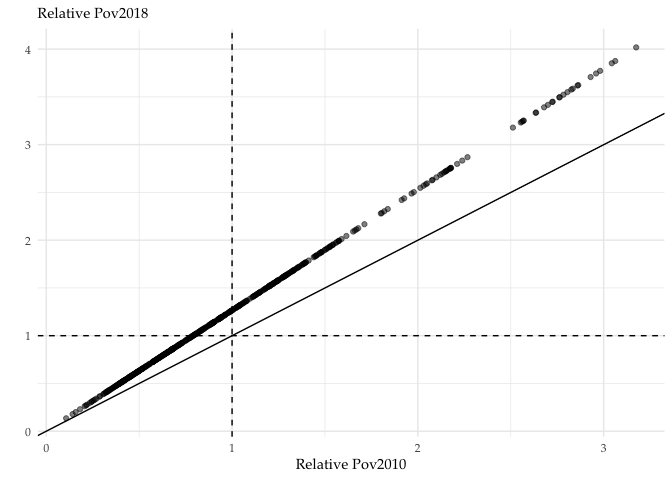<!-- -->

Fit a non-linear function

``` r
dat %>% 
  ggplot(aes(x = rel_pov2010, y = rel_pov2018)) +
  geom_point(alpha=0.5) + 
  geom_smooth() + 
  geom_abline(aes(intercept = 0, slope = 1)) +
  geom_hline(yintercept = 1, linetype="dashed") + 
  geom_vline(xintercept = 1, linetype="dashed") +
  theme_minimal() +
  labs(subtitle = "Relative pov2018",
       x = "Relative pov2010",
       y = "") +
  theme(text=element_text(family="Palatino")) 
```

    ## `geom_smooth()` using method = 'loess' and formula 'y ~ x'

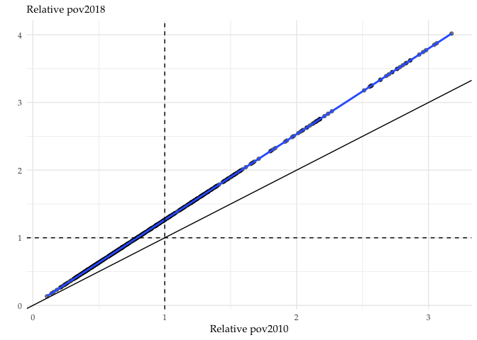<!-- -->

Not that the nonlinear fit crosses the 45-degree line two times from
above.

## Using the Bivariate package

``` r
bivariate <- kbvpdf(dat$rel_pov2010, dat$rel_pov2018, h_rel_pov2010, h_rel_pov2018) 
```

``` r
plot(bivariate,
      xlab="Relative Poverty 2010", 
      ylab="Relative Poverty 2018")
abline(a=0, b=1)
abline(h=1, v=1)
```

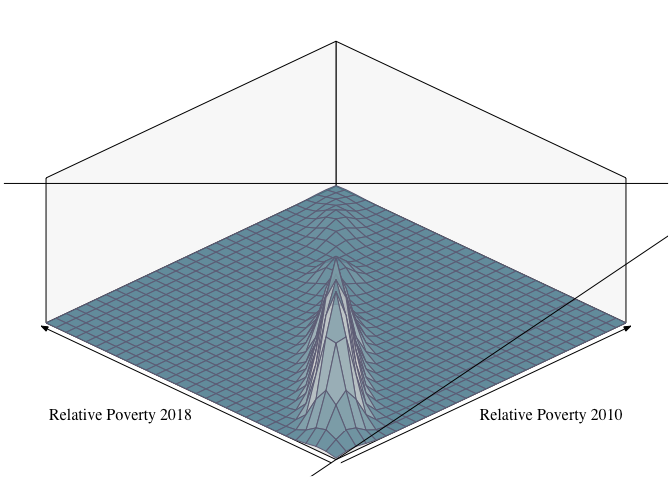<!-- -->

``` r
plot(bivariate,
      TRUE,
      xlab="Relative Poverty 2010", 
      ylab="Relative Poverty 2018")
```

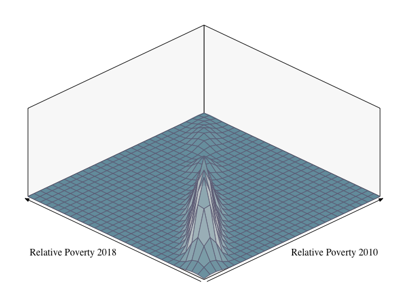<!-- -->

## Using ggplot (stat\_density\_2d)

``` r
dat %>% 
  ggplot(aes(x = rel_pov2010, y = rel_pov2018)) +
  geom_point(color = "lightgray") + 
  geom_smooth() + 
  #geom_smooth(method=lm, se=FALSE) + 
  stat_density_2d() +
  geom_abline(aes(intercept = 0, slope = 1)) +
  geom_hline(yintercept = 1, linetype="dashed") + 
  geom_vline(xintercept = 1, linetype="dashed") +
  theme_minimal() +
  labs(subtitle = "Relative pov2018",
       x = "Relative pov2010",
       y = "") +
  theme(text=element_text(family="Palatino")) 
```

    ## `geom_smooth()` using method = 'loess' and formula 'y ~ x'

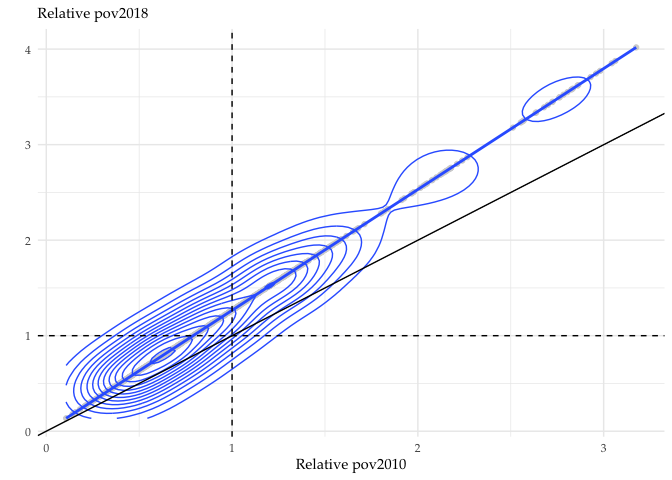<!-- -->

``` r
dat %>% 
  ggplot(aes(x = rel_pov2010, y = rel_pov2018)) +
        stat_density_2d(aes(fill = stat(nlevel)), geom = "polygon") + 
  scale_fill_viridis_c() +
        geom_abline(aes(intercept = 0, slope = 1)) +
        geom_hline(yintercept = 1, linetype="dashed") + 
        geom_vline(xintercept = 1, linetype="dashed") + 
  theme_minimal() +
        labs(x = "Relative Poverty Rate 2010",
             y = "Relative Poverty Rate 2018") +
        theme(text=element_text(size=8, family="Palatino"))
```

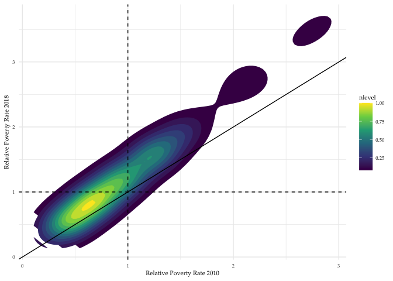<!-- -->

## Using Stochastic Kernel Package

There are two ways of analyzing the use of stochastic kernel package: 1.
Contour Plots and 2. Surface Plots

### Contour Plots

``` r
pov2010pov2018 <- cbind(dat$rel_pov2010, dat$rel_pov2018)
pov2010pov2018_dis <- bkde2D(pov2010pov2018, bandwidth = c(h_rel_pov2010, h_rel_pov2018)) 
```

``` r
contour(pov2010pov2018_dis$x1,pov2010pov2018_dis$x2,pov2010pov2018_dis$fhat)
abline(a=0, b=1)
```

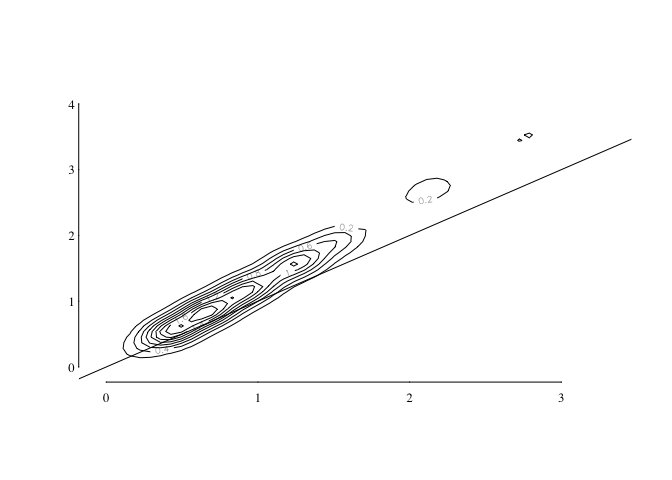<!-- -->

### Surface Plots

``` r
plot_ly(x=pov2010pov2018_dis$x1, y=pov2010pov2018_dis$x2, z=pov2010pov2018_dis$fhat) %>% add_surface()
```

<!--html_preserve-->

<div id="htmlwidget-5b132be56a487c32445b" class="plotly html-widget" style="width:672px;height:480px;">

</div>

<script type="application/json" data-for="htmlwidget-5b132be56a487c32445b">{"x":{"visdat":{"8756a874ca7":["function () ","plotlyVisDat"]},"cur_data":"8756a874ca7","attrs":{"8756a874ca7":{"x":[-0.0469842151387494,0.0205359375929066,0.0880560903245627,0.155576243056219,0.223096395787875,0.290616548519531,0.358136701251187,0.425656853982843,0.493177006714499,0.560697159446155,0.628217312177811,0.695737464909467,0.763257617641123,0.830777770372779,0.898297923104435,0.965818075836091,1.03333822856775,1.1008583812994,1.16837853403106,1.23589868676272,1.30341883949437,1.37093899222603,1.43845914495768,1.50597929768934,1.573499450421,1.64101960315265,1.70853975588431,1.77605990861596,1.84358006134762,1.91110021407928,1.97862036681093,2.04614051954259,2.11366067227424,2.1811808250059,2.24870097773756,2.31622113046921,2.38374128320087,2.45126143593252,2.51878158866418,2.58630174139584,2.65382189412749,2.72134204685915,2.7888621995908,2.85638235232246,2.92390250505412,2.99142265778577,3.05894281051743,3.12646296324908,3.19398311598074,3.2615032687124,3.32902342144405],"y":[-0.0594555497990658,0.0259869289424096,0.111429407683885,0.196871886425361,0.282314365166836,0.367756843908311,0.453199322649787,0.538641801391262,0.624084280132738,0.709526758874213,0.794969237615688,0.880411716357164,0.965854195098639,1.05129667384011,1.13673915258159,1.22218163132307,1.30762411006454,1.39306658880602,1.47850906754749,1.56395154628897,1.64939402503044,1.73483650377192,1.82027898251339,1.90572146125487,1.99116393999634,2.07660641873782,2.1620488974793,2.24749137622077,2.33293385496225,2.41837633370372,2.5038188124452,2.58926129118667,2.67470376992815,2.76014624866962,2.8455887274111,2.93103120615257,3.01647368489405,3.10191616363553,3.187358642377,3.27280112111848,3.35824359985995,3.44368607860143,3.5291285573429,3.61457103608438,3.70001351482585,3.78545599356733,3.8708984723088,3.95634095105028,4.04178342979176,4.12722590853323,4.21266838727471],"z":[[0.00456771004507467,0.0108659923510554,0.0181382765684913,0.0216135833266464,0.0187080887050162,0.0119738373116208,0.005765825860453,0.00211723309337778,0.000592406781421154,0.000122090739821011,1.7395834921429e-05,1.44874419886096e-06,-0,-0,-0,-0,-0,-0,-0,1.66831609291207e-17,3.12250225675825e-17,3.51281503885303e-17,2.37440275774325e-17,1.47993596544271e-17,8.23993651088983e-18,3.53382145594494e-18,-0,-0,-0,-0,-0,-0,-0,-0,-0,-0,-0,-0,-0,-0,-0,4.18773089122526e-18,5.18384163719632e-18,3.81980095476167e-18,2.04039512350455e-18,-0,-0,-0,-0,-0,-0],[0.0108659923510554,0.0272301922487824,0.0486724283723212,0.0633240420980911,0.061248487951123,0.0450562407640081,0.0257970626130449,0.0116936805386613,0.00419767098929882,0.00116532490504593,0.000239823714564132,3.44958134185822e-05,2.52108543346974e-06,7.37596290469045e-18,-0,-0,-0,-0,-0,-0,-0,-0,-0,-0,-0,-0,-0,-0,-0,5.86146799499976e-18,1.17635935714677e-17,8.45677694538693e-18,-0,-0,-0,-0,-0,-0,-0,-0,-0,-0,-0,-0,-0,-0,-0,-0,-0,-0,-0],[0.0181382765684914,0.0486724283723212,0.0949647050078854,0.137778612471895,0.152108925516189,0.130944775549276,0.0898885491824615,0.0497643690728078,0.0220555917884686,0.0076420385880831,0.00200526023440486,0.000385083044870674,4.81715435277604e-05,2.79006612901174e-06,-0,-0,-0,-0,-0,-0,-0,-0,-0,1.56125112837913e-17,2.42861286636753e-17,-0,-0,-0,-0,-0,-0,2.60208521396521e-18,-0,-0,-0,-0,-0,-0,-0,-0,-0,-0,-0,-0,-0,5.33207240296582e-18,-0,-0,-0,-0,-0],[0.0216135833266465,0.0633240420980911,0.137778612471895,0.227994086836189,0.29373949438829,0.301235184308014,0.249357059118435,0.166318945989877,0.0879491760360697,0.036084954834036,0.01125187328401,0.00261449633424847,0.000427515077981624,4.25593047149857e-05,1.78522292402802e-06,-0,-0,-0,-0,-0,-0,-0,-0,-0,-0,-0,-0,-0,-0,-0,-0,-0,-0,1.38777878078145e-17,0,0,-0,-0,-0,-0,-0,-0,1.73472347597681e-18,-0,-0,-0,-0,-0,-0,-0,-0],[0.0187080887050163,0.0612484879511229,0.152108925516189,0.29373949438829,0.450573081125902,0.556766325759732,0.554362446650923,0.438785810310106,0.270943131637828,0.128504492140129,0.0463903789047175,0.012704791189378,0.00259902578415553,0.000376310372385865,3.6197997750066e-05,2.42148952583177e-06,-0,-0,-0,-0,-0,-0,-0,-0,0,-0,-0,-0,-0,-0,-0,9.97465998686664e-18,-0,1.38777878078145e-17,1.38777878078145e-17,0,-0,-0,0,-0,0,-0,-0,-0,1.51788304147971e-17,2.15485181781494e-17,1.38913403349705e-17,-0,3.12250225675825e-17,2.08166817117217e-17,-0],[0.0119738373116209,0.0450562407640081,0.130944775549276,0.301235184308014,0.556766325759732,0.827891510309055,0.978956145662657,0.90476904201375,0.644221529490357,0.351134317698439,0.147154978481238,0.0482263961690781,0.0126093097675828,0.00262718182935149,0.000430085914558475,5.5872059507712e-05,3.94331993304811e-06,-0,-0,-0,-0,-0,-0,-0,-0,-0,-0,-0,-0,-0,-0,-0,-0,6.93889390390723e-18,0,2.77555756156289e-17,5.55111512312578e-17,-0,-0,-0,-0,-0,-0,-0,-0,-0,-0,-0,-0,0,-0],[0.00576582586045304,0.0257970626130449,0.0898885491824614,0.249357059118434,0.554362446650923,0.978956145662656,1.3520800381998,1.44087087012156,1.17733606903668,0.741065653773344,0.366220892091618,0.146694272184501,0.0489218970379952,0.0134692618930854,0.00294056227915464,0.000491444805528402,5.15299218117361e-05,1.73561812863432e-06,-0,-0,-0,-0,-0,-0,-0,-0,-0,-0,-0,-0,-0,-0,-0,1.38777878078145e-17,6.93889390390723e-18,1.38777878078145e-17,-0,-0,0,-0,-0,-0,-0,-0,1.38777878078145e-17,-0,-0,-0,-0,-0,-0],[0.00211723309337789,0.0116936805386613,0.0497643690728077,0.166318945989876,0.438785810310105,0.904769042013749,1.44087087012156,1.76194021704676,1.66143865438316,1.23004874220633,0.737737635150945,0.369582140772699,0.155342816672163,0.0531465648796088,0.0141978102995197,0.00288965180897872,0.000410254162597568,3.38073958393234e-05,2.11301532158231e-06,-0,-0,-0,-0,-0,-0,-0,-0,-0,-0,-0,-0,-0,3.29597460435593e-17,-0,0,6.93889390390723e-17,2.77555756156289e-17,-0,-0,-0,-0,-0,0,-0,0,-0,5.46437894932694e-17,-0,2.25514051876985e-17,-0,-0],[0.000592406781421338,0.00419767098929891,0.0220555917884686,0.0879491760360696,0.270943131637827,0.644221529490356,1.17733606903668,1.66143865438315,1.84208009608356,1.6533383615791,1.23762221764079,0.777727044307473,0.400590640154451,0.163495548023506,0.051813343133893,0.0127716286944718,0.00239443535614075,0.000322571652549036,3.53082010854863e-05,1.75817502157116e-06,-0,-0,-0,-0,-0,-0,-0,-0,0,2.94902990916057e-17,2.51534904016637e-17,3.36102673470506e-17,3.20923843055709e-17,5.55111512312578e-17,3.46944695195361e-17,1.2490009027033e-16,0,-0,-0,0,-0,-0,-0,-0,-0,0,1.73472347597681e-17,4.68375338513738e-17,5.11743425413158e-17,2.77555756156289e-17,2.08166817117217e-17],[0.000122090739821189,0.00116532490504609,0.00764203858808311,0.0360849548340358,0.128504492140128,0.351134317698438,0.741065653773343,1.23004874220633,1.6533383615791,1.85139915083257,1.73805740625722,1.33782469493614,0.818740257201319,0.392020386429464,0.147947676091522,0.0450951122207812,0.0111821901716611,0.00220662736098767,0.000355241013234496,3.82744015109612e-05,2.29309282972871e-06,-0,-0,-0,-0,-0,-0,-0,-0,-0,-0,-0,-0,-0,-0,-0,-0,0,-0,0,-0,-0,-0,-0,-0,2.77555756156289e-17,-0,1.73472347597681e-17,-0,-0,-0],[1.73958349215728e-05,0.000239823714564245,0.00200526023440489,0.01125187328401,0.0463903789047173,0.147154978481238,0.366220892091617,0.737737635150943,1.23762221764079,1.73805740625722,1.99928575828883,1.82942557828328,1.3121849474459,0.744093494959288,0.34253328043644,0.131323877922249,0.0419273879004402,0.010868768134418,0.00225400690632321,0.000340151406716862,3.41587776738145e-05,1.56282278311951e-06,4.85722573273506e-17,-0,-0,-0,-0,-0,-0,-0,-0,6.93889390390723e-18,-0,-0,-0,3.12250225675825e-17,0,-0,-0,-0,-0,-0,-0,-0,-0,-0,-0,0,-0,-0,-0],[1.44874419900909e-06,3.44958134185364e-05,0.000385083044870699,0.00261449633424854,0.012704791189378,0.048226396169078,0.1466942721845,0.369582140772698,0.77772704430747,1.33782469493614,1.82942557828328,1.96249900696509,1.66674236579501,1.15076931676455,0.663092824146361,0.320878005348586,0.128230854816338,0.0412879371665584,0.0105338392579747,0.00204284374795475,0.000285600566652086,2.58534765565557e-05,1.17962573509788e-06,-0,-0,-0,-0,-0,-0,-0,-0,-0,6.93889390390723e-17,-0,-0,-0,-0,-0,-0,0,-0,-0,-0,-0,0,0,-0,-0,-0,-0,5.55111512312578e-17],[7.63278329429795e-17,2.52108543351282e-06,4.81715435278751e-05,0.000427515077981694,0.00259902578415564,0.0126093097675827,0.0489218970379949,0.155342816672162,0.400590640154449,0.818740257201316,1.31218494744589,1.66674236579501,1.72334002163781,1.48869603975409,1.08108027918049,0.649687575939295,0.315939544357462,0.122339106629881,0.0374590753605308,0.00896271028224782,0.00163661258486206,0.00022136976309784,2.07940342766963e-05,1.27082334091394e-06,-0,-0,-0,-0,-0,-0,-0,-0,6.24500451351651e-17,9.71445146547012e-17,2.77555756156289e-17,2.77555756156289e-17,4.83554168928535e-17,-0,-0,4.16333634234434e-17,0,-0,-0,0,-0,0,0,0,-0,6.93889390390723e-18,-0],[7.63278329429795e-17,2.77555756156289e-17,2.79006612909777e-06,4.25593047150494e-05,0.000376310372385995,0.00262718182935145,0.0134692618930853,0.0531465648796085,0.163495548023505,0.392020386429461,0.744093494959284,1.15076931676455,1.48869603975408,1.62066921763529,1.46091176200727,1.06570962176986,0.619505287832281,0.285761021189088,0.10509090737818,0.0310932546312567,0.00745557045097205,0.00146207159350675,0.000229255162658592,2.86478819854418e-05,2.07737608729289e-06,-0,-0,-0,-0,-0,-0,-0,-0,-0,-0,-0,-0,-0,-0,-0,-0,-0,-0,-0,0,0,0,0,0,2.77555756156289e-17,-0],[0,-0,-0,1.78522292396815e-06,3.61979977500358e-05,0.000430085914558441,0.00294056227915452,0.0141978102995196,0.0518133431338925,0.147947676091521,0.342533280436438,0.663092824146357,1.08108027918048,1.46091176200727,1.59814637267479,1.39258253586317,0.962748493973218,0.531375754667299,0.237722218888778,0.0883184686603746,0.0278937431761668,0.00752503312502705,0.00166697400028671,0.000292314361044248,3.49001220957173e-05,1.81339020659602e-06,-0,-0,-0,-0,-0,-0,-0,-0,-0,-0,-0,-0,-0,2.94902990916057e-17,-0,0,-0,5.55111512312578e-17,0,0,1.11022302462516e-16,1.11022302462516e-16,-0,0,0],[3.29597460435593e-17,2.77555756156289e-17,-0,-0,2.42148952590577e-06,5.58720595077097e-05,0.000491444805528351,0.00288965180897868,0.0127716286944717,0.0450951122207807,0.131323877922248,0.320878005348584,0.649687575939292,1.06570962176986,1.39258253586317,1.44309523073091,1.19338581704356,0.79947790397936,0.444863597194579,0.211866077535571,0.087425966111266,0.0305553753258473,0.00861130256122388,0.00188657990160685,0.000297694892242132,2.83285042736369e-05,1.30215673048092e-06,-0,-0,-0,-0,-0,-0,-0,-0,-0,2.60208521396521e-18,6.59194920871187e-17,-0,-0,-0,0,4.16333634234434e-17,0,0,0,1.11022302462516e-16,0,0,0,-0],[6.50521303491303e-18,-0,1.04083408558608e-17,-0,0,3.94331993301689e-06,5.15299218117661e-05,0.000410254162597503,0.00239443535614059,0.011182190171661,0.0419273879004397,0.128230854816337,0.315939544357459,0.619505287832277,0.962748493973214,1.19338581704356,1.19763613371848,0.996711863216053,0.708529843500556,0.436978108789805,0.229613207138075,0.0986609754700309,0.0333346425959727,0.00866831904904375,0.00167695333707188,0.000220691791935549,1.83021070346784e-05,7.10978350328823e-07,-0,-0,0,-0,-0,-0,-0,-0,4.16333634234434e-17,2.08166817117217e-17,-0,-0,-0,-0,4.85722573273506e-17,5.55111512312578e-17,2.77555756156289e-17,0,0,0,0,-0,0],[-0,-0,-0,-0,6.93889390390723e-18,2.77555756156289e-17,1.73561812865514e-06,3.38073958393811e-05,0.000322571652549011,0.00220662736098753,0.0108687681344177,0.041287937166558,0.122339106629879,0.285761021189086,0.531375754667296,0.799477903979357,0.996711863216051,1.05929093720629,0.974967949456211,0.765094180113083,0.492541107287563,0.250891863696641,0.0990603736107108,0.0301677330917891,0.00705185914459465,0.00122912046954249,0.000157733776349127,1.47743203223185e-05,1.01255801667963e-06,-0,-0,-0,-0,-0,-0,-0,-0,-0,-0,-0,-0,2.68882138776405e-17,-0,1.38777878078145e-17,0,0,0,5.55111512312578e-17,0,-0,-0],[-0,-0,-0,8.67361737988404e-18,-0,-0,-0,2.11301532168119e-06,3.53082010854972e-05,0.000355241013234527,0.0022540069063231,0.0105338392579746,0.0374590753605303,0.105090907378179,0.237722218888777,0.444863597194576,0.708529843500553,0.974967949456209,1.14240486626967,1.09904661587767,0.838368795255632,0.497176904274173,0.228314129031321,0.0819490718031897,0.0233853536514172,0.00536241129556144,0.000995473452967627,0.000148923597486838,1.74883870817364e-05,9.42263089559123e-07,-0,-0,-0,-0,1.04083408558608e-17,-0,1.38777878078145e-17,-0,2.08166817117217e-17,-0,3.77302356024956e-17,-0,3.0140820395097e-17,-0,1.04083408558608e-17,-0,0,8.32667268468867e-17,-0,-0,0],[-0,-0,-0,-0,-0,-0,-0,-0,1.75817502162147e-06,3.82744015109699e-05,0.000340151406716848,0.00204284374795472,0.00896271028224761,0.0310932546312563,0.0883184686603736,0.21186607753557,0.436978108789802,0.765094180113079,1.09904661587767,1.25314076990761,1.11259464411864,0.766013484194649,0.412705562272416,0.177806853649314,0.0630806942472234,0.0187512803534302,0.0046111225366458,0.000901753064007511,0.000133105023562247,1.09847361817969e-05,2.14078716898568e-07,-0,-0,-0,-0,-0,-0,-0,-0,-0,5.20417042793042e-18,1.21430643318376e-17,-0,6.0281640790194e-17,-0,7.63278329429795e-17,6.24500451351651e-17,5.55111512312578e-17,-0,-0,0],[-0,-0,-0,-0,-0,-0,-0,-0,-0,2.29309282970182e-06,3.41587776738713e-05,0.000285600566652031,0.00163661258486194,0.00745557045097183,0.0278937431761664,0.0874259661112649,0.229613207138073,0.49254110728756,0.838368795255628,1.11259464411863,1.14663650407132,0.925468991544463,0.597197359751148,0.317469853302844,0.142448897207184,0.0537016041160686,0.0164061035404589,0.00389030253665514,0.000692679249478717,8.03031674858083e-05,5.20149141422033e-06,3.83514530314689e-07,-0,-0,-0,2.60208521396521e-17,-0,-0,-0,-0,-0,8.67361737988404e-19,-0,4.87890977618477e-19,5.98479599211998e-17,2.60208521396521e-17,-0,1.38777878078145e-17,0,-0,-0],[-0,-0,-0,-0,-0,-0,-0,-0,-0,-0,1.56282278309695e-06,2.58534765566441e-05,0.000221369763097804,0.00146207159350673,0.00752503312502707,0.0305553753258469,0.0986609754700297,0.250891863696638,0.497176904274169,0.766013484194645,0.925468991544461,0.894324416062227,0.711425350672877,0.477309165728345,0.269740308444092,0.124496519829628,0.0451071687964233,0.0124971616542541,0.00262454198170244,0.000392617810566018,3.88289544942763e-05,3.55885217851121e-06,2.51310805013394e-08,7.28583859910259e-17,1.73472347597681e-17,-0,-0,-0,-0,-0,-0,-0,-0,-0,-0,-0,-0,-0,-0,-0,-0],[-0,-0,-0,-0,-0,-0,-0,-0,-0,-0,-0,1.17962573505754e-06,2.07940342766045e-05,0.000229255162658471,0.00166697400028672,0.00861130256122376,0.0333346425959723,0.0990603736107096,0.228314129031318,0.412705562272413,0.597197359751145,0.711425350672874,0.714117858942631,0.603474612102542,0.417169752029764,0.227319936635232,0.0952941711735929,0.0306549852090594,0.00769161448369103,0.00150017831679506,0.000227823182907233,3.27654398355443e-05,3.12578135777675e-06,3.63474770323502e-07,-0,-0,-0,-0,-0,-0,-0,-0,-0,-0,8.45677694538693e-18,-0,4.77048955893622e-18,1.90819582357449e-17,-0,1.38777878078145e-17,0],[-0,-0,-0,-0,-0,-0,-0,-0,-0,-0,-0,-0,1.27082334085604e-06,2.86478819853089e-05,0.000292314361044122,0.00188657990160675,0.00866831904904356,0.0301677330917886,0.0819490718031884,0.177806853649312,0.317469853302841,0.477309165728342,0.60347461210254,0.624115678284288,0.509577523594881,0.320803849433724,0.155272054137792,0.0588611639483613,0.01806493944063,0.00460259725928749,0.000991253826837559,0.000190915759289613,2.69723032608783e-05,3.27901396770039e-06,5.20417042793042e-18,1.73472347597681e-18,-0,-0,-0,-0,-0,-0,-0,-0,9.32413868337534e-18,1.66967134562768e-17,-0,3.4477629085039e-17,-0,2.08166817117217e-17,-0],[2.60208521396521e-18,1.38777878078145e-17,1.04083408558608e-17,8.67361737988404e-18,-0,-0,-0,-0,-0,-0,-0,-0,-0,2.07737608722111e-06,3.49001220956938e-05,0.000297694892242031,0.00167695333707186,0.00705185914459446,0.0233853536514168,0.0630806942472225,0.142448897207182,0.26974030844409,0.417169752029761,0.509577523594879,0.480711527513958,0.348997521263364,0.198240734374804,0.091071785843255,0.03527156461238,0.011907976448111,0.00352310726838384,0.00089190180048548,0.000174022901150458,2.71662251969118e-05,1.89865958401605e-06,1.66035182864663e-07,-0,-0,-0,-0,-0,-0,-0,-0,-0,-0,1.21430643318376e-17,1.93801138331784e-17,1.12757025938492e-17,-0,5.20417042793042e-18],[-0,-0,-0,-0,-0,-0,-0,-0,-0,-0,-0,-0,-0,-0,1.81339020659808e-06,2.8328504273561e-05,0.000220691791935532,0.00122912046954243,0.00536241129556131,0.0187512803534299,0.0537016041160677,0.124496519829626,0.22731993663523,0.320803849433722,0.348997521263363,0.297105925454386,0.204077004336878,0.117864180706113,0.0596234086865356,0.0268259970313835,0.0104297974063818,0.00335262274213649,0.000863063498351331,0.000182051235622488,2.69443038508448e-05,3.62282032439348e-06,2.18894664465522e-07,5.20417042793042e-17,2.08166817117217e-17,-0,-0,-0,-0,-0,-0,-0,-0,-0,-0,-0,-0],[-0,-0,-0,-0,-0,-0,-0,-0,-0,-0,-0,-0,-0,-0,-0,1.30215673039549e-06,1.83021070346407e-05,0.000157733776349048,0.00099547345296757,0.00461112253664576,0.0164061035404586,0.0451071687964226,0.0952941711735917,0.15527205413779,0.198240734374803,0.204077004336878,0.176124869993127,0.132787702819076,0.0892549034333757,0.0523865747231345,0.0258157808971521,0.0105220951784466,0.00359298822790651,0.00103668843946135,0.00023724995755305,4.39369007884756e-05,5.36634773929453e-06,3.29604009657695e-07,-0,-0,-0,-0,-0,-0,-0,-0,5.20417042793042e-18,3.90312782094782e-18,1.17093834628434e-17,-0,-0],[1.90819582357449e-17,2.42861286636753e-17,2.66713734431434e-17,3.64291929955129e-17,4.00070601647151e-17,1.7130394325271e-17,-0,-0,-0,-0,-0,-0,-0,-0,-0,-0,7.10978350335761e-07,1.4774320322257e-05,0.000148923597486839,0.000901753064007487,0.00389030253665502,0.0124971616542537,0.0306549852090589,0.0588611639483606,0.0910717858432541,0.117864180706112,0.132787702819076,0.133121004323092,0.116920582880823,0.0869698358300593,0.0539921516851526,0.0283064204805622,0.012677972055512,0.00479483387273506,0.00148306693215479,0.000370409634432968,7.01054379003508e-05,9.33988759775476e-06,7.74094793342273e-07,-0,-0,-0,-0,-0,-0,-0,-0,-0,1.73472347597681e-17,2.08166817117217e-17,1.66967134562768e-17],[3.81639164714898e-17,3.12250225675825e-17,2.08166817117217e-17,3.90312782094782e-18,4.93311988480905e-18,1.32272665043232e-17,3.04660810468427e-17,4.53196508098941e-17,3.46944695195361e-18,-0,-0,-0,-0,-0,-0,-0,-0,1.0125580165582e-06,1.74883870817082e-05,0.000133105023562177,0.000692679249478646,0.00262454198170222,0.00769161448369083,0.0180649394406296,0.0352715646123795,0.0596234086865351,0.0892549034333752,0.116920582880823,0.130315769162502,0.122068726936293,0.0968599480876315,0.0655695510761536,0.0375347616419011,0.0178352784604627,0.00690305545304435,0.0021307537872804,0.000501862311958536,8.43443968089072e-05,9.24057348114808e-06,1.72381164998325e-07,-0,-0,-0,-0,-0,-0,-0,-0,-0,1.73472347597681e-18,1.56125112837913e-17],[6.93889390390723e-18,-0,-0,-0,-0,-0,-0,-0,-0,-0,-0,-0,-0,-0,-0,-0,-0,-0,9.4226308959295e-07,1.09847361817956e-05,8.03031674857725e-05,0.000392617810565893,0.001500178316795,0.00460259725928744,0.0119079764481108,0.0268259970313832,0.0523865747231341,0.0869698358300589,0.122068726936292,0.145924899057606,0.148837377639293,0.127915574980156,0.0909540664755123,0.0526551910291789,0.0243873026058756,0.00879443571405355,0.00237755341317381,0.000458846120087114,5.92806136398563e-05,2.52829892056317e-06,9.16035979034533e-08,6.93889390390723e-17,3.38271077815477e-17,1.38777878078145e-17,-0,-0,-0,-0,-0,-0,-0],[2.77555756156289e-17,2.08166817117217e-17,6.93889390390723e-18,-0,-0,4.01154803819637e-18,5.6920614055489e-18,-0,-0,-0,-0,-0,-0,-0,-0,-0,-0,-0,-0,2.14078716865608e-07,5.2014914141311e-06,3.8828954494088e-05,0.000227823182907171,0.000991253826837528,0.00352310726838373,0.0104297974063816,0.0258157808971518,0.0539921516851522,0.096859948087631,0.148837377639292,0.19252974979721,0.205367928334278,0.177741333256471,0.122864189578122,0.0662907895451041,0.0270714384444744,0.00811285606979792,0.00173095249501977,0.000251294323742163,1.50865393767543e-05,6.76709317955302e-07,-0,-0,-0,0,-0,-0,-0,-0,2.60208521396521e-18,1.0842021724855e-17],[0,-0,1.38777878078145e-17,0,0,1.73472347597681e-17,4.01696904905879e-17,3.72558971520331e-17,1.91361683443692e-17,-0,-0,-0,-0,-0,-0,-0,-0,-0,-0,-0,3.83514530261997e-07,3.55885217832364e-06,3.27654398354971e-05,0.000190915759289598,0.000891901800485396,0.00335262274213637,0.0105220951784464,0.0283064204805619,0.0655695510761532,0.127915574980155,0.205367928334278,0.266655493480733,0.275751870301931,0.222474728319476,0.136245855081444,0.0615936327791747,0.0201383830716347,0.00469792465841063,0.000761022809067145,6.06649349793316e-05,3.16322413612674e-06,2.97071395261028e-17,1.21430643318376e-17,6.50521303491303e-18,1.47451495458029e-17,6.93889390390723e-18,6.93889390390723e-18,-0,-0,-0,-0],[-0,-0,0,-0,6.93889390390723e-18,1.21430643318376e-17,3.51281503885303e-17,3.72965547335014e-17,5.495210948607e-17,7.44304791411299e-17,8.13151629364128e-17,6.72205346941013e-17,5.63785129692462e-17,-0,-0,-0,-0,-0,-0,-0,-0,2.51310803176755e-08,3.12578135772625e-06,2.6972303260825e-05,0.00017402290115038,0.000863063498351236,0.0035929882279064,0.0126779720555118,0.0375347616419008,0.0909540664755118,0.17774133325647,0.275751870301931,0.333100800659198,0.305631028897116,0.207601806087469,0.102346245817512,0.0362650584810754,0.00922194712878433,0.00166527818478275,0.000174307621259274,1.40138705898616e-05,1.43577600850863e-06,3.12726545293471e-07,4.38383682016021e-08,6.07153216591882e-18,8.67361737988404e-18,-0,1.04083408558608e-17,-0,6.93889390390723e-18,5.20417042793042e-18],[-0,-0,-0,-0,3.46944695195361e-18,6.93889390390723e-18,1.47451495458029e-17,2.49366499671666e-17,1.25089825650515e-17,1.58022466639762e-17,1.51517253604849e-17,-0,2.38524477946811e-18,-0,-0,-0,-0,-0,-0,-0,-0,-0,3.63474770310275e-07,3.27901396766881e-06,2.71662251968913e-05,0.000182051235622415,0.00103668843946132,0.00479483387273498,0.0178352784604625,0.0526551910291786,0.122864189578121,0.222474728319475,0.305631028897116,0.311297627537824,0.230745469861514,0.123173032619533,0.0473206661632751,0.0132587426543871,0.0028638322549146,0.000572049313066993,0.000182198275761702,6.81857684896061e-05,1.94963940504532e-05,3.76868414181104e-06,4.06079818962958e-07,5.20417042793042e-17,2.42861286636753e-17,-0,-0,-0,-0],[-0,-0,-0,-0,-0,6.07153216591882e-18,1.47451495458029e-17,2.16840434497101e-17,3.33934269125535e-17,3.63749828868887e-17,1.49890950346121e-17,2.35813972515597e-18,-0,-0,-0,-0,-0,-0,-0,-0,-0,-0,-0,-0,1.89865958398266e-06,2.6944303850729e-05,0.000237249957553025,0.00148306693215473,0.00690305545304422,0.0243873026058754,0.0662907895451036,0.136245855081443,0.207601806087469,0.230745469861514,0.185170777055226,0.107018407227726,0.0450676626305501,0.0148029634211696,0.00496813652192693,0.00239736536636245,0.00132878881979002,0.000581818047108203,0.000179404853762411,3.80884760704762e-05,5.01463997133853e-06,1.84598761727561e-07,-0,0,3.68628738645072e-18,4.77048955893622e-18,1.64798730217797e-17],[-0,-0,-0,0,-0,3.46944695195361e-18,8.67361737988404e-18,4.25007251614318e-17,6.0281640790194e-17,5.50774703622636e-17,2.84060969191202e-17,4.87890977618477e-19,-0,-0,-0,-0,-0,-0,-0,-0,-0,-0,-0,-0,1.66035182861735e-07,3.62282032429395e-06,4.39369007884548e-05,0.000370409634432916,0.00213075378728032,0.0087944357140534,0.0270714384444741,0.0615936327791743,0.102346245817512,0.123173032619533,0.107018407227726,0.0677240333527283,0.0332900176219955,0.0166661715717079,0.0121351975651386,0.0099844425809167,0.00654399936339015,0.00308326133684049,0.00102961998764739,0.000245445183088003,4.00291956516681e-05,3.47752271067845e-06,2.09525732942136e-07,2.86229373536173e-17,3.07913416985883e-17,1.65882932390282e-17,4.55364912443912e-18],[-0,-0,-0,-0,-0,-0,-0,-0,-0,-0,-0,-0,-0,8.13151629364128e-18,2.01661604082304e-17,3.20923843055709e-17,6.07153216591882e-18,-0,-0,-0,-0,-0,-0,-0,-0,2.18894664339971e-07,5.36634773927013e-06,7.01054379002849e-05,0.00050186231195845,0.00237755341317367,0.00811285606979776,0.0201383830716345,0.0362650584810751,0.0473206661632747,0.0450676626305499,0.0332900176219954,0.0248892830855147,0.0269227641395199,0.0329674810468848,0.0321883077958273,0.0227332315456646,0.0115576067782665,0.00431214021886772,0.00121668230065962,0.000260456109749573,3.97328890778666e-05,4.80848576653379e-06,2.95012406334623e-07,8.67361737988404e-19,1.0842021724855e-18,-0],[-0,-0,-0,-0,-0,-0,-0,-0,-0,-0,-0,-0,-0,-0,-0,-0,-0,-0,-0,-0,-0,-0,-0,-0,-0,-0,3.29604009685451e-07,9.3398875977424e-06,8.43443968088759e-05,0.000458846120087005,0.00173095249501968,0.00469792465841051,0.00922194712878419,0.0132587426543869,0.0148029634211695,0.0166661715717078,0.0269227641395198,0.0490085061395334,0.0710943671525767,0.0747187943016332,0.0567959485600464,0.031980964489618,0.0138281978547199,0.00476348337836808,0.00131853184037238,0.000284469465385759,4.81544697928177e-05,5.34426930335333e-06,3.02037181361924e-07,5.33427468862868e-17,3.25260651745651e-17],[-0,-0,-0,-0,-0,-0,-0,-0,-0,-0,-0,1.82145964977565e-17,2.60208521396521e-17,1.58293517182884e-17,6.39679281766448e-18,7.86046575051991e-19,-0,-0,-0,-0,-0,-0,-0,-0,-0,-0,-0,7.74094793306711e-07,9.24057348109528e-06,5.9280613639724e-05,0.000251294323742076,0.000761022809067037,0.00166527818478264,0.00286383225491447,0.00496813652192681,0.0121351975651385,0.0329674810468846,0.0710943671525766,0.111009499633392,0.12561592264968,0.105787493108407,0.0688490460891566,0.0359366181322055,0.0153336604833437,0.00529274566963057,0.00143437661596168,0.000298189338844647,4.28722955521424e-05,3.72241201073266e-06,6.18250426674162e-08,-0],[-0,-0,-0,-0,-0,-0,-0,-0,-0,-0,-0,3.81639164714898e-17,6.59194920871187e-17,6.20163642661709e-17,4.92227786308419e-17,2.23074596988893e-17,1.38777878078145e-17,-0,-0,-0,-0,-0,-0,-0,-0,-0,-0,-0,1.72381164958643e-07,2.52829892041545e-06,1.50865393766777e-05,6.06649349792106e-05,0.000174307621259182,0.000572049313066852,0.00239736536636234,0.00998444258091657,0.0321883077958271,0.0747187943016329,0.12561592264968,0.157555729180456,0.153425799244063,0.120338385642019,0.0773025277141493,0.0403344662543596,0.0167285463614595,0.00539690767649019,0.00133423502410239,0.000242558444014654,3.13102359597167e-05,2.43505290824361e-06,2.1293923498783e-07],[-0,-0,-0,-0,-0,-0,-0,-0,-0,-0,-0,-0,-0,-0,-0,-0,1.62630325872826e-18,2.19008838842072e-17,2.60208521396521e-17,4.0766001685455e-17,3.77302356024956e-17,2.60208521396521e-18,-0,-0,-0,-0,-0,-0,-0,9.16035978041404e-08,6.76709317943864e-07,3.16322413608009e-06,1.40138705898176e-05,0.0001821982757616,0.00132878881978993,0.00654399936339002,0.0227332315456644,0.056795948560046,0.105787493108407,0.153425799244063,0.1800330545413,0.173549704056108,0.135982455206844,0.0847894508743793,0.0413228924368426,0.0155769601696252,0.00453920004130026,0.00102090223972059,0.000177345627989206,2.22099448480399e-05,2.54542669549281e-06],[-0,-0,-0,-0,-0,-0,-0,-0,-0,-0,-0,-0,-0,-0,1.04083408558608e-17,-0,-0,-0,-0,-0,-0,-0,-0,-0,-0,-0,-0,-0,-0,-0,-0,-0,1.43577600847117e-06,6.81857684895247e-05,0.000581818047108153,0.00308326133684041,0.0115576067782664,0.0319809644896177,0.0688490460891561,0.120338385642018,0.173549704056108,0.203918479444191,0.190797138807686,0.139676961974473,0.0793015333149061,0.0349732915851748,0.0121787145853816,0.00342484651720434,0.000783017191301521,0.000138092465733606,1.98571819996483e-05],[-0,-0,-0,-0,-0,-0,-0,-0,-0,-0,-0,-0,-0,-0,-0,-0,-0,-0,-0,-0,-0,-0,-0,-0,-0,6.93889390390723e-18,6.93889390390723e-18,1.73472347597681e-17,-0,-0,-0,-0,3.12726545249886e-07,1.94963940503418e-05,0.00017940485376233,0.0010296199876473,0.00431214021886762,0.0138281978547196,0.0359366181322051,0.0773025277141486,0.135982455206843,0.190797138807685,0.209629317030206,0.178845617668024,0.11865928359647,0.062142217278402,0.0263999793438899,0.00927649345531251,0.00266055441870213,0.000593361588490913,0.000103648831959696],[3.46944695195361e-18,-0,-0,-0,-0,-0,-0,-0,-0,-0,-0,-0,-0,-0,1.04083408558608e-17,4.5102810375397e-17,5.89805981832114e-17,3.72965547335014e-17,1.58293517182884e-17,-0,-0,-0,-0,-0,-0,-0,-0,-0,-0,-0,-0,-0,4.38383681352489e-08,3.76868414167075e-06,3.80884760703673e-05,0.000245445183087885,0.00121668230065951,0.00476348337836788,0.0153336604833434,0.040334466254359,0.0847894508743784,0.139676961974473,0.178845617668023,0.178328699678201,0.140368725302373,0.0894616608839036,0.0472306699324582,0.0205918380378469,0.00719673304772942,0.00195395406667885,0.00041574079270155],[3.46944695195361e-18,-0,-0,-0,-0,1.11672823766007e-17,3.64291929955129e-17,3.29597460435593e-17,2.08166817117217e-17,-0,-0,-0,-0,-0,-0,3.46944695195361e-18,2.16840434497101e-17,1.38777878078145e-17,-0,-0,-0,-0,-0,1.30104260698261e-17,2.25514051876985e-17,1.04083408558608e-17,-0,-0,-0,-0,-0,-0,-0,4.06079818847382e-07,5.01463997128236e-06,4.00291956516091e-05,0.000260456109749542,0.00131853184037227,0.00529274566963047,0.0167285463614592,0.041322892436842,0.0793015333149053,0.118659283596469,0.140368725302373,0.134383227529178,0.106438475555729,0.069793495758241,0.0369444638825242,0.0153417372864334,0.00496321202725817,0.00127667418258999],[-0,-0,-0,-0,-0,-0,1.0842021724855e-18,1.21430643318376e-17,-0,-0,-0,-0,-0,-0,1.38777878078145e-17,2.42861286636753e-17,2.08166817117217e-17,2.60208521396521e-18,-0,-0,-0,-0,-0,-0,-0,-0,-0,-0,-0,-0,-0,-0,-0,3.46944695195361e-18,1.84598761734933e-07,3.47752271065644e-06,3.97328890778643e-05,0.000284469465385658,0.00143437661596163,0.00539690767649005,0.0155769601696249,0.0349732915851743,0.0621422172784013,0.0894616608839029,0.106438475555729,0.104836490672063,0.0836261783603115,0.0524903673501422,0.0256423002877287,0.00989985880711127,0.00307368523792705],[1.99493199737333e-17,2.42861286636753e-17,2.42861286636753e-17,1.25767452008319e-17,1.37896963813e-18,-0,-0,-0,0,-0,1.04083408558608e-17,1.73472347597681e-17,2.77555756156289e-17,2.77555756156289e-17,2.08166817117217e-17,1.38777878078145e-17,-0,-0,-0,-0,-0,-0,-0,-0,-0,-0,-0,-0,-0,-0,-0,-0,-0,-0,-0,2.09525732899635e-07,4.80848576651946e-06,4.81544697927077e-05,0.000298189338844612,0.00133423502410233,0.00453920004130014,0.0121787145853813,0.0263999793438896,0.0472306699324578,0.0697934957582405,0.0836261783603113,0.079097552665473,0.0582188334066863,0.0336830438432371,0.015605789167856,0.00572866849922659],[1.90819582357449e-17,2.40692882291782e-17,2.08166817117217e-17,1.25767452008319e-17,5.18384163719632e-18,-0,-0,-0,-0,-0,-0,-0,-0,1.73472347597681e-17,3.46944695195361e-17,4.16333634234434e-17,6.24500451351651e-17,5.72458747072346e-17,5.20417042793042e-17,4.83554168928535e-17,3.21465944141952e-17,1.13705702839417e-17,-0,-0,-0,-0,-0,-0,-0,-0,-0,-0,-0,-0,-0,-0,2.95012406305343e-07,5.34426930321808e-06,4.2872295552079e-05,0.000242558444014582,0.00102090223972051,0.00342484651720418,0.00927649345531237,0.0205918380378466,0.0369444638825239,0.0524903673501421,0.0582188334066861,0.050656945289482,0.0351117966639198,0.019272966629541,0.00802791930221893],[1.84856470408779e-17,1.3986208025063e-17,3.46944695195361e-18,-0,-0,3.06625926906057e-19,-0,-0,-0,-0,9.10729824887824e-18,1.56125112837913e-17,2.08166817117217e-17,-0,-0,-0,-0,-0,-0,-0,-0,-0,-0,-0,-0,-0,-0,-0,-0,-0,-0,0,5.80048162279745e-18,1.89735380184963e-17,1.56125112837913e-17,9.64939933512099e-18,1.70084215808664e-18,3.02037181281698e-07,3.72241201071905e-06,3.13102359597057e-05,0.00017734562798917,0.000783017191301431,0.00266055441870212,0.00719673304772938,0.0153417372864333,0.0256423002877286,0.033683043843237,0.0351117966639197,0.0288694455466684,0.0180451264752088,0.00814236891254289],[-0,-0,-0,-0,-0,6.33072424777864e-18,2.07792600608098e-17,1.66552088418613e-17,-0,-0,-0,-0,-0,-0,-0,-0,-0,-0,-0,-0,-0,-0,-0,-0,-0,-0,-0,-0,-0,-0,-0,-0,-0,-0,-0,-0,-0,-0,6.18250426653823e-08,2.43505290825751e-06,2.22099448480581e-05,0.000138092465733584,0.000593361588490966,0.00195395406667892,0.00496321202725814,0.00989985880711125,0.015605789167856,0.019272966629541,0.0180451264752088,0.0122362272133129,0.00576895323568453],[8.53809210832335e-19,5.17706537361828e-18,9.5138740635603e-18,1.37422625362538e-17,2.16332214728748e-17,3.56334055415675e-17,4.79616457229002e-17,5.29296595058227e-17,3.08777390592083e-17,2.37169225231204e-18,-0,-0,-0,-0,-0,-0,-0,-0,-0,-0,-0,-0,-0,-0,-0,-0,-0,-0,-0,-0,-0,1.00830802041152e-17,2.08302342388778e-17,3.42878937048541e-17,3.81910215258019e-17,3.22821196857559e-17,2.08132935799327e-17,1.32827471623683e-17,1.37015079630456e-17,2.12939235011339e-07,2.54542669551953e-06,1.98571819996278e-05,0.000103648831959715,0.000415740792701604,0.00127667418258997,0.00307368523792702,0.00572866849922659,0.00802791930221895,0.00814236891254291,0.00576895323568455,0.00278017127421587]],"alpha_stroke":1,"sizes":[10,100],"spans":[1,20],"type":"surface","inherit":true}},"layout":{"margin":{"b":40,"l":60,"t":25,"r":10},"scene":{"xaxis":{"title":[]},"yaxis":{"title":[]},"zaxis":{"title":[]}},"hovermode":"closest","showlegend":false,"legend":{"yanchor":"top","y":0.5}},"source":"A","config":{"showSendToCloud":false},"data":[{"colorbar":{"title":"","ticklen":2,"len":0.5,"lenmode":"fraction","y":1,"yanchor":"top"},"colorscale":[["0","rgba(68,1,84,1)"],["0.0416666666666667","rgba(70,19,97,1)"],["0.0833333333333333","rgba(72,32,111,1)"],["0.125","rgba(71,45,122,1)"],["0.166666666666667","rgba(68,58,128,1)"],["0.208333333333333","rgba(64,70,135,1)"],["0.25","rgba(60,82,138,1)"],["0.291666666666667","rgba(56,93,140,1)"],["0.333333333333333","rgba(49,104,142,1)"],["0.375","rgba(46,114,142,1)"],["0.416666666666667","rgba(42,123,142,1)"],["0.458333333333333","rgba(38,133,141,1)"],["0.5","rgba(37,144,140,1)"],["0.541666666666667","rgba(33,154,138,1)"],["0.583333333333333","rgba(39,164,133,1)"],["0.625","rgba(47,174,127,1)"],["0.666666666666667","rgba(53,183,121,1)"],["0.708333333333333","rgba(79,191,110,1)"],["0.75","rgba(98,199,98,1)"],["0.791666666666667","rgba(119,207,85,1)"],["0.833333333333333","rgba(147,214,70,1)"],["0.875","rgba(172,220,52,1)"],["0.916666666666667","rgba(199,225,42,1)"],["0.958333333333333","rgba(226,228,40,1)"],["1","rgba(253,231,37,1)"]],"showscale":true,"x":[-0.0469842151387494,0.0205359375929066,0.0880560903245627,0.155576243056219,0.223096395787875,0.290616548519531,0.358136701251187,0.425656853982843,0.493177006714499,0.560697159446155,0.628217312177811,0.695737464909467,0.763257617641123,0.830777770372779,0.898297923104435,0.965818075836091,1.03333822856775,1.1008583812994,1.16837853403106,1.23589868676272,1.30341883949437,1.37093899222603,1.43845914495768,1.50597929768934,1.573499450421,1.64101960315265,1.70853975588431,1.77605990861596,1.84358006134762,1.91110021407928,1.97862036681093,2.04614051954259,2.11366067227424,2.1811808250059,2.24870097773756,2.31622113046921,2.38374128320087,2.45126143593252,2.51878158866418,2.58630174139584,2.65382189412749,2.72134204685915,2.7888621995908,2.85638235232246,2.92390250505412,2.99142265778577,3.05894281051743,3.12646296324908,3.19398311598074,3.2615032687124,3.32902342144405],"y":[-0.0594555497990658,0.0259869289424096,0.111429407683885,0.196871886425361,0.282314365166836,0.367756843908311,0.453199322649787,0.538641801391262,0.624084280132738,0.709526758874213,0.794969237615688,0.880411716357164,0.965854195098639,1.05129667384011,1.13673915258159,1.22218163132307,1.30762411006454,1.39306658880602,1.47850906754749,1.56395154628897,1.64939402503044,1.73483650377192,1.82027898251339,1.90572146125487,1.99116393999634,2.07660641873782,2.1620488974793,2.24749137622077,2.33293385496225,2.41837633370372,2.5038188124452,2.58926129118667,2.67470376992815,2.76014624866962,2.8455887274111,2.93103120615257,3.01647368489405,3.10191616363553,3.187358642377,3.27280112111848,3.35824359985995,3.44368607860143,3.5291285573429,3.61457103608438,3.70001351482585,3.78545599356733,3.8708984723088,3.95634095105028,4.04178342979176,4.12722590853323,4.21266838727471],"z":[[0.00456771004507467,0.0108659923510554,0.0181382765684913,0.0216135833266464,0.0187080887050162,0.0119738373116208,0.005765825860453,0.00211723309337778,0.000592406781421154,0.000122090739821011,1.7395834921429e-05,1.44874419886096e-06,-0,-0,-0,-0,-0,-0,-0,1.66831609291207e-17,3.12250225675825e-17,3.51281503885303e-17,2.37440275774325e-17,1.47993596544271e-17,8.23993651088983e-18,3.53382145594494e-18,-0,-0,-0,-0,-0,-0,-0,-0,-0,-0,-0,-0,-0,-0,-0,4.18773089122526e-18,5.18384163719632e-18,3.81980095476167e-18,2.04039512350455e-18,-0,-0,-0,-0,-0,-0],[0.0108659923510554,0.0272301922487824,0.0486724283723212,0.0633240420980911,0.061248487951123,0.0450562407640081,0.0257970626130449,0.0116936805386613,0.00419767098929882,0.00116532490504593,0.000239823714564132,3.44958134185822e-05,2.52108543346974e-06,7.37596290469045e-18,-0,-0,-0,-0,-0,-0,-0,-0,-0,-0,-0,-0,-0,-0,-0,5.86146799499976e-18,1.17635935714677e-17,8.45677694538693e-18,-0,-0,-0,-0,-0,-0,-0,-0,-0,-0,-0,-0,-0,-0,-0,-0,-0,-0,-0],[0.0181382765684914,0.0486724283723212,0.0949647050078854,0.137778612471895,0.152108925516189,0.130944775549276,0.0898885491824615,0.0497643690728078,0.0220555917884686,0.0076420385880831,0.00200526023440486,0.000385083044870674,4.81715435277604e-05,2.79006612901174e-06,-0,-0,-0,-0,-0,-0,-0,-0,-0,1.56125112837913e-17,2.42861286636753e-17,-0,-0,-0,-0,-0,-0,2.60208521396521e-18,-0,-0,-0,-0,-0,-0,-0,-0,-0,-0,-0,-0,-0,5.33207240296582e-18,-0,-0,-0,-0,-0],[0.0216135833266465,0.0633240420980911,0.137778612471895,0.227994086836189,0.29373949438829,0.301235184308014,0.249357059118435,0.166318945989877,0.0879491760360697,0.036084954834036,0.01125187328401,0.00261449633424847,0.000427515077981624,4.25593047149857e-05,1.78522292402802e-06,-0,-0,-0,-0,-0,-0,-0,-0,-0,-0,-0,-0,-0,-0,-0,-0,-0,-0,1.38777878078145e-17,0,0,-0,-0,-0,-0,-0,-0,1.73472347597681e-18,-0,-0,-0,-0,-0,-0,-0,-0],[0.0187080887050163,0.0612484879511229,0.152108925516189,0.29373949438829,0.450573081125902,0.556766325759732,0.554362446650923,0.438785810310106,0.270943131637828,0.128504492140129,0.0463903789047175,0.012704791189378,0.00259902578415553,0.000376310372385865,3.6197997750066e-05,2.42148952583177e-06,-0,-0,-0,-0,-0,-0,-0,-0,0,-0,-0,-0,-0,-0,-0,9.97465998686664e-18,-0,1.38777878078145e-17,1.38777878078145e-17,0,-0,-0,0,-0,0,-0,-0,-0,1.51788304147971e-17,2.15485181781494e-17,1.38913403349705e-17,-0,3.12250225675825e-17,2.08166817117217e-17,-0],[0.0119738373116209,0.0450562407640081,0.130944775549276,0.301235184308014,0.556766325759732,0.827891510309055,0.978956145662657,0.90476904201375,0.644221529490357,0.351134317698439,0.147154978481238,0.0482263961690781,0.0126093097675828,0.00262718182935149,0.000430085914558475,5.5872059507712e-05,3.94331993304811e-06,-0,-0,-0,-0,-0,-0,-0,-0,-0,-0,-0,-0,-0,-0,-0,-0,6.93889390390723e-18,0,2.77555756156289e-17,5.55111512312578e-17,-0,-0,-0,-0,-0,-0,-0,-0,-0,-0,-0,-0,0,-0],[0.00576582586045304,0.0257970626130449,0.0898885491824614,0.249357059118434,0.554362446650923,0.978956145662656,1.3520800381998,1.44087087012156,1.17733606903668,0.741065653773344,0.366220892091618,0.146694272184501,0.0489218970379952,0.0134692618930854,0.00294056227915464,0.000491444805528402,5.15299218117361e-05,1.73561812863432e-06,-0,-0,-0,-0,-0,-0,-0,-0,-0,-0,-0,-0,-0,-0,-0,1.38777878078145e-17,6.93889390390723e-18,1.38777878078145e-17,-0,-0,0,-0,-0,-0,-0,-0,1.38777878078145e-17,-0,-0,-0,-0,-0,-0],[0.00211723309337789,0.0116936805386613,0.0497643690728077,0.166318945989876,0.438785810310105,0.904769042013749,1.44087087012156,1.76194021704676,1.66143865438316,1.23004874220633,0.737737635150945,0.369582140772699,0.155342816672163,0.0531465648796088,0.0141978102995197,0.00288965180897872,0.000410254162597568,3.38073958393234e-05,2.11301532158231e-06,-0,-0,-0,-0,-0,-0,-0,-0,-0,-0,-0,-0,-0,3.29597460435593e-17,-0,0,6.93889390390723e-17,2.77555756156289e-17,-0,-0,-0,-0,-0,0,-0,0,-0,5.46437894932694e-17,-0,2.25514051876985e-17,-0,-0],[0.000592406781421338,0.00419767098929891,0.0220555917884686,0.0879491760360696,0.270943131637827,0.644221529490356,1.17733606903668,1.66143865438315,1.84208009608356,1.6533383615791,1.23762221764079,0.777727044307473,0.400590640154451,0.163495548023506,0.051813343133893,0.0127716286944718,0.00239443535614075,0.000322571652549036,3.53082010854863e-05,1.75817502157116e-06,-0,-0,-0,-0,-0,-0,-0,-0,0,2.94902990916057e-17,2.51534904016637e-17,3.36102673470506e-17,3.20923843055709e-17,5.55111512312578e-17,3.46944695195361e-17,1.2490009027033e-16,0,-0,-0,0,-0,-0,-0,-0,-0,0,1.73472347597681e-17,4.68375338513738e-17,5.11743425413158e-17,2.77555756156289e-17,2.08166817117217e-17],[0.000122090739821189,0.00116532490504609,0.00764203858808311,0.0360849548340358,0.128504492140128,0.351134317698438,0.741065653773343,1.23004874220633,1.6533383615791,1.85139915083257,1.73805740625722,1.33782469493614,0.818740257201319,0.392020386429464,0.147947676091522,0.0450951122207812,0.0111821901716611,0.00220662736098767,0.000355241013234496,3.82744015109612e-05,2.29309282972871e-06,-0,-0,-0,-0,-0,-0,-0,-0,-0,-0,-0,-0,-0,-0,-0,-0,0,-0,0,-0,-0,-0,-0,-0,2.77555756156289e-17,-0,1.73472347597681e-17,-0,-0,-0],[1.73958349215728e-05,0.000239823714564245,0.00200526023440489,0.01125187328401,0.0463903789047173,0.147154978481238,0.366220892091617,0.737737635150943,1.23762221764079,1.73805740625722,1.99928575828883,1.82942557828328,1.3121849474459,0.744093494959288,0.34253328043644,0.131323877922249,0.0419273879004402,0.010868768134418,0.00225400690632321,0.000340151406716862,3.41587776738145e-05,1.56282278311951e-06,4.85722573273506e-17,-0,-0,-0,-0,-0,-0,-0,-0,6.93889390390723e-18,-0,-0,-0,3.12250225675825e-17,0,-0,-0,-0,-0,-0,-0,-0,-0,-0,-0,0,-0,-0,-0],[1.44874419900909e-06,3.44958134185364e-05,0.000385083044870699,0.00261449633424854,0.012704791189378,0.048226396169078,0.1466942721845,0.369582140772698,0.77772704430747,1.33782469493614,1.82942557828328,1.96249900696509,1.66674236579501,1.15076931676455,0.663092824146361,0.320878005348586,0.128230854816338,0.0412879371665584,0.0105338392579747,0.00204284374795475,0.000285600566652086,2.58534765565557e-05,1.17962573509788e-06,-0,-0,-0,-0,-0,-0,-0,-0,-0,6.93889390390723e-17,-0,-0,-0,-0,-0,-0,0,-0,-0,-0,-0,0,0,-0,-0,-0,-0,5.55111512312578e-17],[7.63278329429795e-17,2.52108543351282e-06,4.81715435278751e-05,0.000427515077981694,0.00259902578415564,0.0126093097675827,0.0489218970379949,0.155342816672162,0.400590640154449,0.818740257201316,1.31218494744589,1.66674236579501,1.72334002163781,1.48869603975409,1.08108027918049,0.649687575939295,0.315939544357462,0.122339106629881,0.0374590753605308,0.00896271028224782,0.00163661258486206,0.00022136976309784,2.07940342766963e-05,1.27082334091394e-06,-0,-0,-0,-0,-0,-0,-0,-0,6.24500451351651e-17,9.71445146547012e-17,2.77555756156289e-17,2.77555756156289e-17,4.83554168928535e-17,-0,-0,4.16333634234434e-17,0,-0,-0,0,-0,0,0,0,-0,6.93889390390723e-18,-0],[7.63278329429795e-17,2.77555756156289e-17,2.79006612909777e-06,4.25593047150494e-05,0.000376310372385995,0.00262718182935145,0.0134692618930853,0.0531465648796085,0.163495548023505,0.392020386429461,0.744093494959284,1.15076931676455,1.48869603975408,1.62066921763529,1.46091176200727,1.06570962176986,0.619505287832281,0.285761021189088,0.10509090737818,0.0310932546312567,0.00745557045097205,0.00146207159350675,0.000229255162658592,2.86478819854418e-05,2.07737608729289e-06,-0,-0,-0,-0,-0,-0,-0,-0,-0,-0,-0,-0,-0,-0,-0,-0,-0,-0,-0,0,0,0,0,0,2.77555756156289e-17,-0],[0,-0,-0,1.78522292396815e-06,3.61979977500358e-05,0.000430085914558441,0.00294056227915452,0.0141978102995196,0.0518133431338925,0.147947676091521,0.342533280436438,0.663092824146357,1.08108027918048,1.46091176200727,1.59814637267479,1.39258253586317,0.962748493973218,0.531375754667299,0.237722218888778,0.0883184686603746,0.0278937431761668,0.00752503312502705,0.00166697400028671,0.000292314361044248,3.49001220957173e-05,1.81339020659602e-06,-0,-0,-0,-0,-0,-0,-0,-0,-0,-0,-0,-0,-0,2.94902990916057e-17,-0,0,-0,5.55111512312578e-17,0,0,1.11022302462516e-16,1.11022302462516e-16,-0,0,0],[3.29597460435593e-17,2.77555756156289e-17,-0,-0,2.42148952590577e-06,5.58720595077097e-05,0.000491444805528351,0.00288965180897868,0.0127716286944717,0.0450951122207807,0.131323877922248,0.320878005348584,0.649687575939292,1.06570962176986,1.39258253586317,1.44309523073091,1.19338581704356,0.79947790397936,0.444863597194579,0.211866077535571,0.087425966111266,0.0305553753258473,0.00861130256122388,0.00188657990160685,0.000297694892242132,2.83285042736369e-05,1.30215673048092e-06,-0,-0,-0,-0,-0,-0,-0,-0,-0,2.60208521396521e-18,6.59194920871187e-17,-0,-0,-0,0,4.16333634234434e-17,0,0,0,1.11022302462516e-16,0,0,0,-0],[6.50521303491303e-18,-0,1.04083408558608e-17,-0,0,3.94331993301689e-06,5.15299218117661e-05,0.000410254162597503,0.00239443535614059,0.011182190171661,0.0419273879004397,0.128230854816337,0.315939544357459,0.619505287832277,0.962748493973214,1.19338581704356,1.19763613371848,0.996711863216053,0.708529843500556,0.436978108789805,0.229613207138075,0.0986609754700309,0.0333346425959727,0.00866831904904375,0.00167695333707188,0.000220691791935549,1.83021070346784e-05,7.10978350328823e-07,-0,-0,0,-0,-0,-0,-0,-0,4.16333634234434e-17,2.08166817117217e-17,-0,-0,-0,-0,4.85722573273506e-17,5.55111512312578e-17,2.77555756156289e-17,0,0,0,0,-0,0],[-0,-0,-0,-0,6.93889390390723e-18,2.77555756156289e-17,1.73561812865514e-06,3.38073958393811e-05,0.000322571652549011,0.00220662736098753,0.0108687681344177,0.041287937166558,0.122339106629879,0.285761021189086,0.531375754667296,0.799477903979357,0.996711863216051,1.05929093720629,0.974967949456211,0.765094180113083,0.492541107287563,0.250891863696641,0.0990603736107108,0.0301677330917891,0.00705185914459465,0.00122912046954249,0.000157733776349127,1.47743203223185e-05,1.01255801667963e-06,-0,-0,-0,-0,-0,-0,-0,-0,-0,-0,-0,-0,2.68882138776405e-17,-0,1.38777878078145e-17,0,0,0,5.55111512312578e-17,0,-0,-0],[-0,-0,-0,8.67361737988404e-18,-0,-0,-0,2.11301532168119e-06,3.53082010854972e-05,0.000355241013234527,0.0022540069063231,0.0105338392579746,0.0374590753605303,0.105090907378179,0.237722218888777,0.444863597194576,0.708529843500553,0.974967949456209,1.14240486626967,1.09904661587767,0.838368795255632,0.497176904274173,0.228314129031321,0.0819490718031897,0.0233853536514172,0.00536241129556144,0.000995473452967627,0.000148923597486838,1.74883870817364e-05,9.42263089559123e-07,-0,-0,-0,-0,1.04083408558608e-17,-0,1.38777878078145e-17,-0,2.08166817117217e-17,-0,3.77302356024956e-17,-0,3.0140820395097e-17,-0,1.04083408558608e-17,-0,0,8.32667268468867e-17,-0,-0,0],[-0,-0,-0,-0,-0,-0,-0,-0,1.75817502162147e-06,3.82744015109699e-05,0.000340151406716848,0.00204284374795472,0.00896271028224761,0.0310932546312563,0.0883184686603736,0.21186607753557,0.436978108789802,0.765094180113079,1.09904661587767,1.25314076990761,1.11259464411864,0.766013484194649,0.412705562272416,0.177806853649314,0.0630806942472234,0.0187512803534302,0.0046111225366458,0.000901753064007511,0.000133105023562247,1.09847361817969e-05,2.14078716898568e-07,-0,-0,-0,-0,-0,-0,-0,-0,-0,5.20417042793042e-18,1.21430643318376e-17,-0,6.0281640790194e-17,-0,7.63278329429795e-17,6.24500451351651e-17,5.55111512312578e-17,-0,-0,0],[-0,-0,-0,-0,-0,-0,-0,-0,-0,2.29309282970182e-06,3.41587776738713e-05,0.000285600566652031,0.00163661258486194,0.00745557045097183,0.0278937431761664,0.0874259661112649,0.229613207138073,0.49254110728756,0.838368795255628,1.11259464411863,1.14663650407132,0.925468991544463,0.597197359751148,0.317469853302844,0.142448897207184,0.0537016041160686,0.0164061035404589,0.00389030253665514,0.000692679249478717,8.03031674858083e-05,5.20149141422033e-06,3.83514530314689e-07,-0,-0,-0,2.60208521396521e-17,-0,-0,-0,-0,-0,8.67361737988404e-19,-0,4.87890977618477e-19,5.98479599211998e-17,2.60208521396521e-17,-0,1.38777878078145e-17,0,-0,-0],[-0,-0,-0,-0,-0,-0,-0,-0,-0,-0,1.56282278309695e-06,2.58534765566441e-05,0.000221369763097804,0.00146207159350673,0.00752503312502707,0.0305553753258469,0.0986609754700297,0.250891863696638,0.497176904274169,0.766013484194645,0.925468991544461,0.894324416062227,0.711425350672877,0.477309165728345,0.269740308444092,0.124496519829628,0.0451071687964233,0.0124971616542541,0.00262454198170244,0.000392617810566018,3.88289544942763e-05,3.55885217851121e-06,2.51310805013394e-08,7.28583859910259e-17,1.73472347597681e-17,-0,-0,-0,-0,-0,-0,-0,-0,-0,-0,-0,-0,-0,-0,-0,-0],[-0,-0,-0,-0,-0,-0,-0,-0,-0,-0,-0,1.17962573505754e-06,2.07940342766045e-05,0.000229255162658471,0.00166697400028672,0.00861130256122376,0.0333346425959723,0.0990603736107096,0.228314129031318,0.412705562272413,0.597197359751145,0.711425350672874,0.714117858942631,0.603474612102542,0.417169752029764,0.227319936635232,0.0952941711735929,0.0306549852090594,0.00769161448369103,0.00150017831679506,0.000227823182907233,3.27654398355443e-05,3.12578135777675e-06,3.63474770323502e-07,-0,-0,-0,-0,-0,-0,-0,-0,-0,-0,8.45677694538693e-18,-0,4.77048955893622e-18,1.90819582357449e-17,-0,1.38777878078145e-17,0],[-0,-0,-0,-0,-0,-0,-0,-0,-0,-0,-0,-0,1.27082334085604e-06,2.86478819853089e-05,0.000292314361044122,0.00188657990160675,0.00866831904904356,0.0301677330917886,0.0819490718031884,0.177806853649312,0.317469853302841,0.477309165728342,0.60347461210254,0.624115678284288,0.509577523594881,0.320803849433724,0.155272054137792,0.0588611639483613,0.01806493944063,0.00460259725928749,0.000991253826837559,0.000190915759289613,2.69723032608783e-05,3.27901396770039e-06,5.20417042793042e-18,1.73472347597681e-18,-0,-0,-0,-0,-0,-0,-0,-0,9.32413868337534e-18,1.66967134562768e-17,-0,3.4477629085039e-17,-0,2.08166817117217e-17,-0],[2.60208521396521e-18,1.38777878078145e-17,1.04083408558608e-17,8.67361737988404e-18,-0,-0,-0,-0,-0,-0,-0,-0,-0,2.07737608722111e-06,3.49001220956938e-05,0.000297694892242031,0.00167695333707186,0.00705185914459446,0.0233853536514168,0.0630806942472225,0.142448897207182,0.26974030844409,0.417169752029761,0.509577523594879,0.480711527513958,0.348997521263364,0.198240734374804,0.091071785843255,0.03527156461238,0.011907976448111,0.00352310726838384,0.00089190180048548,0.000174022901150458,2.71662251969118e-05,1.89865958401605e-06,1.66035182864663e-07,-0,-0,-0,-0,-0,-0,-0,-0,-0,-0,1.21430643318376e-17,1.93801138331784e-17,1.12757025938492e-17,-0,5.20417042793042e-18],[-0,-0,-0,-0,-0,-0,-0,-0,-0,-0,-0,-0,-0,-0,1.81339020659808e-06,2.8328504273561e-05,0.000220691791935532,0.00122912046954243,0.00536241129556131,0.0187512803534299,0.0537016041160677,0.124496519829626,0.22731993663523,0.320803849433722,0.348997521263363,0.297105925454386,0.204077004336878,0.117864180706113,0.0596234086865356,0.0268259970313835,0.0104297974063818,0.00335262274213649,0.000863063498351331,0.000182051235622488,2.69443038508448e-05,3.62282032439348e-06,2.18894664465522e-07,5.20417042793042e-17,2.08166817117217e-17,-0,-0,-0,-0,-0,-0,-0,-0,-0,-0,-0,-0],[-0,-0,-0,-0,-0,-0,-0,-0,-0,-0,-0,-0,-0,-0,-0,1.30215673039549e-06,1.83021070346407e-05,0.000157733776349048,0.00099547345296757,0.00461112253664576,0.0164061035404586,0.0451071687964226,0.0952941711735917,0.15527205413779,0.198240734374803,0.204077004336878,0.176124869993127,0.132787702819076,0.0892549034333757,0.0523865747231345,0.0258157808971521,0.0105220951784466,0.00359298822790651,0.00103668843946135,0.00023724995755305,4.39369007884756e-05,5.36634773929453e-06,3.29604009657695e-07,-0,-0,-0,-0,-0,-0,-0,-0,5.20417042793042e-18,3.90312782094782e-18,1.17093834628434e-17,-0,-0],[1.90819582357449e-17,2.42861286636753e-17,2.66713734431434e-17,3.64291929955129e-17,4.00070601647151e-17,1.7130394325271e-17,-0,-0,-0,-0,-0,-0,-0,-0,-0,-0,7.10978350335761e-07,1.4774320322257e-05,0.000148923597486839,0.000901753064007487,0.00389030253665502,0.0124971616542537,0.0306549852090589,0.0588611639483606,0.0910717858432541,0.117864180706112,0.132787702819076,0.133121004323092,0.116920582880823,0.0869698358300593,0.0539921516851526,0.0283064204805622,0.012677972055512,0.00479483387273506,0.00148306693215479,0.000370409634432968,7.01054379003508e-05,9.33988759775476e-06,7.74094793342273e-07,-0,-0,-0,-0,-0,-0,-0,-0,-0,1.73472347597681e-17,2.08166817117217e-17,1.66967134562768e-17],[3.81639164714898e-17,3.12250225675825e-17,2.08166817117217e-17,3.90312782094782e-18,4.93311988480905e-18,1.32272665043232e-17,3.04660810468427e-17,4.53196508098941e-17,3.46944695195361e-18,-0,-0,-0,-0,-0,-0,-0,-0,1.0125580165582e-06,1.74883870817082e-05,0.000133105023562177,0.000692679249478646,0.00262454198170222,0.00769161448369083,0.0180649394406296,0.0352715646123795,0.0596234086865351,0.0892549034333752,0.116920582880823,0.130315769162502,0.122068726936293,0.0968599480876315,0.0655695510761536,0.0375347616419011,0.0178352784604627,0.00690305545304435,0.0021307537872804,0.000501862311958536,8.43443968089072e-05,9.24057348114808e-06,1.72381164998325e-07,-0,-0,-0,-0,-0,-0,-0,-0,-0,1.73472347597681e-18,1.56125112837913e-17],[6.93889390390723e-18,-0,-0,-0,-0,-0,-0,-0,-0,-0,-0,-0,-0,-0,-0,-0,-0,-0,9.4226308959295e-07,1.09847361817956e-05,8.03031674857725e-05,0.000392617810565893,0.001500178316795,0.00460259725928744,0.0119079764481108,0.0268259970313832,0.0523865747231341,0.0869698358300589,0.122068726936292,0.145924899057606,0.148837377639293,0.127915574980156,0.0909540664755123,0.0526551910291789,0.0243873026058756,0.00879443571405355,0.00237755341317381,0.000458846120087114,5.92806136398563e-05,2.52829892056317e-06,9.16035979034533e-08,6.93889390390723e-17,3.38271077815477e-17,1.38777878078145e-17,-0,-0,-0,-0,-0,-0,-0],[2.77555756156289e-17,2.08166817117217e-17,6.93889390390723e-18,-0,-0,4.01154803819637e-18,5.6920614055489e-18,-0,-0,-0,-0,-0,-0,-0,-0,-0,-0,-0,-0,2.14078716865608e-07,5.2014914141311e-06,3.8828954494088e-05,0.000227823182907171,0.000991253826837528,0.00352310726838373,0.0104297974063816,0.0258157808971518,0.0539921516851522,0.096859948087631,0.148837377639292,0.19252974979721,0.205367928334278,0.177741333256471,0.122864189578122,0.0662907895451041,0.0270714384444744,0.00811285606979792,0.00173095249501977,0.000251294323742163,1.50865393767543e-05,6.76709317955302e-07,-0,-0,-0,0,-0,-0,-0,-0,2.60208521396521e-18,1.0842021724855e-17],[0,-0,1.38777878078145e-17,0,0,1.73472347597681e-17,4.01696904905879e-17,3.72558971520331e-17,1.91361683443692e-17,-0,-0,-0,-0,-0,-0,-0,-0,-0,-0,-0,3.83514530261997e-07,3.55885217832364e-06,3.27654398354971e-05,0.000190915759289598,0.000891901800485396,0.00335262274213637,0.0105220951784464,0.0283064204805619,0.0655695510761532,0.127915574980155,0.205367928334278,0.266655493480733,0.275751870301931,0.222474728319476,0.136245855081444,0.0615936327791747,0.0201383830716347,0.00469792465841063,0.000761022809067145,6.06649349793316e-05,3.16322413612674e-06,2.97071395261028e-17,1.21430643318376e-17,6.50521303491303e-18,1.47451495458029e-17,6.93889390390723e-18,6.93889390390723e-18,-0,-0,-0,-0],[-0,-0,0,-0,6.93889390390723e-18,1.21430643318376e-17,3.51281503885303e-17,3.72965547335014e-17,5.495210948607e-17,7.44304791411299e-17,8.13151629364128e-17,6.72205346941013e-17,5.63785129692462e-17,-0,-0,-0,-0,-0,-0,-0,-0,2.51310803176755e-08,3.12578135772625e-06,2.6972303260825e-05,0.00017402290115038,0.000863063498351236,0.0035929882279064,0.0126779720555118,0.0375347616419008,0.0909540664755118,0.17774133325647,0.275751870301931,0.333100800659198,0.305631028897116,0.207601806087469,0.102346245817512,0.0362650584810754,0.00922194712878433,0.00166527818478275,0.000174307621259274,1.40138705898616e-05,1.43577600850863e-06,3.12726545293471e-07,4.38383682016021e-08,6.07153216591882e-18,8.67361737988404e-18,-0,1.04083408558608e-17,-0,6.93889390390723e-18,5.20417042793042e-18],[-0,-0,-0,-0,3.46944695195361e-18,6.93889390390723e-18,1.47451495458029e-17,2.49366499671666e-17,1.25089825650515e-17,1.58022466639762e-17,1.51517253604849e-17,-0,2.38524477946811e-18,-0,-0,-0,-0,-0,-0,-0,-0,-0,3.63474770310275e-07,3.27901396766881e-06,2.71662251968913e-05,0.000182051235622415,0.00103668843946132,0.00479483387273498,0.0178352784604625,0.0526551910291786,0.122864189578121,0.222474728319475,0.305631028897116,0.311297627537824,0.230745469861514,0.123173032619533,0.0473206661632751,0.0132587426543871,0.0028638322549146,0.000572049313066993,0.000182198275761702,6.81857684896061e-05,1.94963940504532e-05,3.76868414181104e-06,4.06079818962958e-07,5.20417042793042e-17,2.42861286636753e-17,-0,-0,-0,-0],[-0,-0,-0,-0,-0,6.07153216591882e-18,1.47451495458029e-17,2.16840434497101e-17,3.33934269125535e-17,3.63749828868887e-17,1.49890950346121e-17,2.35813972515597e-18,-0,-0,-0,-0,-0,-0,-0,-0,-0,-0,-0,-0,1.89865958398266e-06,2.6944303850729e-05,0.000237249957553025,0.00148306693215473,0.00690305545304422,0.0243873026058754,0.0662907895451036,0.136245855081443,0.207601806087469,0.230745469861514,0.185170777055226,0.107018407227726,0.0450676626305501,0.0148029634211696,0.00496813652192693,0.00239736536636245,0.00132878881979002,0.000581818047108203,0.000179404853762411,3.80884760704762e-05,5.01463997133853e-06,1.84598761727561e-07,-0,0,3.68628738645072e-18,4.77048955893622e-18,1.64798730217797e-17],[-0,-0,-0,0,-0,3.46944695195361e-18,8.67361737988404e-18,4.25007251614318e-17,6.0281640790194e-17,5.50774703622636e-17,2.84060969191202e-17,4.87890977618477e-19,-0,-0,-0,-0,-0,-0,-0,-0,-0,-0,-0,-0,1.66035182861735e-07,3.62282032429395e-06,4.39369007884548e-05,0.000370409634432916,0.00213075378728032,0.0087944357140534,0.0270714384444741,0.0615936327791743,0.102346245817512,0.123173032619533,0.107018407227726,0.0677240333527283,0.0332900176219955,0.0166661715717079,0.0121351975651386,0.0099844425809167,0.00654399936339015,0.00308326133684049,0.00102961998764739,0.000245445183088003,4.00291956516681e-05,3.47752271067845e-06,2.09525732942136e-07,2.86229373536173e-17,3.07913416985883e-17,1.65882932390282e-17,4.55364912443912e-18],[-0,-0,-0,-0,-0,-0,-0,-0,-0,-0,-0,-0,-0,8.13151629364128e-18,2.01661604082304e-17,3.20923843055709e-17,6.07153216591882e-18,-0,-0,-0,-0,-0,-0,-0,-0,2.18894664339971e-07,5.36634773927013e-06,7.01054379002849e-05,0.00050186231195845,0.00237755341317367,0.00811285606979776,0.0201383830716345,0.0362650584810751,0.0473206661632747,0.0450676626305499,0.0332900176219954,0.0248892830855147,0.0269227641395199,0.0329674810468848,0.0321883077958273,0.0227332315456646,0.0115576067782665,0.00431214021886772,0.00121668230065962,0.000260456109749573,3.97328890778666e-05,4.80848576653379e-06,2.95012406334623e-07,8.67361737988404e-19,1.0842021724855e-18,-0],[-0,-0,-0,-0,-0,-0,-0,-0,-0,-0,-0,-0,-0,-0,-0,-0,-0,-0,-0,-0,-0,-0,-0,-0,-0,-0,3.29604009685451e-07,9.3398875977424e-06,8.43443968088759e-05,0.000458846120087005,0.00173095249501968,0.00469792465841051,0.00922194712878419,0.0132587426543869,0.0148029634211695,0.0166661715717078,0.0269227641395198,0.0490085061395334,0.0710943671525767,0.0747187943016332,0.0567959485600464,0.031980964489618,0.0138281978547199,0.00476348337836808,0.00131853184037238,0.000284469465385759,4.81544697928177e-05,5.34426930335333e-06,3.02037181361924e-07,5.33427468862868e-17,3.25260651745651e-17],[-0,-0,-0,-0,-0,-0,-0,-0,-0,-0,-0,1.82145964977565e-17,2.60208521396521e-17,1.58293517182884e-17,6.39679281766448e-18,7.86046575051991e-19,-0,-0,-0,-0,-0,-0,-0,-0,-0,-0,-0,7.74094793306711e-07,9.24057348109528e-06,5.9280613639724e-05,0.000251294323742076,0.000761022809067037,0.00166527818478264,0.00286383225491447,0.00496813652192681,0.0121351975651385,0.0329674810468846,0.0710943671525766,0.111009499633392,0.12561592264968,0.105787493108407,0.0688490460891566,0.0359366181322055,0.0153336604833437,0.00529274566963057,0.00143437661596168,0.000298189338844647,4.28722955521424e-05,3.72241201073266e-06,6.18250426674162e-08,-0],[-0,-0,-0,-0,-0,-0,-0,-0,-0,-0,-0,3.81639164714898e-17,6.59194920871187e-17,6.20163642661709e-17,4.92227786308419e-17,2.23074596988893e-17,1.38777878078145e-17,-0,-0,-0,-0,-0,-0,-0,-0,-0,-0,-0,1.72381164958643e-07,2.52829892041545e-06,1.50865393766777e-05,6.06649349792106e-05,0.000174307621259182,0.000572049313066852,0.00239736536636234,0.00998444258091657,0.0321883077958271,0.0747187943016329,0.12561592264968,0.157555729180456,0.153425799244063,0.120338385642019,0.0773025277141493,0.0403344662543596,0.0167285463614595,0.00539690767649019,0.00133423502410239,0.000242558444014654,3.13102359597167e-05,2.43505290824361e-06,2.1293923498783e-07],[-0,-0,-0,-0,-0,-0,-0,-0,-0,-0,-0,-0,-0,-0,-0,-0,1.62630325872826e-18,2.19008838842072e-17,2.60208521396521e-17,4.0766001685455e-17,3.77302356024956e-17,2.60208521396521e-18,-0,-0,-0,-0,-0,-0,-0,9.16035978041404e-08,6.76709317943864e-07,3.16322413608009e-06,1.40138705898176e-05,0.0001821982757616,0.00132878881978993,0.00654399936339002,0.0227332315456644,0.056795948560046,0.105787493108407,0.153425799244063,0.1800330545413,0.173549704056108,0.135982455206844,0.0847894508743793,0.0413228924368426,0.0155769601696252,0.00453920004130026,0.00102090223972059,0.000177345627989206,2.22099448480399e-05,2.54542669549281e-06],[-0,-0,-0,-0,-0,-0,-0,-0,-0,-0,-0,-0,-0,-0,1.04083408558608e-17,-0,-0,-0,-0,-0,-0,-0,-0,-0,-0,-0,-0,-0,-0,-0,-0,-0,1.43577600847117e-06,6.81857684895247e-05,0.000581818047108153,0.00308326133684041,0.0115576067782664,0.0319809644896177,0.0688490460891561,0.120338385642018,0.173549704056108,0.203918479444191,0.190797138807686,0.139676961974473,0.0793015333149061,0.0349732915851748,0.0121787145853816,0.00342484651720434,0.000783017191301521,0.000138092465733606,1.98571819996483e-05],[-0,-0,-0,-0,-0,-0,-0,-0,-0,-0,-0,-0,-0,-0,-0,-0,-0,-0,-0,-0,-0,-0,-0,-0,-0,6.93889390390723e-18,6.93889390390723e-18,1.73472347597681e-17,-0,-0,-0,-0,3.12726545249886e-07,1.94963940503418e-05,0.00017940485376233,0.0010296199876473,0.00431214021886762,0.0138281978547196,0.0359366181322051,0.0773025277141486,0.135982455206843,0.190797138807685,0.209629317030206,0.178845617668024,0.11865928359647,0.062142217278402,0.0263999793438899,0.00927649345531251,0.00266055441870213,0.000593361588490913,0.000103648831959696],[3.46944695195361e-18,-0,-0,-0,-0,-0,-0,-0,-0,-0,-0,-0,-0,-0,1.04083408558608e-17,4.5102810375397e-17,5.89805981832114e-17,3.72965547335014e-17,1.58293517182884e-17,-0,-0,-0,-0,-0,-0,-0,-0,-0,-0,-0,-0,-0,4.38383681352489e-08,3.76868414167075e-06,3.80884760703673e-05,0.000245445183087885,0.00121668230065951,0.00476348337836788,0.0153336604833434,0.040334466254359,0.0847894508743784,0.139676961974473,0.178845617668023,0.178328699678201,0.140368725302373,0.0894616608839036,0.0472306699324582,0.0205918380378469,0.00719673304772942,0.00195395406667885,0.00041574079270155],[3.46944695195361e-18,-0,-0,-0,-0,1.11672823766007e-17,3.64291929955129e-17,3.29597460435593e-17,2.08166817117217e-17,-0,-0,-0,-0,-0,-0,3.46944695195361e-18,2.16840434497101e-17,1.38777878078145e-17,-0,-0,-0,-0,-0,1.30104260698261e-17,2.25514051876985e-17,1.04083408558608e-17,-0,-0,-0,-0,-0,-0,-0,4.06079818847382e-07,5.01463997128236e-06,4.00291956516091e-05,0.000260456109749542,0.00131853184037227,0.00529274566963047,0.0167285463614592,0.041322892436842,0.0793015333149053,0.118659283596469,0.140368725302373,0.134383227529178,0.106438475555729,0.069793495758241,0.0369444638825242,0.0153417372864334,0.00496321202725817,0.00127667418258999],[-0,-0,-0,-0,-0,-0,1.0842021724855e-18,1.21430643318376e-17,-0,-0,-0,-0,-0,-0,1.38777878078145e-17,2.42861286636753e-17,2.08166817117217e-17,2.60208521396521e-18,-0,-0,-0,-0,-0,-0,-0,-0,-0,-0,-0,-0,-0,-0,-0,3.46944695195361e-18,1.84598761734933e-07,3.47752271065644e-06,3.97328890778643e-05,0.000284469465385658,0.00143437661596163,0.00539690767649005,0.0155769601696249,0.0349732915851743,0.0621422172784013,0.0894616608839029,0.106438475555729,0.104836490672063,0.0836261783603115,0.0524903673501422,0.0256423002877287,0.00989985880711127,0.00307368523792705],[1.99493199737333e-17,2.42861286636753e-17,2.42861286636753e-17,1.25767452008319e-17,1.37896963813e-18,-0,-0,-0,0,-0,1.04083408558608e-17,1.73472347597681e-17,2.77555756156289e-17,2.77555756156289e-17,2.08166817117217e-17,1.38777878078145e-17,-0,-0,-0,-0,-0,-0,-0,-0,-0,-0,-0,-0,-0,-0,-0,-0,-0,-0,-0,2.09525732899635e-07,4.80848576651946e-06,4.81544697927077e-05,0.000298189338844612,0.00133423502410233,0.00453920004130014,0.0121787145853813,0.0263999793438896,0.0472306699324578,0.0697934957582405,0.0836261783603113,0.079097552665473,0.0582188334066863,0.0336830438432371,0.015605789167856,0.00572866849922659],[1.90819582357449e-17,2.40692882291782e-17,2.08166817117217e-17,1.25767452008319e-17,5.18384163719632e-18,-0,-0,-0,-0,-0,-0,-0,-0,1.73472347597681e-17,3.46944695195361e-17,4.16333634234434e-17,6.24500451351651e-17,5.72458747072346e-17,5.20417042793042e-17,4.83554168928535e-17,3.21465944141952e-17,1.13705702839417e-17,-0,-0,-0,-0,-0,-0,-0,-0,-0,-0,-0,-0,-0,-0,2.95012406305343e-07,5.34426930321808e-06,4.2872295552079e-05,0.000242558444014582,0.00102090223972051,0.00342484651720418,0.00927649345531237,0.0205918380378466,0.0369444638825239,0.0524903673501421,0.0582188334066861,0.050656945289482,0.0351117966639198,0.019272966629541,0.00802791930221893],[1.84856470408779e-17,1.3986208025063e-17,3.46944695195361e-18,-0,-0,3.06625926906057e-19,-0,-0,-0,-0,9.10729824887824e-18,1.56125112837913e-17,2.08166817117217e-17,-0,-0,-0,-0,-0,-0,-0,-0,-0,-0,-0,-0,-0,-0,-0,-0,-0,-0,0,5.80048162279745e-18,1.89735380184963e-17,1.56125112837913e-17,9.64939933512099e-18,1.70084215808664e-18,3.02037181281698e-07,3.72241201071905e-06,3.13102359597057e-05,0.00017734562798917,0.000783017191301431,0.00266055441870212,0.00719673304772938,0.0153417372864333,0.0256423002877286,0.033683043843237,0.0351117966639197,0.0288694455466684,0.0180451264752088,0.00814236891254289],[-0,-0,-0,-0,-0,6.33072424777864e-18,2.07792600608098e-17,1.66552088418613e-17,-0,-0,-0,-0,-0,-0,-0,-0,-0,-0,-0,-0,-0,-0,-0,-0,-0,-0,-0,-0,-0,-0,-0,-0,-0,-0,-0,-0,-0,-0,6.18250426653823e-08,2.43505290825751e-06,2.22099448480581e-05,0.000138092465733584,0.000593361588490966,0.00195395406667892,0.00496321202725814,0.00989985880711125,0.015605789167856,0.019272966629541,0.0180451264752088,0.0122362272133129,0.00576895323568453],[8.53809210832335e-19,5.17706537361828e-18,9.5138740635603e-18,1.37422625362538e-17,2.16332214728748e-17,3.56334055415675e-17,4.79616457229002e-17,5.29296595058227e-17,3.08777390592083e-17,2.37169225231204e-18,-0,-0,-0,-0,-0,-0,-0,-0,-0,-0,-0,-0,-0,-0,-0,-0,-0,-0,-0,-0,-0,1.00830802041152e-17,2.08302342388778e-17,3.42878937048541e-17,3.81910215258019e-17,3.22821196857559e-17,2.08132935799327e-17,1.32827471623683e-17,1.37015079630456e-17,2.12939235011339e-07,2.54542669551953e-06,1.98571819996278e-05,0.000103648831959715,0.000415740792701604,0.00127667418258997,0.00307368523792702,0.00572866849922659,0.00802791930221895,0.00814236891254291,0.00576895323568455,0.00278017127421587]],"type":"surface","frame":null}],"highlight":{"on":"plotly_click","persistent":false,"dynamic":false,"selectize":false,"opacityDim":0.2,"selected":{"opacity":1},"debounce":0},"shinyEvents":["plotly_hover","plotly_click","plotly_selected","plotly_relayout","plotly_brushed","plotly_brushing","plotly_clickannotation","plotly_doubleclick","plotly_deselect","plotly_afterplot","plotly_sunburstclick"],"base_url":"https://plot.ly"},"evals":[],"jsHooks":[]}</script>

<!--/html_preserve-->

``` r
plot_ly(x=pov2010pov2018_dis$x1, y=pov2010pov2018_dis$x2, z=pov2010pov2018_dis$fhat, type = "contour", contours = list(showlabels = TRUE))  %>%
  colorbar(title = "Density")
```

<!--html_preserve-->

<div id="htmlwidget-86bba700b4e0f8806f9c" class="plotly html-widget" style="width:672px;height:480px;">

</div>

<script type="application/json" data-for="htmlwidget-86bba700b4e0f8806f9c">{"x":{"visdat":{"87525a340e":["function () ","plotlyVisDat"]},"cur_data":"87525a340e","attrs":{"87525a340e":{"x":[-0.0469842151387494,0.0205359375929066,0.0880560903245627,0.155576243056219,0.223096395787875,0.290616548519531,0.358136701251187,0.425656853982843,0.493177006714499,0.560697159446155,0.628217312177811,0.695737464909467,0.763257617641123,0.830777770372779,0.898297923104435,0.965818075836091,1.03333822856775,1.1008583812994,1.16837853403106,1.23589868676272,1.30341883949437,1.37093899222603,1.43845914495768,1.50597929768934,1.573499450421,1.64101960315265,1.70853975588431,1.77605990861596,1.84358006134762,1.91110021407928,1.97862036681093,2.04614051954259,2.11366067227424,2.1811808250059,2.24870097773756,2.31622113046921,2.38374128320087,2.45126143593252,2.51878158866418,2.58630174139584,2.65382189412749,2.72134204685915,2.7888621995908,2.85638235232246,2.92390250505412,2.99142265778577,3.05894281051743,3.12646296324908,3.19398311598074,3.2615032687124,3.32902342144405],"y":[-0.0594555497990658,0.0259869289424096,0.111429407683885,0.196871886425361,0.282314365166836,0.367756843908311,0.453199322649787,0.538641801391262,0.624084280132738,0.709526758874213,0.794969237615688,0.880411716357164,0.965854195098639,1.05129667384011,1.13673915258159,1.22218163132307,1.30762411006454,1.39306658880602,1.47850906754749,1.56395154628897,1.64939402503044,1.73483650377192,1.82027898251339,1.90572146125487,1.99116393999634,2.07660641873782,2.1620488974793,2.24749137622077,2.33293385496225,2.41837633370372,2.5038188124452,2.58926129118667,2.67470376992815,2.76014624866962,2.8455887274111,2.93103120615257,3.01647368489405,3.10191616363553,3.187358642377,3.27280112111848,3.35824359985995,3.44368607860143,3.5291285573429,3.61457103608438,3.70001351482585,3.78545599356733,3.8708984723088,3.95634095105028,4.04178342979176,4.12722590853323,4.21266838727471],"z":[[0.00456771004507467,0.0108659923510554,0.0181382765684913,0.0216135833266464,0.0187080887050162,0.0119738373116208,0.005765825860453,0.00211723309337778,0.000592406781421154,0.000122090739821011,1.7395834921429e-05,1.44874419886096e-06,-0,-0,-0,-0,-0,-0,-0,1.66831609291207e-17,3.12250225675825e-17,3.51281503885303e-17,2.37440275774325e-17,1.47993596544271e-17,8.23993651088983e-18,3.53382145594494e-18,-0,-0,-0,-0,-0,-0,-0,-0,-0,-0,-0,-0,-0,-0,-0,4.18773089122526e-18,5.18384163719632e-18,3.81980095476167e-18,2.04039512350455e-18,-0,-0,-0,-0,-0,-0],[0.0108659923510554,0.0272301922487824,0.0486724283723212,0.0633240420980911,0.061248487951123,0.0450562407640081,0.0257970626130449,0.0116936805386613,0.00419767098929882,0.00116532490504593,0.000239823714564132,3.44958134185822e-05,2.52108543346974e-06,7.37596290469045e-18,-0,-0,-0,-0,-0,-0,-0,-0,-0,-0,-0,-0,-0,-0,-0,5.86146799499976e-18,1.17635935714677e-17,8.45677694538693e-18,-0,-0,-0,-0,-0,-0,-0,-0,-0,-0,-0,-0,-0,-0,-0,-0,-0,-0,-0],[0.0181382765684914,0.0486724283723212,0.0949647050078854,0.137778612471895,0.152108925516189,0.130944775549276,0.0898885491824615,0.0497643690728078,0.0220555917884686,0.0076420385880831,0.00200526023440486,0.000385083044870674,4.81715435277604e-05,2.79006612901174e-06,-0,-0,-0,-0,-0,-0,-0,-0,-0,1.56125112837913e-17,2.42861286636753e-17,-0,-0,-0,-0,-0,-0,2.60208521396521e-18,-0,-0,-0,-0,-0,-0,-0,-0,-0,-0,-0,-0,-0,5.33207240296582e-18,-0,-0,-0,-0,-0],[0.0216135833266465,0.0633240420980911,0.137778612471895,0.227994086836189,0.29373949438829,0.301235184308014,0.249357059118435,0.166318945989877,0.0879491760360697,0.036084954834036,0.01125187328401,0.00261449633424847,0.000427515077981624,4.25593047149857e-05,1.78522292402802e-06,-0,-0,-0,-0,-0,-0,-0,-0,-0,-0,-0,-0,-0,-0,-0,-0,-0,-0,1.38777878078145e-17,0,0,-0,-0,-0,-0,-0,-0,1.73472347597681e-18,-0,-0,-0,-0,-0,-0,-0,-0],[0.0187080887050163,0.0612484879511229,0.152108925516189,0.29373949438829,0.450573081125902,0.556766325759732,0.554362446650923,0.438785810310106,0.270943131637828,0.128504492140129,0.0463903789047175,0.012704791189378,0.00259902578415553,0.000376310372385865,3.6197997750066e-05,2.42148952583177e-06,-0,-0,-0,-0,-0,-0,-0,-0,0,-0,-0,-0,-0,-0,-0,9.97465998686664e-18,-0,1.38777878078145e-17,1.38777878078145e-17,0,-0,-0,0,-0,0,-0,-0,-0,1.51788304147971e-17,2.15485181781494e-17,1.38913403349705e-17,-0,3.12250225675825e-17,2.08166817117217e-17,-0],[0.0119738373116209,0.0450562407640081,0.130944775549276,0.301235184308014,0.556766325759732,0.827891510309055,0.978956145662657,0.90476904201375,0.644221529490357,0.351134317698439,0.147154978481238,0.0482263961690781,0.0126093097675828,0.00262718182935149,0.000430085914558475,5.5872059507712e-05,3.94331993304811e-06,-0,-0,-0,-0,-0,-0,-0,-0,-0,-0,-0,-0,-0,-0,-0,-0,6.93889390390723e-18,0,2.77555756156289e-17,5.55111512312578e-17,-0,-0,-0,-0,-0,-0,-0,-0,-0,-0,-0,-0,0,-0],[0.00576582586045304,0.0257970626130449,0.0898885491824614,0.249357059118434,0.554362446650923,0.978956145662656,1.3520800381998,1.44087087012156,1.17733606903668,0.741065653773344,0.366220892091618,0.146694272184501,0.0489218970379952,0.0134692618930854,0.00294056227915464,0.000491444805528402,5.15299218117361e-05,1.73561812863432e-06,-0,-0,-0,-0,-0,-0,-0,-0,-0,-0,-0,-0,-0,-0,-0,1.38777878078145e-17,6.93889390390723e-18,1.38777878078145e-17,-0,-0,0,-0,-0,-0,-0,-0,1.38777878078145e-17,-0,-0,-0,-0,-0,-0],[0.00211723309337789,0.0116936805386613,0.0497643690728077,0.166318945989876,0.438785810310105,0.904769042013749,1.44087087012156,1.76194021704676,1.66143865438316,1.23004874220633,0.737737635150945,0.369582140772699,0.155342816672163,0.0531465648796088,0.0141978102995197,0.00288965180897872,0.000410254162597568,3.38073958393234e-05,2.11301532158231e-06,-0,-0,-0,-0,-0,-0,-0,-0,-0,-0,-0,-0,-0,3.29597460435593e-17,-0,0,6.93889390390723e-17,2.77555756156289e-17,-0,-0,-0,-0,-0,0,-0,0,-0,5.46437894932694e-17,-0,2.25514051876985e-17,-0,-0],[0.000592406781421338,0.00419767098929891,0.0220555917884686,0.0879491760360696,0.270943131637827,0.644221529490356,1.17733606903668,1.66143865438315,1.84208009608356,1.6533383615791,1.23762221764079,0.777727044307473,0.400590640154451,0.163495548023506,0.051813343133893,0.0127716286944718,0.00239443535614075,0.000322571652549036,3.53082010854863e-05,1.75817502157116e-06,-0,-0,-0,-0,-0,-0,-0,-0,0,2.94902990916057e-17,2.51534904016637e-17,3.36102673470506e-17,3.20923843055709e-17,5.55111512312578e-17,3.46944695195361e-17,1.2490009027033e-16,0,-0,-0,0,-0,-0,-0,-0,-0,0,1.73472347597681e-17,4.68375338513738e-17,5.11743425413158e-17,2.77555756156289e-17,2.08166817117217e-17],[0.000122090739821189,0.00116532490504609,0.00764203858808311,0.0360849548340358,0.128504492140128,0.351134317698438,0.741065653773343,1.23004874220633,1.6533383615791,1.85139915083257,1.73805740625722,1.33782469493614,0.818740257201319,0.392020386429464,0.147947676091522,0.0450951122207812,0.0111821901716611,0.00220662736098767,0.000355241013234496,3.82744015109612e-05,2.29309282972871e-06,-0,-0,-0,-0,-0,-0,-0,-0,-0,-0,-0,-0,-0,-0,-0,-0,0,-0,0,-0,-0,-0,-0,-0,2.77555756156289e-17,-0,1.73472347597681e-17,-0,-0,-0],[1.73958349215728e-05,0.000239823714564245,0.00200526023440489,0.01125187328401,0.0463903789047173,0.147154978481238,0.366220892091617,0.737737635150943,1.23762221764079,1.73805740625722,1.99928575828883,1.82942557828328,1.3121849474459,0.744093494959288,0.34253328043644,0.131323877922249,0.0419273879004402,0.010868768134418,0.00225400690632321,0.000340151406716862,3.41587776738145e-05,1.56282278311951e-06,4.85722573273506e-17,-0,-0,-0,-0,-0,-0,-0,-0,6.93889390390723e-18,-0,-0,-0,3.12250225675825e-17,0,-0,-0,-0,-0,-0,-0,-0,-0,-0,-0,0,-0,-0,-0],[1.44874419900909e-06,3.44958134185364e-05,0.000385083044870699,0.00261449633424854,0.012704791189378,0.048226396169078,0.1466942721845,0.369582140772698,0.77772704430747,1.33782469493614,1.82942557828328,1.96249900696509,1.66674236579501,1.15076931676455,0.663092824146361,0.320878005348586,0.128230854816338,0.0412879371665584,0.0105338392579747,0.00204284374795475,0.000285600566652086,2.58534765565557e-05,1.17962573509788e-06,-0,-0,-0,-0,-0,-0,-0,-0,-0,6.93889390390723e-17,-0,-0,-0,-0,-0,-0,0,-0,-0,-0,-0,0,0,-0,-0,-0,-0,5.55111512312578e-17],[7.63278329429795e-17,2.52108543351282e-06,4.81715435278751e-05,0.000427515077981694,0.00259902578415564,0.0126093097675827,0.0489218970379949,0.155342816672162,0.400590640154449,0.818740257201316,1.31218494744589,1.66674236579501,1.72334002163781,1.48869603975409,1.08108027918049,0.649687575939295,0.315939544357462,0.122339106629881,0.0374590753605308,0.00896271028224782,0.00163661258486206,0.00022136976309784,2.07940342766963e-05,1.27082334091394e-06,-0,-0,-0,-0,-0,-0,-0,-0,6.24500451351651e-17,9.71445146547012e-17,2.77555756156289e-17,2.77555756156289e-17,4.83554168928535e-17,-0,-0,4.16333634234434e-17,0,-0,-0,0,-0,0,0,0,-0,6.93889390390723e-18,-0],[7.63278329429795e-17,2.77555756156289e-17,2.79006612909777e-06,4.25593047150494e-05,0.000376310372385995,0.00262718182935145,0.0134692618930853,0.0531465648796085,0.163495548023505,0.392020386429461,0.744093494959284,1.15076931676455,1.48869603975408,1.62066921763529,1.46091176200727,1.06570962176986,0.619505287832281,0.285761021189088,0.10509090737818,0.0310932546312567,0.00745557045097205,0.00146207159350675,0.000229255162658592,2.86478819854418e-05,2.07737608729289e-06,-0,-0,-0,-0,-0,-0,-0,-0,-0,-0,-0,-0,-0,-0,-0,-0,-0,-0,-0,0,0,0,0,0,2.77555756156289e-17,-0],[0,-0,-0,1.78522292396815e-06,3.61979977500358e-05,0.000430085914558441,0.00294056227915452,0.0141978102995196,0.0518133431338925,0.147947676091521,0.342533280436438,0.663092824146357,1.08108027918048,1.46091176200727,1.59814637267479,1.39258253586317,0.962748493973218,0.531375754667299,0.237722218888778,0.0883184686603746,0.0278937431761668,0.00752503312502705,0.00166697400028671,0.000292314361044248,3.49001220957173e-05,1.81339020659602e-06,-0,-0,-0,-0,-0,-0,-0,-0,-0,-0,-0,-0,-0,2.94902990916057e-17,-0,0,-0,5.55111512312578e-17,0,0,1.11022302462516e-16,1.11022302462516e-16,-0,0,0],[3.29597460435593e-17,2.77555756156289e-17,-0,-0,2.42148952590577e-06,5.58720595077097e-05,0.000491444805528351,0.00288965180897868,0.0127716286944717,0.0450951122207807,0.131323877922248,0.320878005348584,0.649687575939292,1.06570962176986,1.39258253586317,1.44309523073091,1.19338581704356,0.79947790397936,0.444863597194579,0.211866077535571,0.087425966111266,0.0305553753258473,0.00861130256122388,0.00188657990160685,0.000297694892242132,2.83285042736369e-05,1.30215673048092e-06,-0,-0,-0,-0,-0,-0,-0,-0,-0,2.60208521396521e-18,6.59194920871187e-17,-0,-0,-0,0,4.16333634234434e-17,0,0,0,1.11022302462516e-16,0,0,0,-0],[6.50521303491303e-18,-0,1.04083408558608e-17,-0,0,3.94331993301689e-06,5.15299218117661e-05,0.000410254162597503,0.00239443535614059,0.011182190171661,0.0419273879004397,0.128230854816337,0.315939544357459,0.619505287832277,0.962748493973214,1.19338581704356,1.19763613371848,0.996711863216053,0.708529843500556,0.436978108789805,0.229613207138075,0.0986609754700309,0.0333346425959727,0.00866831904904375,0.00167695333707188,0.000220691791935549,1.83021070346784e-05,7.10978350328823e-07,-0,-0,0,-0,-0,-0,-0,-0,4.16333634234434e-17,2.08166817117217e-17,-0,-0,-0,-0,4.85722573273506e-17,5.55111512312578e-17,2.77555756156289e-17,0,0,0,0,-0,0],[-0,-0,-0,-0,6.93889390390723e-18,2.77555756156289e-17,1.73561812865514e-06,3.38073958393811e-05,0.000322571652549011,0.00220662736098753,0.0108687681344177,0.041287937166558,0.122339106629879,0.285761021189086,0.531375754667296,0.799477903979357,0.996711863216051,1.05929093720629,0.974967949456211,0.765094180113083,0.492541107287563,0.250891863696641,0.0990603736107108,0.0301677330917891,0.00705185914459465,0.00122912046954249,0.000157733776349127,1.47743203223185e-05,1.01255801667963e-06,-0,-0,-0,-0,-0,-0,-0,-0,-0,-0,-0,-0,2.68882138776405e-17,-0,1.38777878078145e-17,0,0,0,5.55111512312578e-17,0,-0,-0],[-0,-0,-0,8.67361737988404e-18,-0,-0,-0,2.11301532168119e-06,3.53082010854972e-05,0.000355241013234527,0.0022540069063231,0.0105338392579746,0.0374590753605303,0.105090907378179,0.237722218888777,0.444863597194576,0.708529843500553,0.974967949456209,1.14240486626967,1.09904661587767,0.838368795255632,0.497176904274173,0.228314129031321,0.0819490718031897,0.0233853536514172,0.00536241129556144,0.000995473452967627,0.000148923597486838,1.74883870817364e-05,9.42263089559123e-07,-0,-0,-0,-0,1.04083408558608e-17,-0,1.38777878078145e-17,-0,2.08166817117217e-17,-0,3.77302356024956e-17,-0,3.0140820395097e-17,-0,1.04083408558608e-17,-0,0,8.32667268468867e-17,-0,-0,0],[-0,-0,-0,-0,-0,-0,-0,-0,1.75817502162147e-06,3.82744015109699e-05,0.000340151406716848,0.00204284374795472,0.00896271028224761,0.0310932546312563,0.0883184686603736,0.21186607753557,0.436978108789802,0.765094180113079,1.09904661587767,1.25314076990761,1.11259464411864,0.766013484194649,0.412705562272416,0.177806853649314,0.0630806942472234,0.0187512803534302,0.0046111225366458,0.000901753064007511,0.000133105023562247,1.09847361817969e-05,2.14078716898568e-07,-0,-0,-0,-0,-0,-0,-0,-0,-0,5.20417042793042e-18,1.21430643318376e-17,-0,6.0281640790194e-17,-0,7.63278329429795e-17,6.24500451351651e-17,5.55111512312578e-17,-0,-0,0],[-0,-0,-0,-0,-0,-0,-0,-0,-0,2.29309282970182e-06,3.41587776738713e-05,0.000285600566652031,0.00163661258486194,0.00745557045097183,0.0278937431761664,0.0874259661112649,0.229613207138073,0.49254110728756,0.838368795255628,1.11259464411863,1.14663650407132,0.925468991544463,0.597197359751148,0.317469853302844,0.142448897207184,0.0537016041160686,0.0164061035404589,0.00389030253665514,0.000692679249478717,8.03031674858083e-05,5.20149141422033e-06,3.83514530314689e-07,-0,-0,-0,2.60208521396521e-17,-0,-0,-0,-0,-0,8.67361737988404e-19,-0,4.87890977618477e-19,5.98479599211998e-17,2.60208521396521e-17,-0,1.38777878078145e-17,0,-0,-0],[-0,-0,-0,-0,-0,-0,-0,-0,-0,-0,1.56282278309695e-06,2.58534765566441e-05,0.000221369763097804,0.00146207159350673,0.00752503312502707,0.0305553753258469,0.0986609754700297,0.250891863696638,0.497176904274169,0.766013484194645,0.925468991544461,0.894324416062227,0.711425350672877,0.477309165728345,0.269740308444092,0.124496519829628,0.0451071687964233,0.0124971616542541,0.00262454198170244,0.000392617810566018,3.88289544942763e-05,3.55885217851121e-06,2.51310805013394e-08,7.28583859910259e-17,1.73472347597681e-17,-0,-0,-0,-0,-0,-0,-0,-0,-0,-0,-0,-0,-0,-0,-0,-0],[-0,-0,-0,-0,-0,-0,-0,-0,-0,-0,-0,1.17962573505754e-06,2.07940342766045e-05,0.000229255162658471,0.00166697400028672,0.00861130256122376,0.0333346425959723,0.0990603736107096,0.228314129031318,0.412705562272413,0.597197359751145,0.711425350672874,0.714117858942631,0.603474612102542,0.417169752029764,0.227319936635232,0.0952941711735929,0.0306549852090594,0.00769161448369103,0.00150017831679506,0.000227823182907233,3.27654398355443e-05,3.12578135777675e-06,3.63474770323502e-07,-0,-0,-0,-0,-0,-0,-0,-0,-0,-0,8.45677694538693e-18,-0,4.77048955893622e-18,1.90819582357449e-17,-0,1.38777878078145e-17,0],[-0,-0,-0,-0,-0,-0,-0,-0,-0,-0,-0,-0,1.27082334085604e-06,2.86478819853089e-05,0.000292314361044122,0.00188657990160675,0.00866831904904356,0.0301677330917886,0.0819490718031884,0.177806853649312,0.317469853302841,0.477309165728342,0.60347461210254,0.624115678284288,0.509577523594881,0.320803849433724,0.155272054137792,0.0588611639483613,0.01806493944063,0.00460259725928749,0.000991253826837559,0.000190915759289613,2.69723032608783e-05,3.27901396770039e-06,5.20417042793042e-18,1.73472347597681e-18,-0,-0,-0,-0,-0,-0,-0,-0,9.32413868337534e-18,1.66967134562768e-17,-0,3.4477629085039e-17,-0,2.08166817117217e-17,-0],[2.60208521396521e-18,1.38777878078145e-17,1.04083408558608e-17,8.67361737988404e-18,-0,-0,-0,-0,-0,-0,-0,-0,-0,2.07737608722111e-06,3.49001220956938e-05,0.000297694892242031,0.00167695333707186,0.00705185914459446,0.0233853536514168,0.0630806942472225,0.142448897207182,0.26974030844409,0.417169752029761,0.509577523594879,0.480711527513958,0.348997521263364,0.198240734374804,0.091071785843255,0.03527156461238,0.011907976448111,0.00352310726838384,0.00089190180048548,0.000174022901150458,2.71662251969118e-05,1.89865958401605e-06,1.66035182864663e-07,-0,-0,-0,-0,-0,-0,-0,-0,-0,-0,1.21430643318376e-17,1.93801138331784e-17,1.12757025938492e-17,-0,5.20417042793042e-18],[-0,-0,-0,-0,-0,-0,-0,-0,-0,-0,-0,-0,-0,-0,1.81339020659808e-06,2.8328504273561e-05,0.000220691791935532,0.00122912046954243,0.00536241129556131,0.0187512803534299,0.0537016041160677,0.124496519829626,0.22731993663523,0.320803849433722,0.348997521263363,0.297105925454386,0.204077004336878,0.117864180706113,0.0596234086865356,0.0268259970313835,0.0104297974063818,0.00335262274213649,0.000863063498351331,0.000182051235622488,2.69443038508448e-05,3.62282032439348e-06,2.18894664465522e-07,5.20417042793042e-17,2.08166817117217e-17,-0,-0,-0,-0,-0,-0,-0,-0,-0,-0,-0,-0],[-0,-0,-0,-0,-0,-0,-0,-0,-0,-0,-0,-0,-0,-0,-0,1.30215673039549e-06,1.83021070346407e-05,0.000157733776349048,0.00099547345296757,0.00461112253664576,0.0164061035404586,0.0451071687964226,0.0952941711735917,0.15527205413779,0.198240734374803,0.204077004336878,0.176124869993127,0.132787702819076,0.0892549034333757,0.0523865747231345,0.0258157808971521,0.0105220951784466,0.00359298822790651,0.00103668843946135,0.00023724995755305,4.39369007884756e-05,5.36634773929453e-06,3.29604009657695e-07,-0,-0,-0,-0,-0,-0,-0,-0,5.20417042793042e-18,3.90312782094782e-18,1.17093834628434e-17,-0,-0],[1.90819582357449e-17,2.42861286636753e-17,2.66713734431434e-17,3.64291929955129e-17,4.00070601647151e-17,1.7130394325271e-17,-0,-0,-0,-0,-0,-0,-0,-0,-0,-0,7.10978350335761e-07,1.4774320322257e-05,0.000148923597486839,0.000901753064007487,0.00389030253665502,0.0124971616542537,0.0306549852090589,0.0588611639483606,0.0910717858432541,0.117864180706112,0.132787702819076,0.133121004323092,0.116920582880823,0.0869698358300593,0.0539921516851526,0.0283064204805622,0.012677972055512,0.00479483387273506,0.00148306693215479,0.000370409634432968,7.01054379003508e-05,9.33988759775476e-06,7.74094793342273e-07,-0,-0,-0,-0,-0,-0,-0,-0,-0,1.73472347597681e-17,2.08166817117217e-17,1.66967134562768e-17],[3.81639164714898e-17,3.12250225675825e-17,2.08166817117217e-17,3.90312782094782e-18,4.93311988480905e-18,1.32272665043232e-17,3.04660810468427e-17,4.53196508098941e-17,3.46944695195361e-18,-0,-0,-0,-0,-0,-0,-0,-0,1.0125580165582e-06,1.74883870817082e-05,0.000133105023562177,0.000692679249478646,0.00262454198170222,0.00769161448369083,0.0180649394406296,0.0352715646123795,0.0596234086865351,0.0892549034333752,0.116920582880823,0.130315769162502,0.122068726936293,0.0968599480876315,0.0655695510761536,0.0375347616419011,0.0178352784604627,0.00690305545304435,0.0021307537872804,0.000501862311958536,8.43443968089072e-05,9.24057348114808e-06,1.72381164998325e-07,-0,-0,-0,-0,-0,-0,-0,-0,-0,1.73472347597681e-18,1.56125112837913e-17],[6.93889390390723e-18,-0,-0,-0,-0,-0,-0,-0,-0,-0,-0,-0,-0,-0,-0,-0,-0,-0,9.4226308959295e-07,1.09847361817956e-05,8.03031674857725e-05,0.000392617810565893,0.001500178316795,0.00460259725928744,0.0119079764481108,0.0268259970313832,0.0523865747231341,0.0869698358300589,0.122068726936292,0.145924899057606,0.148837377639293,0.127915574980156,0.0909540664755123,0.0526551910291789,0.0243873026058756,0.00879443571405355,0.00237755341317381,0.000458846120087114,5.92806136398563e-05,2.52829892056317e-06,9.16035979034533e-08,6.93889390390723e-17,3.38271077815477e-17,1.38777878078145e-17,-0,-0,-0,-0,-0,-0,-0],[2.77555756156289e-17,2.08166817117217e-17,6.93889390390723e-18,-0,-0,4.01154803819637e-18,5.6920614055489e-18,-0,-0,-0,-0,-0,-0,-0,-0,-0,-0,-0,-0,2.14078716865608e-07,5.2014914141311e-06,3.8828954494088e-05,0.000227823182907171,0.000991253826837528,0.00352310726838373,0.0104297974063816,0.0258157808971518,0.0539921516851522,0.096859948087631,0.148837377639292,0.19252974979721,0.205367928334278,0.177741333256471,0.122864189578122,0.0662907895451041,0.0270714384444744,0.00811285606979792,0.00173095249501977,0.000251294323742163,1.50865393767543e-05,6.76709317955302e-07,-0,-0,-0,0,-0,-0,-0,-0,2.60208521396521e-18,1.0842021724855e-17],[0,-0,1.38777878078145e-17,0,0,1.73472347597681e-17,4.01696904905879e-17,3.72558971520331e-17,1.91361683443692e-17,-0,-0,-0,-0,-0,-0,-0,-0,-0,-0,-0,3.83514530261997e-07,3.55885217832364e-06,3.27654398354971e-05,0.000190915759289598,0.000891901800485396,0.00335262274213637,0.0105220951784464,0.0283064204805619,0.0655695510761532,0.127915574980155,0.205367928334278,0.266655493480733,0.275751870301931,0.222474728319476,0.136245855081444,0.0615936327791747,0.0201383830716347,0.00469792465841063,0.000761022809067145,6.06649349793316e-05,3.16322413612674e-06,2.97071395261028e-17,1.21430643318376e-17,6.50521303491303e-18,1.47451495458029e-17,6.93889390390723e-18,6.93889390390723e-18,-0,-0,-0,-0],[-0,-0,0,-0,6.93889390390723e-18,1.21430643318376e-17,3.51281503885303e-17,3.72965547335014e-17,5.495210948607e-17,7.44304791411299e-17,8.13151629364128e-17,6.72205346941013e-17,5.63785129692462e-17,-0,-0,-0,-0,-0,-0,-0,-0,2.51310803176755e-08,3.12578135772625e-06,2.6972303260825e-05,0.00017402290115038,0.000863063498351236,0.0035929882279064,0.0126779720555118,0.0375347616419008,0.0909540664755118,0.17774133325647,0.275751870301931,0.333100800659198,0.305631028897116,0.207601806087469,0.102346245817512,0.0362650584810754,0.00922194712878433,0.00166527818478275,0.000174307621259274,1.40138705898616e-05,1.43577600850863e-06,3.12726545293471e-07,4.38383682016021e-08,6.07153216591882e-18,8.67361737988404e-18,-0,1.04083408558608e-17,-0,6.93889390390723e-18,5.20417042793042e-18],[-0,-0,-0,-0,3.46944695195361e-18,6.93889390390723e-18,1.47451495458029e-17,2.49366499671666e-17,1.25089825650515e-17,1.58022466639762e-17,1.51517253604849e-17,-0,2.38524477946811e-18,-0,-0,-0,-0,-0,-0,-0,-0,-0,3.63474770310275e-07,3.27901396766881e-06,2.71662251968913e-05,0.000182051235622415,0.00103668843946132,0.00479483387273498,0.0178352784604625,0.0526551910291786,0.122864189578121,0.222474728319475,0.305631028897116,0.311297627537824,0.230745469861514,0.123173032619533,0.0473206661632751,0.0132587426543871,0.0028638322549146,0.000572049313066993,0.000182198275761702,6.81857684896061e-05,1.94963940504532e-05,3.76868414181104e-06,4.06079818962958e-07,5.20417042793042e-17,2.42861286636753e-17,-0,-0,-0,-0],[-0,-0,-0,-0,-0,6.07153216591882e-18,1.47451495458029e-17,2.16840434497101e-17,3.33934269125535e-17,3.63749828868887e-17,1.49890950346121e-17,2.35813972515597e-18,-0,-0,-0,-0,-0,-0,-0,-0,-0,-0,-0,-0,1.89865958398266e-06,2.6944303850729e-05,0.000237249957553025,0.00148306693215473,0.00690305545304422,0.0243873026058754,0.0662907895451036,0.136245855081443,0.207601806087469,0.230745469861514,0.185170777055226,0.107018407227726,0.0450676626305501,0.0148029634211696,0.00496813652192693,0.00239736536636245,0.00132878881979002,0.000581818047108203,0.000179404853762411,3.80884760704762e-05,5.01463997133853e-06,1.84598761727561e-07,-0,0,3.68628738645072e-18,4.77048955893622e-18,1.64798730217797e-17],[-0,-0,-0,0,-0,3.46944695195361e-18,8.67361737988404e-18,4.25007251614318e-17,6.0281640790194e-17,5.50774703622636e-17,2.84060969191202e-17,4.87890977618477e-19,-0,-0,-0,-0,-0,-0,-0,-0,-0,-0,-0,-0,1.66035182861735e-07,3.62282032429395e-06,4.39369007884548e-05,0.000370409634432916,0.00213075378728032,0.0087944357140534,0.0270714384444741,0.0615936327791743,0.102346245817512,0.123173032619533,0.107018407227726,0.0677240333527283,0.0332900176219955,0.0166661715717079,0.0121351975651386,0.0099844425809167,0.00654399936339015,0.00308326133684049,0.00102961998764739,0.000245445183088003,4.00291956516681e-05,3.47752271067845e-06,2.09525732942136e-07,2.86229373536173e-17,3.07913416985883e-17,1.65882932390282e-17,4.55364912443912e-18],[-0,-0,-0,-0,-0,-0,-0,-0,-0,-0,-0,-0,-0,8.13151629364128e-18,2.01661604082304e-17,3.20923843055709e-17,6.07153216591882e-18,-0,-0,-0,-0,-0,-0,-0,-0,2.18894664339971e-07,5.36634773927013e-06,7.01054379002849e-05,0.00050186231195845,0.00237755341317367,0.00811285606979776,0.0201383830716345,0.0362650584810751,0.0473206661632747,0.0450676626305499,0.0332900176219954,0.0248892830855147,0.0269227641395199,0.0329674810468848,0.0321883077958273,0.0227332315456646,0.0115576067782665,0.00431214021886772,0.00121668230065962,0.000260456109749573,3.97328890778666e-05,4.80848576653379e-06,2.95012406334623e-07,8.67361737988404e-19,1.0842021724855e-18,-0],[-0,-0,-0,-0,-0,-0,-0,-0,-0,-0,-0,-0,-0,-0,-0,-0,-0,-0,-0,-0,-0,-0,-0,-0,-0,-0,3.29604009685451e-07,9.3398875977424e-06,8.43443968088759e-05,0.000458846120087005,0.00173095249501968,0.00469792465841051,0.00922194712878419,0.0132587426543869,0.0148029634211695,0.0166661715717078,0.0269227641395198,0.0490085061395334,0.0710943671525767,0.0747187943016332,0.0567959485600464,0.031980964489618,0.0138281978547199,0.00476348337836808,0.00131853184037238,0.000284469465385759,4.81544697928177e-05,5.34426930335333e-06,3.02037181361924e-07,5.33427468862868e-17,3.25260651745651e-17],[-0,-0,-0,-0,-0,-0,-0,-0,-0,-0,-0,1.82145964977565e-17,2.60208521396521e-17,1.58293517182884e-17,6.39679281766448e-18,7.86046575051991e-19,-0,-0,-0,-0,-0,-0,-0,-0,-0,-0,-0,7.74094793306711e-07,9.24057348109528e-06,5.9280613639724e-05,0.000251294323742076,0.000761022809067037,0.00166527818478264,0.00286383225491447,0.00496813652192681,0.0121351975651385,0.0329674810468846,0.0710943671525766,0.111009499633392,0.12561592264968,0.105787493108407,0.0688490460891566,0.0359366181322055,0.0153336604833437,0.00529274566963057,0.00143437661596168,0.000298189338844647,4.28722955521424e-05,3.72241201073266e-06,6.18250426674162e-08,-0],[-0,-0,-0,-0,-0,-0,-0,-0,-0,-0,-0,3.81639164714898e-17,6.59194920871187e-17,6.20163642661709e-17,4.92227786308419e-17,2.23074596988893e-17,1.38777878078145e-17,-0,-0,-0,-0,-0,-0,-0,-0,-0,-0,-0,1.72381164958643e-07,2.52829892041545e-06,1.50865393766777e-05,6.06649349792106e-05,0.000174307621259182,0.000572049313066852,0.00239736536636234,0.00998444258091657,0.0321883077958271,0.0747187943016329,0.12561592264968,0.157555729180456,0.153425799244063,0.120338385642019,0.0773025277141493,0.0403344662543596,0.0167285463614595,0.00539690767649019,0.00133423502410239,0.000242558444014654,3.13102359597167e-05,2.43505290824361e-06,2.1293923498783e-07],[-0,-0,-0,-0,-0,-0,-0,-0,-0,-0,-0,-0,-0,-0,-0,-0,1.62630325872826e-18,2.19008838842072e-17,2.60208521396521e-17,4.0766001685455e-17,3.77302356024956e-17,2.60208521396521e-18,-0,-0,-0,-0,-0,-0,-0,9.16035978041404e-08,6.76709317943864e-07,3.16322413608009e-06,1.40138705898176e-05,0.0001821982757616,0.00132878881978993,0.00654399936339002,0.0227332315456644,0.056795948560046,0.105787493108407,0.153425799244063,0.1800330545413,0.173549704056108,0.135982455206844,0.0847894508743793,0.0413228924368426,0.0155769601696252,0.00453920004130026,0.00102090223972059,0.000177345627989206,2.22099448480399e-05,2.54542669549281e-06],[-0,-0,-0,-0,-0,-0,-0,-0,-0,-0,-0,-0,-0,-0,1.04083408558608e-17,-0,-0,-0,-0,-0,-0,-0,-0,-0,-0,-0,-0,-0,-0,-0,-0,-0,1.43577600847117e-06,6.81857684895247e-05,0.000581818047108153,0.00308326133684041,0.0115576067782664,0.0319809644896177,0.0688490460891561,0.120338385642018,0.173549704056108,0.203918479444191,0.190797138807686,0.139676961974473,0.0793015333149061,0.0349732915851748,0.0121787145853816,0.00342484651720434,0.000783017191301521,0.000138092465733606,1.98571819996483e-05],[-0,-0,-0,-0,-0,-0,-0,-0,-0,-0,-0,-0,-0,-0,-0,-0,-0,-0,-0,-0,-0,-0,-0,-0,-0,6.93889390390723e-18,6.93889390390723e-18,1.73472347597681e-17,-0,-0,-0,-0,3.12726545249886e-07,1.94963940503418e-05,0.00017940485376233,0.0010296199876473,0.00431214021886762,0.0138281978547196,0.0359366181322051,0.0773025277141486,0.135982455206843,0.190797138807685,0.209629317030206,0.178845617668024,0.11865928359647,0.062142217278402,0.0263999793438899,0.00927649345531251,0.00266055441870213,0.000593361588490913,0.000103648831959696],[3.46944695195361e-18,-0,-0,-0,-0,-0,-0,-0,-0,-0,-0,-0,-0,-0,1.04083408558608e-17,4.5102810375397e-17,5.89805981832114e-17,3.72965547335014e-17,1.58293517182884e-17,-0,-0,-0,-0,-0,-0,-0,-0,-0,-0,-0,-0,-0,4.38383681352489e-08,3.76868414167075e-06,3.80884760703673e-05,0.000245445183087885,0.00121668230065951,0.00476348337836788,0.0153336604833434,0.040334466254359,0.0847894508743784,0.139676961974473,0.178845617668023,0.178328699678201,0.140368725302373,0.0894616608839036,0.0472306699324582,0.0205918380378469,0.00719673304772942,0.00195395406667885,0.00041574079270155],[3.46944695195361e-18,-0,-0,-0,-0,1.11672823766007e-17,3.64291929955129e-17,3.29597460435593e-17,2.08166817117217e-17,-0,-0,-0,-0,-0,-0,3.46944695195361e-18,2.16840434497101e-17,1.38777878078145e-17,-0,-0,-0,-0,-0,1.30104260698261e-17,2.25514051876985e-17,1.04083408558608e-17,-0,-0,-0,-0,-0,-0,-0,4.06079818847382e-07,5.01463997128236e-06,4.00291956516091e-05,0.000260456109749542,0.00131853184037227,0.00529274566963047,0.0167285463614592,0.041322892436842,0.0793015333149053,0.118659283596469,0.140368725302373,0.134383227529178,0.106438475555729,0.069793495758241,0.0369444638825242,0.0153417372864334,0.00496321202725817,0.00127667418258999],[-0,-0,-0,-0,-0,-0,1.0842021724855e-18,1.21430643318376e-17,-0,-0,-0,-0,-0,-0,1.38777878078145e-17,2.42861286636753e-17,2.08166817117217e-17,2.60208521396521e-18,-0,-0,-0,-0,-0,-0,-0,-0,-0,-0,-0,-0,-0,-0,-0,3.46944695195361e-18,1.84598761734933e-07,3.47752271065644e-06,3.97328890778643e-05,0.000284469465385658,0.00143437661596163,0.00539690767649005,0.0155769601696249,0.0349732915851743,0.0621422172784013,0.0894616608839029,0.106438475555729,0.104836490672063,0.0836261783603115,0.0524903673501422,0.0256423002877287,0.00989985880711127,0.00307368523792705],[1.99493199737333e-17,2.42861286636753e-17,2.42861286636753e-17,1.25767452008319e-17,1.37896963813e-18,-0,-0,-0,0,-0,1.04083408558608e-17,1.73472347597681e-17,2.77555756156289e-17,2.77555756156289e-17,2.08166817117217e-17,1.38777878078145e-17,-0,-0,-0,-0,-0,-0,-0,-0,-0,-0,-0,-0,-0,-0,-0,-0,-0,-0,-0,2.09525732899635e-07,4.80848576651946e-06,4.81544697927077e-05,0.000298189338844612,0.00133423502410233,0.00453920004130014,0.0121787145853813,0.0263999793438896,0.0472306699324578,0.0697934957582405,0.0836261783603113,0.079097552665473,0.0582188334066863,0.0336830438432371,0.015605789167856,0.00572866849922659],[1.90819582357449e-17,2.40692882291782e-17,2.08166817117217e-17,1.25767452008319e-17,5.18384163719632e-18,-0,-0,-0,-0,-0,-0,-0,-0,1.73472347597681e-17,3.46944695195361e-17,4.16333634234434e-17,6.24500451351651e-17,5.72458747072346e-17,5.20417042793042e-17,4.83554168928535e-17,3.21465944141952e-17,1.13705702839417e-17,-0,-0,-0,-0,-0,-0,-0,-0,-0,-0,-0,-0,-0,-0,2.95012406305343e-07,5.34426930321808e-06,4.2872295552079e-05,0.000242558444014582,0.00102090223972051,0.00342484651720418,0.00927649345531237,0.0205918380378466,0.0369444638825239,0.0524903673501421,0.0582188334066861,0.050656945289482,0.0351117966639198,0.019272966629541,0.00802791930221893],[1.84856470408779e-17,1.3986208025063e-17,3.46944695195361e-18,-0,-0,3.06625926906057e-19,-0,-0,-0,-0,9.10729824887824e-18,1.56125112837913e-17,2.08166817117217e-17,-0,-0,-0,-0,-0,-0,-0,-0,-0,-0,-0,-0,-0,-0,-0,-0,-0,-0,0,5.80048162279745e-18,1.89735380184963e-17,1.56125112837913e-17,9.64939933512099e-18,1.70084215808664e-18,3.02037181281698e-07,3.72241201071905e-06,3.13102359597057e-05,0.00017734562798917,0.000783017191301431,0.00266055441870212,0.00719673304772938,0.0153417372864333,0.0256423002877286,0.033683043843237,0.0351117966639197,0.0288694455466684,0.0180451264752088,0.00814236891254289],[-0,-0,-0,-0,-0,6.33072424777864e-18,2.07792600608098e-17,1.66552088418613e-17,-0,-0,-0,-0,-0,-0,-0,-0,-0,-0,-0,-0,-0,-0,-0,-0,-0,-0,-0,-0,-0,-0,-0,-0,-0,-0,-0,-0,-0,-0,6.18250426653823e-08,2.43505290825751e-06,2.22099448480581e-05,0.000138092465733584,0.000593361588490966,0.00195395406667892,0.00496321202725814,0.00989985880711125,0.015605789167856,0.019272966629541,0.0180451264752088,0.0122362272133129,0.00576895323568453],[8.53809210832335e-19,5.17706537361828e-18,9.5138740635603e-18,1.37422625362538e-17,2.16332214728748e-17,3.56334055415675e-17,4.79616457229002e-17,5.29296595058227e-17,3.08777390592083e-17,2.37169225231204e-18,-0,-0,-0,-0,-0,-0,-0,-0,-0,-0,-0,-0,-0,-0,-0,-0,-0,-0,-0,-0,-0,1.00830802041152e-17,2.08302342388778e-17,3.42878937048541e-17,3.81910215258019e-17,3.22821196857559e-17,2.08132935799327e-17,1.32827471623683e-17,1.37015079630456e-17,2.12939235011339e-07,2.54542669551953e-06,1.98571819996278e-05,0.000103648831959715,0.000415740792701604,0.00127667418258997,0.00307368523792702,0.00572866849922659,0.00802791930221895,0.00814236891254291,0.00576895323568455,0.00278017127421587]],"contours":{"showlabels":true},"alpha_stroke":1,"sizes":[10,100],"spans":[1,20],"type":"contour"}},"layout":{"margin":{"b":40,"l":60,"t":25,"r":10},"xaxis":{"domain":[0,1],"automargin":true,"title":[]},"yaxis":{"domain":[0,1],"automargin":true,"title":[]},"scene":{"zaxis":{"title":[]}},"hovermode":"closest","showlegend":false,"legend":{"yanchor":"top","y":0.5}},"source":"A","config":{"showSendToCloud":false},"data":[{"colorbar":{"title":"Density","ticklen":2,"len":0.5,"lenmode":"fraction","y":1,"yanchor":"top"},"colorscale":[["0","rgba(68,1,84,1)"],["0.0416666666666667","rgba(70,19,97,1)"],["0.0833333333333333","rgba(72,32,111,1)"],["0.125","rgba(71,45,122,1)"],["0.166666666666667","rgba(68,58,128,1)"],["0.208333333333333","rgba(64,70,135,1)"],["0.25","rgba(60,82,138,1)"],["0.291666666666667","rgba(56,93,140,1)"],["0.333333333333333","rgba(49,104,142,1)"],["0.375","rgba(46,114,142,1)"],["0.416666666666667","rgba(42,123,142,1)"],["0.458333333333333","rgba(38,133,141,1)"],["0.5","rgba(37,144,140,1)"],["0.541666666666667","rgba(33,154,138,1)"],["0.583333333333333","rgba(39,164,133,1)"],["0.625","rgba(47,174,127,1)"],["0.666666666666667","rgba(53,183,121,1)"],["0.708333333333333","rgba(79,191,110,1)"],["0.75","rgba(98,199,98,1)"],["0.791666666666667","rgba(119,207,85,1)"],["0.833333333333333","rgba(147,214,70,1)"],["0.875","rgba(172,220,52,1)"],["0.916666666666667","rgba(199,225,42,1)"],["0.958333333333333","rgba(226,228,40,1)"],["1","rgba(253,231,37,1)"]],"showscale":true,"x":[-0.0469842151387494,0.0205359375929066,0.0880560903245627,0.155576243056219,0.223096395787875,0.290616548519531,0.358136701251187,0.425656853982843,0.493177006714499,0.560697159446155,0.628217312177811,0.695737464909467,0.763257617641123,0.830777770372779,0.898297923104435,0.965818075836091,1.03333822856775,1.1008583812994,1.16837853403106,1.23589868676272,1.30341883949437,1.37093899222603,1.43845914495768,1.50597929768934,1.573499450421,1.64101960315265,1.70853975588431,1.77605990861596,1.84358006134762,1.91110021407928,1.97862036681093,2.04614051954259,2.11366067227424,2.1811808250059,2.24870097773756,2.31622113046921,2.38374128320087,2.45126143593252,2.51878158866418,2.58630174139584,2.65382189412749,2.72134204685915,2.7888621995908,2.85638235232246,2.92390250505412,2.99142265778577,3.05894281051743,3.12646296324908,3.19398311598074,3.2615032687124,3.32902342144405],"y":[-0.0594555497990658,0.0259869289424096,0.111429407683885,0.196871886425361,0.282314365166836,0.367756843908311,0.453199322649787,0.538641801391262,0.624084280132738,0.709526758874213,0.794969237615688,0.880411716357164,0.965854195098639,1.05129667384011,1.13673915258159,1.22218163132307,1.30762411006454,1.39306658880602,1.47850906754749,1.56395154628897,1.64939402503044,1.73483650377192,1.82027898251339,1.90572146125487,1.99116393999634,2.07660641873782,2.1620488974793,2.24749137622077,2.33293385496225,2.41837633370372,2.5038188124452,2.58926129118667,2.67470376992815,2.76014624866962,2.8455887274111,2.93103120615257,3.01647368489405,3.10191616363553,3.187358642377,3.27280112111848,3.35824359985995,3.44368607860143,3.5291285573429,3.61457103608438,3.70001351482585,3.78545599356733,3.8708984723088,3.95634095105028,4.04178342979176,4.12722590853323,4.21266838727471],"z":[[0.00456771004507467,0.0108659923510554,0.0181382765684913,0.0216135833266464,0.0187080887050162,0.0119738373116208,0.005765825860453,0.00211723309337778,0.000592406781421154,0.000122090739821011,1.7395834921429e-05,1.44874419886096e-06,-0,-0,-0,-0,-0,-0,-0,1.66831609291207e-17,3.12250225675825e-17,3.51281503885303e-17,2.37440275774325e-17,1.47993596544271e-17,8.23993651088983e-18,3.53382145594494e-18,-0,-0,-0,-0,-0,-0,-0,-0,-0,-0,-0,-0,-0,-0,-0,4.18773089122526e-18,5.18384163719632e-18,3.81980095476167e-18,2.04039512350455e-18,-0,-0,-0,-0,-0,-0],[0.0108659923510554,0.0272301922487824,0.0486724283723212,0.0633240420980911,0.061248487951123,0.0450562407640081,0.0257970626130449,0.0116936805386613,0.00419767098929882,0.00116532490504593,0.000239823714564132,3.44958134185822e-05,2.52108543346974e-06,7.37596290469045e-18,-0,-0,-0,-0,-0,-0,-0,-0,-0,-0,-0,-0,-0,-0,-0,5.86146799499976e-18,1.17635935714677e-17,8.45677694538693e-18,-0,-0,-0,-0,-0,-0,-0,-0,-0,-0,-0,-0,-0,-0,-0,-0,-0,-0,-0],[0.0181382765684914,0.0486724283723212,0.0949647050078854,0.137778612471895,0.152108925516189,0.130944775549276,0.0898885491824615,0.0497643690728078,0.0220555917884686,0.0076420385880831,0.00200526023440486,0.000385083044870674,4.81715435277604e-05,2.79006612901174e-06,-0,-0,-0,-0,-0,-0,-0,-0,-0,1.56125112837913e-17,2.42861286636753e-17,-0,-0,-0,-0,-0,-0,2.60208521396521e-18,-0,-0,-0,-0,-0,-0,-0,-0,-0,-0,-0,-0,-0,5.33207240296582e-18,-0,-0,-0,-0,-0],[0.0216135833266465,0.0633240420980911,0.137778612471895,0.227994086836189,0.29373949438829,0.301235184308014,0.249357059118435,0.166318945989877,0.0879491760360697,0.036084954834036,0.01125187328401,0.00261449633424847,0.000427515077981624,4.25593047149857e-05,1.78522292402802e-06,-0,-0,-0,-0,-0,-0,-0,-0,-0,-0,-0,-0,-0,-0,-0,-0,-0,-0,1.38777878078145e-17,0,0,-0,-0,-0,-0,-0,-0,1.73472347597681e-18,-0,-0,-0,-0,-0,-0,-0,-0],[0.0187080887050163,0.0612484879511229,0.152108925516189,0.29373949438829,0.450573081125902,0.556766325759732,0.554362446650923,0.438785810310106,0.270943131637828,0.128504492140129,0.0463903789047175,0.012704791189378,0.00259902578415553,0.000376310372385865,3.6197997750066e-05,2.42148952583177e-06,-0,-0,-0,-0,-0,-0,-0,-0,0,-0,-0,-0,-0,-0,-0,9.97465998686664e-18,-0,1.38777878078145e-17,1.38777878078145e-17,0,-0,-0,0,-0,0,-0,-0,-0,1.51788304147971e-17,2.15485181781494e-17,1.38913403349705e-17,-0,3.12250225675825e-17,2.08166817117217e-17,-0],[0.0119738373116209,0.0450562407640081,0.130944775549276,0.301235184308014,0.556766325759732,0.827891510309055,0.978956145662657,0.90476904201375,0.644221529490357,0.351134317698439,0.147154978481238,0.0482263961690781,0.0126093097675828,0.00262718182935149,0.000430085914558475,5.5872059507712e-05,3.94331993304811e-06,-0,-0,-0,-0,-0,-0,-0,-0,-0,-0,-0,-0,-0,-0,-0,-0,6.93889390390723e-18,0,2.77555756156289e-17,5.55111512312578e-17,-0,-0,-0,-0,-0,-0,-0,-0,-0,-0,-0,-0,0,-0],[0.00576582586045304,0.0257970626130449,0.0898885491824614,0.249357059118434,0.554362446650923,0.978956145662656,1.3520800381998,1.44087087012156,1.17733606903668,0.741065653773344,0.366220892091618,0.146694272184501,0.0489218970379952,0.0134692618930854,0.00294056227915464,0.000491444805528402,5.15299218117361e-05,1.73561812863432e-06,-0,-0,-0,-0,-0,-0,-0,-0,-0,-0,-0,-0,-0,-0,-0,1.38777878078145e-17,6.93889390390723e-18,1.38777878078145e-17,-0,-0,0,-0,-0,-0,-0,-0,1.38777878078145e-17,-0,-0,-0,-0,-0,-0],[0.00211723309337789,0.0116936805386613,0.0497643690728077,0.166318945989876,0.438785810310105,0.904769042013749,1.44087087012156,1.76194021704676,1.66143865438316,1.23004874220633,0.737737635150945,0.369582140772699,0.155342816672163,0.0531465648796088,0.0141978102995197,0.00288965180897872,0.000410254162597568,3.38073958393234e-05,2.11301532158231e-06,-0,-0,-0,-0,-0,-0,-0,-0,-0,-0,-0,-0,-0,3.29597460435593e-17,-0,0,6.93889390390723e-17,2.77555756156289e-17,-0,-0,-0,-0,-0,0,-0,0,-0,5.46437894932694e-17,-0,2.25514051876985e-17,-0,-0],[0.000592406781421338,0.00419767098929891,0.0220555917884686,0.0879491760360696,0.270943131637827,0.644221529490356,1.17733606903668,1.66143865438315,1.84208009608356,1.6533383615791,1.23762221764079,0.777727044307473,0.400590640154451,0.163495548023506,0.051813343133893,0.0127716286944718,0.00239443535614075,0.000322571652549036,3.53082010854863e-05,1.75817502157116e-06,-0,-0,-0,-0,-0,-0,-0,-0,0,2.94902990916057e-17,2.51534904016637e-17,3.36102673470506e-17,3.20923843055709e-17,5.55111512312578e-17,3.46944695195361e-17,1.2490009027033e-16,0,-0,-0,0,-0,-0,-0,-0,-0,0,1.73472347597681e-17,4.68375338513738e-17,5.11743425413158e-17,2.77555756156289e-17,2.08166817117217e-17],[0.000122090739821189,0.00116532490504609,0.00764203858808311,0.0360849548340358,0.128504492140128,0.351134317698438,0.741065653773343,1.23004874220633,1.6533383615791,1.85139915083257,1.73805740625722,1.33782469493614,0.818740257201319,0.392020386429464,0.147947676091522,0.0450951122207812,0.0111821901716611,0.00220662736098767,0.000355241013234496,3.82744015109612e-05,2.29309282972871e-06,-0,-0,-0,-0,-0,-0,-0,-0,-0,-0,-0,-0,-0,-0,-0,-0,0,-0,0,-0,-0,-0,-0,-0,2.77555756156289e-17,-0,1.73472347597681e-17,-0,-0,-0],[1.73958349215728e-05,0.000239823714564245,0.00200526023440489,0.01125187328401,0.0463903789047173,0.147154978481238,0.366220892091617,0.737737635150943,1.23762221764079,1.73805740625722,1.99928575828883,1.82942557828328,1.3121849474459,0.744093494959288,0.34253328043644,0.131323877922249,0.0419273879004402,0.010868768134418,0.00225400690632321,0.000340151406716862,3.41587776738145e-05,1.56282278311951e-06,4.85722573273506e-17,-0,-0,-0,-0,-0,-0,-0,-0,6.93889390390723e-18,-0,-0,-0,3.12250225675825e-17,0,-0,-0,-0,-0,-0,-0,-0,-0,-0,-0,0,-0,-0,-0],[1.44874419900909e-06,3.44958134185364e-05,0.000385083044870699,0.00261449633424854,0.012704791189378,0.048226396169078,0.1466942721845,0.369582140772698,0.77772704430747,1.33782469493614,1.82942557828328,1.96249900696509,1.66674236579501,1.15076931676455,0.663092824146361,0.320878005348586,0.128230854816338,0.0412879371665584,0.0105338392579747,0.00204284374795475,0.000285600566652086,2.58534765565557e-05,1.17962573509788e-06,-0,-0,-0,-0,-0,-0,-0,-0,-0,6.93889390390723e-17,-0,-0,-0,-0,-0,-0,0,-0,-0,-0,-0,0,0,-0,-0,-0,-0,5.55111512312578e-17],[7.63278329429795e-17,2.52108543351282e-06,4.81715435278751e-05,0.000427515077981694,0.00259902578415564,0.0126093097675827,0.0489218970379949,0.155342816672162,0.400590640154449,0.818740257201316,1.31218494744589,1.66674236579501,1.72334002163781,1.48869603975409,1.08108027918049,0.649687575939295,0.315939544357462,0.122339106629881,0.0374590753605308,0.00896271028224782,0.00163661258486206,0.00022136976309784,2.07940342766963e-05,1.27082334091394e-06,-0,-0,-0,-0,-0,-0,-0,-0,6.24500451351651e-17,9.71445146547012e-17,2.77555756156289e-17,2.77555756156289e-17,4.83554168928535e-17,-0,-0,4.16333634234434e-17,0,-0,-0,0,-0,0,0,0,-0,6.93889390390723e-18,-0],[7.63278329429795e-17,2.77555756156289e-17,2.79006612909777e-06,4.25593047150494e-05,0.000376310372385995,0.00262718182935145,0.0134692618930853,0.0531465648796085,0.163495548023505,0.392020386429461,0.744093494959284,1.15076931676455,1.48869603975408,1.62066921763529,1.46091176200727,1.06570962176986,0.619505287832281,0.285761021189088,0.10509090737818,0.0310932546312567,0.00745557045097205,0.00146207159350675,0.000229255162658592,2.86478819854418e-05,2.07737608729289e-06,-0,-0,-0,-0,-0,-0,-0,-0,-0,-0,-0,-0,-0,-0,-0,-0,-0,-0,-0,0,0,0,0,0,2.77555756156289e-17,-0],[0,-0,-0,1.78522292396815e-06,3.61979977500358e-05,0.000430085914558441,0.00294056227915452,0.0141978102995196,0.0518133431338925,0.147947676091521,0.342533280436438,0.663092824146357,1.08108027918048,1.46091176200727,1.59814637267479,1.39258253586317,0.962748493973218,0.531375754667299,0.237722218888778,0.0883184686603746,0.0278937431761668,0.00752503312502705,0.00166697400028671,0.000292314361044248,3.49001220957173e-05,1.81339020659602e-06,-0,-0,-0,-0,-0,-0,-0,-0,-0,-0,-0,-0,-0,2.94902990916057e-17,-0,0,-0,5.55111512312578e-17,0,0,1.11022302462516e-16,1.11022302462516e-16,-0,0,0],[3.29597460435593e-17,2.77555756156289e-17,-0,-0,2.42148952590577e-06,5.58720595077097e-05,0.000491444805528351,0.00288965180897868,0.0127716286944717,0.0450951122207807,0.131323877922248,0.320878005348584,0.649687575939292,1.06570962176986,1.39258253586317,1.44309523073091,1.19338581704356,0.79947790397936,0.444863597194579,0.211866077535571,0.087425966111266,0.0305553753258473,0.00861130256122388,0.00188657990160685,0.000297694892242132,2.83285042736369e-05,1.30215673048092e-06,-0,-0,-0,-0,-0,-0,-0,-0,-0,2.60208521396521e-18,6.59194920871187e-17,-0,-0,-0,0,4.16333634234434e-17,0,0,0,1.11022302462516e-16,0,0,0,-0],[6.50521303491303e-18,-0,1.04083408558608e-17,-0,0,3.94331993301689e-06,5.15299218117661e-05,0.000410254162597503,0.00239443535614059,0.011182190171661,0.0419273879004397,0.128230854816337,0.315939544357459,0.619505287832277,0.962748493973214,1.19338581704356,1.19763613371848,0.996711863216053,0.708529843500556,0.436978108789805,0.229613207138075,0.0986609754700309,0.0333346425959727,0.00866831904904375,0.00167695333707188,0.000220691791935549,1.83021070346784e-05,7.10978350328823e-07,-0,-0,0,-0,-0,-0,-0,-0,4.16333634234434e-17,2.08166817117217e-17,-0,-0,-0,-0,4.85722573273506e-17,5.55111512312578e-17,2.77555756156289e-17,0,0,0,0,-0,0],[-0,-0,-0,-0,6.93889390390723e-18,2.77555756156289e-17,1.73561812865514e-06,3.38073958393811e-05,0.000322571652549011,0.00220662736098753,0.0108687681344177,0.041287937166558,0.122339106629879,0.285761021189086,0.531375754667296,0.799477903979357,0.996711863216051,1.05929093720629,0.974967949456211,0.765094180113083,0.492541107287563,0.250891863696641,0.0990603736107108,0.0301677330917891,0.00705185914459465,0.00122912046954249,0.000157733776349127,1.47743203223185e-05,1.01255801667963e-06,-0,-0,-0,-0,-0,-0,-0,-0,-0,-0,-0,-0,2.68882138776405e-17,-0,1.38777878078145e-17,0,0,0,5.55111512312578e-17,0,-0,-0],[-0,-0,-0,8.67361737988404e-18,-0,-0,-0,2.11301532168119e-06,3.53082010854972e-05,0.000355241013234527,0.0022540069063231,0.0105338392579746,0.0374590753605303,0.105090907378179,0.237722218888777,0.444863597194576,0.708529843500553,0.974967949456209,1.14240486626967,1.09904661587767,0.838368795255632,0.497176904274173,0.228314129031321,0.0819490718031897,0.0233853536514172,0.00536241129556144,0.000995473452967627,0.000148923597486838,1.74883870817364e-05,9.42263089559123e-07,-0,-0,-0,-0,1.04083408558608e-17,-0,1.38777878078145e-17,-0,2.08166817117217e-17,-0,3.77302356024956e-17,-0,3.0140820395097e-17,-0,1.04083408558608e-17,-0,0,8.32667268468867e-17,-0,-0,0],[-0,-0,-0,-0,-0,-0,-0,-0,1.75817502162147e-06,3.82744015109699e-05,0.000340151406716848,0.00204284374795472,0.00896271028224761,0.0310932546312563,0.0883184686603736,0.21186607753557,0.436978108789802,0.765094180113079,1.09904661587767,1.25314076990761,1.11259464411864,0.766013484194649,0.412705562272416,0.177806853649314,0.0630806942472234,0.0187512803534302,0.0046111225366458,0.000901753064007511,0.000133105023562247,1.09847361817969e-05,2.14078716898568e-07,-0,-0,-0,-0,-0,-0,-0,-0,-0,5.20417042793042e-18,1.21430643318376e-17,-0,6.0281640790194e-17,-0,7.63278329429795e-17,6.24500451351651e-17,5.55111512312578e-17,-0,-0,0],[-0,-0,-0,-0,-0,-0,-0,-0,-0,2.29309282970182e-06,3.41587776738713e-05,0.000285600566652031,0.00163661258486194,0.00745557045097183,0.0278937431761664,0.0874259661112649,0.229613207138073,0.49254110728756,0.838368795255628,1.11259464411863,1.14663650407132,0.925468991544463,0.597197359751148,0.317469853302844,0.142448897207184,0.0537016041160686,0.0164061035404589,0.00389030253665514,0.000692679249478717,8.03031674858083e-05,5.20149141422033e-06,3.83514530314689e-07,-0,-0,-0,2.60208521396521e-17,-0,-0,-0,-0,-0,8.67361737988404e-19,-0,4.87890977618477e-19,5.98479599211998e-17,2.60208521396521e-17,-0,1.38777878078145e-17,0,-0,-0],[-0,-0,-0,-0,-0,-0,-0,-0,-0,-0,1.56282278309695e-06,2.58534765566441e-05,0.000221369763097804,0.00146207159350673,0.00752503312502707,0.0305553753258469,0.0986609754700297,0.250891863696638,0.497176904274169,0.766013484194645,0.925468991544461,0.894324416062227,0.711425350672877,0.477309165728345,0.269740308444092,0.124496519829628,0.0451071687964233,0.0124971616542541,0.00262454198170244,0.000392617810566018,3.88289544942763e-05,3.55885217851121e-06,2.51310805013394e-08,7.28583859910259e-17,1.73472347597681e-17,-0,-0,-0,-0,-0,-0,-0,-0,-0,-0,-0,-0,-0,-0,-0,-0],[-0,-0,-0,-0,-0,-0,-0,-0,-0,-0,-0,1.17962573505754e-06,2.07940342766045e-05,0.000229255162658471,0.00166697400028672,0.00861130256122376,0.0333346425959723,0.0990603736107096,0.228314129031318,0.412705562272413,0.597197359751145,0.711425350672874,0.714117858942631,0.603474612102542,0.417169752029764,0.227319936635232,0.0952941711735929,0.0306549852090594,0.00769161448369103,0.00150017831679506,0.000227823182907233,3.27654398355443e-05,3.12578135777675e-06,3.63474770323502e-07,-0,-0,-0,-0,-0,-0,-0,-0,-0,-0,8.45677694538693e-18,-0,4.77048955893622e-18,1.90819582357449e-17,-0,1.38777878078145e-17,0],[-0,-0,-0,-0,-0,-0,-0,-0,-0,-0,-0,-0,1.27082334085604e-06,2.86478819853089e-05,0.000292314361044122,0.00188657990160675,0.00866831904904356,0.0301677330917886,0.0819490718031884,0.177806853649312,0.317469853302841,0.477309165728342,0.60347461210254,0.624115678284288,0.509577523594881,0.320803849433724,0.155272054137792,0.0588611639483613,0.01806493944063,0.00460259725928749,0.000991253826837559,0.000190915759289613,2.69723032608783e-05,3.27901396770039e-06,5.20417042793042e-18,1.73472347597681e-18,-0,-0,-0,-0,-0,-0,-0,-0,9.32413868337534e-18,1.66967134562768e-17,-0,3.4477629085039e-17,-0,2.08166817117217e-17,-0],[2.60208521396521e-18,1.38777878078145e-17,1.04083408558608e-17,8.67361737988404e-18,-0,-0,-0,-0,-0,-0,-0,-0,-0,2.07737608722111e-06,3.49001220956938e-05,0.000297694892242031,0.00167695333707186,0.00705185914459446,0.0233853536514168,0.0630806942472225,0.142448897207182,0.26974030844409,0.417169752029761,0.509577523594879,0.480711527513958,0.348997521263364,0.198240734374804,0.091071785843255,0.03527156461238,0.011907976448111,0.00352310726838384,0.00089190180048548,0.000174022901150458,2.71662251969118e-05,1.89865958401605e-06,1.66035182864663e-07,-0,-0,-0,-0,-0,-0,-0,-0,-0,-0,1.21430643318376e-17,1.93801138331784e-17,1.12757025938492e-17,-0,5.20417042793042e-18],[-0,-0,-0,-0,-0,-0,-0,-0,-0,-0,-0,-0,-0,-0,1.81339020659808e-06,2.8328504273561e-05,0.000220691791935532,0.00122912046954243,0.00536241129556131,0.0187512803534299,0.0537016041160677,0.124496519829626,0.22731993663523,0.320803849433722,0.348997521263363,0.297105925454386,0.204077004336878,0.117864180706113,0.0596234086865356,0.0268259970313835,0.0104297974063818,0.00335262274213649,0.000863063498351331,0.000182051235622488,2.69443038508448e-05,3.62282032439348e-06,2.18894664465522e-07,5.20417042793042e-17,2.08166817117217e-17,-0,-0,-0,-0,-0,-0,-0,-0,-0,-0,-0,-0],[-0,-0,-0,-0,-0,-0,-0,-0,-0,-0,-0,-0,-0,-0,-0,1.30215673039549e-06,1.83021070346407e-05,0.000157733776349048,0.00099547345296757,0.00461112253664576,0.0164061035404586,0.0451071687964226,0.0952941711735917,0.15527205413779,0.198240734374803,0.204077004336878,0.176124869993127,0.132787702819076,0.0892549034333757,0.0523865747231345,0.0258157808971521,0.0105220951784466,0.00359298822790651,0.00103668843946135,0.00023724995755305,4.39369007884756e-05,5.36634773929453e-06,3.29604009657695e-07,-0,-0,-0,-0,-0,-0,-0,-0,5.20417042793042e-18,3.90312782094782e-18,1.17093834628434e-17,-0,-0],[1.90819582357449e-17,2.42861286636753e-17,2.66713734431434e-17,3.64291929955129e-17,4.00070601647151e-17,1.7130394325271e-17,-0,-0,-0,-0,-0,-0,-0,-0,-0,-0,7.10978350335761e-07,1.4774320322257e-05,0.000148923597486839,0.000901753064007487,0.00389030253665502,0.0124971616542537,0.0306549852090589,0.0588611639483606,0.0910717858432541,0.117864180706112,0.132787702819076,0.133121004323092,0.116920582880823,0.0869698358300593,0.0539921516851526,0.0283064204805622,0.012677972055512,0.00479483387273506,0.00148306693215479,0.000370409634432968,7.01054379003508e-05,9.33988759775476e-06,7.74094793342273e-07,-0,-0,-0,-0,-0,-0,-0,-0,-0,1.73472347597681e-17,2.08166817117217e-17,1.66967134562768e-17],[3.81639164714898e-17,3.12250225675825e-17,2.08166817117217e-17,3.90312782094782e-18,4.93311988480905e-18,1.32272665043232e-17,3.04660810468427e-17,4.53196508098941e-17,3.46944695195361e-18,-0,-0,-0,-0,-0,-0,-0,-0,1.0125580165582e-06,1.74883870817082e-05,0.000133105023562177,0.000692679249478646,0.00262454198170222,0.00769161448369083,0.0180649394406296,0.0352715646123795,0.0596234086865351,0.0892549034333752,0.116920582880823,0.130315769162502,0.122068726936293,0.0968599480876315,0.0655695510761536,0.0375347616419011,0.0178352784604627,0.00690305545304435,0.0021307537872804,0.000501862311958536,8.43443968089072e-05,9.24057348114808e-06,1.72381164998325e-07,-0,-0,-0,-0,-0,-0,-0,-0,-0,1.73472347597681e-18,1.56125112837913e-17],[6.93889390390723e-18,-0,-0,-0,-0,-0,-0,-0,-0,-0,-0,-0,-0,-0,-0,-0,-0,-0,9.4226308959295e-07,1.09847361817956e-05,8.03031674857725e-05,0.000392617810565893,0.001500178316795,0.00460259725928744,0.0119079764481108,0.0268259970313832,0.0523865747231341,0.0869698358300589,0.122068726936292,0.145924899057606,0.148837377639293,0.127915574980156,0.0909540664755123,0.0526551910291789,0.0243873026058756,0.00879443571405355,0.00237755341317381,0.000458846120087114,5.92806136398563e-05,2.52829892056317e-06,9.16035979034533e-08,6.93889390390723e-17,3.38271077815477e-17,1.38777878078145e-17,-0,-0,-0,-0,-0,-0,-0],[2.77555756156289e-17,2.08166817117217e-17,6.93889390390723e-18,-0,-0,4.01154803819637e-18,5.6920614055489e-18,-0,-0,-0,-0,-0,-0,-0,-0,-0,-0,-0,-0,2.14078716865608e-07,5.2014914141311e-06,3.8828954494088e-05,0.000227823182907171,0.000991253826837528,0.00352310726838373,0.0104297974063816,0.0258157808971518,0.0539921516851522,0.096859948087631,0.148837377639292,0.19252974979721,0.205367928334278,0.177741333256471,0.122864189578122,0.0662907895451041,0.0270714384444744,0.00811285606979792,0.00173095249501977,0.000251294323742163,1.50865393767543e-05,6.76709317955302e-07,-0,-0,-0,0,-0,-0,-0,-0,2.60208521396521e-18,1.0842021724855e-17],[0,-0,1.38777878078145e-17,0,0,1.73472347597681e-17,4.01696904905879e-17,3.72558971520331e-17,1.91361683443692e-17,-0,-0,-0,-0,-0,-0,-0,-0,-0,-0,-0,3.83514530261997e-07,3.55885217832364e-06,3.27654398354971e-05,0.000190915759289598,0.000891901800485396,0.00335262274213637,0.0105220951784464,0.0283064204805619,0.0655695510761532,0.127915574980155,0.205367928334278,0.266655493480733,0.275751870301931,0.222474728319476,0.136245855081444,0.0615936327791747,0.0201383830716347,0.00469792465841063,0.000761022809067145,6.06649349793316e-05,3.16322413612674e-06,2.97071395261028e-17,1.21430643318376e-17,6.50521303491303e-18,1.47451495458029e-17,6.93889390390723e-18,6.93889390390723e-18,-0,-0,-0,-0],[-0,-0,0,-0,6.93889390390723e-18,1.21430643318376e-17,3.51281503885303e-17,3.72965547335014e-17,5.495210948607e-17,7.44304791411299e-17,8.13151629364128e-17,6.72205346941013e-17,5.63785129692462e-17,-0,-0,-0,-0,-0,-0,-0,-0,2.51310803176755e-08,3.12578135772625e-06,2.6972303260825e-05,0.00017402290115038,0.000863063498351236,0.0035929882279064,0.0126779720555118,0.0375347616419008,0.0909540664755118,0.17774133325647,0.275751870301931,0.333100800659198,0.305631028897116,0.207601806087469,0.102346245817512,0.0362650584810754,0.00922194712878433,0.00166527818478275,0.000174307621259274,1.40138705898616e-05,1.43577600850863e-06,3.12726545293471e-07,4.38383682016021e-08,6.07153216591882e-18,8.67361737988404e-18,-0,1.04083408558608e-17,-0,6.93889390390723e-18,5.20417042793042e-18],[-0,-0,-0,-0,3.46944695195361e-18,6.93889390390723e-18,1.47451495458029e-17,2.49366499671666e-17,1.25089825650515e-17,1.58022466639762e-17,1.51517253604849e-17,-0,2.38524477946811e-18,-0,-0,-0,-0,-0,-0,-0,-0,-0,3.63474770310275e-07,3.27901396766881e-06,2.71662251968913e-05,0.000182051235622415,0.00103668843946132,0.00479483387273498,0.0178352784604625,0.0526551910291786,0.122864189578121,0.222474728319475,0.305631028897116,0.311297627537824,0.230745469861514,0.123173032619533,0.0473206661632751,0.0132587426543871,0.0028638322549146,0.000572049313066993,0.000182198275761702,6.81857684896061e-05,1.94963940504532e-05,3.76868414181104e-06,4.06079818962958e-07,5.20417042793042e-17,2.42861286636753e-17,-0,-0,-0,-0],[-0,-0,-0,-0,-0,6.07153216591882e-18,1.47451495458029e-17,2.16840434497101e-17,3.33934269125535e-17,3.63749828868887e-17,1.49890950346121e-17,2.35813972515597e-18,-0,-0,-0,-0,-0,-0,-0,-0,-0,-0,-0,-0,1.89865958398266e-06,2.6944303850729e-05,0.000237249957553025,0.00148306693215473,0.00690305545304422,0.0243873026058754,0.0662907895451036,0.136245855081443,0.207601806087469,0.230745469861514,0.185170777055226,0.107018407227726,0.0450676626305501,0.0148029634211696,0.00496813652192693,0.00239736536636245,0.00132878881979002,0.000581818047108203,0.000179404853762411,3.80884760704762e-05,5.01463997133853e-06,1.84598761727561e-07,-0,0,3.68628738645072e-18,4.77048955893622e-18,1.64798730217797e-17],[-0,-0,-0,0,-0,3.46944695195361e-18,8.67361737988404e-18,4.25007251614318e-17,6.0281640790194e-17,5.50774703622636e-17,2.84060969191202e-17,4.87890977618477e-19,-0,-0,-0,-0,-0,-0,-0,-0,-0,-0,-0,-0,1.66035182861735e-07,3.62282032429395e-06,4.39369007884548e-05,0.000370409634432916,0.00213075378728032,0.0087944357140534,0.0270714384444741,0.0615936327791743,0.102346245817512,0.123173032619533,0.107018407227726,0.0677240333527283,0.0332900176219955,0.0166661715717079,0.0121351975651386,0.0099844425809167,0.00654399936339015,0.00308326133684049,0.00102961998764739,0.000245445183088003,4.00291956516681e-05,3.47752271067845e-06,2.09525732942136e-07,2.86229373536173e-17,3.07913416985883e-17,1.65882932390282e-17,4.55364912443912e-18],[-0,-0,-0,-0,-0,-0,-0,-0,-0,-0,-0,-0,-0,8.13151629364128e-18,2.01661604082304e-17,3.20923843055709e-17,6.07153216591882e-18,-0,-0,-0,-0,-0,-0,-0,-0,2.18894664339971e-07,5.36634773927013e-06,7.01054379002849e-05,0.00050186231195845,0.00237755341317367,0.00811285606979776,0.0201383830716345,0.0362650584810751,0.0473206661632747,0.0450676626305499,0.0332900176219954,0.0248892830855147,0.0269227641395199,0.0329674810468848,0.0321883077958273,0.0227332315456646,0.0115576067782665,0.00431214021886772,0.00121668230065962,0.000260456109749573,3.97328890778666e-05,4.80848576653379e-06,2.95012406334623e-07,8.67361737988404e-19,1.0842021724855e-18,-0],[-0,-0,-0,-0,-0,-0,-0,-0,-0,-0,-0,-0,-0,-0,-0,-0,-0,-0,-0,-0,-0,-0,-0,-0,-0,-0,3.29604009685451e-07,9.3398875977424e-06,8.43443968088759e-05,0.000458846120087005,0.00173095249501968,0.00469792465841051,0.00922194712878419,0.0132587426543869,0.0148029634211695,0.0166661715717078,0.0269227641395198,0.0490085061395334,0.0710943671525767,0.0747187943016332,0.0567959485600464,0.031980964489618,0.0138281978547199,0.00476348337836808,0.00131853184037238,0.000284469465385759,4.81544697928177e-05,5.34426930335333e-06,3.02037181361924e-07,5.33427468862868e-17,3.25260651745651e-17],[-0,-0,-0,-0,-0,-0,-0,-0,-0,-0,-0,1.82145964977565e-17,2.60208521396521e-17,1.58293517182884e-17,6.39679281766448e-18,7.86046575051991e-19,-0,-0,-0,-0,-0,-0,-0,-0,-0,-0,-0,7.74094793306711e-07,9.24057348109528e-06,5.9280613639724e-05,0.000251294323742076,0.000761022809067037,0.00166527818478264,0.00286383225491447,0.00496813652192681,0.0121351975651385,0.0329674810468846,0.0710943671525766,0.111009499633392,0.12561592264968,0.105787493108407,0.0688490460891566,0.0359366181322055,0.0153336604833437,0.00529274566963057,0.00143437661596168,0.000298189338844647,4.28722955521424e-05,3.72241201073266e-06,6.18250426674162e-08,-0],[-0,-0,-0,-0,-0,-0,-0,-0,-0,-0,-0,3.81639164714898e-17,6.59194920871187e-17,6.20163642661709e-17,4.92227786308419e-17,2.23074596988893e-17,1.38777878078145e-17,-0,-0,-0,-0,-0,-0,-0,-0,-0,-0,-0,1.72381164958643e-07,2.52829892041545e-06,1.50865393766777e-05,6.06649349792106e-05,0.000174307621259182,0.000572049313066852,0.00239736536636234,0.00998444258091657,0.0321883077958271,0.0747187943016329,0.12561592264968,0.157555729180456,0.153425799244063,0.120338385642019,0.0773025277141493,0.0403344662543596,0.0167285463614595,0.00539690767649019,0.00133423502410239,0.000242558444014654,3.13102359597167e-05,2.43505290824361e-06,2.1293923498783e-07],[-0,-0,-0,-0,-0,-0,-0,-0,-0,-0,-0,-0,-0,-0,-0,-0,1.62630325872826e-18,2.19008838842072e-17,2.60208521396521e-17,4.0766001685455e-17,3.77302356024956e-17,2.60208521396521e-18,-0,-0,-0,-0,-0,-0,-0,9.16035978041404e-08,6.76709317943864e-07,3.16322413608009e-06,1.40138705898176e-05,0.0001821982757616,0.00132878881978993,0.00654399936339002,0.0227332315456644,0.056795948560046,0.105787493108407,0.153425799244063,0.1800330545413,0.173549704056108,0.135982455206844,0.0847894508743793,0.0413228924368426,0.0155769601696252,0.00453920004130026,0.00102090223972059,0.000177345627989206,2.22099448480399e-05,2.54542669549281e-06],[-0,-0,-0,-0,-0,-0,-0,-0,-0,-0,-0,-0,-0,-0,1.04083408558608e-17,-0,-0,-0,-0,-0,-0,-0,-0,-0,-0,-0,-0,-0,-0,-0,-0,-0,1.43577600847117e-06,6.81857684895247e-05,0.000581818047108153,0.00308326133684041,0.0115576067782664,0.0319809644896177,0.0688490460891561,0.120338385642018,0.173549704056108,0.203918479444191,0.190797138807686,0.139676961974473,0.0793015333149061,0.0349732915851748,0.0121787145853816,0.00342484651720434,0.000783017191301521,0.000138092465733606,1.98571819996483e-05],[-0,-0,-0,-0,-0,-0,-0,-0,-0,-0,-0,-0,-0,-0,-0,-0,-0,-0,-0,-0,-0,-0,-0,-0,-0,6.93889390390723e-18,6.93889390390723e-18,1.73472347597681e-17,-0,-0,-0,-0,3.12726545249886e-07,1.94963940503418e-05,0.00017940485376233,0.0010296199876473,0.00431214021886762,0.0138281978547196,0.0359366181322051,0.0773025277141486,0.135982455206843,0.190797138807685,0.209629317030206,0.178845617668024,0.11865928359647,0.062142217278402,0.0263999793438899,0.00927649345531251,0.00266055441870213,0.000593361588490913,0.000103648831959696],[3.46944695195361e-18,-0,-0,-0,-0,-0,-0,-0,-0,-0,-0,-0,-0,-0,1.04083408558608e-17,4.5102810375397e-17,5.89805981832114e-17,3.72965547335014e-17,1.58293517182884e-17,-0,-0,-0,-0,-0,-0,-0,-0,-0,-0,-0,-0,-0,4.38383681352489e-08,3.76868414167075e-06,3.80884760703673e-05,0.000245445183087885,0.00121668230065951,0.00476348337836788,0.0153336604833434,0.040334466254359,0.0847894508743784,0.139676961974473,0.178845617668023,0.178328699678201,0.140368725302373,0.0894616608839036,0.0472306699324582,0.0205918380378469,0.00719673304772942,0.00195395406667885,0.00041574079270155],[3.46944695195361e-18,-0,-0,-0,-0,1.11672823766007e-17,3.64291929955129e-17,3.29597460435593e-17,2.08166817117217e-17,-0,-0,-0,-0,-0,-0,3.46944695195361e-18,2.16840434497101e-17,1.38777878078145e-17,-0,-0,-0,-0,-0,1.30104260698261e-17,2.25514051876985e-17,1.04083408558608e-17,-0,-0,-0,-0,-0,-0,-0,4.06079818847382e-07,5.01463997128236e-06,4.00291956516091e-05,0.000260456109749542,0.00131853184037227,0.00529274566963047,0.0167285463614592,0.041322892436842,0.0793015333149053,0.118659283596469,0.140368725302373,0.134383227529178,0.106438475555729,0.069793495758241,0.0369444638825242,0.0153417372864334,0.00496321202725817,0.00127667418258999],[-0,-0,-0,-0,-0,-0,1.0842021724855e-18,1.21430643318376e-17,-0,-0,-0,-0,-0,-0,1.38777878078145e-17,2.42861286636753e-17,2.08166817117217e-17,2.60208521396521e-18,-0,-0,-0,-0,-0,-0,-0,-0,-0,-0,-0,-0,-0,-0,-0,3.46944695195361e-18,1.84598761734933e-07,3.47752271065644e-06,3.97328890778643e-05,0.000284469465385658,0.00143437661596163,0.00539690767649005,0.0155769601696249,0.0349732915851743,0.0621422172784013,0.0894616608839029,0.106438475555729,0.104836490672063,0.0836261783603115,0.0524903673501422,0.0256423002877287,0.00989985880711127,0.00307368523792705],[1.99493199737333e-17,2.42861286636753e-17,2.42861286636753e-17,1.25767452008319e-17,1.37896963813e-18,-0,-0,-0,0,-0,1.04083408558608e-17,1.73472347597681e-17,2.77555756156289e-17,2.77555756156289e-17,2.08166817117217e-17,1.38777878078145e-17,-0,-0,-0,-0,-0,-0,-0,-0,-0,-0,-0,-0,-0,-0,-0,-0,-0,-0,-0,2.09525732899635e-07,4.80848576651946e-06,4.81544697927077e-05,0.000298189338844612,0.00133423502410233,0.00453920004130014,0.0121787145853813,0.0263999793438896,0.0472306699324578,0.0697934957582405,0.0836261783603113,0.079097552665473,0.0582188334066863,0.0336830438432371,0.015605789167856,0.00572866849922659],[1.90819582357449e-17,2.40692882291782e-17,2.08166817117217e-17,1.25767452008319e-17,5.18384163719632e-18,-0,-0,-0,-0,-0,-0,-0,-0,1.73472347597681e-17,3.46944695195361e-17,4.16333634234434e-17,6.24500451351651e-17,5.72458747072346e-17,5.20417042793042e-17,4.83554168928535e-17,3.21465944141952e-17,1.13705702839417e-17,-0,-0,-0,-0,-0,-0,-0,-0,-0,-0,-0,-0,-0,-0,2.95012406305343e-07,5.34426930321808e-06,4.2872295552079e-05,0.000242558444014582,0.00102090223972051,0.00342484651720418,0.00927649345531237,0.0205918380378466,0.0369444638825239,0.0524903673501421,0.0582188334066861,0.050656945289482,0.0351117966639198,0.019272966629541,0.00802791930221893],[1.84856470408779e-17,1.3986208025063e-17,3.46944695195361e-18,-0,-0,3.06625926906057e-19,-0,-0,-0,-0,9.10729824887824e-18,1.56125112837913e-17,2.08166817117217e-17,-0,-0,-0,-0,-0,-0,-0,-0,-0,-0,-0,-0,-0,-0,-0,-0,-0,-0,0,5.80048162279745e-18,1.89735380184963e-17,1.56125112837913e-17,9.64939933512099e-18,1.70084215808664e-18,3.02037181281698e-07,3.72241201071905e-06,3.13102359597057e-05,0.00017734562798917,0.000783017191301431,0.00266055441870212,0.00719673304772938,0.0153417372864333,0.0256423002877286,0.033683043843237,0.0351117966639197,0.0288694455466684,0.0180451264752088,0.00814236891254289],[-0,-0,-0,-0,-0,6.33072424777864e-18,2.07792600608098e-17,1.66552088418613e-17,-0,-0,-0,-0,-0,-0,-0,-0,-0,-0,-0,-0,-0,-0,-0,-0,-0,-0,-0,-0,-0,-0,-0,-0,-0,-0,-0,-0,-0,-0,6.18250426653823e-08,2.43505290825751e-06,2.22099448480581e-05,0.000138092465733584,0.000593361588490966,0.00195395406667892,0.00496321202725814,0.00989985880711125,0.015605789167856,0.019272966629541,0.0180451264752088,0.0122362272133129,0.00576895323568453],[8.53809210832335e-19,5.17706537361828e-18,9.5138740635603e-18,1.37422625362538e-17,2.16332214728748e-17,3.56334055415675e-17,4.79616457229002e-17,5.29296595058227e-17,3.08777390592083e-17,2.37169225231204e-18,-0,-0,-0,-0,-0,-0,-0,-0,-0,-0,-0,-0,-0,-0,-0,-0,-0,-0,-0,-0,-0,1.00830802041152e-17,2.08302342388778e-17,3.42878937048541e-17,3.81910215258019e-17,3.22821196857559e-17,2.08132935799327e-17,1.32827471623683e-17,1.37015079630456e-17,2.12939235011339e-07,2.54542669551953e-06,1.98571819996278e-05,0.000103648831959715,0.000415740792701604,0.00127667418258997,0.00307368523792702,0.00572866849922659,0.00802791930221895,0.00814236891254291,0.00576895323568455,0.00278017127421587]],"contours":{"showlabels":true},"type":"contour","line":{"color":"rgba(31,119,180,1)"},"xaxis":"x","yaxis":"y","frame":null}],"highlight":{"on":"plotly_click","persistent":false,"dynamic":false,"selectize":false,"opacityDim":0.2,"selected":{"opacity":1},"debounce":0},"shinyEvents":["plotly_hover","plotly_click","plotly_selected","plotly_relayout","plotly_brushed","plotly_brushing","plotly_clickannotation","plotly_doubleclick","plotly_deselect","plotly_afterplot","plotly_sunburstclick"],"base_url":"https://plot.ly"},"evals":[],"jsHooks":[]}</script>

<!--/html_preserve-->

# Conditional density analysis

## Using the `hdrcde` package

``` r
pov2010pov2018_cde <- cde(dat$pov2010, dat$pov2018)
```

Increase the number of intervals to 20

``` r
pov2010pov2018_cde2 <- cde(dat$pov2010, dat$pov2018, nxmargin = 20)
```

``` r
plot(pov2010pov2018_cde)
```

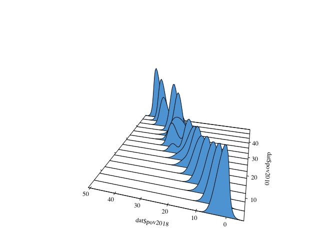<!-- -->

``` r
plot(pov2010pov2018_cde2)
```

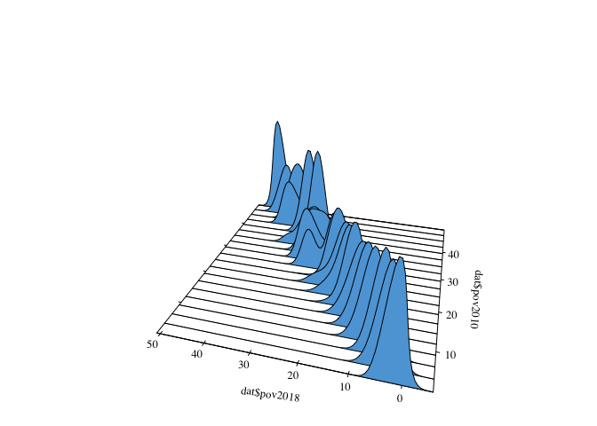<!-- -->

High density regions

``` r
plot(pov2010pov2018_cde, plot.fn="hdr")
abline(a=0, b=1)
abline(h=1, v=1)
```

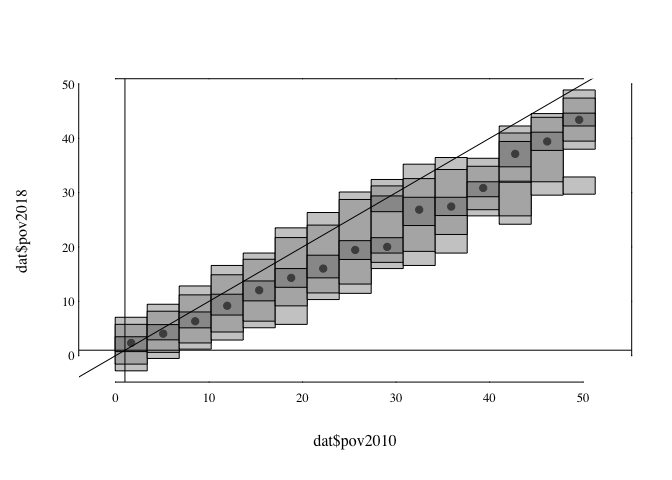<!-- -->

# References

  - [Magrini, S. (2007). Analysing convergence through the distribution
    dynamics approach: why and how?. University Ca’Foscari of Venice,
    Dept. of Economics Research Paper Series
    No, 13.](https://pdfs.semanticscholar.org/eab1/cb89dde0c909898b0a43273377c5dfa73ebc.pdf)

  - Mendez C. (2020). Classical sigma and beta convergence analysis in
    R: Using the REAT 2.1 Package. R Studio/RPubs. Available at
    <https://rpubs.com/quarcs-lab/classical-convergence-reat21>

  - Mendez C. (2020). Univariate distribution dynamics in R: Using the
    ggridges package. R Studio/RPubs. Available at
    <https://rpubs.com/quarcs-lab/univariate-distribution-dynamics>

  - [Mendez, C. (2020) Regional efficiency convergence and efficiency
    clusters. Asia-Pacific Journal of Regional
    Science, 1-21.](http://em.rdcu.be/wf/click?upn=lMZy1lernSJ7apc5DgYM8YThSI5bKW06znW3BanO-2FRs-3D_u6a2PqF3vslNNtSRbhxJPcJKxO5EKzOsf0-2FWiizN57d4csF7ReMur5e40TbX48DbSe9kEMCwFpvvFpLcuaVB-2BpdC3fLCbsP0iKcsxIs1dv1yrPsGDCNh5bhgvI8-2F-2Bxwz7upjDgycqPbhObNqkT41uqY3dPiXr5vBoY1xwT88MA3-2FbdJgwoBl1Gnzli13mkmlJj0kqTs-2BllVfCTB356mLjjKR2VBZCUgKbyVpYgu1vXjwTwdOyzd5FTbU8eaRsWyORje7WCPpGEKCUAvbeTCSPa2rfdkmnkQIrsmYBSqfSZ8aaWzHwIkMU3hxbIU6nHGQ)

  - [Mendez, C. (2019). Lack of Global Convergence and the Formation of
    Multiple Welfare Clubs across Countries: An Unsupervised Machine
    Learning Approach.
    Economies, 7(3), 74.](https://www.mdpi.com/2227-7099/7/3/74/pdf)

  - Mendez, C. (2019). Overall efficiency, pure technical efficiency,
    and scale efficiency across provinces in Indonesia 1990 and 2010. R
    Studio/RPubs. Available at
    <https://rpubs.com/quarcs-lab/efficiency-clusters-indonesia-1990-2010>

  - [Mendez-Guerra, C. (2018). On the distribution dynamics of human
    development: Evidence from the metropolitan regions of Bolivia’’.
    Economics
    Bulletin, 38(4), 2467-2475.](http://www.accessecon.com/Pubs/EB/2018/Volume38/EB-18-V38-I4-P223.pdf)

END
